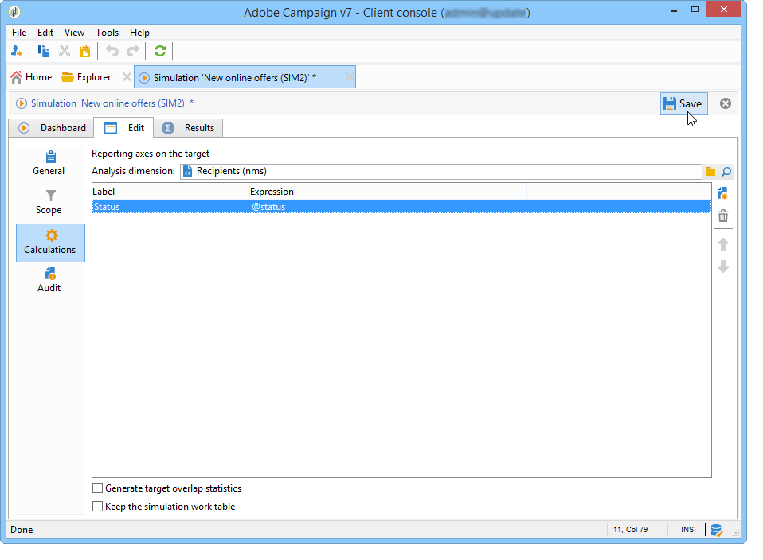

# Simuleringar i Campaign{#campaign-simulations}

Med Campaign Optimization kan ni testa effektiviteten i en kampanjplan med hjälp av simuleringar. Detta gör att ni kan mäta den potentiella framgången för en kampanj: genererade intäkter, målvolym baserat på de typologiregler som tillämpas osv.

Med simulering kan du övervaka och jämföra effekterna av leveranser.

## Konfigurera en simulering {#set-up-a-simulation}

### Varning

Leveranser som förberetts i **testläge** påverkar inte varandra, till exempel när en kampanj utvärderas i distribuerad marknadsföring, eller så länge leveranserna inte är schemalagda i den preliminära kalendern.

Detta innebär att tryck- och kapacitetsregler endast tillämpas på leveranser i **[!UICONTROL Target estimation and message personalization]**-läge. Leveranser i **[!UICONTROL Estimation and approval of the provisional target]**-läge och i **[!UICONTROL Target evaluation]**-läge beaktas inte.

Leveransläget väljs på underfliken **[!UICONTROL Typology]** i leveransegenskaperna.

### Skapa en simulering {#create-a-simulation}

Så här skapar du en simulering:

1. Öppna fliken **[!UICONTROL Campaigns]**, klicka på länken **[!UICONTROL More]** i avsnittet **[!UICONTROL Create]** och välj alternativet **[!UICONTROL Simulation]**.

   

1. Ange mallen och namnet på simuleringen. Klicka på **[!UICONTROL Save]** för att skapa simuleringen.

   

1. Klicka på fliken **[!UICONTROL Edit]** för att konfigurera den.

   

1. På fliken **[!UICONTROL Scope]** anger du de leveranser du vill ta hänsyn till för den här simuleringen. Om du vill göra det klickar du på knappen **[!UICONTROL Add]** och anger det leveransvalsläge som ska beaktas.

   

   Du kan antingen välja varje leverans en i taget eller sortera dem efter kampanj, program eller plan.

   >[!NOTE]
   >
   >Om du väljer leveranser via en plan, ett program eller en kampanj kan Adobe Campaign automatiskt uppdatera listan med leveranser som ska beaktas när en simulering startas. Det gör du genom att kontrollera alternativet **[!UICONTROL Refresh the selection of deliveries each time the simulation is started]**.
   >  
   >Om du inte gör detta kommer alla leveranser som inte är tillgängliga i planen, programmet eller kampanjen när simuleringen skapas inte att tas med i beräkningen: leveranser som läggs till senare kommer att ignoreras.

   

1. Markera de element som ska ingå i simuleringsomfånget. Om det behövs markerar du flera element med hjälp av SKIFT- och CTRL-tangenterna.

   

   Klicka på **[!UICONTROL Finish]** för att godkänna markeringen.

   Du kan kombinera utvalda leveranser och leveranser som hör till planer, program eller kampanjer manuellt.

   

   Om det behövs kan du använda ett dynamiskt villkor via länken **[!UICONTROL Edit the dynamic condition...]**.

   Klicka på **[!UICONTROL Save]** för att godkänna konfigurationen.

   >[!NOTE]
   >
   >Endast leveranser vars mål har beräknats beaktas vid beräkning av simuleringar (status: **Klart** eller **Leveransklart**).

1. På fliken **[!UICONTROL Calculations]** väljer du en analysdimension, till exempel mottagarschemat.

   

1. Sedan kan du lägga till uttryck.

   

### Körningsinställningar {#execution-settings}

På fliken **[!UICONTROL General]** i simuleringen kan du ange körningsinställningar:

* Alternativet **[!UICONTROL Schedule execution for down-time]** skjuter upp simuleringsöppningen till en mindre upptagen tidsperiod, baserat på vald prioritetsnivå. Simuleringar använder stora databasresurser, vilket är orsaken till varför icke-brådskande simuleringar ska schemaläggas att köras på natten, till exempel.
* **[!UICONTROL Priority]** är den nivå som används för simuleringen för att fördröja dess utlösare.
* **[!UICONTROL Save SQL queries in the log]**. Med SQL-loggar kan du diagnostisera en simulering om den avslutas med fel. De kan också hjälpa dig att ta reda på varför en simulering är för långsam. Dessa meddelanden visas efter simuleringen på underfliken **[!UICONTROL SQL logs]** på fliken **[!UICONTROL Audit]**.

## Kör en simulering {#execute-a-simulation}

### Starta en simulering {#start-a-simulation}

När simuleringsomfånget har definierats kan du köra det.

Om du vill göra det öppnar du simuleringspanelen och klickar på **[!UICONTROL Start simulation]**.

När körningen är klar öppnar du simuleringen och klickar på fliken **[!UICONTROL Results]** för att visa de mål som beräknats för varje leverans.

1. Underfliken **[!UICONTROL Deliveries]** visar alla leveranser som har beaktats vid simuleringen. Den visar två antal:

   * **[!UICONTROL Initial count]** är målet så som det beräknats under uppskattningen av leveransen.
   * **[!UICONTROL Final count]** är antalet mottagare som räknas efter simulering.

     Skillnaden mellan inledande och avslutande antal återspeglar tillämpningen av de olika regler eller filter som konfigurerats före simuleringen.

     Redigera underfliken **[!UICONTROL Exclusions]** om du vill veta mer om den här beräkningen.

1. På underfliken **[!UICONTROL Exclusions]** kan du visa den nedbrutna exkluderingen.

   

1. Underfliken **[!UICONTROL Alerts]** grupperar alla varningsmeddelanden som genererats under simuleringen. Varningsmeddelanden kan skickas vid kapacitetsöverbelastning (om antalet mottagare som är mål överstiger den angivna kapaciteten, till exempel).
1. Med underfliken **[!UICONTROL Exploration of the exclusions]** kan du skapa en resultatanalystabell. Användaren måste ange variabler i axeln abscissa/ordinates.

   Ett exempel på hur analystabellen skapas finns i slutet av [det här avsnittet](#explore-results).

### Visa resultat {#view-results}

#### Granskning {#audit}

På fliken **[!UICONTROL Audit]** kan du övervaka simuleringskörning. Underfliken **[!UICONTROL SQL Logs]** är användbar för expertanvändare. Körningsloggar visas i SQL-format. Dessa loggar visas bara om alternativet **[!UICONTROL Save SQL queries in the log]** har valts på fliken **[!UICONTROL General]** innan simuleringskörningen.

#### Utforska resultat {#explore-results}

Med underfliken **[!UICONTROL Exploration of the exclusions]** kan du analysera data som är ett resultat av en simulering.

<!--
Descriptive analysis is detailed in [this section](../../reporting/using/about-adobe-campaign-reporting-tools.md).
-->

## Resultat av en simulering {#results-of-a-simulation}

Indikatorerna på flikarna **[!UICONTROL Log]** och **[!UICONTROL Results]** ger en första översikt över simuleringsresultaten. Öppna fliken **[!UICONTROL Reports]** om du vill få en mer detaljerad resultatvy.

### Rapporter {#reports}

Om du vill analysera resultatet av en simulering redigerar du dess rapporter: de visar undantag och orsaker.

Följande rapporter tillhandahålls som standard:

* **[!UICONTROL Detail of simulation exclusions]** : den här rapporten innehåller en detaljerad tabell över uteslutningsorsaker för alla berörda leveranser.
* **[!UICONTROL Simulation summary]** : den här rapporten visar vilka populationer som har uteslutits från simuleringen under de olika leveranserna.
* **[!UICONTROL Summary of exclusions linked to the simulation]** : den här rapporten innehåller ett diagram över undantag som orsakas av simuleringen tillsammans med den tillämpade typologiregeln och ett diagram som visar exkluderingsförhållandet per regel.

<!--
>[!NOTE]
>
>You can create new reports and add them to the ones offered. For more on this, refer to [this section](../../reporting/using/about-adobe-campaign-reporting-tools.md).
-->

Om du vill få åtkomst till rapporter klickar du på länken **[!UICONTROL Reports]** för målsimuleringen via kontrollpanelen.

Du kan också redigera rapporter med hjälp av länken **[!UICONTROL Reports]** som är tillgänglig från simuleringspanelen.

### Jämför simuleringar {#compare-simulations-}

Varje gång en simulering körs ersätter resultatet alla tidigare resultat: du kan inte visa och jämföra resultat från en körning med en annan.

Om du vill jämföra resultaten måste du använda rapporter. I Adobe Campaign kan du spara en rapporthistorik och visa den igen senare. Den här historiken sparas under simuleringens livscykel.

**Exempel:**

1. Skapa en simulering för en leverans som typologin **A** tillämpas på.
1. Redigera en av de tillgängliga rapporterna på fliken **[!UICONTROL Reports]**, till exempel **[!UICONTROL Detail of simulation exclusions]**.
1. Klicka på ikonen längst upp till höger i rapporten för att skapa en ny historik.

   

1. Stäng simuleringen och ändra typkonfigurationen **A**.
1. Kör simuleringen igen och jämför resultatet med resultatet som visas i rapporten som en historik skapades för.

   

   Du kan spara så många rapporthistorik som behövs.

### Rapporteringsaxlar {#reporting-axes}

På fliken **[!UICONTROL Calculations]** kan du definiera rapporteringsaxlar för målet. De här axlarna används under [resultatanalys](#explore-results).

>[!NOTE]
>
>Vi rekommenderar att du definierar beräkningsaxlar i simuleringsmallarna i stället för individuellt för varje simulering.\
>Simuleringsmallar sparas i mappen **[!UICONTROL Resources > Templates > Simulation templates]** i Campaign Explorer.

**Exempel:**

I exemplet nedan vill vi skapa ytterligare en rapporteringsaxel baserat på mottagarnas status (&quot;Kund&quot;,&quot;Prospekt&quot; eller ingen).

1. Om du vill definiera en rapportaxel markerar du tabellen som innehåller den information som ska bearbetas i fältet **[!UICONTROL Analysis dimension]**. Denna information är obligatorisk.
1. Här väljer vi segmentfältet för mottagartabellen.

   

1. Följande alternativ är tillgängliga:

   * Med **[!UICONTROL Generate target overlap statistics]** kan du återställa all överlappningsstatistik i simuleringsrapporten. Överlappningar är mottagare som används för minst två leveranser inom en simulering.

     >[!CAUTION]
     >
     >Om du väljer det här alternativet ökar simuleringskörningstiden avsevärt.

   * Med **[!UICONTROL Keep the simulation work table]** kan du behålla simuleringsspår.

     >[!CAUTION]
     >
     >Det automatiska sparandet av dessa tabeller kräver en betydande lagringskapacitet: se till att databasen är tillräckligt stor.

När simuleringsresultaten visas visas informationen för det valda uttrycket på underfliken **[!UICONTROL Overlaps]**.

Målöverlapp för leverans anger målmottagarna i minst två leveranser av en simulering.

>[!NOTE]
>
>Den här underfliken visas bara om alternativet **[!UICONTROL Generate target recovery statistics]** har aktiverats.

Informationen om rapportaxlar kan behandlas i exkluderingsanalysrapporter som skapas på underfliken **[!UICONTROL Exploring exclusions]**. [Läs mer](#explore-results).
