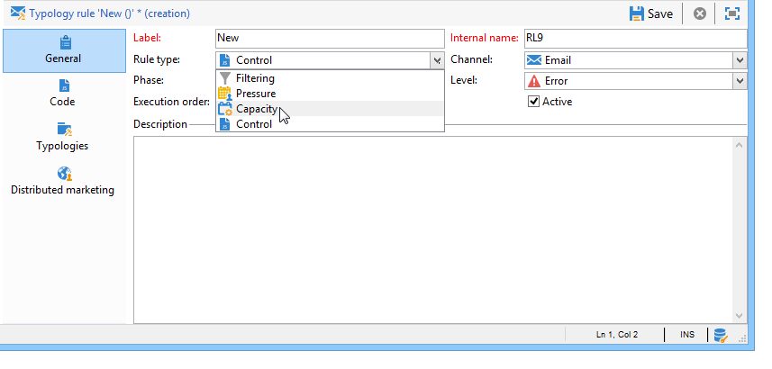
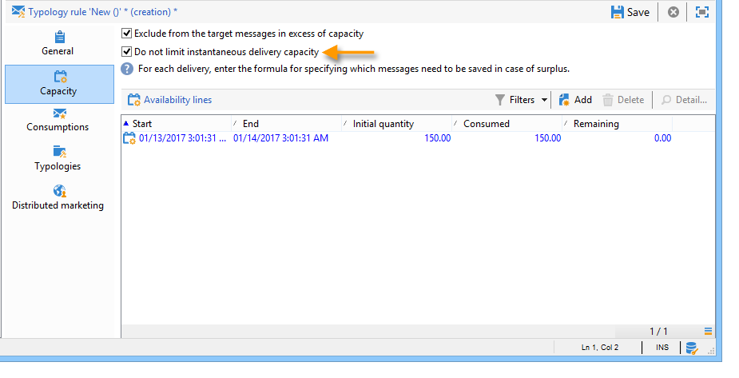

# Konsekvensregler{#consistency-rules}

Adobe Campaign garanterar enhetlig kommunikation tack vare en uppsättning regler som finns i kampanjtypologier. Syftet är att kontrollera de leveranser som skickas till mottagarna, t.ex. volym, art, relevans osv.

**Kapacitet** regler, t.ex. kan undvika att överbelasta den plattform som berörs av meddelandeleveransen. Specialerbjudanden som innehåller en nedladdningslänk får till exempel inte skickas till för många personer samtidigt för att undvika att servern blir mättad. Telefonkampanjer får inte överskrida uppspelningskapaciteten hos callcenter osv.

## Kontrollkapacitet {#control-capacity}

Innan du levererar meddelanden måste du se till att din organisation har kapacitet (fysisk infrastruktur) att bearbeta leveransen, de svar som leveransen kan generera (inkommande meddelanden) och antalet samtal som ska göras till kontaktprenumeranter (bearbetningskapacitet för callcenter), till exempel.

Om du vill göra det skapar du **[!UICONTROL Capacity]** typologiregler.

I följande exempel skapar vi en typologiregel för en lojalitetskampanj per telefon. Vi begränsar antalet meddelanden till 20 per dag, dvs. den dagliga bearbetningskapaciteten för ett callcenter. När regeln tillämpas på två leveranser kan vi övervaka förbrukningen via loggar.

Så här utformar du en ny kapacitetsregel:

1. Under **[!UICONTROL Administration > Campaign management > Typology management > Typology rules]** mapp, klicka på **[!UICONTROL New]**.
1. Välj en **[!UICONTROL Capacity]** regeltyp.

   

1. I **[!UICONTROL Capacity]** skapar du tillgänglighetsraderna: i vårt exempel är det här tidsperioder under vilka anrop kan göras. Välj en period på 24 timmar och ange 150 i den initiala kvantiteten, vilket innebär att callcentret kan hantera 150 samtal per dag.

   

   >[!NOTE]
   >
   >Tillgänglighetsraderna är endast avsedda som information. Om du behöver exkludera meddelanden när kapacitetsgränsen nås, se [det här avsnittet](#exclude-messages-when-capacity-limit-reached).

1. Koppla den här regeln till en typologi och referera sedan till typologin i leveransen för att tillämpa den här kapacitetsregeln. Mer information om detta finns i [det här avsnittet](apply-rules.md#apply-a-typology-to-a-delivery).
1. Du kan övervaka förbrukningen från regeln **[!UICONTROL Consumptions]** och **[!UICONTROL Capacity]** -tabbar.

   När en regel används i en leverans **[!UICONTROL Consumed]** och **[!UICONTROL Remaining]** kolumner innehåller information om inläsningen enligt nedan:

   

   Mer information om detta finns i [det här avsnittet](#monitor-consumption).

## Definiera maximal last {#define-the-maximum-load}

Om du vill definiera den maximala lasten måste du definiera tillgänglighetsrader. Det finns två alternativ: du kan göra det manuellt [skapa en eller flera tillgänglighetsrader](#add-availability-lines-one-by-one) eller skapa tillgänglighetsintervall. Frekvensen för dessa tidsperioder kan automatiseras. [Läs mer](#add-a-set-of-availability-lines).

### Lägg till tillgänglighetsrader en efter en {#add-availability-lines-one-by-one}

Om du vill skapa en tillgänglighetsrad klickar du på **[!UICONTROL Add]** knapp och markera **[!UICONTROL Add an availability line]**. Ange tillgänglighetsperioden och tillgänglig last.

Lägg till så många rader som behövs för att anpassa bearbetningskapaciteten.

### Lägg till en uppsättning tillgänglighetsrader {#add-a-set-of-availability-lines}

Om du vill definiera tillgänglighetsperioder för en viss tid klickar du på **[!UICONTROL Add]** och väljer **[!UICONTROL Add a set of availability lines]** alternativ. Ange en varaktighet för varje tidsperiod och antalet perioder som ska skapas.

Om du vill automatisera sidskapandet klickar du på **[!UICONTROL Change]** och definiera tidsplanering.

Vi kan till exempel definiera ett schema för att skapa tillgänglighetsperioder för alla arbetsdagar med en hastighet på 10 samtal per timme mellan 09.00 och 17.00. Gör så här:

1. Välj typ av intervall och de dagar och timmar som den gäller:

   

1. Ange giltighetsdatum:

   

1. Kontrollera schemat innan du godkänner det:

   

The **[!UICONTROL Forecasting]** Alla matchande rader skapas automatiskt i arbetsflödet.

>[!NOTE]
>
>Vi rekommenderar att du skapar tillgänglighetsrader via filimport. På den här fliken kan du visa och kontrollera förbrukningsrader.

## Uteslut meddelanden när kapacitetsgränsen har nåtts {#exclude-messages-when-capacity-limit-reached}

Tillgänglighetsraderna är endast avsedda som information. Om du vill exkludera överflödiga meddelanden ska du kontrollera **[!UICONTROL Exclude from the target messages in excess of capacity]** alternativ. Detta förhindrar att kapaciteten överskrids. För samma population som i föregående exempel får förbrukningen och den återstående kapaciteten inte överstiga den ursprungliga kvantiteten:

Det högsta antalet meddelanden som kan bearbetas är jämnt fördelat över det definierade tillgänglighetsintervallet. Detta är särskilt relevant för callcenters eftersom deras högsta antal samtal per dag är begränsat. När det gäller e-postleveranser **[!UICONTROL Do not limit instantaneous delivery capacity]** kan du ignorera det här tillgänglighetsintervallet och skicka e-postmeddelanden samtidigt.

>[!NOTE]
>
>Om det finns en överlagring väljs de sparade meddelandena enligt formeln som definieras i leveransegenskaperna.

## Övervaka förbrukning {#monitoring-consumption}

Som standard är kapacitetsreglerna endast avsedda för indikationsändamål. Välj **[!UICONTROL Exclude messages in excess of capacity from the target]** för att förhindra att den definierade lasten överskrids. I det här fallet utesluts överflödiga meddelanden automatiskt från leveranser med denna typologiregel.

Om du vill övervaka förbrukning kan du visa värdena som visas i **[!UICONTROL Consumed]** kolumn i **[!UICONTROL Capacity]** i typologiregeln.

Klicka på **[!UICONTROL Consumptions]** i regeln.
