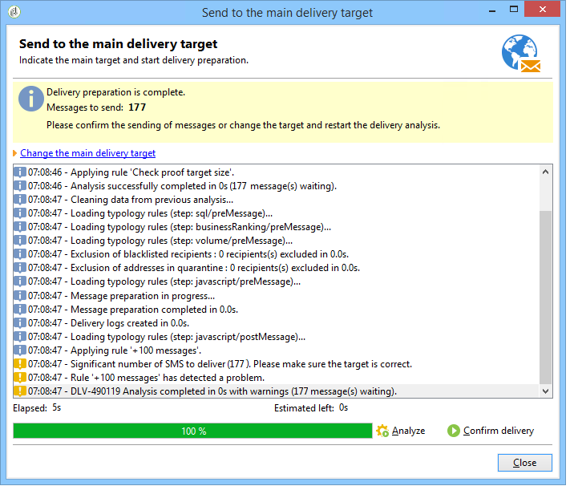

# Kontrollregler{#control-rules}

Med kontrollregler kan du garantera giltigheten och kvaliteten på meddelanden före leverans: teckenvisning, SMS-storlek, adressformat osv.

Med en uppsättning färdiga regler kan du utföra vanliga kontroller. Dessa kontroller (visas i fet stil i gränssnittet) är:

* **[!UICONTROL Object approval]** (e-post): kontrollerar att avsändarobjektet och avsändaradressen inte innehåller specialtecken som kan orsaka problem för vissa e-postagenter.
* **[!UICONTROL URL label approval]** (e-post): kontrollerar att varje spårnings-URL har en etikett.
* **[!UICONTROL URL approval]** (e-post): kontrollerar spårnings-URL:er (om tecknet &quot;&amp;&quot; finns).
* **[!UICONTROL Message size approval]** (mobil): kontrollerar storleken på SMS-meddelanden.
* **[!UICONTROL Validity period check]** (e-post): kontrollerar att giltighetsperioden för leveransen är tillräckligt lång för att skicka alla meddelanden.
* **[!UICONTROL Proof size check]** (alla kanaler): genererar ett felmeddelande om målgruppen för korrektur överstiger 100 mottagare.
* **[!UICONTROL Wave scheduling check]** (e-post): kontrollerar att den sista leveranspvågen är planerad att påbörjas före utgången av giltighetsperioden, om leveransen delas upp i flera vågor.
* **[!UICONTROL Unsubscription link approval]** (e-post): kontrollerar om det finns minst en avanmälan (avanmälan)-URL i varje innehåll (HTML och Text).

## Skapa en kontrollregel {#create-a-control-rule}

Det går att skapa nya kontrollregler som passar dina behov. Om du vill göra det skapar du en **[!UICONTROL Control]** typologiregel och ange kontrollformeln i SQL i **[!UICONTROL Code]** -fliken.

**Exempel:**

I följande exempel ska vi skapa en regel som förhindrar att ett SMS-erbjudande skickas till fler än 100 mottagare. Denna regel kommer att kopplas till en kampanjtypologi och sedan till de SMS-leveranser som det aktuella erbjudandet är tillgängligt för.

Använd följande steg:

1. Skapa en **[!UICONTROL Control]** typologiregel. Välj en **[!UICONTROL Warning]** varningsnivå.

   

1. I **[!UICONTROL Code]** anger du det skript som ska använda det önskade tröskelvärdet enligt nedan:

   

   Skriptet utlöser en varning om leveransmålet överstiger 100 kontakter:

   ```
   if( delivery.FCP == false && delivery.properties.toDeliver > 100 ) { logWarning("Significant number of SMS to deliver (" + delivery.properties.toDeliver + "). Please make sure the target is correct.") return false; } return true
   ```

1. Länka den här regeln till en kampanjtypologi och referera till typologin i den aktuella SMS-leveransen.

   

1. Vid leveransanalys tillämpas regeln och en varning skapas om tillämpligt.

   

   Leveransen är dock fortfarande klar att skickas.

   Om du ökar aviseringsnivån förhindrar detta att leveransen startar.

   

   När analysen är klar ska **[!UICONTROL Confirm delivery]** kommer inte att vara tillgänglig.

   
