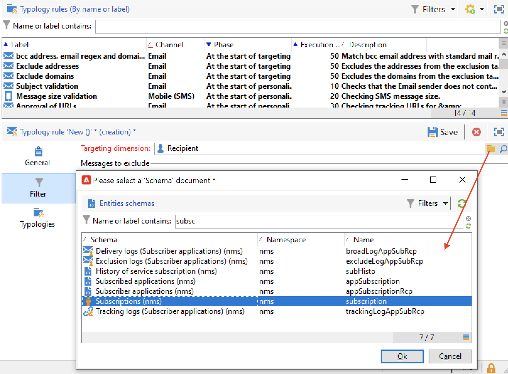
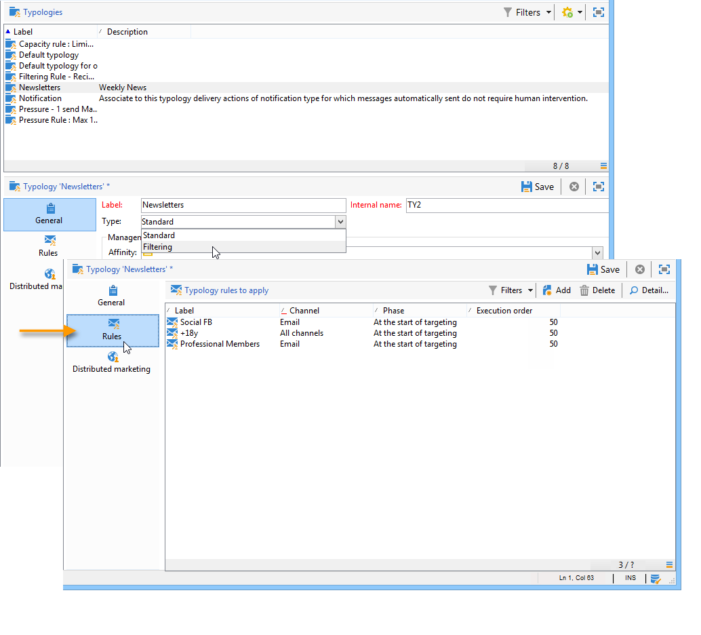

# Filtreringsregler{#filtering-rules}

Använd filtreringsregler för att välja meddelanden som ska exkluderas baserat på kriterier som definierats i en fråga. Dessa regler är kopplade till en målinriktningsdimension.

Filtreringsregler kan länkas till andra typer av regler (kontroll, tryck osv.) i typologier, eller grupperade i en dedikerad **Filtrering** typologi. [Läs mer](#create-and-use-a-filtering-typology).

## Skapa en filtreringsregel {#create-a-filtering-rule}

Du kan t.ex. filtrera nyhetsbrevets prenumeranter för att förhindra att kommunikationen skickas till mottagare som är minderåriga.

Så här definierar du filtret:

1. Bläddra till **[!UICONTROL Administration > Campaign management > Typology management > Typology rules]** mapp för Campaign-exporteraren och klicka på **Nytt** om du vill skapa en typologiregel.
1. Skapa en **[!UICONTROL Filtering]** typologiregel som gäller för alla kanaler.

   

1. Från **Filter** tabbändra standarddimensionen för målinriktning till **Prenumerationer** (**nms:prenumeration**).

   

1. Skapa filtret med **[!UICONTROL Edit the query from the targeting dimension...]** länk.

   

1. Filtrera på mottagarsidan och spara filtreringsvillkoret.

   

1. Från **Typologier** länka den här regeln till en kampanjtypologi och spara den.

   

När den här regeln används i en leverans, exkluderas undertidsprenumeranter automatiskt. Ett specifikt meddelande indikerar när regeln tillämpas:

## Villkora en filtreringsregel {#condition-a-filtering-rule}

Du kan begränsa programfältet för filtreringsregeln baserat på den länkade leverans- eller leveransdispositionen.

För att göra det går du till **[!UICONTROL General]** väljer du den typ av begränsning som ska användas och skapar filtret.
<!--

-->

I det här fallet gäller att även om regeln är länkad till alla leveranser, kommer den endast att tillämpas på dem som matchar kriterierna för det definierade filtret.

>[!NOTE]
>
>Typologier och filtreringsregler kan användas i ett arbetsflöde i **[!UICONTROL Delivery outline]** aktivitet. [Läs mer](../workflow/delivery-outline.md).

## Skapa och använda en filtertypologi {#create-and-use-a-filtering-typology}

Du kan skapa **[!UICONTROL Filtering]** typologier: de innehåller bara filtreringsregler.

Dessa specifika typologier kan länkas till en leverans när målet har valts: i leveransguiden klickar du på **[!UICONTROL To]** klicka på **[!UICONTROL Exclusions]** -fliken.

Välj sedan den filtreringstyp som ska användas för leveransen. Om du vill göra det klickar du på **[!UICONTROL Add]** och välj de typologier som ska användas.

Du kan också länka filtreringsregler direkt via den här fliken utan att gruppera dem i en typologi. Använd fönstrets nedre del för att göra detta.

>[!NOTE]
>
>Endast typologier och filtreringsregler är tillgängliga i urvalsfönstret.
>
>Dessa konfigurationer kan definieras i leveransmallen som automatiskt tillämpas på alla nya leveranser som skapas med hjälp av mallen.

## Undantagsregler för standardleverans {#default-deliverability-exclusion-rules}

Två filtreringsregler är tillgängliga som standard: **[!UICONTROL Exclude addresses]** ( **[!UICONTROL addressExclusions]** ) och **[!UICONTROL Exclude domains]** ( **[!UICONTROL domainExclusions]** ). Under e-postanalysen jämför dessa regler mottagarnas e-postadresser med de förbjudna adresserna eller domännamnen i en krypterad global undertryckningslista som hanteras i leveransinstansen. Om det finns en matchning skickas inte meddelandet till den mottagaren.

Detta för att undvika att läggas till i blockeringslista på grund av skadlig aktivitet, särskilt användning av en svampfälla. Om du till exempel använder en svällning för att prenumerera via ett av dina webbformulär, skickas ett bekräftelsemeddelande via e-post till den svällningen, vilket gör att din adress automatiskt läggs till i blockeringslista.

>[!NOTE]
>
>Adresserna och domännamnen som finns i den globala undertryckningslistan är dolda. Endast antalet uteslutna mottagare anges i leveransanalysloggarna.
