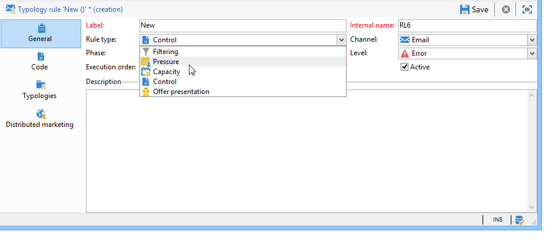
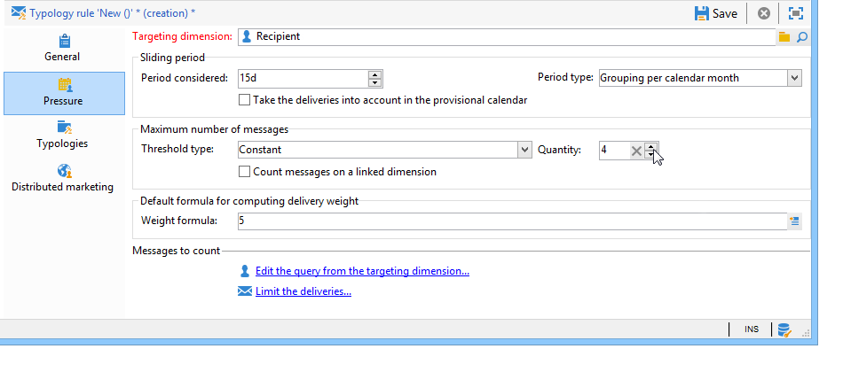
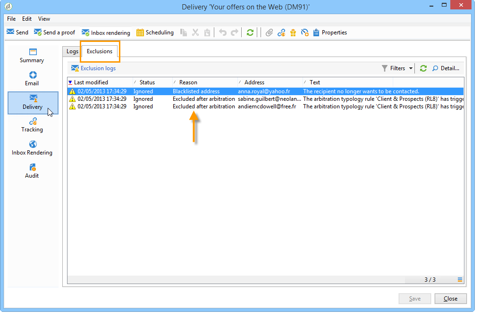

# Tryckregler{#pressure-rules}

Genom att implementera tryckhantering kan ni undvika att överbelasta databaspopulationen, vilket också kallas utmattning för marknadsföring. För att göra detta kan du definiera ett maximalt antal meddelanden per mottagare. Ni kan också tillämpa skiljedomsregler mellan kampanjer för att skicka det bästa meddelandet till målgruppen.

**Tryck** om du vill hantera utmattning för marknadsföring, till exempel för att begränsa antalet brev som ska skickas till en population till två, för att välja den kommunikation som bäst matchar intressena hos en grupp prenumeranter, för att undvika att skicka ett SMS till en missnöjd kund, osv.

Kampanjer väljs ut baserat på definierade trösklar och meddelandevikt.

* Ett tröskelvärde är det högsta antalet leveranser som tillåts för en viss mottagare under en viss period. Den kan vara inställd eller variabel. Den anges eller beräknas i typologiregelinställningarna. [Läs mer](#maximum-number-of-messages).
* Med leveransvikter kan ni identifiera leveranser med högsta prioritet inom ramen för tryckhantering. Meddelanden med högst vikt har prioritet. [Läs mer](#message-weight).

Skiljeförfarandet består i att se till att schemalagda kampanjer, vars vikt är större än den pågående kampanjen, inte leder till alltför stor profilbegäran: i så fall utesluts profilen från leveransen.

Skiljekriterierna (meddelandets vikt och/eller tröskelvärde) kan variera beroende på två typer av information:

* mottagarinställning, som är deklarativ information: nyhetsbrevsprenumerationer, mottagarstatus (kund eller potentiell kund),
* mottagarens beteende: inköp, besökta länkar osv.

Skiljedomsregeln för att definiera godtagbara meddelanden tillämpas under analysfasen. För varje mottagare och för den berörda perioden skickas meddelandet om följande formel är sann: **(antal skickade meddelanden) + (antal meddelanden med större vikt) &lt; tröskelvärde**.

Annars blir mottagaren **[!UICONTROL Excluded by arbitration]**. [Läs mer](#exclusion-after-arbitration).

## Skapa en tryckregel {#create-a-pressure-rule}

Om du vill skapa medling mellan kampanjer med Adobe Campaign börjar du med att skapa kampanjtypologier och definiera länkade typologiregler (**Tryck**-regler).

Så här skapar och konfigurerar du en **[!UICONTROL Pressure]**-typologiregel:

1. I listan med kampanjtypologiregler väljer du ikonen **[!UICONTROL New]** ovanför listan.

   

1. På fliken **[!UICONTROL General]** i den nya regeln väljer du en **tryckregel** och anger ett namn och en beskrivning för den.

   

1. Ändra körningsordningen om det behövs. När flera typologiregler används som en **[!UICONTROL Typology]**-uppsättning tillämpas de lägre ordnade reglerna först. [Läs mer](apply-rules.md#execution-order).
1. Definiera en frekvens i avsnittet **[!UICONTROL Calculation parameters]** om du vill spara mål efter nästa dagliga omskiljningskörning. [Läs mer](apply-rules.md#adjust-calculation-frequency).
1. Klicka på fliken **[!UICONTROL Pressure]** och välj den kalenderperiod under vilken typologiregeln gäller.

   

   Regeln kommer att tillämpas på leveranser vars kontaktdatum är inkluderat i den berörda perioden.

   >[!NOTE]
   >
   >I samband med en [Enterprise-distribution](../../v8/architecture/enterprise-deployment.md) av Campaign beaktas inte schemalagda leveranser.

1. Definiera metoden för att beräkna det högsta antalet meddelanden.

   Tröskelvärdet är det högsta antal meddelanden som kan skickas till en mottagare under den aktuella perioden.

   Som standard är tröskelvärdet konstant och du måste ange ett maximalt antal meddelanden som tillåts av regeln.

   

   Om du vill definiera ett variabeltröskelvärde väljer du värdet **[!UICONTROL Depends on the recipient]** i fältet **[!UICONTROL Type of threshold]** och använder ikonen till höger för att öppna uttrycksredigeraren.

   

   Mer information finns i [Maximalt antal meddelanden](#maximum-number-of-messages).

1. Ange metod för beräkning av leveransvikt.

   Varje leverans har en vikt, dvs. ett värde som representerar dess prioritetsnivå: detta möjliggör medling mellan kampanjer. Vikten beräknas med hjälp av den formel som definieras i typologiregeln och/eller i dess egenskaper. [Läs mer](#message-weight).

1. Som standard tas alla meddelanden med i beräkningen av tröskelvärdet. På fliken **[!UICONTROL Restriction]** kan du filtrera de meddelanden som berörs av typologiregeln:

   * I det övre avsnittet på den här fliken kan du begränsa vilka mottagare som påverkas.
   * I det nedre avsnittet på den här fliken kan du filtrera de meddelanden som ska räknas.

     I följande exempel beaktas endast mottagare som sparats i mappen **NewContacts** och leveranser som börjar med **Newsletter** berörs.

   

1. På fliken **[!UICONTROL Typologies]** kan du visa de kampanjtyper som tillämpar den här regeln eller länka regeln till en eller flera befintliga typologier. [Läs mer](campaign-typologies.md#apply-typologies).

## Definiera tröskelvärden och vikter {#define-thresholds-and-weights}

### Maximalt antal meddelanden {#maximum-number-of-messages}

Varje tryckregel definierar ett tröskelvärde, dvs. det maximala antalet meddelanden som kan skickas till en mottagare under en viss tidsperiod. När denna tröskel har uppnåtts kan inga fler leveranser göras förrän efter den beaktade perioden. Med den här processen kan du automatiskt utesluta en mottagare från en leverans om ett meddelande överskrider det angivna tröskelvärdet och på så sätt undvika överdriven begäran.

Tröskelvärden kan antingen vara konstanta eller beräknas med en formel med variabler. Detta innebär att tröskelvärdena för en viss period kan variera från en mottagare till en annan, eller till och med för samma mottagare.

>[!CAUTION]
>
>Om du anger **0** som ett tröskelvärde förhindras alla leveranser till målpopulationen under skadeundersökningsperioden.

**Exempel:**

Du kan indexera antalet auktoriserade meddelanden beroende på vilket segment mottagaren tillhör. Det innebär att en mottagare som tillhör webbsegmentet kan få fler meddelanden än andra mottagare. En formel av typen **[!UICONTROL Iif (@origin='Web', 5, 3)]** tillåter leverans av 5 meddelanden till mottagare och 3 för andra segment. Konfigurationen blir följande:

Om du vill definiera tröskelvärdet kan du använda en dimension som är länkad till måldimensionen, till exempel för att inkludera meddelanden som levereras till mottagarprofilerna som lagras i [besökstabellen](../../v8/audiences/target-mappings.md) eller för att undvika att skicka mer än ett meddelande per vecka till samma hushåll (som kan referera till flera e-postadresser) som identifieras i en dimension som är länkad till mottagarnas.

Om du vill göra det väljer du alternativet **[!UICONTROL Count messages on a linked dimension]** och väljer sedan besökaren eller kontakttabellen.

### Meddelandevikt {#message-weight}

Varje leverans har en vikt som motsvarar dess prioritetsnivå. Som standard är vikten för en leverans inställd på 5. Med tryckregler kan du definiera vikten på de leveranser som de ska tillämpas på.

Vikter kan antingen anges eller beräknas med en formel som passar mottagarna. Du kan till exempel definiera vikten för en leverans baserat på mottagarens intressen.

>[!CAUTION]
>
>Vikten som definieras i en typologiregel kan överladdas individuellt för varje leverans på fliken **[!UICONTROL Properties]**. Klicka på fliken **[!UICONTROL Typology]** för att välja kampanjens typologi och, om det behövs, ange vilken vikt som ska användas.\
>Vikten som deklarerats i en A-typologiregel används dock inte för att beräkna en B-typologiregel: den här vikten gäller endast leveranser som använder A-regeln.

**Exempel:**

I följande exempel vill vi länka vikten på nyhetsbrev på musik till mottagarnas benägenhetspoäng. Så här gör du:

1. Skapa ett nytt fält för att lagra poängvärden för mottagarnas benägenhet. Fältet, **@Music** i det här fallet, kommer att berikas med svar på enkäter och online-enkäter, insamlade spårningsdata osv.
1. Skapa en typologiregel för att beräkna meddelandevikten baserat på det här fältet.

   

1. Använd den här regeln för meddelanden med följande ämne: nyhetsbrev, specialerbjudanden osv. Vikten av dessa leveranser, och därmed deras prioritet, beror på varje mottagares benägenhetspoäng.

## Ange perioden {#setting-the-period}

Tryckregler definieras i **n**-dagars rullande perioder.

Perioden har konfigurerats på fliken **[!UICONTROL Pressure]** i regeln. Du kan ange antalet dagar och vid behov välja vilken typ av gruppering som ska användas (dag, vecka, månad, kvartal osv.).

Med grupperingstypen kan du utöka fältet **[!UICONTROL Period considered]** till hela dagen, kalenderveckan, kalendermånaden eller kalenderåret för datum för perioden.

En tryckregel som definierar ett tröskelvärde på 2 meddelanden per vecka, med en gruppering för varje kalendermånad, förhindrar till exempel att fler än 2 meddelanden levereras inom samma vecka OCH inom samma kalendermånad. Varning! Om perioden överlappar två månader kommer beräkningströskeln att ta hänsyn till leveranser från dessa två kalendermånader och kan därför förhindra alla nya leveranser under den andra månaden.

>[!CAUTION]
>
>Endast leveranser som redan har skickats tas med i beräkningen av tröskelvärdet.

Om du vill begränsa antalet leveranser som beaktas för en tvåveckorsperiod anger du **15d** i fältet **[!UICONTROL Concerned period]**: leveranser som skickats upp till två veckor före leveransdatumet som regeln tillämpas på ska beaktas vid beräkningen

Periodens startdatum beror på hur databasen är konfigurerad.

Om du t.ex. tillämpar en 15-dagars tryckregel utan gruppering för en leverans som är daterad 12/11, kommer leveranser att tas med i beräkningen mellan 11/27 och 12/12. Om tryckregeln tar hänsyn till leveranserna i den preliminära kalendern, kommer alla leveranser som planeras mellan 11/27 och 12/27 att beaktas. Slutligen, om du konfigurerar en gruppering per kalendermånad i regeln, kommer alla leveranser i november och december att beaktas vid beräkningen av tröskelvärdet (från 11/1 till 12/31).

**Vanliga fall**

Om du vill vara säker på att leveranser för den aktuella kalenderveckan inte tas med i beräkningen, och inte riskera att även ta hänsyn till leveranser från föregående vecka för beräkningströskeln, anger du **[!UICONTROL Period considered]** vid &#39;0&#39; och väljer &#39;Gruppera per kalendervecka&#39; som **[!UICONTROL Period type]**.

När en period är större än 0 (till exempel 1) kan beräkningströskeln ta hänsyn till föregående dags leveranser. Om föregående dag motsvarar föregående kalendervecka och den valda periodtypen är Gruppering per kalendervecka, kommer därför alla föregående vecka att tas med i beräkningen.

**Exempel:**

Vi vill skapa en tryckregel som begränsar begäran till tre meddelanden per tvåveckorsperiod, med en gruppering efter kalendermånaden.

Låt oss ta sex nyhetsbrev med samma vikt, som är schemalagda till 05/30, 06/3, 06/8, 06/12, 06/22 och 06/30.

Leveranserna som planeras till den 12 och 30 juni kommer inte att skickas: leveranströskeln 06/12 skulle överstiga tröskelvärdet på 3 meddelanden per tvåveckorsperiod och den 30:e leveransen skulle överstiga tröskelvärdet för auktoriserad kommunikation per kalendermånad.

Alla mottagare av dessa leveranser undantas genom skiljedomsförfarande under analysfasen:

Om du grupperar leveranser per kvartal, kommer även mottagarna av **nyhetsbrevet nr.5** att exkluderas, och det kommer inte att skickas.

Om ingen gruppering är markerad skickas inte bara **nyhetsbrevet nr.4**, eftersom det var schemalagt för samma 2-veckorsperiod som de första tre nyhetsbreven.

>[!NOTE]
>
>När du ändrar definitionen för en typologiregel kan du skapa en **simulering** för att kontrollera hur den påverkar leveranserna som den tillämpas på och övervaka hur leveranserna påverkar varandra. [Läs mer](campaign-simulations.md).

## Uteslutning efter skiljedom {#exclusion-after-arbitration}

Skiljeförfarandet tillämpas varje kväll på nytt via det tekniska arbetsflödet **[!UICONTROL Forecasting]** och arbetsflödet **[!UICONTROL Campaign jobs]**.

Arbetsflödet **[!UICONTROL Forecasting]** förberäknar data för den aktuella perioden (från startdatumet till dagens datum), vilket gör att typologiregler kan tillämpas under analysen. Den beräknar också om räknare för uteslutning för skiljedom varje kväll.

För varje mottagare kontrollerar Adobe Campaign därför att antalet meddelanden som ska skickas inte överstiger tröskelvärdet, med hänsyn tagen till antalet meddelanden som redan har skickats under den berörda perioden. Den här informationen är en **indikator** eftersom alla beräkningar uppdateras vid leveranstillfället.

Om det här antalet överskrider tröskelvärdet tillämpas de skiljeregler som definierats i kampanjtypologin och mottagarna utesluts från kampanjer med lägre vikt.

>[!NOTE]
>
>Om flera leveranser har samma poängtal skickas kampanjen för det tidigaste datumet.

## Användningsfall för tryckregler {#use-cases-on-pressure-rules}

### Anpassa tröskelvärdet baserat på kriterium {#adapt-the-threshold-based-on-criterion}

Vi vill skapa en typologiregel för att förhindra att fler än fyra meddelanden per vecka skickas till kunder och två meddelanden per vecka till potentiella kunder.

Om du vill identifiera kunder och potentiella kunder använder du fältet **[!UICONTROL Status]**, som innehåller 0 för potentiella kunder och 1 för kunder.

Så här skapar du regeln:

1. Skapa en ny typologiregel av typen **Tryck**.
1. Redigera fliken **[!UICONTROL Pressure]**: i avsnittet **[!UICONTROL Maximum number of messages]** vill vi skapa en formel för att beräkna tröskeln beroende på varje mottagare. Markera värdet **[!UICONTROL Depends on the recipient]** i fältet **[!UICONTROL Threshold type]** och klicka sedan på **[!UICONTROL Edit expression]** till höger om fältet **[!UICONTROL Formula]**.

   Klicka på knappen **[!UICONTROL Advanced parameters]** för att definiera beräkningsformeln.

   

1. Välj alternativet **[!UICONTROL Edit the formula using an expression]** och klicka på **[!UICONTROL Next]**.

   

1. Dubbelklicka på funktionen **Iif** i noden **[!UICONTROL Others]** i listan över funktioner.

   Välj sedan mottagarnas **status** i avsnittet **[!UICONTROL Available fields]**.

   

   Ange följande formel: **Iif(@status=0,2,4)**

   

   Med den här formeln kan du tilldela värdet 2 om statusen är lika med 0 och värdet 4 för alla andra statusvärden.

   Klicka **[!UICONTROL Finish]** för att godkänna formeln.

1. Ange den period under vilken regeln gäller: 7 dagar i det här fallet, för att räkna antalet meddelanden per vecka.

   

1. Spara regeln för att godkänna skapandet.

Länka nu den regel du just har skapat till en typologi för att använda den på leveranser. Så här gör du:

1. Skapa en kampanjtypologi.
1. Gå till fliken **[!UICONTROL Rules]**, klicka på knappen **[!UICONTROL Add]** och välj den regel du just har skapat.

   

1. Spara typologin: läggs den till i listan över befintliga typologier.

Om du vill använda den här typologin i dina leveranser markerar du den i leveransegenskaperna på fliken **[!UICONTROL Typology]** enligt nedan:

>[!NOTE]
>
>Typologin kan definieras i leveransmallen som automatiskt ska tillämpas på alla leveranser som skapas med den här mallen.

Vid leveransanalys utesluts leveransmottagarna vid behov från leveransen, beroende på hur många leveranser de redan har skickat. Om du vill visa informationen kan du:

* Visa analysresultatet:

  

* Redigera leveransen och klicka på fliken **[!UICONTROL Delivery]** och underfliken **[!UICONTROL Exclusions]**:

  

* Klicka på fliken **[!UICONTROL Audit]** och sedan på underfliken **[!UICONTROL Causes of exclusions]** för att visa antalet undantag och de använda typologireglerna:

  

### Beräkna leveransvikten baserat på beteende {#calculate-the-delivery-weight-based-on-behavior}

Du kan definiera tryckregler baserat på mottagarnas beteende, vilket innebär att vikten på en leverans kan anpassas till kriterier som varierar mellan olika mottagare. Du kan till exempel bestämma dig för att skicka ett meddelande beroende på om en mottagare besökt din webbplats eller inte, klickat i ett visst avsnitt av det senaste nyhetsbrevet, prenumererat på en informationstjänst eller till och med baserat på svar på en undersökning, ett onlinespel osv.

I följande exempel vill vi skapa en leverans med vikten 5. Vikten har berikats med benägenhetspoäng baserat på mottagarnas beteende: kunder som redan beställt från den här webbplatsen får poängen 5, medan kunder som aldrig beställt online får poängen 4.

Om du vill utföra den här typen av konfiguration måste du använda en formel för att definiera meddelandets vikt. Information om benägenhetspoäng och enkätsvar måste finnas tillgänglig i datamodellen. I vårt exempel har fältet **Propensity** lagts till.

Använd följande konfigurationssteg:

1. Skapa en ny typologiregel av typen **Tryck**.
1. Redigera fliken **[!UICONTROL Pressure]**. Vi vill skapa en tröskelformel som baseras på varje enskild mottagare: klicka på ikonen **[!UICONTROL Edit expression]** till höger om fältet **[!UICONTROL Weight formula]**.

   

1. Som standard visas värdet **5** i den övre delen av uttrycksredigeraren. Vi vill lägga till prioritetspoängen för varje mottagare i den här vikten: placera markören till höger om 5, ange tecknet **+** och markera fältet **Propensitet**.

   

1. Lägg sedan till ett högre värde för mottagare som redan har gjort ett köp. För dem måste vikten på leveransen ökas med 5, medan för andra bara 4.

   

1. Klicka på **[!UICONTROL Finish]** om du vill spara den här regeln.
1. Länka regeln till en kampanjtypologi och referera till den här typologin i en leverans för att godkänna den.

### Skicka endast de högst viktade meddelandena {#send-only-the-highest-weighted-messages}

Du vill inte skicka mer än två meddelanden inom samma vecka, med en gräns på två meddelanden per dag, till var och en av dina mottagare, och du vill bara att meddelanden med högre vikt ska levereras.

För att göra detta måste du schemalägga flera leveranser med olika vikter för samma mottagare och tillämpa en tryckregel som utesluter leveranser med lägre vikter.

Först konfigurerar du tryckregeln.

1. Skapa en tryckregel. [Läs mer](#create-a-pressure-rule).
1. Välj alternativet **[!UICONTROL Re-apply the rule at the start of personalization]** på fliken **[!UICONTROL General]**.

   

   Det här alternativet åsidosätter det värde som definierats i fältet **[!UICONTROL Frequency]** och tillämpar automatiskt regeln under personaliseringsfasen. [Läs mer](apply-rules.md#adjust-calculation-frequency).

1. På fliken **[!UICONTROL Pressure]** väljer du **[!UICONTROL 7d]** som **[!UICONTROL Period considered]** och **[!UICONTROL Grouping per day]** som **[!UICONTROL Period type]**.
1. Länka regeln till en kampanjtypologi på fliken **[!UICONTROL Typologies]**.
1. Spara ändringarna.

Skapa och konfigurera nu ett arbetsflöde för varje leverans som du vill att tryckregeln ska tillämpas på.

1. Skapa en kampanj. [Läs mer](../campaigns/marketing-campaign-create.md#create-a-campaign).
1. Lägg till en **Query**-aktivitet i arbetsflödet på fliken **[!UICONTROL Targeting and workflows]** i kampanjen. Mer information om hur du använder den här aktiviteten finns i [det här avsnittet](../workflow/query.md).
1. Lägg till en **[!UICONTROL Email delivery]**-aktivitet i arbetsflödet och öppna den. Mer information om hur du använder den här aktiviteten finns i [det här avsnittet](../workflow/delivery.md).
1. Gå till fliken **[!UICONTROL Approvals]** i **[!UICONTROL Delivery properties]** och inaktivera alla godkännanden.

   

1. På fliken **[!UICONTROL Typology]** i **[!UICONTROL Delivery properties]** refererar du till kampanjtypen som regeln ska tillämpas på. Definiera en vikt för leveransen.

   

1. Klicka på **[!UICONTROL Scheduling]** i leveransen och välj **[!UICONTROL Schedule delivery (automatic execution when the scheduled date is reached)]**. I det här exemplet väljer du alternativet **[!UICONTROL Use a calculation formula]**.
1. Ange extraheringsdatumet till 10 minuter (aktuellt datum + 10 minuter).
1. Ange kontaktdatumet till nästa dag (aktuellt datum + 1 dag).

   

   För att undantagen för tryckregler ska kunna implementeras måste du ange datum och tid för extraheringen innan kontaktdatum och -tid samt innan nattskiljedomsförfarandet tillämpas på nytt. [Läs mer](#exclusion-after-arbitration).

1. Avmarkera alternativet **[!UICONTROL Confirm the delivery before sending]** och spara ändringarna.
1. Fortsätt på samma sätt för varje leverans som du vill skicka. Se till att du anger önskad vikt för varje leverans.
1. Kör relevanta arbetsflöden för att förbereda och skicka leveranserna.

När det nattliga skiljeförfarandet tillämpas kommer leveranser med de lägre vikterna för samma mottagare att uteslutas. Endast leveranser med den högsta vikten kommer att övervägas för sändning. [Läs mer](#message-weight).

Med tanke på att ett e-postmeddelande redan har skickats till de berörda mottagarna tidigare under veckan visar tabellen nedan ett exempel på konfigurationer som kan användas för ytterligare två leveranser.

<table> 
 <thead> 
  <tr> 
   <th> Leverans  </th> 
   <th> Godkännanden  </th> 
   <th> Bredd   </th> 
   <th> Extraheringsdatum/-tid  </th> 
   <th> Kontaktdatum  </th> 
   <th> Startdatum/tid för leverans   </th> 
   <th> Körningsdatum/tid för skiljedomsarbetsflöde   </th> 
   <th> Leveransstatus   </th> 
   <th> Leverans skickad (datum/tid)  </th> 
  </tr> 
 </thead> 
 <tbody> 
  <tr> 
   <td> Leverans 1  </td> 
   <td> Inaktiverad  </td> 
   <td> 5  </td> 
   <td> 17:00   </td> 
   <td> 8.00 (nästa dag)  </td> 
   <td> 2:0  </td> 
   <td> Nightly  </td> 
   <td> Utesluten  </td> 
   <td> Utesluten  </td> 
  </tr> 
  <tr> 
   <td> Leverans 2  </td> 
   <td> Inaktiverad  </td> 
   <td> 10  </td> 
   <td> kl. 16:00   </td> 
   <td> 9.00 (nästa dag)  </td> 
   <td> 2:0  </td> 
   <td> Nightly  </td> 
   <td> Skickat   </td> 
   <td> 9.00 (nästa dag)  </td> 
  </tr> 
 </tbody> 
</table>

Efter det att extraktionsdatumet har passerats för de två leveranserna, tillämpas det nattliga skiljeförfarandet på nytt före kontaktdatumen för båda leveranserna. På så sätt kan du hitta alla leveranser som redan har skickats (mottagare för vilka en leverans har bearbetats, registrerats via de breda loggarna) eller som har schemalagts för att skickas (mottagare som är berättigade att ta emot en leverans, som registrerats via prognosloggarna).

När alla skickade och potentiella leveranser har listats för den period som anges i tryckregeln sorterar Adobe Campaign dem efter vikt, med den högsta viktningen först. När det tröskelvärde som anges i tryckregeln nås (om det inte finns fler än två e-postmeddelanden inom samma vecka), utesluts mottagarna från leveransen.
