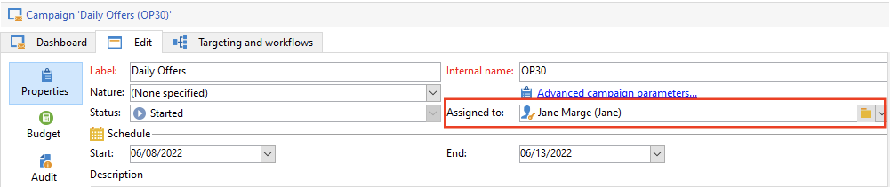
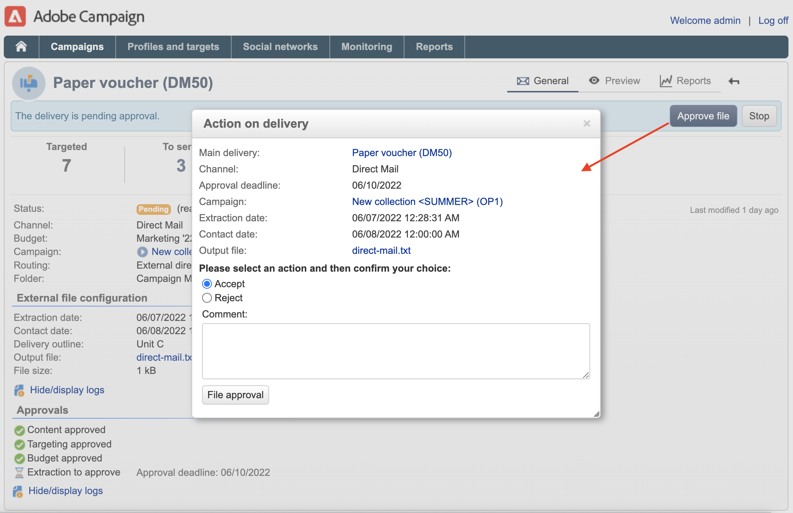
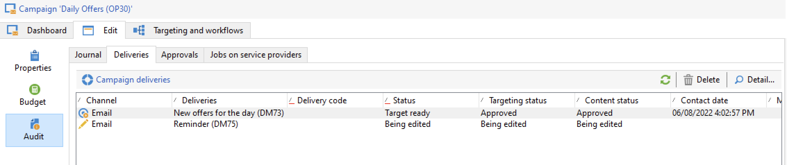

# Konfigurera och hantera godkännandeprocessen {#approval-marketing-campaigns}

Metoder och personer som arbetar med att skapa och godkänna marknadsföringskampanjer är specifika för varje organisation. Processen för kampanjgodkännande innefattar att samordna olika intressenter: digitala marknadsförare, leveransansvariga, innehållschefer och externa ägare som partners och leverantörer.

Med Adobe Campaign kan ni skapa ett godkännandeflöde för era kampanjer och meddela operatörerna när en åtgärd krävs. Du kan definiera godkännanden för varje steg i en leverans: målinriktning, innehåll, budget, extrahering och korrekturutskick. I takt med att era kampanjleveranser går igenom de olika valideringsstegen sammanställer Adobe Campaigns en historik över ändringar och godkännanden, inklusive feedback, kommentarer, ändringsbegäranden och kommentarer.

Meddelanden skickas till de Adobe Campaign-operatörer som har utsetts till granskare för att informera dem om en ansökan om godkännande.

Operatorer kan godkänna på flera sätt:

* Från meddelandemeddelandet. Länken i e-postmeddelandet gör att operatören kan Campaign via en webbläsare. Efter anslutningen kan granskaren välja att godkänna innehållet eller inte.
  

* Från kampanjkontrollpanelen.
  

* Från kontrollpanelen för leverans.
  

Operatörerna kan komma åt kampanjen och leveransen från godkännandefönstret. De kan också skriva en kommentar.

När en operator har validerat visas informationen i kampanj- och leveransdashboards samt i loggarna.

Informationen finns också i godkännandeloggarna för leveransen och i kampanjens godkännandejournal. Loggarna öppnas via **[!UICONTROL Edit > Audit > Approvals]** -tabbar.

## Aktivera godkännanden{#enable-approvals}

Godkännandemeddelanden skickas till de operatorer som påverkas av varje process för vilken godkännande har aktiverats.

De kan aktiveras för kampanjmallen, för varje enskild kampanj eller för en leverans.

Alla jobb som kräver godkännande väljs i kampanjmallen via  **[!UICONTROL Properties]** > **[!UICONTROL Advanced campaign parameters...]** > **[!UICONTROL Approvals]** -fliken. Granskare eller grupper av granskare markeras på den här fliken. De får meddelanden, såvida inte det här alternativet är aktiverat. [Läs mer](#approving-processes).

Inställningarna kan åsidosättas för varje kampanj som skapas med den här mallen och individuellt för varje leverans. Sök i **[!UICONTROL Properties]** leveransknappen, sedan **[!UICONTROL Approvals]** -fliken.

I följande exempel kommer leveransinnehållet inte att kräva godkännande:

>[!CAUTION]
>
>Kontrollera att granskarna har **lämpliga behörigheter** för godkännande och att deras säkerhetszon är korrekt definierad. [Läs mer](#selecting-reviewers).

Godkännandeprocessen för leveranser beskrivs i [det här avsnittet](#review-and-approve-deliveries).

## Välj granskare {#select-reviewers}

För varje typ av godkännande väljs de operatörer eller operatörsgrupper som ansvarar för godkännandet i den nedrullningsbara listan i leveransen. Fler operatorer kan läggas till med **[!UICONTROL Edit...]** länk. I det här fönstret kan du även redigera deadline för godkännande. Som standard har granskarna tre dagar på sig att godkänna en process från och med överföringsdatumet. Om du vill lägga till en automatisk påminnelse använder du **[!UICONTROL Add a reminder]** länk.

Om ingen granskare anges ansvarar kampanjägaren för godkännandena och får meddelanden. Kampanjägaren anges i **[!UICONTROL Edit > Properties]** kampanjflik:

Alla andra Adobe Campaign-operatorer med **[!UICONTROL Administrator]** rättigheter kan också godkänna jobb, men de får inga meddelanden.

>[!NOTE]
>
>Som standard kan kampanjägaren inte genomföra godkännandet eller starta leveranserna om godkännandeoperatorer har definierats. Som Adobe Campaign-administratör kan du ändra detta och låta kampanjägarna godkänna/starta leveranser genom att skapa **NmsCampaign_Activate_OwnerConfirmation** alternativ, ange till **1**.

Om en lista med granskare definieras, godkänns ett jobb när en granskare har godkänt det. Godkännandelänken är då inte längre tillgänglig i kampanj- och leveransdashboards. Om en annan granskare klickar på länken för godkännande i meddelandet när meddelanden har skickats, får de ett meddelande om att en annan operator redan har godkänt jobbet.

## Granska och godkänn leveranser {#review-and-approve-deliveries}

För varje kampanj kan du godkänna leveransmålet, [leveransinnehåll](#approving-content) och kostnader. Adobe Campaign-operatörer som ansvarar för godkännande kan meddelas via e-post och kan acceptera eller avvisa godkännande från klientkonsolen eller via en webbanslutning. [Läs mer](#approving-processes).

För direktutskick kan Adobe Campaign-operatörer visa extraheringsfilen innan den skickas till routern, och om det behövs kan de ändra formatet och starta extraheringen igen. [Läs mer](#approve-an-extraction-file).

När dessa valideringsfaser är klara kan leveransen startas. [Läs mer](marketing-campaign-deliveries.md#starting-a-delivery).

>[!NOTE]
>
>Processer som kräver ett godkännande väljs i kampanjmallen. [Läs mer](marketing-campaign-templates.md).
>

### Steg för att godkänna en leverans {#approving-processes}

De faser som kräver godkännande visas på kampanjkontrollpanelen (via klientkonsolen eller webbgränssnittet). De visas också i leveransspårningstabellen och på leveransinstrumentpanelen.

För varje leverans i kampanjen kan du godkänna följande processer:

* **Målgruppsanpassning, innehåll och budget**

  När **[!UICONTROL Enable target approval]**, **[!UICONTROL Enable content approval]** eller **[!UICONTROL Enable budget approval]** alternativ väljs i fönstret för godkännandeinställningar, visas de relaterade länkarna i kampanj- och leveransdashboards.

  

  >[!NOTE]
  >
  >Budgetgodkännande är bara tillgängligt om målgodkännande har aktiverats i fönstret för godkännandeinställningar. Länken för budgetgodkännande visas bara när målet har analyserats.

  Om **[!UICONTROL Assign content editing]** eller **[!UICONTROL External content approval]** om du väljer alternativ i fönstret för godkännandeinställningar visas **[!UICONTROL Available content]** och **[!UICONTROL External content approval]** länkar.

  Med godkännande av innehåll får du åtkomst till de skickade korrekturen.

* **Godkännande av utdrag (direktutskick)**

  När **[!UICONTROL Enable extraction approval]** väljs i fönstret för godkännandeinställningar måste den extraherade filen godkännas innan routern kan meddelas.

  The **[!UICONTROL Approve file]** finns på kampanj- och leveransdashboards.

  

  Du kan förhandsgranska utdatafilen före valideringen. Extraheringsfilens förhandsgranskning visar endast ett dataexempel. Hela filen läses inte in.

* **Godkänner associerade leveranser**

  The **[!UICONTROL Enable individual approval of each associated delivery]** används för en primär leverans som är kopplad till sekundära leveranser. Som standard är det här alternativet inte markerat så att ett övergripande godkännande av huvudleveransen kan utföras. Om du väljer det här alternativet måste varje leverans godkännas individuellt.

  

>[!NOTE]
>
>Om ett fel som är länkat till ett konfigurationsproblem uppstår under meddelandeförberedelsen i ett målarbetsflöde **[!UICONTROL Restart message preparation]** visas på kontrollpanelen. Åtgärda felet och använd den här länken för att starta om meddelandeförberedelsen samtidigt som målfasen kringgås.

### Godkänn ett innehåll {#approve-content}

>[!CAUTION]
>
>För att godkänna ett innehåll är en korrekturcykel obligatorisk. Med korrektur kan du godkänna visningen av information, personaliseringsdata och kontrollera att länkar fungerar.
>
>De funktioner för godkännande av innehåll som beskrivs nedan avser leveransbeviset.

Det går att konfigurera en innehållsgodkännandecykel. Om du vill göra det väljer du **[!UICONTROL Enable content approval]** i fönstret för godkännandeinställningar. Huvudstegen i innehållsgodkännandecykeln är:

1. Efter att ha skapat en ny leverans klickar kampanjchefen på **[!UICONTROL Submit content]** på kontrollpanelen för kampanjer för att starta innehållsgodkännandecykeln.

   >[!NOTE]
   >
   >Om **[!UICONTROL Enable the sending of proofs]** alternativ (för e-postleveranser) eller **[!UICONTROL Enable the sending and approval of proofs]** (för direktutskick) som valdes i fönstret för godkännandeinställningar skickas korrektur automatiskt.

1. Ett e-postmeddelande skickas till den person som ansvarar för innehållet, som kan välja om det ska godkännas eller inte:

   * via e-postmeddelandet: e-postmeddelandet innehåller en länk till de korrektur som redan har skickats och eventuellt en återgivning av meddelandet för de olika webbreformaten om **Leverans** add-on är aktiverad för den här instansen.

   * via klientkonsolen eller webbgränssnittet, leveransspårning, kontrollpanelen för leverans eller kontrollpanelen för kampanjer. På den här kampanjkontrollpanelen kan du visa en lista över de korrektur som har skickats genom att klicka på **[!UICONTROL Inbox rendering...]** länk. Klicka på **[!UICONTROL Detail]** till höger om listan.

1. Ett e-postmeddelande skickas till den person som är ansvarig för kampanjen som informerar dem om huruvida innehållet har godkänts eller inte. Den person som ansvarar för kampanjen kan när som helst starta om innehållsgodkännandecykeln. Klicka på länken på **[!UICONTROL Content status]** rad på kampanjkontrollpanelen (på leveransnivå) och klicka sedan på **[!UICONTROL Reset content approval to submit it again]**.

#### Tilldela redigering av innehåll {#assign-content-editing}

Med det här alternativet kan du definiera någon som ansvarar för redigering av innehåll, till exempel en webbmaster. Om **[!UICONTROL Assign content editing]** alternativ har valts i fönstret för godkännandeinställningar, läggs flera godkännandesteg till mellan det att meddelandet skapas och levereras till den person som ansvarar för innehållet:

1. När en ny leverans har skapats klickar den person som ansvarar för kampanjen på **[!UICONTROL Submit content editing]** på kontrollpanelen för kampanjer för att starta redigeringscykeln för innehåll.

1. Den person som ansvarar för redigering av innehåll får ett e-postmeddelande om att innehållet är tillgängligt.

1. De kan sedan logga in på klientkonsolen, öppna leveransen och redigera den med en förenklad guide för att ändra ämne, HTML och textinnehåll samt skicka korrektur.

   >[!NOTE]
   >
   >Om **[!UICONTROL Enable the sending of proofs]** alternativ (för e-postleveranser) eller **[!UICONTROL Enable the sending and approval of proofs]** (för direktutskick) som valdes i fönstret för godkännandeinställningar skickas korrektur automatiskt.

1. När den person som ansvarar för redigeringen av innehållet är klar med alla ändringar av leveransinnehållet kan han eller hon göra innehållet tillgängligt.

   För att göra detta kan de använda:

   * den **[!UICONTROL Available content]** i Adobe Campaign Client Console.
   * länken i meddelandet.
Operatören kan lägga till en kommentar innan innehållet skickas till den person som ansvarar för kampanjen.
I meddelandet kan granskaren godkänna eller avvisa innehållet.

#### Godkännande av externt innehåll {#external-content-approval}

Med det här alternativet kan du definiera en extern operatör som ansvarar för att godkänna leveransåtergivning, som enhetlig varumärkeskommunikation, priser osv. När **[!UICONTROL External content approval]** alternativ väljs i fönstret för godkännandeinställningar, läggs flera godkännandesteg till mellan innehållsgodkännande och leverans av meddelandet till den person som ansvarar för kampanjen:

1. Den externa innehållshanteraren får ett e-postmeddelande om att innehållet har godkänts och begär externt godkännande.
1. E-postmeddelandet innehåller länkar till skickade korrektur, som gör att du kan visa leveransåtergivning, och en knapp för att godkänna eller avvisa leveransinnehållet.

De här länkarna är bara tillgängliga om ett eller flera korrektur har skickats. I annat fall är leveransåtergivning bara tillgängligt via klientkonsolen eller webbgränssnittet.

### Godkänn en extraheringsfil {#approve-an-extraction-file}

För offlineleveranser genererar Adobe Campaign en extraheringsfil som skickas till routern beroende på hur den är konfigurerad. Dess innehåll beror på vilken exportmall som används.

När innehåll, mål och budget har godkänts ändras leveransen till **[!UICONTROL Extraction pending]** tills extraheringsarbetsflödet för kampanjerna har startats.

Extraheringsfilen skapas och leveransstatusen ändras till **[!UICONTROL File to approve]**.

Du kan visa innehållet i den extraherade filen (genom att klicka på filens namn), godkänna den eller, om det behövs, ändra formatet och starta extraheringen igen med hjälp av länkarna på kontrollpanelen.

När filen har godkänts kan du skicka e-postmeddelandet till routern. [Läs mer](marketing-campaign-deliveries.md#start-an-offline-delivery).

## Godkännandelägen {#approval-modes}

Jobb kan godkännas på kontrollpanelen för kampanjer, på fliken för leveransspårning, på kontrollpanelen för leveranser eller i e-postmeddelandet som skickas till granskarna.

### Godkänn på kontrollpanelen {#approval-via-the-dashboard}

Om du vill godkänna ett jobb via klientkonsolen eller webbgränssnittet klickar du på lämplig länk på kontrollpanelen för kampanjer.

När leveransanalysen har utförts, till exempel:

1. Välj **[!UICONTROL Approve targeting]**.

1. Kontrollera informationen som ska godkännas i popup-fönstret.
1. Välj **[!UICONTROL Accept]** eller **[!UICONTROL Reject]** och ange en kommentar om det behövs. Den här kommentaren visas i valideringsloggarna.
1. Bekräfta ditt val med **[!UICONTROL Target approval]** -knappen.

Om en process redan har godkänts av en annan operator är godkännandelänken inte tillgänglig.

Om en process har avvisats visas informationen på kontrollpanelen:

### Godkänn från meddelandena {#approval-via-notification-messages}

Godkänna ett jobb från [meddelandemeddelande](#notifications):

1. Klicka på länken i meddelandet.
1. Logga in på Adobe Campaign.
1. Kontrollera informationen som ska godkännas
1. Välj **[!UICONTROL Accept]** eller **[!UICONTROL Reject]** och ange en kommentar om det behövs.
1. Validera. Ditt val och din kommentar visas i valideringsloggarna.

>[!NOTE]
>
>Om varningar utlöstes under processen visas en varning i meddelandet.

### Spåra godkännandet{#approval-tracking}

Godkännandeloggar finns i användargränssnittet:

* I loggen för kampanjgodkännande **[!UICONTROL Approvals]** underflik i **[!UICONTROL Edit > Audit]** tab:

  

* I kampanjleveransloggen **[!UICONTROL Deliveries]** underflik i **[!UICONTROL Edit > Audit]** tab:

  

* Godkännandestatusen för varje leverans visas genom att klicka på **[!UICONTROL Hide/display logs]** alternativ för **[!UICONTROL Summary]** -fliken.

  

* Den här informationen kan även nås via **[!UICONTROL Audit > Approvals]** varje leverans:

  

>[!NOTE]
>
>När en operator har godkänt eller avvisat ett jobb kan de andra granskarna inte längre ändra det.

### Automatiska/manuella godkännanden {#automatic-and-manual-approval}

När du skapar ett arbetsflöde för målinriktning, om godkännande är automatiskt (standardläge), visar Adobe Campaign godkännandelänken eller skickar ett meddelande så snart ett godkännande krävs.

Välj godkännandeläge (manuellt eller automatiskt) genom att klicka på **[!UICONTROL Edit > Properties]** fliken för kampanj- eller kampanjmallen och klicka sedan på **[!UICONTROL Advanced campaign parameters...]** och slutligen **[!UICONTROL Approvals]** -fliken.
par

>[!NOTE]
>
>Godkännandeläget gäller alla leveranser av kampanjen.

När ett arbetsflöde med målinriktning skapas kan du med manuellt godkännande undvika att skapa godkännandelänkar eller skicka meddelanden automatiskt. Kampanjpanelen erbjuder sedan en **[!UICONTROL Submit targeting for approval]** för att starta godkännandeprocessen manuellt.

Med ett bekräftelsemeddelande kan du auktorisera godkännanden för de jobb som valts för den här leveransen.

Godkännandeknapparna visas sedan på kontrollpanelen för kampanjer (för den här leveransen), på kontrollpanelen för leveranser och i leveransspårningen. Om meddelanden är aktiverade skickas de parallellt.

Med den här metoden kan du aktivera godkännanden utan att skicka falska meddelanden till granskarna.

## Meddelanden {#notifications}

Meddelanden är specifika e-postmeddelanden som skickas till granskarna för att informera dem om att en process väntar på godkännande. När operatorn klickar på länken i meddelandet visas en autentiseringssida, och efter inloggningen kan operatorn visa informationen och godkänna eller avvisa jobbet. En kommentar kan också anges i godkännandefönstret.

Innehållet i e-postmeddelanden kan personaliseras. Se [Meddelandeinnehåll](#notification-content).

### Aktivera/inaktivera meddelande {#enabling-disabling-notification}

Som standard skickas aviseringsmeddelanden om godkännandet av det relaterade jobbet är aktiverat i kampanjmallen, kampanjen eller leveransen. Meddelanden kan dock inaktiveras för att endast auktorisera godkännanden från klientkonsolen.

Det gör du genom att redigera godkännandefönstret för kampanj- eller kampanjmallen ( **[!UICONTROL Edit > Properties]** > **[!UICONTROL Advanced campaign parameters...]** > **[!UICONTROL Approvals]** tabbtangent) och markera **[!UICONTROL Do not enable notification sending]**.

### Meddelandeinnehåll {#notification-content}

Meddelandeinnehåll definieras i en specifik mall: **[!UICONTROL Notification of validations for the marketing campaign]**. Den här mallen sparas i **[!UICONTROL Administration > Campaign management > Technical delivery templates]** i Adobe Campaign-trädet.
