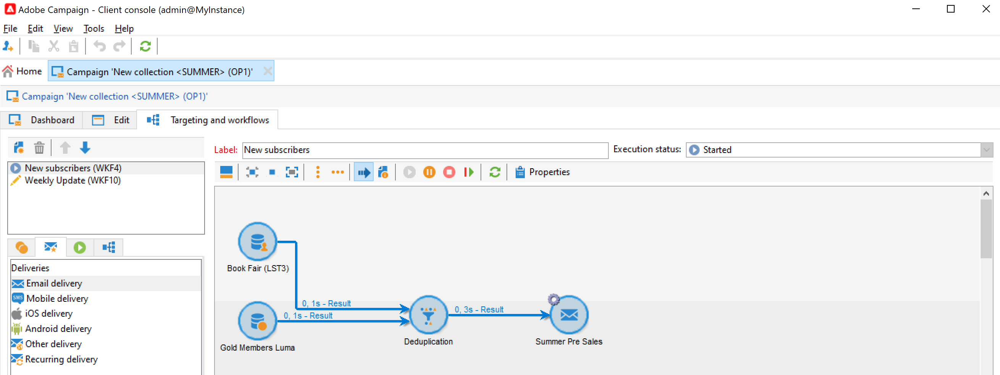
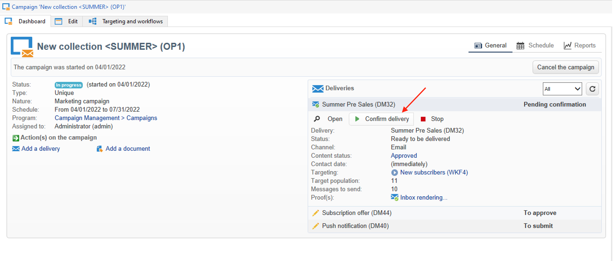

# Leveranser av marknadsföringskampanjer {#marketing-campaign-deliveries}

Samordna era flerkanalsleveranser i era kampanjer: effektivisera kommunikationen med Adobe Campaign via personaliserade e-postmeddelanden, SMS, push-meddelanden och meddelanden i appen. Du kan använda multimedia som videor, känslolägesikoner eller GIF och integrera dem direkt.

Leveranser kan skapas via kampanjkontrollpanelen, ett kampanjarbetsflöde eller direkt via leveransöversikten. När leveranser skapas från en kampanj länkas de till den här kampanjen och konsolideras på kampanjnivå.

## Skapa leveranser {#create-deliveries}

Det finns två sätt att lägga till leveranser till era marknadsföringskampanjer:

* Från **[!UICONTROL Add a delivery]** -länk på kampanjkontrollpanelen.

När leveransen har sparats läggs den till på kampanjkontrollpanelen.

* Från ett kampanjarbetsflöde, i **[!UICONTROL Targeting and workflows]** genom att lägga till leveransen.

   

   När arbetsflödet har startats läggs leveransen till på kontrollpanelen för kampanjer.

Lär dig hur du ställer in och kör flödet för leveransgodkännande [på den här sidan](marketing-campaign-approval.md).

## Starta en leverans {#start-a-delivery}

En leverans kan skickas när alla godkännanden har beviljats. Körningsprocessen beror på kanalen.

* För e-post- och mobilkanalsleveranser, se [det här avsnittet](#start-an-online-delivery)

* För direktreklam finns [det här avsnittet](#start-an-offline-delivery)

### Påbörja e-post- eller mobilleverans {#start-an-online-delivery}

När alla godkännandebegäranden har beviljats ändras leveransstatusen till **[!UICONTROL Pending confirmation]** och kan startas. Granskare som kan starta leveransen får ett meddelande om att en leverans är klar att startas.

Informationen visas också på kampanjkontrollpanelen. The **[!UICONTROL Confirm delivery]** kan du påbörja leveransen.

Bekräftelsen av leveransen är begränsad till administratörer och till den operatör eller grupp av operatorer som uttryckligen anges i leverans- eller kampanjegenskaperna. Om ingen operator är utformad kan administratörer och kampanjägaren godkänna.

Du kan även tillåta kampanjägaren att bekräfta sändningen, även om specifika granskare har definierats i leverans- eller kampanjegenskaperna. Om du vill göra det som administratör skapar du **NmsCampaign_Activate_OwnerConfirmation** och ange **1**. Alternativen hanteras från **[!UICONTROL Administration]** > **[!UICONTROL Platform]** > **[!UICONTROL Options]** i Adobe Campaign Explorer.

### Starta direktleverans av e-post {#start-an-offline-delivery}

När alla godkännanden har beviljats ändras leveransstatusen till **[!UICONTROL Pending extraction]**. Extraheringsfilerna skapas via en dedikerad [tekniskt arbetsflöde](../workflow/technical-workflows.md) som i en standardkonfiguration startar automatiskt när en direktleverans väntar på extrahering. När en process pågår visas den på kontrollpanelen och kan redigeras via länken.

När extraheringsarbetsflödet har körts måste extraheringsfilen godkännas (förutsatt att godkännande av extraheringsfilen har valts i leveransinställningarna). [Läs mer](marketing-campaign-approval.md#approving-an-extraction-file).

Följ stegen nedan för att validera innehåll och skicka filen till leverantören:

1. När extraheringsfilen har godkänts kan du generera ett korrektur av routerns e-postmeddelande. Det här e-postmeddelandet är konstruerat baserat på en leveransmall. Det måste godkännas.

   Det här steget är bara tillgängligt om **[!UICONTROL Enable the sending and validation of proofs (Direct mail)]** option was enabled in **[!UICONTROL Approvals]** -fliken för de avancerade kampanjparametrarna.

   

1. Klicka på **[!UICONTROL Send a proof]** för att skapa korrektur.

   Korrekturmålet måste definieras i förväg.

   Du kan skapa så många korrektur som behövs. Dessa nås via **[!UICONTROL Direct mail...]** leveransinformationens länk.

1. Leveransstatusen ändras till **[!UICONTROL To submit]**. Klicka på **[!UICONTROL Submit proofs]** för att starta godkännandeprocessen.

1. Leveransstatusen ändras till **[!UICONTROL Proof to validate]** och en knapp kan du godkänna eller avvisa.

   Du kan antingen godkänna eller avvisa det här godkännandet eller återgå till extraheringssteget.

1. När korrekturet är godkänt skickas extraheringsfilen till routern och leveransen är klar.

### Budget- och kostnadsberäkning {#compute-costs-and-stocks}

Filextraheringen startar två processer: budgetberäkning och lagerberäkning. Budgetposterna uppdateras.

* The **[!UICONTROL Budget]** kan du hantera budgeten för kampanjen. Summan av kostnadsposterna visas i **[!UICONTROL Calculated cost]** fält på kampanjens huvudflik och det program den tillhör. Beloppen återspeglas också i kampanjbudgeten.

   

   Den verkliga kostnaden kommer så småningom att beräknas utifrån information som tillhandahålls av routern. Endast meddelanden som skickas faktureras.

* Lager definieras i **[!UICONTROL Administration > Campaign management > Stocks]** trädnod.

   

   Kostnadsstrukturer i **[!UICONTROL Administration > Campaign management > Service providers]** nod.

   

   Lagerrader visas i lagersektionen. Om du vill definiera det ursprungliga lagret öppnar du en aktielinje. Lagret minskas varje gång en leverans sker. Du kan definiera en varningsnivå och meddelanden.

   >[!NOTE]
   >
   >Läs mer om budgetar [i det här avsnittet](providers--stocks-and-budgets.md).
