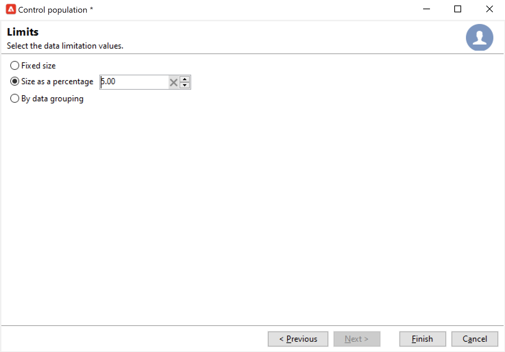

# Välj målgruppen för dina kampanjer {#marketing-campaign-deliveries}

I en marknadsföringskampanj kan ni för varje leverans definiera:

* Målgruppen. Du kan skicka meddelanden till en [lista över mottagare](#send-to-a-group) eller skapa [målgrupp i ett arbetsflöde](#build-the-main-target-in-a-workflow)
* En kontrollgrupp. Du kan [lägga till en kontrollgrupp](#add-a-control-group) övervaka mottagarnas beteende efter meddelandeleverans
<!--
* Seed addresses - Learn more in [this section](../../delivery/using/about-seed-addresses.md).-->

En del av den här informationen kan ärvas från [kampanjmall](marketing-campaign-templates.md#campaign-templates).

<!--
To build the delivery target, you can define filtering criteria for the recipients in the database. This recipient selection mode is presented in [this section](../../delivery/using/steps-defining-the-target-population.md).
-->

## Skicka till en grupp{#send-to-a-group}

Du kan importera en population till en lista och sedan ange den här listan som mål i leveranser. Följ stegen nedan för att göra detta:

1. Redigera leveransen och klicka på **[!UICONTROL To]** länk för att ändra målpopulationen.
1. I **[!UICONTROL Main target]** väljer du **[!UICONTROL Defined via the database]** och klicka **[!UICONTROL Add]** för att välja mottagare.

   

1. Välj **[!UICONTROL A list of recipients]**.

   

1. Klicka **[!UICONTROL Next]** för att markera listan.

   

   Du kan förfina målet genom att lägga till nya filtervillkor.

1. Klicka **[!UICONTROL Finish]** när alla villkor är definierade och spara huvudmålet.

## Bygg målgruppen i ett kampanjarbetsflöde {#build-the-main-target-in-a-workflow}

Huvudmålet för en leverans kan också definieras i kampanjarbetsflödet: I den grafiska miljön kan du skapa mål med hjälp av frågor, tester och operatorer: union, borttagning av dubbletter, delning osv.

>[!IMPORTANT]
>
>Du får inte lägga till fler än 28 arbetsflöden i en kampanj. Tidigare är ytterligare arbetsflöden inte synliga i gränssnittet och kan generera fel.

### Skapa arbetsflödet {#create-a-targeting-workflow}

Målinriktning kan skapas med en kombination av filtreringsvillkor i en grafisk sekvens i ett arbetsflöde. Ni kan skapa populationer och underpopulationer som ska anpassas efter era behov. Om du vill visa arbetsflödesredigeraren klickar du på **[!UICONTROL Targeting and workflows]** på kampanjkontrollpanelen.

Målpopulationen extraheras från Adobe Campaign-databasen via en eller flera frågor i ett arbetsflöde. Lär dig hur du skapar en fråga i [det här avsnittet](../workflow/query.md).

Du kan starta frågor och dela populationer via rutor som Union, Intersection, Sharing, Exclusion osv.

Markera objekten i listorna till vänster om arbetsytan och länka dem för att skapa målet.

I diagrammet länkar du upp de mål- och planeringsfrågor som krävs för målkonstruktion i diagrammet. Du kan utföra målinriktningen medan konstruktionen pågår för att kontrollera populationen som extraherats från databasen.

>[!NOTE]
>
>Exempel och procedurer för att definiera frågor finns i [det här avsnittet](../workflow/query.md).

I den vänstra delen av redigeraren finns ett bibliotek med grafiska objekt som representerar aktiviteter. Den första fliken innehåller målinriktningsaktiviteterna och den andra fliken innehåller flödeskontrollaktiviteterna, som används ibland för att samordna målinriktningsaktiviteter.

Körnings- och formateringsfunktionerna för målarbetsflödet är tillgängliga via verktygsfältet för diagramredigering.

>[!NOTE]
>
>De aktiviteter som finns tillgängliga för att skapa diagrammet och alla funktioner för visning och layout finns i [det här avsnittet](../workflow/about-workflows.md).

Ni kan skapa flera arbetsflöden för målinriktning för en enskild kampanj. Så här lägger du till ett arbetsflöde:

1. Gå till den övre vänstra delen av arbetsflödeszonen, högerklicka och välj **[!UICONTROL Add]**. Du kan också använda **[!UICONTROL New]** som finns ovanför den här zonen.

   

1. Välj **[!UICONTROL New workflow]** mall och namnge arbetsflödet.
1. Klicka **[!UICONTROL OK]** för att bekräfta att arbetsflödet har skapats och skapa sedan diagrammet för arbetsflödet.

### Kör arbetsflödet {#execute-a-workflow}

Målarbetsflöden kan startas manuellt via **[!UICONTROL Start]** i verktygsfältet, förutsatt att du har rätt behörighet.

Målinriktningen kan programmeras för automatisk körning enligt ett schema (schemaläggare) eller en händelse (extern signal, filimport osv.).

Åtgärder som rör körning av målarbetsflödet (starta, stoppa, pausa, osv.) är **asynkron** processer: kommandot sparas och börjar gälla så fort servern är tillgänglig för att använda det.

Med verktygsfältsikonerna kan du utföra åtgärder för arbetsflödet.

* Starta eller starta om

   * The **[!UICONTROL Start]** Med -ikonen kan du starta målarbetsflödet. När du klickar på den här ikonen aktiveras alla aktiviteter utan en indataövergång (förutom slutpunktshopp).

      

      Servern tar hänsyn till begäran, vilket framgår av dess status: **[!UICONTROL Start as soon as possible]**.

   * Du kan starta om arbetsflödet för målanpassning via motsvarande verktygsfältsikon. Det här kommandot kan vara användbart om **[!UICONTROL Start]** -ikonen är inte tillgänglig, till exempel när målarbetsflödet stoppas. I det här fallet klickar du på **[!UICONTROL Restart]** -ikonen för att förutse omstarten. Servern tar hänsyn till begäran, vilket framgår av dess status: **[!UICONTROL Restart requested]**.

* Stoppa eller pausa

   * Med verktygsfältsikonerna kan du stoppa eller pausa ett pågående målarbetsflöde.

      När du klickar **[!UICONTROL Pause]**, pågående åtgärder **[!UICONTROL are not]** pausad, men ingen annan aktivitet startas förrän nästa omstart.

      

      Servern tar hänsyn till kommandot, vilket visas i dess status: **[!UICONTROL Pause requested]**.

      Du kan också pausa ett arbetsflöde för målinriktning automatiskt när körningen når en viss aktivitet. Om du vill göra det högerklickar du på den aktivitet som målarbetsflödet ska pausas från och väljer **[!UICONTROL Enable but do not execute]**.

      

      Den här konfigurationen visas med en särskild ikon.

      

      >[!NOTE]
      >
      >Det här alternativet är användbart under design- och testfaser av avancerade riktade kampanjer.

      Klicka **[!UICONTROL Start]** för att återuppta körningen.

   * Klicka på **[!UICONTROL Stop]** om du vill stoppa körningen.

      

      Servern tar hänsyn till kommandot, vilket visas i dess status: **[!UICONTROL Stop requested]**.
   Du kan också stoppa ett målarbetsflöde automatiskt när körningen når en aktivitet. Om du vill göra det högerklickar du på aktiviteten som målarbetsflödet ska stoppas från och väljer **[!UICONTROL Do not activate]**.

   

   Den här konfigurationen visas med en särskild ikon.

   

   >[!NOTE]
   >
   >Det här alternativet är användbart under design- och testfaser av avancerade riktade kampanjer.

* Ovillkorligt stopp

   I Utforskaren väljer du **[!UICONTROL Administration > Production > Object created automatically > Campaign workflows]** för att få tillgång till och agera utifrån alla kampanjarbetsflöden.

   Du kan avbryta ditt arbetsflöde genom att klicka på **[!UICONTROL Actions]** ikon och markera **[!UICONTROL Unconditional]** sluta. Den här åtgärden avbryter kampanjarbetsflödet.

   

## Lägga till en kontrollgrupp {#add-a-control-group}

En kontrollgrupp är en population som inte kommer att få leveransen. Det används för att spåra beteenden och kampanjeffekter efter leverans genom att göra en jämförelse med beteendet hos målpopulationen, som har fått leveransen.

Kontrollgruppen kan extraheras från huvudmålet och/eller komma från en viss grupp eller fråga.

### Aktivera kontrollgruppen för en kampanj {#activate-the-control-group-for-a-campaign}

Du kan definiera en kontrollgrupp på kampanjnivå, och i så fall tillämpas kontrollgruppen på varje leverans av den aktuella kampanjen.

1. Redigera kampanjen i fråga och klicka på **[!UICONTROL Edit]** -fliken.
1. Klicka på **[!UICONTROL Advanced campaign parameters...]**.

   

1. Välj **[!UICONTROL Enable and edit control group configuration]** alternativ.
1. Klicka **[!UICONTROL Edit...]** för att konfigurera kontrollgruppen.

   

Hela proceduren beskrivs i [det här avsnittet](#extract-the-control-group-from-the-main-target). Läs mer om kontrollgrupper i [det här avsnittet](#add-a-population).

### Aktivera kontrollgruppen för en leverans {#activate-the-control-group-for-a-delivery}

Du kan definiera en kontrollgrupp på leveransnivå. I så fall tillämpas kontrollgruppen på varje leverans av den aktuella kampanjen.

Som standard gäller den kontrollgruppskonfiguration som definieras på kampanjnivå för varje leverans av kampanjen. Du kan dock anpassa kontrollgruppen för en enskild leverans.

>[!NOTE]
>
>Om du har definierat en kontrollgrupp för en kampanj, och du även konfigurerar den för en leverans som är länkad till den här kampanjen, tillämpas bara den kontrollgrupp som har definierats för leveransen.

1. Redigera den aktuella leveransen och klicka sedan på knappen **[!UICONTROL To]** länk.
1. Klicka på **[!UICONTROL Control group]** tabboch sedan markera **[!UICONTROL Enable and edit control group configuration]**.

   

1. Klicka **[!UICONTROL Edit...]** för att konfigurera kontrollgruppen.

Hela proceduren beskrivs i [det här avsnittet](#extract-the-control-group-from-the-main-target).

### Använd en ny population som kontrollgrupp {#add-a-population}

Du kan använda en specifik population för kontrollgruppen. I så fall väljer du den lista som ska användas som kontrollgrupp i det relaterade fältet.

Den här populationen kan komma från en lista med mottagare eller så kan du definiera den via en specifik fråga.

>[!NOTE]
>
>Adobe Campaign Query Editor presenteras i [det här avsnittet](../workflow/query.md).

### Extrahera kontrollgruppen från huvudmålet {#extract-the-control-group-from-the-main-target}

Du kan även extrahera mottagare från leveransens huvudmål. I det här fallet hämtas mottagarna från målet för leveransåtgärder som påverkas av den här konfigurationen. Extraheringen kan vara slumpmässig eller bero på att mottagarna har sorterats.

Om du vill extrahera en kontrollgrupp aktiverar du kontrollgruppen för kampanjen eller leveransen och väljer något av följande alternativ: **[!UICONTROL Activate random sampling]** eller **[!UICONTROL Keep only the first records after sorting]**.

* Använd **[!UICONTROL Activate random sampling]** möjlighet att tillämpa slumpmässig provtagning på mottagarna i huvudpopulationen. Om du sedan anger tröskelvärdet till 100 kommer kontrollgruppen att bestå av 100 mottagare som väljs slumpmässigt från målpopulationen. Det slumpmässiga urvalet beror på databasmotorn.
* Använd **[!UICONTROL Keep only the first records after sorting]** för att definiera en begränsning baserat på en eller flera sorteringsorder. Om du väljer **[!UICONTROL Age]** som sorteringskriterium och sedan definiera 100 som ett tröskelvärde, kommer kontrollgruppen att bestå av de 100 yngsta mottagarna. Det kan till exempel vara intressant att definiera en kontrollgrupp som innehåller mottagare som gör få inköp, eller mottagare som gör vanliga inköp, och att jämföra deras beteende med de kontaktade mottagarna.

Klicka **[!UICONTROL Next]** om du vill definiera sorteringsordningen (om det behövs) och välja mottagarbegränsningsläget.

Den här konfigurationen motsvarar en **[!UICONTROL Split]** i arbetsflödet, vilket gör att du kan dela upp målet i delmängder. Kontrollgruppen är en av dessa deluppsättningar.

#### Videokurs {#create-email-video}

I den här videon förklaras hur du skapar en kampanj och ett e-postmeddelande i Adobe Campaign.

>[!VIDEO](https://video.tv.adobe.com/v/25604?quality=12)

Det finns ytterligare utbildningsvideor för Campaign [här](https://experienceleague.adobe.com/docs/campaign-classic-learn/tutorials/overview.html?lang=sv).
