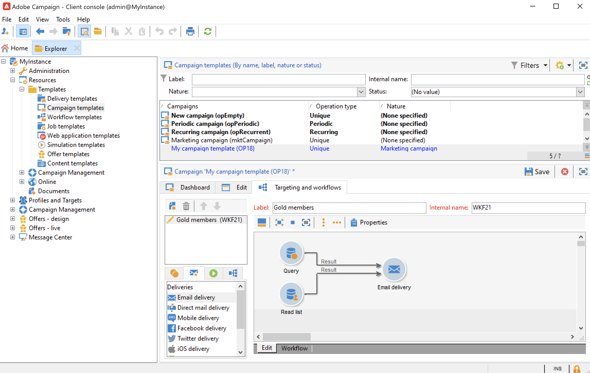

# Skapa och konfigurera kampanjmallar {#campaign-templates}

Alla marknadsföringskampanjer bygger på en mall som lagrar de viktigaste egenskaperna och funktionerna. Campaign innehåller en inbyggd mall för att skapa kampanjer. Den här mallen har alla funktioner aktiverade: Dokument, dirigeringsadresser, godkännanden, leveransdispositioner osv.

Vilka funktioner som är tillgängliga beror på dina behörigheter, tillägg och konfigurationen för din Adobe Campaign-plattform.

>[!NOTE]
>
>Trädet visas när du klickar på **[!UICONTROL Explorer]** på startsidan.

En inbyggd mall tillhandahålls för att skapa en kampanj för vilken ingen specifik konfiguration har definierats. Du kan skapa och konfigurera kampanjmallar och sedan skapa kampanjer utifrån dessa mallar.

## Skapa en kampanjmall {#create-a-campaign-template}

Så här skapar du en kampanjmall:

1. Öppna kampanj **Utforskaren** och bläddra till **Resurser > Mallar > Campaign-mallar**.
1. Klicka **Nytt** i verktygsfältet ovanför listan med mallar.

Du kan också **duplicera** den inbyggda mallen för återanvändning och anpassning av dess konfiguration. Om du vill göra det högerklickar du på mallen och väljer **Duplicera**.

1. Ange etiketten för den nya kampanjmallen.
1. Klicka **Spara** och öppna mallen igen.
1. I **Redigera** definierar du mallegenskaperna.
1. Välj **Avancerade kampanjparametrar..** länk för att lägga till ett arbetsflöde i kampanjmallen.

   

1. Ändra **Målgruppsanpassning och arbetsflöden** värde till **Ja**., och bekräfta. Lär dig hur du lägger till funktioner i [det här avsnittet](#typology-of-enabled-modules).
1. The **Målgruppsanpassning och arbetsflöden** -fliken läggs till i mallen. Klicka **Lägg till ett arbetsflöde..**, ange **Etikett** och klicka **OK**.
1. Skapa arbetsflödet efter behov.

   

1. Klicka **Spara**. Mallen är nu klar att användas för att skapa en ny kampanj.

På de olika flikarna och underflikarna i kampanjmallen kan du komma åt inställningarna som beskrivs i [Allmän konfiguration](#general-configuration).

## Välj moduler {#select-modules}

The **[!UICONTROL Advanced campaign parameters...]** kan du aktivera och inaktivera jobb för kampanjer som är baserade på den här mallen. Välj de funktioner som du vill aktivera i kampanjer som skapas baserat på den här mallen.

Om ingen funktion är markerad, de element som rör processen (menyer, ikoner, alternativ, flikar, underflikar osv.) visas inte i mallens gränssnitt eller i kampanjer som är baserade på den här mallen. Flikarna till vänster om kampanjinformationen och de tillgängliga flikarna sammanfaller med de funktioner som valts i mallen. Till exempel **Utgifter och mål** är inte aktiverad, **[!UICONTROL Budget]** visas inte i kampanjer som är baserade på den här mallen.

Dessutom läggs genvägar till konfigurationsfönstren till på kontrollpanelen för kampanjer. När en funktion är aktiverad får en direktlänk åtkomst till den från kontrollpanelen för kampanjer.

### Konfigurationsexempel

* Med följande inställningar:

   

   Kampanjpanelen visar:

   

   Observera att **[!UICONTROL Targeting and workflows]** -fliken saknas.

   Följande funktioner är tillgängliga:

   

   Observera att **[!UICONTROL Budget]** -fliken saknas.

   De avancerade inställningarna för kampanjen återspeglar även den här konfigurationen.

   

   Observera att **[!UICONTROL Approvals]** -fliken är inte tillgänglig.

* Med den här konfigurationen:
   

   Kampanjpanelen visar:

   

   Observera att **[!UICONTROL Targeting and workflows]** -fliken är tillgänglig men **Lägga till ett dokument** länk saknas.

   Följande funktioner är tillgängliga:

   

   Observera att **[!UICONTROL Budget]** -fliken är tillgänglig.

   De avancerade inställningarna för kampanjen återspeglar även den här konfigurationen.

   

   Observera att **[!UICONTROL Approvals]** -fliken är tillgänglig men **[!UICONTROL Control population]** och **[!UICONTROL Seed addresses]** -flikar är inte aktiverade.

## Modultyper {#typology-of-enabled-modules}

* **Kontrollgrupp**

   När den här modulen är markerad läggs en extra flik till i de avancerade inställningarna för mallen och kampanjerna som är baserade på den här mallen. Konfigurationen kan definieras via mallen eller individuellt för varje kampanj. Läs mer om kontrollgrupper i [det här avsnittet](marketing-campaign-deliveries.md#defining-a-control-group).

   

* **Fröadresser**

   När den här modulen är markerad läggs en extra flik till i de avancerade inställningarna för mallen och kampanjerna som är baserade på den här mallen. Konfigurationen kan definieras via mallen eller individuellt för varje kampanj.

   

* **Dokument**

   När den här modulen är markerad läggs en extra flik till i **[!UICONTROL Edit]** -fliken i mallen och de kampanjer som är baserade på den här mallen. Bifogade dokument kan läggas till från mallen eller individuellt för varje kampanj. Läs mer om dokument i [det här avsnittet](marketing-campaign-deliveries.md#manage-associated-documents).

   

* **Leveransbeskrivning**

   När den här modulen är markerad **[!UICONTROL Delivery outlines]** underfliken läggs till i **[!UICONTROL Documents]** för att definiera leveransdispositioner för kampanjen. Läs mer om leveransdispositioner i [det här avsnittet](marketing-campaign-assets.md#delivery-outlines).

   

* **Målgruppsanpassning och arbetsflöden**

   När du väljer **[!UICONTROL Targeting and workflows]** -modulen läggs en flik till så att du kan skapa ett eller flera arbetsflöden för kampanjer baserat på den här mallen. Arbetsflöden kan också konfigureras individuellt för varje kampanj baserat på den här mallen.Läs mer om kampanjarbetsflöden i [det här avsnittet](marketing-campaign-deliveries.md#build-the-main-target-in-a-workflow).

   

   När den här modulen är aktiverad visas en **[!UICONTROL Jobs]** -fliken läggs till i de avancerade inställningarna för kampanjen för att definiera processens körningssekvens.

* **Godkännanden**

   Om du aktiverar **[!UICONTROL Approvals]** kan du välja vilka processer som ska godkännas och vilka operatörer som ansvarar för godkännandena. Läs mer om godkännanden i [det här avsnittet](marketing-campaign-approval.md#select-reviewers).

   

   Du kan välja om du vill aktivera processgodkännande via **[!UICONTROL Approvals]** -fliken i avsnittet för mallar med avancerade inställningar.

* **Utgifter och mål**

   När den här modulen är markerad **[!UICONTROL Budget]** -fliken läggs till i informationen om mallen och kampanjer som baseras på den här mallen, så att den associerade budgeten kan väljas.

   

## Mallegenskaper {#template-properties}

När du skapar en kampanjmall måste du ange följande information:

* Ange **label** av mallen: etiketten är obligatorisk och är standardetikett för alla kampanjer som baseras på den här mallen.
* Välj kampanj **natur** i listrutan. De värden som är tillgängliga i den här listan är de som har sparats i **[!UICONTROL natureOp]** uppräkning.

Lär dig hur du får åtkomst till och konfigurerar dina uppräkningar i [den här sidan](../../v8/config/ui-settings.md#enumerations).

* Välj **kampanjtyp**: unika, återkommande eller periodiska. Som standard används kampanjmallar för unika kampanjer. Återkommande och periodiska kampanjer beskrivs i [det här avsnittet](recurring-periodic-campaigns.md).
* Ange kampanjens varaktighet, dvs. antalet dagar som kampanjen ska äga rum. När du skapar en kampanj som baseras på den här mallen fylls start- och slutdatumet för kampanjen i automatiskt.

   Om kampanjen är återkommande måste du ange kampanjens start- och slutdatum direkt i mallen.

* Ange **relaterat program** av mallen: kampanjer som är baserade på den här mallen är länkade till det valda programmet.

<!--
## Track campaign execution{#campaign-reverse-scheduling}

You can create a schedule for a campaign and track accomplishments, for instance to prepare an event schedule for a specific date. Campaign templates now let you calculate the start date of a task based on the end date of a campaign.

In the task configuration box, go to the **[!UICONTROL Implementation schedule]** area and check the **[!UICONTROL The start date is calculated based on the campaign end date]** box. (Here, "start date" is the task start date). Go to the **[!UICONTROL Start]** field and enter an interval: the task will start this long before the campaign end date. If you enter a period which is longer than the campaign is set to last, the task will begin before the campaign.

When you create a campaign using this template, the task start date will be calculated automatically. However, you can always change it later.-->
