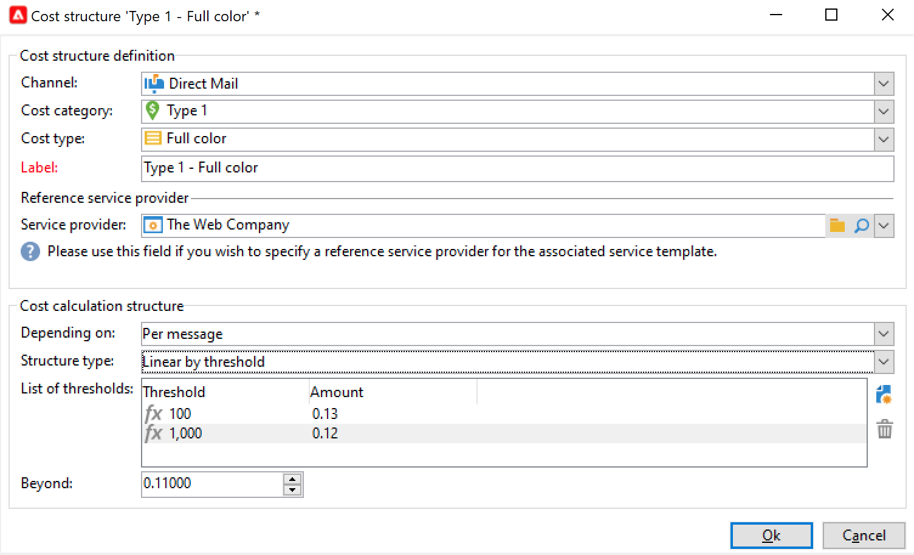
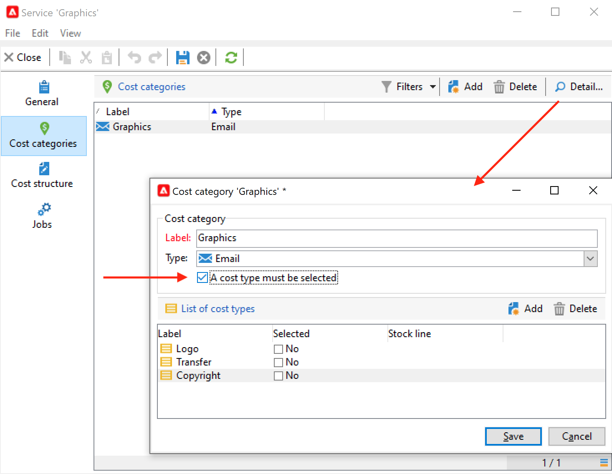

# Leverantörer, lager och budgetar{#providers-stocks-and-budgets}

Med Adobe Campaign kan ni definiera tjänsteleverantörer som ska delta i de jobb som utförs i kampanjer. Information om tjänsteleverantörerna och de tillhörande kostnadsstrukturerna definieras av Adobe Campaign-administratören ur huvudsynvinkel. Tjänsteleverantören hänvisas till från leveransen, och dess kostnadsstrukturer gör det möjligt att beräkna kostnaderna i samband med denna leverans samt förvaltningen av det berörda lagret.

## Skapa tjänsteleverantörer och deras kostnadsstrukturer {#create-service-providers-and-their-cost-structures}

Varje tjänsteleverantör sparas i en fil med kontaktinformation, tjänstmallar och relaterade jobb.

Tjänsteleverantörer är konfigurerade i **[!UICONTROL Administration > Campaign management]** trädnod.

De jobb som utförs under leveranser utförs av tjänsteleverantörer, särskilt för direktreklam och mobila kanaler. Dessa tjänsteleverantörer kan till exempel vara inblandade i utskrift eller distribution av meddelanden. Dessa jobb omfattar konfigurationer och kostnader som är specifika för varje tjänsteleverantör. Tjänsteleverantörernas konfiguration omfattar fyra steg:

1. Skapande av en tjänsteleverantör i Adobe Campaign. [Läs mer](#add-a-service-provider)

1. Definiera kostnadskategorier och strukturer för tillhörande tjänstmallar. [Läs mer](#define-cost-categories)

1. Konfiguration av processer. [Läs mer](#configure-processes-associated-with-a-service).

1. Referera till tjänstleverantören på kampanjnivå. [Läs mer](#associate-a-service-with-a-campaign).

### Skapa en tjänsteleverantör och dess kostnadskategorier {#create-a-service-provider-and-its-cost-categories}

#### Lägg till en tjänsteleverantör {#add-a-service-provider}

Du kan skapa så många tjänsteleverantörer som behövs för dina leveranser. Så här lägger du till en tjänsteleverantör:

1. Klicka på **[!UICONTROL New]** ovanför listan över tjänsteleverantörer.
1. Ange tjänstleverantörens namn och kontaktinformation i fönstrets nedre del.

   

1. Klicka på **[!UICONTROL Save]** om du vill lägga till tjänsteleverantören i listan.

#### Definiera kostnadskategorier {#define-cost-categories}

Du kan nu associera tjänstmallar med varje tjänsteleverantör. I dessa mallar måste du först identifiera kostnadskategorierna och vid behov det berörda lagret. Du kan sedan skapa kostnadsberäkningsregler för varje kategori via kostnadsstrukturerna. [Läs mer](#define-the-cost-structure).

En kostnadskategori är en enhet som innehåller en uppsättning kostnader som berättigar till en viss typ av leverans (e-post, direktreklam, SMS osv.). Kostnadskategorierna grupperas i mallar för tjänster som är kopplade till tjänsteleverantörerna. Varje tjänsteleverantör kan referera till en eller flera tjänstmallar.

Så här skapar du en tjänstmall och definierar dess innehåll:

1. I **[!UICONTROL Services]** klickar du på **[!UICONTROL Add]** och ange namnet på tjänstmallen.

   

1. Skapa kostnadskategorier för varje typ av process (direktreklam/e-post/etc.). eller uppgift). Om du vill göra det klickar du på **[!UICONTROL Cost categories]** och sedan **[!UICONTROL Add]** och ange parametrarna för varje kostnadskategori.

   

   * Ange en etikett för kostnadskategorin och välj typ av process: **[!UICONTROL Direct mail]**, **[!UICONTROL Email]**, **[!UICONTROL Mobile]**, osv.
   * Klicka på **[!UICONTROL Add]** för att definiera de typer av kostnader som är kopplade till den här kategorin.
   * Vid behov skall en lagerlinje kopplas till varje typ av kostnad så att de använda kvantiteterna automatiskt kopplas till de befintliga lagren.

      >[!NOTE]
      >
      >Lagerraderna definieras i **[!UICONTROL Stock management]** nod. [Läs mer](#stock-and-order-management).

1. Du kan förvälja ett värde för den här kostnadskategorin, som är standard i tjänsteleverantörens kostnadskategorier (i stället för ett tomt värde). Aktivera **Ja** i **[!UICONTROL Selected]** Kolumn för den berörda kategorin:

   

   På leveransnivån väljs värdet som standard.

### Definiera kostnadsstrukturen {#define-the-cost-structure}

För varje typ av kostnad anger kostnadsstrukturen de beräkningsregler som ska tillämpas.

Klicka på **[!UICONTROL Cost structure]** för att konfigurera kostnadsberäkningen för varje kostnadskategori och typ. Klicka **[!UICONTROL Add]** och ange kostnadsstrukturen.

* Om du vill skapa kostnadsstrukturen väljer du typ av meddelande och den berörda kostnadskategorin i listrutorna samt den typ av kostnad som beräkningsregeln ska gälla för. Innehållet i listrutorna kommer från den information som anges via **[!UICONTROL Cost categories]** -fliken.

   Du måste tilldela en etikett till kostnadsstrukturen. Som standard har den följande leveransdisposition: **Kostnadskategori - typ av kostnad**.

   Du kan dock byta namn på den: ange det önskade värdet direkt i dialogrutan **[!UICONTROL Label]** fält.

* Kostnadsberäkningsformeln definieras i fönstrets nedre del.

   Den här formeln kan vara fast (för valfritt antal meddelanden) eller beräknas utifrån antalet meddelanden.

   När det beror på antalet meddelanden kan kostnadsberäkningsstrukturen vara **[!UICONTROL Linear]**, **[!UICONTROL Linear by threshold]**, eller **[!UICONTROL Constant by threshold]**.

#### Linjär struktur {#linear-structure}

Om mängden alltid är densamma för ett meddelande (eller en grupp med meddelanden) oavsett det totala antalet meddelanden väljer du **[!UICONTROL Linear]** och ange kostnaden för varje meddelande.

Om detta belopp gäller för en grupp meddelanden, ange antalet meddelanden som berörs i **[!UICONTROL for]** fält.

#### Linjär struktur efter tröskelvärde {#linear-structure-by-threshold}

Om beloppet gäller med tröskelvärdet för varje meddelande måste du definiera en **[!UICONTROL Linear by threshold]** beräkningsstruktur. I den här typen av kostnadsstruktur kostar varje meddelande till exempel 0,13 om det totala antalet meddelanden är mellan 1 och 100 och kommer att kosta 0,12 från 100 till 1000 skickade meddelanden, eller 0,11 bortom 1000 meddelanden.

Konfigurationen är följande:

Om du vill lägga till ett tröskelvärde klickar du på **[!UICONTROL Add]** till höger om listan.

#### Konstant struktur efter tröskelvärde {#constant-structure-by-threshold}

Slutligen kan du konfigurera en kostnadsberäkning utifrån det totala antalet meddelanden. Välj en **[!UICONTROL Constant by threshold]** beräkningsstruktur. Kostnaden sätts till exempel till ett fast belopp på 12,00 för 1 till 100 meddelanden och till 100,00 för leverans av 101 till 1000 meddelanden och till 500,00 för alla leveranser av över 1000 meddelanden, oavsett totalt antal.

### Konfigurera jobb som är kopplade till en tjänst {#configure-processes-associated-with-a-service}

Du kan associera information om processerna som är kopplade till tjänsteleverantören via **[!UICONTROL Jobs]** -fliken. I det här avsnittet kan du konfigurera sändning av information till routern.

* The **[!UICONTROL File extraction]** anger exportmallen som används för leverans när den här tjänsten väljs. Du kan ange namnet på utdatafilen i dialogrutan **[!UICONTROL Extraction file]** fält. Med knappen till höger om fältet kan du infoga variabler.

* The **[!UICONTROL Notification email]** kan du ange en mall som ska meddela tjänsteleverantörer när filerna har skickats. Välj den mall som används för att skapa varningsmeddelandet och gruppen med mottagare.

   Leveransmallar för meddelanden sparas som standard i **[!UICONTROL Administration > Campaign management > Technical delivery templates]** som är tillgänglig från den allmänna vyn.

* The **[!UICONTROL Post-processing]** kan du välja vilket arbetsflöde som ska startas när leveransen har godkänts. Om en arbetsflödesmall anges skapas en arbetsflödesinstans automatiskt och startas så snart godkännandet börjar gälla. Det här arbetsflödet kan till exempel skicka extraheringsfilen till en extern tjänsteleverantör för bearbetning.

### Associera en tjänst med en kampanj {#associate-a-service-with-a-campaign}

Tjänsteleverantörer är associerade med kampanjleveranser. Det finns referenser i leveransmallar för att erbjuda sina tjänster i leveranser som skapas via den här mallen.

När en tjänst har valts, de kostnadskategorier som motsvarar leveranstypen (direktreklam, e-post, osv.) anges automatiskt i den centrala tabellen tillsammans med de bearbetningsalternativ som har definierats.

>[!NOTE]
>
>Om ingen kostnadskategori visas när en tjänst väljs betyder det att ingen kostnadskategori har definierats för den här typen av process. För en e-postleverans, till exempel om **[!UICONTROL Email]** typkostnadskategorin har definierats, ingen kategori visas och att du väljer tjänsten har ingen effekt.

* Om du vill få direktreklam kan du välja tjänsten i konfigurationsfönstret.

   

* För leverans i mobilkanaler eller via telefon gäller samma urvalsmodell.
* För en e-postleverans väljs tjänsten från **[!UICONTROL Advanced]** -fliken i leveransegenskaperna, som i följande exempel:

   

The **[!UICONTROL Amount to surcharge]** kan du lägga till en kostnad för den här kategorin i samband med den aktuella leveransen eller uppgiften.

Du kan definiera ett obligatoriskt urval av en kostnadstyp under definitionen av kostnadskategorier för en leverans. Välj **[!UICONTROL A cost type must be selected]**.

## Lager- och orderhantering {#stock-and-order-management}

Kostnadstyperna kan kopplas till lagerrader för att hantera aviseringar, spåra leveranser och startorder.

Förfarandet för att upprätta lager- och orderhantering i Adobe Campaign samt för att varna aktörer om det inte finns tillräckligt med material för att en leverans ska kunna genomföras är följande:

1. Skapa och referera till lager för associerade tjänsteleverantörer. [Läs mer](#create-a-stock).

1. Lägger till aktierader. [Läs mer](#add-stock-lines).

1. Meddela operatörerna i händelse av en varning. [Läs mer](#alert-operators).

1. Beställningar och leverans. [Läs mer](#orders).

### Stock-hantering {#stock-management}

Adobe Campaign kan meddela en grupp operatorer om beståndet har tagit slut eller uppnått ett minimivärde. Stock-nivåer är tillgängliga via **[!UICONTROL Stocks]** länk till **[!UICONTROL Campaigns]** via **[!UICONTROL Other choices]** navigeringsområdets länk.

#### Skapa en aktie {#creating-a-stock}

Så här skapar du en ny aktie:

1. Klicka på **[!UICONTROL Create]** ovanför lagerförteckningen.
1. Ange Stock-etiketten och välj den tjänsteleverantör som den är associerad med i listrutan. [Läs mer](#create-service-providers-and-their-cost-structures).

#### Lägg till aktierader {#add-stock-lines}

En aktie består av olika stocklinjer. En lagerrad innehåller en ursprunglig kvantitet resurser som förbrukas av leveranser. Varje lagerrad anger förbrukad kvantitet, lagerkvantitet och beställd kvantitet.

När du skapar en aktie klickar du på **[!UICONTROL Stock lines]** för att lägga till nya rader.

När du har skapat stockfilen kan du använda kontrollpanelen för att skapa och övervaka lageruppsättningar.

Klicka på **[!UICONTROL Create]** om du vill lägga till nya aktierader.

* Ange den ursprungliga lagerkvantiteten i **[!UICONTROL Initial stock]** fält. The **[!UICONTROL Consumed]** och **[!UICONTROL In stock]** fälten beräknas automatiskt och uppdateras allt eftersom kampanjer pågår.

   

* Ange det tröskelvärde från vilket operatorer ska larmas för att beställa lager i **[!UICONTROL Alert level]** fält. När varningsnivån nås visas ett varningsmeddelande i godkännandefönstret för leveranser som använder detta lager.

#### Associera en aktie med kostnadskategorier {#associate-a-stock-with-cost-categories}

För en viss tjänsteleverantör kan en aktierad refereras till av en av kostnadskategorierna i en tjänst, enligt följande:

### Stock-spårning {#stock-tracking}

#### Aviseringsoperatorer {#alert-operators}

En varning visas när ett lager som refereras i en leverans inte räcker till. Följande varning visas till exempel när en extraheringsfil har godkänts:

#### Beställningar {#orders}

The **[!UICONTROL Orders]** Med underfliken kan du visa aktuella order och spara nya order.

Om du vill spara en beställning redigerar du den avsedda lagerraden och klickar på **[!UICONTROL Add]** och ange leveransdatum och beställd kvantitet.

>[!NOTE]
>
>När leveransdatumet har nåtts försvinner den beställda lagerraden automatiskt och den kvantitet som anges i **[!UICONTROL Volume on order]** fältet läggs till i **[!UICONTROL Tracking]** -fliken. Den här kvantiteten läggs automatiskt till i lagervolymen.

The **[!UICONTROL Consumptions]** -fliken innehåller den volym som används per kampanj. Informationen på den här fliken matas in automatiskt efter leveransen. Klicka på **[!UICONTROL Edit]** knappen för att öppna den aktuella kampanjen.

## Beräkna budgetar {#calculate-budgets}

### Princip {#principle}

Kostnaderna hanteras för leveranser och kampanjer. Kostnaderna fördelas enligt framstegen på budgetarna.

Leveranskostnaderna för en kampanj konsolideras på kampanjnivå och kostnaderna för alla kampanjer i ett program överförs till det program som de är kopplade till. Med dedikerade rapporter kan ni hålla reda på budgeten för hela plattformen eller för varje plan och program.

### Implementering {#implementation}

När du väljer budget i en kampanj måste du ange det ursprungliga beloppet. De beräknade kostnaderna uppdateras automatiskt i enlighet med åtagandenivån för de angivna beloppen (utgifter som gjorts, förväntades, reserverades, gjordes).

<!--
See [Calculating amounts](../../mrm/using/controlling-costs.md#calculating-amounts).

>[!NOTE]
>
>The procedure for creating budgets is presented in [Creating a budget](../../mrm/using/controlling-costs.md#creating-a-budget).
-->
