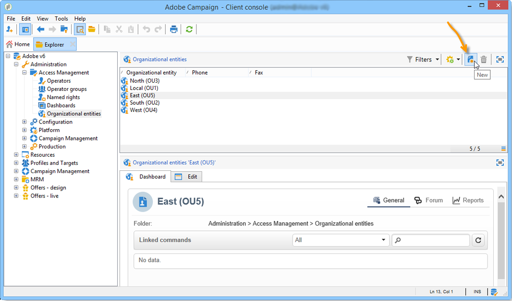

# Kom igång med distribuerad marknadsföring{#about-distributed-marketing}

Adobe Campaign erbjuder en **Distribuerad marknadsföring**-applikation för att implementera samarbetskampanjer mellan centrala enheter (huvudkontor, marknadsföringsavdelningar osv.) och lokala enheter (säljställen, regionala organ osv.). Samarbetet baseras på en delad arbetsyta som kallas **[!UICONTROL list of campaign packages]**, där centralt skapade kampanjmallar och instanser erbjuds lokala entiteter.

Den centrala enheten tillhandahåller kampanjer som lokala enheter kan använda. Kampanjer materialiseras av paket som representerar antingen lokala kampanjer eller samarbetskampanjer. För att kunna använda en kampanj måste den lokala enheten beställa den och ordern måste godkännas.

>[!CAUTION]
>
>Modulen Distribuerad marknadsföring är ett **kampanjalternativ**. Kontrollera licensavtalet.

## Terminologi {#terminology}

* **Centrala entiteter**

  Centrala enheter består av marknadsföringsoperatörer som ansvarar för att specificera kommunikation och bistå lokala enheter vid genomförandet av deras marknadsföringskampanjer.

  Den distribuerade marknadsföringsmodulen gör att den centrala enheten kan:

   * skapa marknadsföringskampanjer för lokala enheter,
   * öka de lokala enheternas grad av självbestämmande när det gäller val av kommunikation, målgruppsanpassning, innehåll m.m. mellan kunder och potentiella kunder.
   * hantera och kontrollera kostnader,
   * hantera ett nätverk av myndigheter.

* **Lokala entiteter**

  Lokala enheter kan vara myndigheter, butiker eller grupper av specifika lokala aktörer (nationella eller regionala chefer, varumärkesansvariga osv.).

  Distribuerad marknadsföring ger lokala enheter större självständighet samtidigt som man optimerar kostnaderna för att genomföra kampanjen.

* **Lokalisering**

  Lokalisering är en lokal enhets förmåga att ändra mål och innehåll för en kampanj. Möjlig lokaliseringsnivå beror på kampanjtypen och dess implementering.

* **Lista över kampanjpaket**

  Listan över kampanjpaket innehåller kampanjer som är tillgängliga för lokala entiteter.

* **Kampanjpaket**

  Mall (eller kampanjinstans) som har skapats av en central enhet och gjorts tillgänglig för en uppsättning lokala enheter.

* **Lokal kampanj**

  En lokal kampanj är en instans som skapats från en mall som refereras i listan med **[!UICONTROL campaign packages]** med ett **specifikt körningsschema**. Syftet är att tillgodose ett lokalt kommunikationsbehov med hjälp av en kampanjmall som har konfigurerats och konfigurerats av den centrala enheten.

  Den lokala enhetens grad av självbestämmande beror på det genomförande som används.

  Se [Skapa en lokal kampanj](creating-a-local-campaign.md).

* **Samverkande kampanj**

  En samverkanskampanj är en kampanj vars **körningsschema definieras** av den centrala entiteten, som den lokala entiteten kan använda. Innehållet är detsamma för varje lokal enhet, men kostnaderna delas. Delta genom att lokala enheter prenumererar på samarbetskampanjen.

   * **[!UICONTROL Collaborative campaign (by form)]**: rekommenderas för kampanjer med upp till 300 lokala entiteter. Den lokala enheten kan ange fördefinierade parametrar för målinriktning och innehållspersonalisering i ett webbformulär. Formuläret kan vara ett Adobe Campaign-formulär eller ett externt formulär (extranät-klient). En funktionell administratör kan definiera och konfigurera formuläret baserat på en formulärmall som definieras av integratorn. För att kunna beställa kampanjen behöver den lokala enheten bara webbåtkomst.
   * **[!UICONTROL Collaborative campaign (by campaign)]**: rekommenderas för kampanjer som riktar sig till dussintals lokala entiteter. Den här typen av kampanj skapar underordnade kampanjer för varje lokal enhet. När **[!UICONTROL collaborative campaign (by campaign)]** har godkänts av den centrala entiteten blir kampanjen tillgänglig för den lokala entiteten, som kan ändra den. Körningen synkroniseras automatiskt mellan överordnade och underordnade kampanjer. Den lokala enheten måste ha tillgång till en instans för att kunna beställa en kampanj och delta i den.
   * **[!UICONTROL Collaborative campaign (by target approval)]**: rekommenderas för kampanjer som riktar sig till flera tusen lokala enheter. Lokal enhet tar emot en kontaktlista som har fördefinierats av den centrala enheten. Den lokala enheten avgör om vissa kontakter ska behållas eller inte baserat på kampanjinnehållet via ett webbformulär. Lokala enheter dras från listan med valda kontakter. För att delta i kampanjen behöver den lokala enheten bara tillgång till webben.
   * **[!UICONTROL Collaborative campaign (simple)]**: Det här läget garanterar kompatibilitet med de specifika körningsprocesserna i tidigare versioner.

  Se [Skapa en samarbetskampanj](creating-a-collaborative-campaign.md).

**Beställa kampanjpaket**

Om en lokal enhet registrerar för en kampanj görs detta i en order som grupperar all information som är relativ till kampanjlokaliseringen.

## Workspace {#workspace}

Listan med kampanjpaket kan nås från fliken **Kampanjer**: klicka på länken **[!UICONTROL Campaign packages]**.

I det här fönstret kan alla lokala operatörer visa kampanjer som är tillgängliga för deras lokala myndighet.

När det gäller centrala myndigheter visar det här fönstret alla paket som är tillgängliga i listan över kampanjpaket och erbjuder ytterligare länkar för redigering av listan.

## Operatörer och enheter {#operators-and-entities}

Börja med att ange operatorer för central och lokal enhet via mappen **[!UICONTROL Access management]**.

### Operatorer {#operators}

Du måste skapa centrala och lokala operatorer.

Centrala operatorer måste tillhöra operatorgruppen **[!UICONTROL Central management]** eller ha **[!UICONTROL CENTRAL]** namngiven.

Lokala operatorer måste tillhöra operatorgruppen **[!UICONTROL Local management]** eller ha **[!UICONTROL LOCAL]** namngiven. De måste också vara kopplade till sin lokala enhet.

### Organisationsenheter {#organizational-entities}

Om du vill skapa en organisationsenhet klickar du på mappen **[!UICONTROL Administration > Access management > Organizational entities]** och klickar på ikonen **[!UICONTROL New]** ovanför listan med enheter.

Varje organisationsenhet innehåller identifieringsinformation (etikett, internt namn, kontaktinformation osv.) och grupper som deltar i ordergodkännandeprocessen. Dessa definieras i avsnittet **[!UICONTROL Notifications and approvals]** som finns på fliken **[!UICONTROL General]**.

* Definiera en paketmeddelandegrupp: operatorer i den här gruppen får ett meddelande varje gång ett nytt paket läggs till i listan över kampanjpaket och varje gång en kampanj blir tillgänglig.
* Välj den grupp med granskare som ansvarar för att godkänna order, dvs. de som ansvarar för att godkänna kampanjer som beställts av den lokala enheten.
* Slutligen väljer du den grupp med granskare som ansvarar för att godkänna den lokala kampanjen (mål, innehåll, budget osv.). Den här gruppen kan läggas till när du beställer en kampanj, beroende på mallen.

>[!NOTE]
>
>Godkännandeprocessen presenteras i avsnittet [Godkännandeprocess](creating-a-local-campaign.md#approval-process).

## Implementering {#implementation}

Distribuerade marknadsföringskampanjer skapas och publiceras av den centrala enheten. De får användas av både lokala och centrala enheter efter behov.

Implementeringsproceduren beror på vilken typ av kampanjpaket som används och delegeringsnivåerna för den lokala enheten.

### Integreringsuppgifter {#integrator-side}

1. Skapa lokala entiteter.
1. Länka mottagare med operatorer som hanterar lokala enheter.

   

1. Ange rättigheter och bläddringsregler för lokala entiteter
1. Ange den uppsättning fält som krävs för kampanjlokalisering:

   * Måldefinition och maximal storlek.
   * innehållsdefinition,
   * körningsschema (kontaktdatum och extraheringsdatum), **endast för lokala operatorer**,
   * tillägg av orderschema med alla nödvändiga ytterligare fält.

1. Skapa ett webbformulär (Adobe eller extranät) som gör att du kan visa lokaliseringsparametrar, utvärdera mål och budget samt förhandsgranska innehållet och godkänna ordern.

   Skapa tabellen där godkännandena för varje lokal enhet sparas för **samarbetskampanjer (efter målgodkännande)**.

### Funktionella administratörsuppgifter {#functional-administrator-side}

Dessa steg måste utföras när varje kampanj skapas.

1. Uppdatera formuläret med fälten som används för kampanjlokalisering.
1. Skapa en instans från en lämplig kampanjmall (samarbetskampanj) eller duplicera kampanjmallen (lokal kampanj).
1. Konfigurera kampanjen med lokaliseringsfälten och formulärreferensen.
1. Publish kampanjen.

### Lokala operatoruppgifter {#local-operator-side}

Dessa steg måste utföras för varje kampanj.

1. När du har fått ett meddelande om kampanjpaketets tillgänglighet anger du kampanjens plats (valfritt).
1. Utvärdera målet, budgeten osv.
1. Förhandsgranska kampanjinnehåll.
1. Beställ kampanjen.
