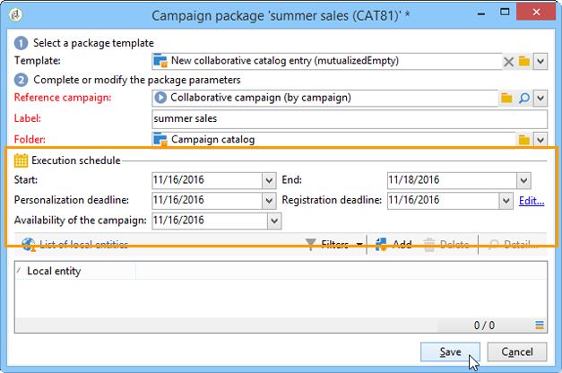

# Skapa en samverkanskampanj{#creating-a-collaborative-campaign-intro}

Den centrala enheten skapar samarbetskampanjer från **mallar för distribuerad marknadsföring**. Se [den här sidan](about-distributed-marketing.md#collaborative-campaign).

## Skapa en samverkanskampanj {#creating-a-collaborative-campaign}

Klicka på mappen **[!UICONTROL Campaign management > Campaigns]** och sedan på ikonen **[!UICONTROL New]** för att konfigurera en samarbetskampanj.

>[!NOTE]
>
>Förutom **[!UICONTROL collaborative campaigns (by campaign)]** kan dessa kampanjer konfigureras och köras via ett webbgränssnitt.

Konfigurationsprocessen för en databas för en samarbetskampanj liknar den för en lokal kampanjmall. Specifikationerna för de olika typerna av samarbetskampanjer anges nedan.

### Per formulär {#by-form}

Om du vill skapa en samarbetskampanj (efter formulär) måste du välja mallen **[!UICONTROL Collaborative campaign (by form)]**.

Klicka på länken **[!UICONTROL Advanced campaign parameters...]** på fliken **[!UICONTROL Edit]** för att komma åt fliken **Distribuerad marknadsföring**.

Välj webbgränssnittet **Efter formulär**. Med den här typen av gränssnitt kan du skapa anpassningsfält som ska användas av lokala enheter när du beställer en kampanj. Se [Skapa en lokal kampanj (efter formulär)](examples.md#creating-a-local-campaign--by-form-).

Spara kampanjen. Du kan nu använda den från vyn **Campaign-paket** på fliken **Campaign** genom att klicka på knappen **[!UICONTROL Create]**.

I vyn **[!UICONTROL Campaign Package]** kan du använda lokala kampanjmallar (färdiga eller duplicerade) samt referenskampanjer för samarbetskampanjer, i syfte att skapa kampanjer för olika organisationsenheter.

### Per kampanj {#by-campaign}

Om du vill skapa en samarbetskampanj (per kampanj) måste du välja mallen **[!UICONTROL Collaborative campaign (by campaign) (opCollaborativeByCampaign)]**.

När kampanjen beställs kan den lokala enheten slutföra de villkor som den centrala enheten har fördefinierat och utvärdera kampanjen innan den beställs.

När en order för en **samarbetskampanj (per kampanj)** har godkänts av den centrala enheten skapas en underordnad kampanj för den lokala entiteten. När den lokala enheten är tillgänglig kan den sedan ändra:

* kampanjarbetsflödet,
* typologiregler,
* och personaliseringsfält.

Den lokala entiteten kör den underordnade kampanjen. Den centrala enheten kör den överordnade kampanjen.

Den centrala enheten kan visa alla underordnade kampanjer som är länkade till en **Samarbetskampanj (per kampanj)** från den här instrumentpanelen (via länken **[!UICONTROL List of associated campaigns]**).

### Efter målgodkännande {#by-target-approval}

Om du vill skapa en samarbetskampanj (med målgodkännande) måste du välja mallen **[!UICONTROL Collaborative campaign (by target approval)]**.

>[!NOTE]
>
>I det här läget behöver den centrala enheten inte ange lokala enheter.

Kampanjarbetsflödet måste integrera aktiviteten av typen **Lokalt godkännande**. Aktivitetsparametrarna är följande:

* **[!UICONTROL Action to perform]**: Meddelande om målgodkännande.
* **[!UICONTROL Distribution context]**: explicit.
* **[!UICONTROL Data distribution]**: Lokal entitetsdistribution.

**Distributionen av datatypen Local Entity Distribution** måste skapas. Med mallen för datadistribution kan du begränsa antalet poster från en lista med grupperingsvärden. Klicka på ikonen **[!UICONTROL New]** i **[!UICONTROL Resources > Campaign management > Data distribution]** för att skapa en ny **[!UICONTROL Data distribution]**. Mer information om datadistribution finns i

Välj **Måldimension** och **[!UICONTROL Distribution field]**. För **[!UICONTROL Assignment type]** väljer du **Lokal entitet**.

Lägg till ett fält för varje lokal enhet och ange värdet på fliken **[!UICONTROL Distribution]**.

Du kan lägga till ytterligare ett **målgodkännande** efter aktiviteten av typen **Leverans** för att konfigurera en rapport för den.

I meddelandet om att kampanjen har skapats får den lokala enheten en kontaktlista som har fördefinierats av de centrala enhetsparametrarna.

Den lokala enheten kan ta bort vissa kontakter baserat på kampanjinnehållet.

### Enkel {#simple}

Om du vill skapa en enkel samarbetskampanj måste du välja mallen **[!UICONTROL Collaborative campaign (simple)]**.

## Skapa ett kampanjpaket för samarbete {#creating-a-collaborative-campaign-package}

För att göra en kampanj tillgänglig för lokala enheter måste den centrala enheten skapa ett kampanjpaket.

Använd följande steg:

1. Klicka på länken **[!UICONTROL Campaign packages]** i avsnittet **[!UICONTROL Navigation]** på sidan **Kampanjer**.
1. Klicka på knappen **[!UICONTROL Create]**.
1. I avsnittet högst upp i fönstret kan du välja mallen **[!UICONTROL New collaborative package (mutualizedEmpty)]**.
1. Välj referenskampanj.
1. Ange etikett, mapp och körningsschema för kampanjpaketet.

### Datum {#dates}

Start- och slutdatumen definierar kampanjens synlighetsperiod i listan över kampanjpaket.

För **samarbetskampanjer** måste den centrala enheten ange deadline för registrering och personalisering.

>[!NOTE]
>
>**[!UICONTROL Personalization deadline]** låter den centrala enheten välja en tidsgräns inom vilken de lokala entiteterna måste ha levererat de dokument (kalkylblad, bilder) som ska användas för att konfigurera kampanjen. Detta är inte ett obligatoriskt alternativ. Sidstegning av det här datumet påverkar inte kampanjens implementering.

### Målgrupp {#audience}

Den centrala enheten måste specificera de lokala enheter som är inblandade per kampanj så snart en samarbetskampanj har skapats.

>[!CAUTION]
>
>**[!UICONTROL Simple, by form and by campaign collaborative campaign kits]** kan inte godkännas om inte de relevanta lokala entiteterna har angetts.

### Godkännandelägen {#approval-modes}

För **samarbetskampanjer** kan du ange ordergodkännandeläge.

I manuellt läge måste den lokala enheten prenumerera på kampanjen för att kunna delta.

I automatiskt läge är den lokala enheten förregistrerad för kampanjen. Den kan avbryta kampanjprenumerationen eller ändra parametrarna utan att den centrala enheten behöver godkänna prenumerationen.

### Meddelanden {#notifications}

Konfigurationen för meddelanden är identisk med aviseringar för en lokal enhet. Se [det här avsnittet](creating-a-local-campaign.md#notifications).

## Beställ en kampanj {#ordering-a-campaign}

När en samarbetskampanj läggs till i listan över kampanjpaket meddelas de lokala entiteter som tillhör målgruppen som definieras av den centrala entiteten (de **samarbetskampanjer (med målgodkännande)** har ingen fördefinierad målgrupp). Det skickade meddelandet innehåller en länk som gör att du kan registrera dig för kampanjen, vilket visas nedan:

Det här meddelandet gör det även möjligt för lokala enheter att visa den beskrivning som anges av den centrala operatör som skapade paketet samt dokument som är länkade till kampanjen. Dessa tillhör inte själva kampanjen, även om de ger ytterligare information om den.

När lokala operatörer har loggat in via ett webbgränssnitt kan de ange personlig information till den samarbetskampanj de vill beställa:

När en lokal enhet har slutfört sin registrering meddelas centrala enheter via e-post för att godkänna deras beställning.

Mer information finns i avsnittet [Godkännandeprocess](creating-a-local-campaign.md#approval-process).

## Godkänn en order {#approving-an-order}

Processen för att godkänna en kollaborativ kampanjpaketorder är densamma som för en lokal kampanj. Se [det här avsnittet](creating-a-local-campaign.md#approving-an-order).
