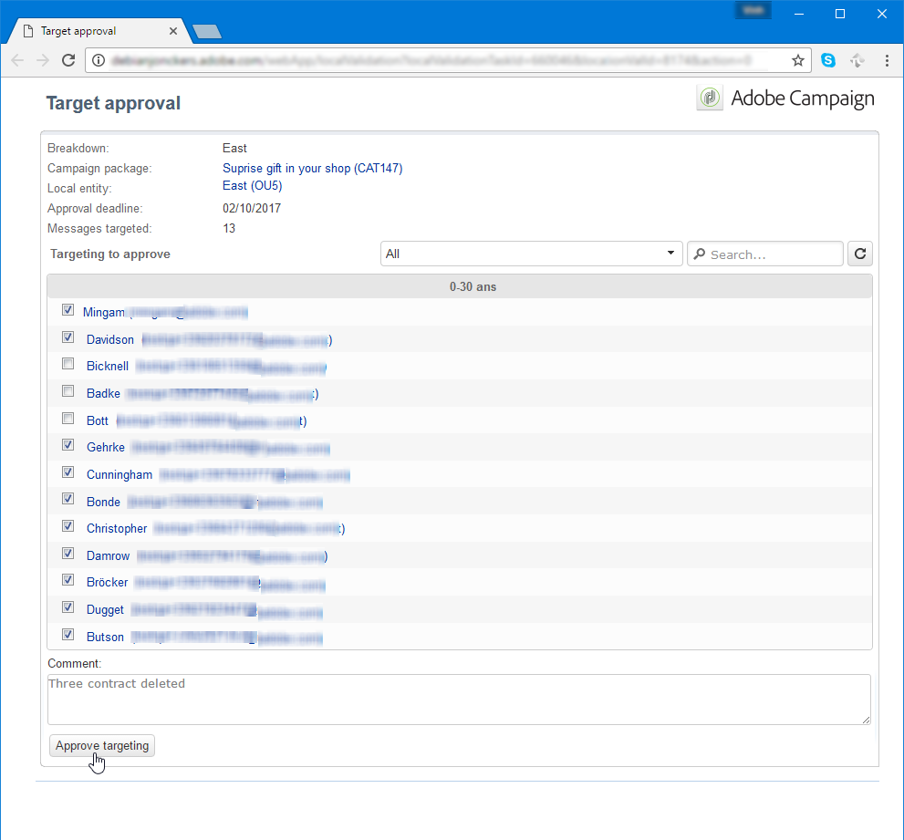
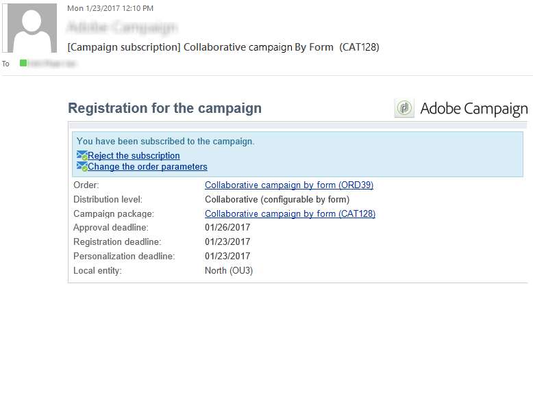
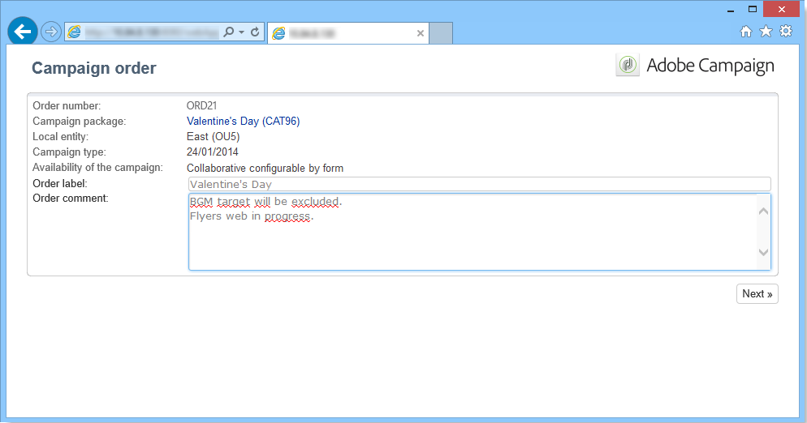

# Skapa en samverkanskampanj{#creating-a-collaborative-campaign-intro}

Den centrala enheten skapar samverkanskampanjer från **Distribuerad marknadsföring** kampanjmallar. Se [den här sidan](about-distributed-marketing.md#collaborative-campaign).

## Skapa en samverkanskampanj {#creating-a-collaborative-campaign}

Om du vill konfigurera en samarbetskampanj klickar du på **[!UICONTROL Campaign management > Campaigns]** -nod, sedan **[!UICONTROL New]** ikon.

>[!NOTE]
>
>Förutom **[!UICONTROL collaborative campaigns (by campaign)]** kan dessa kampanjer konfigureras och köras via ett webbgränssnitt.

Konfigurationsprocessen för en databas för en samarbetskampanj liknar den för en lokal kampanjmall. Specifikationerna för de olika typerna av samarbetskampanjer anges nedan.

### Per formulär {#by-form}

Om du vill skapa en kampanj för samarbete (per formulär) **[!UICONTROL Collaborative campaign (by form)]** -mallen måste vara markerad.

I **[!UICONTROL Edit]** klickar du på **[!UICONTROL Advanced campaign parameters...]** länk för att komma åt **Distribuerad marknadsföring** -fliken.

Välj **Per formulär** webbgränssnitt. Med den här typen av gränssnitt kan du skapa anpassningsfält som ska användas av lokala enheter när du beställer en kampanj. Se [Skapa en lokal kampanj (per formulär)](examples.md#creating-a-local-campaign--by-form-).

Spara kampanjen. Du kan nu använda den från **Kampanjpaket** visa i **Campaign** genom att klicka på **[!UICONTROL Create]** -knappen.

The **[!UICONTROL Campaign Package]** kan ni använda lokala kampanjmallar (färdiga eller duplicerade) samt referenskampanjer för samarbetskampanjer, i syfte att skapa kampanjer för olika organisatoriska enheter.

### Per kampanj {#by-campaign}

Om du vill skapa en samarbetskampanj (per kampanj) **[!UICONTROL Collaborative campaign (by campaign) (opCollaborativeByCampaign)]** -mallen måste vara markerad.

När kampanjen beställs kan den lokala enheten slutföra de villkor som den centrala enheten har fördefinierat och utvärdera kampanjen innan den beställs.

En gång för en order **Samverkande kampanj (per kampanj)** godkänns av den centrala enheten, skapas en underordnad kampanj för den lokala enheten. När den lokala enheten är tillgänglig kan den sedan ändra:

* kampanjarbetsflödet,
* typologiregler,
* och personaliseringsfält.

Den lokala entiteten kör den underordnade kampanjen. Den centrala enheten kör den överordnade kampanjen.

Den centrala enheten kan visa alla underordnade kampanjer som är länkade till en **Samverkande kampanj (per kampanj)** från den här instrumentpanelen (via **[!UICONTROL List of associated campaigns]** länk).

### Efter målgodkännande {#by-target-approval}

Om du vill skapa en samarbetskampanj (genom målgodkännande) använder du **[!UICONTROL Collaborative campaign (by target approval)]** -mallen måste vara markerad.

>[!NOTE]
>
>I det här läget behöver den centrala enheten inte ange lokala enheter.

Kampanjarbetsflödet måste integreras **Lokalt godkännande** typaktivitet. Aktivitetsparametrarna är följande:

* **[!UICONTROL Action to perform]** : Målmeddelande för godkännande.
* **[!UICONTROL Distribution context]** : Explicit.
* **[!UICONTROL Data distribution]** : Lokal entitetsdistribution.

**Lokal entitetsdistribution** typdatafördelningen måste skapas. Med mallen för datadistribution kan du begränsa antalet poster från en lista med grupperingsvärden. I **[!UICONTROL Resources > Campaign management > Data distribution]** klickar du på **[!UICONTROL New]** ikon för att skapa en ny **[!UICONTROL Data distribution]**. Mer information om datadistribution

Välj **Måldimension** och **[!UICONTROL Distribution field]**. För **[!UICONTROL Assignment type]**, markera **Lokal entitet**.

I **[!UICONTROL Distribution]** lägger du till ett fält för varje lokal enhet och anger värdet.

Du kan lägga till en sekund **Målgodkännande** efter **Leverans** typaktivitet för att konfigurera en rapport för den.

I meddelandet om att kampanjen har skapats får den lokala enheten en kontaktlista som har fördefinierats av de centrala enhetsparametrarna.

Den lokala enheten kan ta bort vissa kontakter baserat på kampanjinnehållet.

### Enkel {#simple}

Om du vill skapa en enkel samarbetskampanj **[!UICONTROL Collaborative campaign (simple)]** -mallen måste vara markerad.

## Skapa ett kampanjpaket för samarbete {#creating-a-collaborative-campaign-package}

För att göra en kampanj tillgänglig för lokala enheter måste den centrala enheten skapa ett kampanjpaket.

Använd följande steg:

1. I **[!UICONTROL Navigation]** i **Kampanjer** klickar du på **[!UICONTROL Campaign packages]** länk.
1. Klicka på knappen **[!UICONTROL Create]**.
1. I avsnittet högst upp i fönstret kan du välja **[!UICONTROL New collaborative package (mutualizedEmpty)]** mall.
1. Välj referenskampanj.
1. Ange etikett, mapp och körningsschema för kampanjpaketet.

### Datum {#dates}

Start- och slutdatumen definierar kampanjens synlighetsperiod i listan över kampanjpaket.

För **samverkanskampanjer** måste den centrala enheten ange en deadline för registrering och personalisering.

>[!NOTE]
>
>The **[!UICONTROL Personalization deadline]** låter den centrala enheten välja en tidsfrist inom vilken de lokala enheterna måste ha levererat de dokument (kalkylblad, bilder) som ska användas för att konfigurera kampanjen. Detta är inte ett obligatoriskt alternativ. Sidstegning av det här datumet påverkar inte kampanjens implementering.

### Målgrupp {#audience}

Den centrala enheten måste specificera de lokala enheter som är inblandade per kampanj så snart en samarbetskampanj har skapats.

>[!CAUTION]
>
>**[!UICONTROL Simple, by form and by campaign collaborative campaign kits]** kan inte godkännas om inte de relevanta lokala enheterna har specificerats.

### Godkännandelägen {#approval-modes}

För **samverkanskampanjer** kan du ange ordergodkännandeläge.

I manuellt läge måste den lokala enheten prenumerera på kampanjen för att kunna delta.

I automatiskt läge är den lokala enheten förregistrerad för kampanjen. Den kan avbryta kampanjprenumerationen eller ändra parametrarna utan att den centrala enheten behöver godkänna prenumerationen.

### Meddelanden {#notifications}

Konfigurationen för meddelanden är identisk med aviseringar för en lokal enhet. Se [det här avsnittet](creating-a-local-campaign.md#notifications).

## Beställ en kampanj {#ordering-a-campaign}

När en samverkanskampanj läggs till i listan över kampanjpaket meddelas de lokala enheter som tillhör den målgrupp som definieras av den centrala enheten ( **samverkanskampanjer (genom målgodkännande)** har ingen fördefinierad publik). Det skickade meddelandet innehåller en länk som gör att du kan registrera dig för kampanjen, vilket visas nedan:

Det här meddelandet gör det även möjligt för lokala enheter att visa den beskrivning som anges av den centrala operatör som skapade paketet samt dokument som är länkade till kampanjen. Dessa tillhör inte själva kampanjen, även om de ger ytterligare information om den.

När lokala operatörer har loggat in via ett webbgränssnitt kan de ange personlig information till den samarbetskampanj de vill beställa:

När en lokal enhet har slutfört sin registrering meddelas centrala enheter via e-post för att godkänna deras beställning.

Mer information finns i [Godkännandeprocess](creating-a-local-campaign.md#approval-process) -avsnitt.

## Godkänn en order {#approving-an-order}

Processen för att godkänna en kollaborativ kampanjpaketorder är densamma som för en lokal kampanj. Se [det här avsnittet](creating-a-local-campaign.md#approving-an-order).
