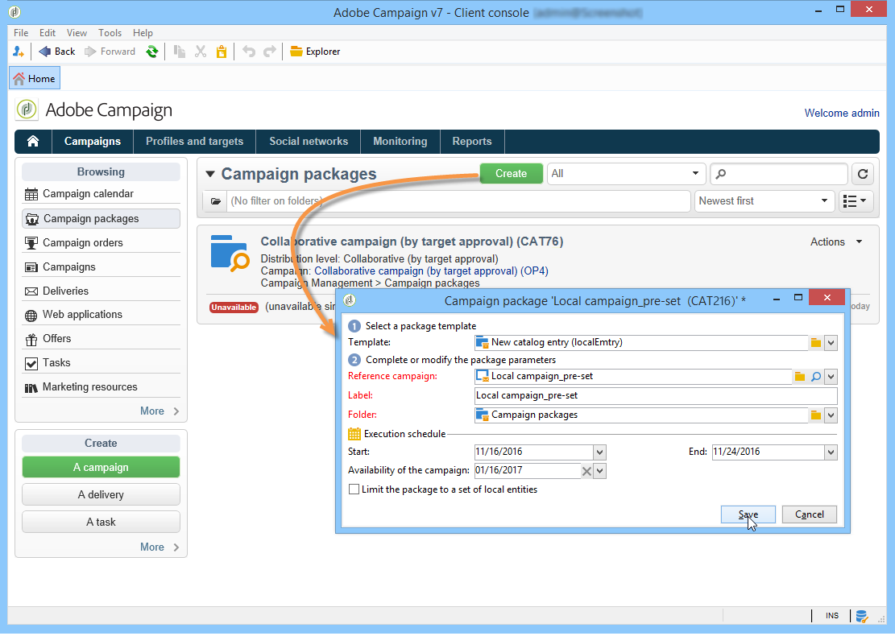
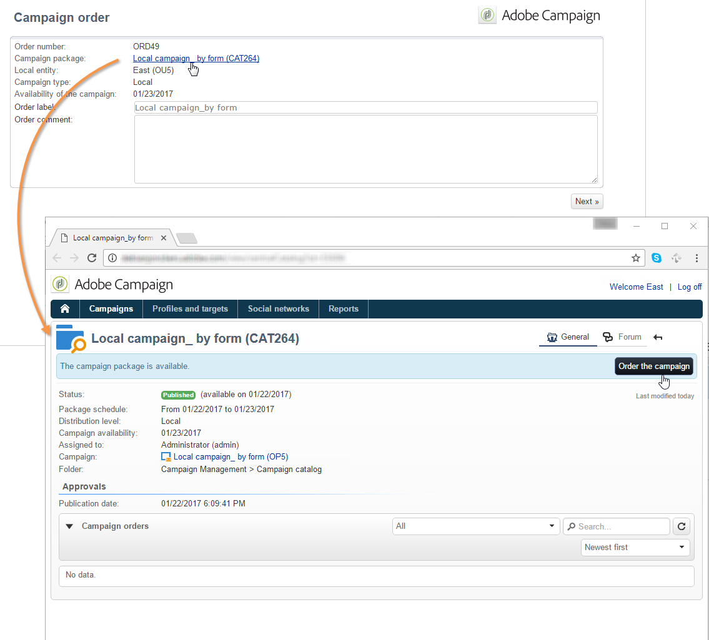
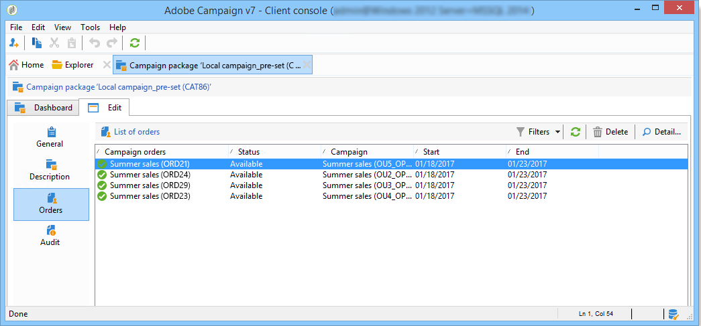
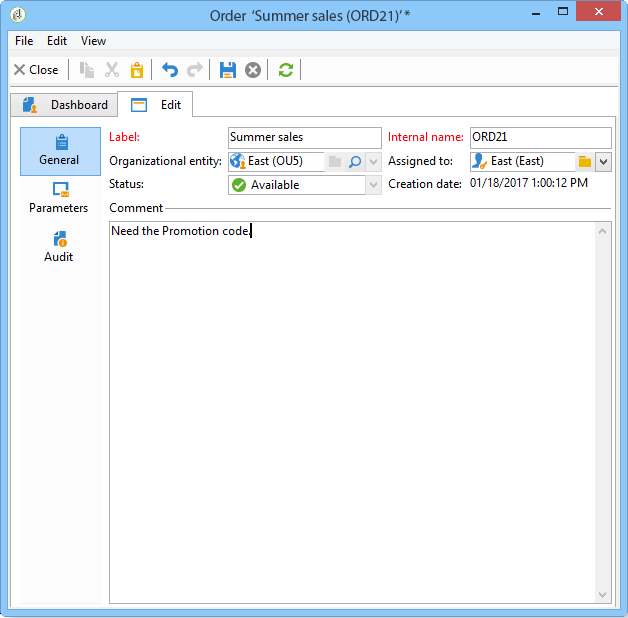
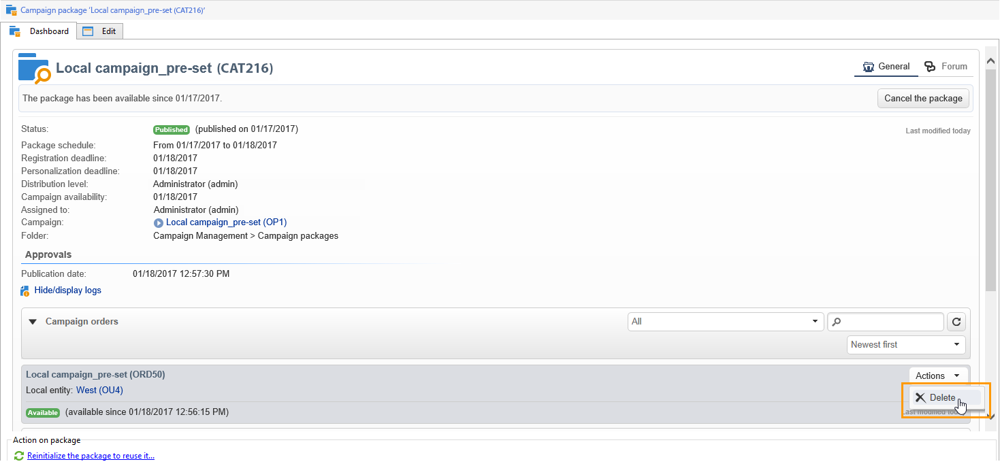

# Skapa en lokal kampanj{#creating-a-local-campaign}

En lokal kampanj är en instans som skapats från en mall som refereras i listan med **[!UICONTROL campaign packages]** med ett **specifikt körningsschema**. Syftet är att tillgodose ett lokalt kommunikationsbehov med hjälp av en kampanjmall som har konfigurerats och konfigurerats av den centrala enheten. De viktigaste stegen för att genomföra en lokal åtgärd är följande:

**För den centrala enheten**

1. Skapa en lokal kampanjmall.
1. Skapa ett kampanjpaket från en mall.
1. Publicera ett kampanjpaket.
1. Godkänner order.

**För den lokala entiteten**

1. Beställa kampanjen.
1. Kör kampanjer.

## Skapa en lokal kampanjmall {#creating-a-local-campaign-template}

Om du vill skapa ett kampanjpaket måste du först skapa **kampanjmallen** via noden **[!UICONTROL Resources > Templates]**.

Om du vill skapa en ny lokal mall duplicerar du standardmallen **[!UICONTROL Local campaign (opLocal)]**.

Ge kampanjmallen ett namn och fyll i de tillgängliga fälten.

Klicka på fliken **[!UICONTROL Edit]** i kampanjfönstret och klicka sedan på länken **[!UICONTROL Advanced campaign parameters...]**.

### Typ av gränssnitt {#web-interface}

På fliken **Distribuerad marknadsföring** kan du välja gränssnittstyp och ange standardvärden och parametrar som ska anges när en lokal enhet placerar en order.

Gränssnittet motsvarar ett formulär som ska fyllas i av den lokala enheten när kampanjen beställs.

Välj vilken typ av gränssnitt som ska användas för kampanjer som skapas från mallen:

Det finns fyra typer av gränssnitt:

* **[!UICONTROL By brief]**: Den lokala entiteten måste ange en beskrivning som beskriver kampanjkonfigurationerna. När ordern har godkänts konfigurerar och kör den centrala enheten kampanjen som helhet.

  

* **[!UICONTROL By form]** : den lokala entiteten har åtkomst till ett webbformulär där de, beroende på vilken mall som används, kan redigera innehållet, målet, dess maximala storlek samt datum för skapande och extrahering med hjälp av anpassningsfält. Lokal enhet kan utvärdera mål- och förhandsgranskningsinnehållet från det här webbformuläret.

  

  Formuläret som erbjuds anges i ett webbprogram som måste väljas i en nedrullningsbar lista från fältet **[!UICONTROL web Interface]** i mallens **[!UICONTROL Advanced campaign parameters...]**-länk. Se [Skapa en lokal kampanj (efter formulär)](examples.md#creating-a-local-campaign--by-form-).

  >[!NOTE]
  >
  >Webbprogrammet som används i det här exemplet är ett exempel. Du måste skapa ett specifikt webbprogram för att kunna använda ett formulär.

  

* **[!UICONTROL By external form]** : den lokala entiteten har åtkomst till kampanjparametrar i extranätet (inte Adobe Campaign). De här parametrarna är identiska med parametrarna för en **lokal kampanj (efter formulär)**.
* **[!UICONTROL Pre-set]**: Den lokala entiteten beställer kampanjer med standardformuläret, utan att lokalisera det.

  

### Standardvärden {#default-values}

Välj **[!UICONTROL Default values]** som ska slutföras av lokala entiteter. Exempel:

* Kontakt- och extraktionsdatum.
* målegenskaper (ålderssegment osv.).

Fyll i fälten **[!UICONTROL Parent marketing program]** och **[!UICONTROL Charge]**.

### Godkännanden {#approvals}

Från länken **[!UICONTROL Advanced parameters for campaign entry]** kan du ange maximalt antal granskare.

Granskare anges av den lokala enheten när kampanjen beställs.

Ange 0 om du inte vill namnge granskare för en kampanj.

### Dokument {#documents}

Du kan tillåta lokala entitetsoperatorer att länka dokument (textfiler, kalkylblad, bilder, kampanjbeskrivningar osv.) till den lokala kampanjen när ordern skapas. Med länken **[!UICONTROL Advanced parameters for campaign entry...]** kan du begränsa antalet dokument. Om du vill göra det anger du det högsta tillåtna antalet i fältet **[!UICONTROL Number of documents]**.

När du beställer ett kampanjpaket föreslår formuläret att du länkar så många dokument som anges i motsvarande fält i mallen.

Om du inte vill visa ett dokumentöverföringsfält anger du **[!UICONTROL 0]** i fältet **[!UICONTROL Number of documents]**.

>[!NOTE]
>
>**[!UICONTROL Advanced parameters for campaign entry]** kan inaktiveras genom kontroll av **[!UICONTROL Do not display the page used to enter the campaign parameters]**.

### Arbetsflöde {#workflow}

Skapa kampanjarbetsflödet som samlar in **[!UICONTROL Default values]** som anges i **[!UICONTROL Advanced campaign parameters...]** och skapar leveranserna på fliken **[!UICONTROL Targeting and workflows]**.

Dubbelklicka på aktiviteten **[!UICONTROL Query]** för att konfigurera den enligt angiven **[!UICONTROL Default values]**.

### Leverans {#delivery}

Klicka på ikonen **[!UICONTROL Detail...]** på fliken **[!UICONTROL Audit]** för att visa **[!UICONTROL Scheduling]** för den valda leveransen.

Med ikonen **[!UICONTROL Scheduling]** kan du konfigurera leveransens kontakt- och körningsdatum.

Konfigurera vid behov maxstorleken för leveransen:

Hitta HTML. I **[!UICONTROL Delivery > Current order > Additional fields]** kan du till exempel använda fältet **[!UICONTROL Age segment]** för att hitta leveransen utifrån målets ålder.

Spara kampanjmallen. Du kan nu använda den från vyn **[!UICONTROL Campaign packages]** på fliken **[!UICONTROL Campaigns]** genom att klicka på knappen **[!UICONTROL Create]**.

>[!NOTE]
>
>Kampanjmallar och deras allmänna konfiguration finns på [den här sidan](../campaigns/marketing-campaign-templates.md).

## Skapa kampanjpaketet {#creating-the-campaign-package}

För att kampanjmallen ska bli tillgänglig för lokala enheter måste den läggas till i listan. För att göra detta måste centralmyndigheten skapa ett nytt paket.

Använd följande steg:

1. Klicka på länken **[!UICONTROL Campaign packages]** i avsnittet **[!UICONTROL Navigation]** på sidan **Kampanjer**.
1. Klicka på knappen **[!UICONTROL Create]**.

   

1. I avsnittet ovanför fönstret kan du välja den [tidigare](#creating-a-local-campaign-template) angivna kampanjpaketmallen.

   Som standard används mallen **[!UICONTROL New local campaign package (localEmpty)]** för lokala kampanjer.

1. Ange etikett, mapp och körningsschema för kampanjpaketet.

### Datum {#dates}

Start- och slutdatumen definierar kampanjens synlighetsperiod i listan över kampanjpaket.

Tillgänglighetsdatumet är det datum då kampanjen blir tillgänglig för lokala enheter (att beställa).

>[!CAUTION]
>
>Om en lokal enhet inte reserverar kampanjen före deadline kommer den inte att kunna använda den.

Denna information finns i det meddelande som skickas till lokala myndigheter, vilket visas nedan:

### Målgrupp {#audience}

För en lokal kampanj kan den centrala entiteten ange de lokala entiteter som berörs genom att kontrollera **[!UICONTROL Limit the package to a set of local entities]**.

### Ytterligare inställningar {#additional-settings}

När paketet har sparats kan den centrala enheten redigera det på fliken **[!UICONTROL Edit]**.

Från fliken **[!UICONTROL General]** kan den centrala enheten:

* konfigurera granskare av kampanjpaket från länken **[!UICONTROL Approval parameters...]**,
* Granska körningsplanen.
* lägga till eller ta bort lokala entiteter.

>[!NOTE]
>
>Som standard kan varje entitet endast beställa en **lokal kampanj** en gång.
>   
>Markera alternativet **[!UICONTROL Enable multiple creation]** om du vill tillåta att flera lokala kampanjer skapas från kampanjpaketet.

### Meddelanden {#notifications}

När en kampanj blir tillgänglig eller när tidsgränsen för registrering nås, skickas ett meddelande till operatörerna i den lokala meddelandegruppen. Mer information finns i [Organisationsenheter](about-distributed-marketing.md#organizational-entities).

## Beställa en kampanj {#ordering-a-campaign}

Kampanjpaket blir tillgängliga för lokala enheter när de har godkänts och implementeringsperioden har startats. Lokala enheter får ett e-postmeddelande som meddelar dem om att ett nytt kampanjpaket är tillgängligt (så snart som dess tillgänglighetsdatum har nåtts).

>[!NOTE]
>
>Om vissa lokala entiteter angavs när kampanjpaketet skapades är det de enda som får ett meddelande. Om ingen lokal enhet har angetts får alla lokala enheter ett meddelande.

För att kunna använda en kampanj som erbjuds av den centrala enheten måste den lokala enheten beställa den.

Så här beställer du en kampanj:

1. Klicka på **[!UICONTROL Order campaign]** i meddelandet eller på motsvarande knapp i Adobe Campaign.

   Ange ditt ID och lösenord för att beställa kampanjen. Gränssnittet består av en uppsättning sidor som definieras i ett webbprogram.

1. Ange nödvändig information på den första sidan (beställningsetikett och kommentar) och klicka på **[!UICONTROL Next]**.

   

1. Slutför de tillgängliga parametrarna och godkänn ordern.

1. Ett meddelande skickas till chefen för den organisationsenhet som den lokala enheten tillhör för att godkänna ordern.

   

1. Informationen returneras till de lokala och centrala enheterna. Lokala enheter kan bara visa sina egna order, men den centrala enheten kan visa alla order från vilken lokal enhet som helst, vilket visas nedan:

   

   Operatorer kan visa orderinformation:

   

   Fliken **[!UICONTROL Edit]** innehåller information som angetts av den lokala entiteten när kampanjen beställdes.

   

1. Ordern måste godkännas av den centrala enhet som ska färdigställas.

   

   Mer information finns i avsnittet [Godkännandeprocess](#approval-process).

1. Den lokala operatorn meddelas sedan om att kampanjen är tillgänglig: kampanjtillgängligheten finns i listan över kampanjpaket på fliken **Kampanjer**. Kampanjen kan sedan användas. Mer information finns i [Åtkomst till kampanjer](accessing-campaigns.md).

   Alternativet **[!UICONTROL Start targeting with order approval]** låter den lokala enheten köra kampanjen så snart ordern har godkänts.

   

## Godkänna en order {#approving-an-order}

Den centrala enheten måste godkänna en kampanjorder för att bekräfta den.

Med översikten **[!UICONTROL Campaign orders]**, som du kommer åt via fliken **Kampanjer**, kan du visa status för kampanjorder och godkänna dem.

>[!NOTE]
>
>Lokala enheter kan ändra ordern tills den har godkänts.

### Godkännandeprocess {#approval-process}

#### E-postmeddelande {#email-notification}

När en kampanj beställs av en lokal enhet meddelas dess granskare via e-post, vilket visas nedan:

>[!NOTE]
>
>Markerade granskare visas i avsnittet [Granskare](#reviewers). De kan godkänna eller avvisa ordern.

#### Godkänn via klientkonsolen {#approving-via-the-adobe-campaign-console}

Beställningen kan också godkännas via klientkonsolen i kampanjorderöversikten. Om du vill godkänna en beställning markerar du den och klickar på **[!UICONTROL Approve the order]**.

>[!NOTE]
>
>Kampanjen kan fortfarande redigeras och konfigureras om fram till kampanjens tillgänglighetsdatum. Lokala entiteter kan också avvisa kampanjen genom att klicka på knappen **[!UICONTROL Cancel]**.

#### Skapa en kampanj {#creating-a-campaign}

När en kampanjorder har godkänts kan den konfigureras och köras av den lokala enheten.

Mer information finns i [Åtkomst till kampanjer](accessing-campaigns.md).

### Avslå ett godkännande {#rejecting-an-approval}

Operatören som ansvarar för godkännandet kan avvisa en order eller ett kampanjpaket.

Om granskaren avvisar en order skickas det relevanta meddelandet automatiskt till de berörda lokala enheterna, där kommentaren från den aktör som avvisade godkännandet visas.

Information visas på sidan med kampanjpaket eller på sidan med kampanjorder. Om de har åtkomst till Adobe Campaign klientkonsol informeras lokala enheter om detta avvisande.

De kan visa den relaterade kommentaren på fliken **[!UICONTROL Edit]** i kampanjpaketet.

### Granskare {#reviewers}

Varje gång ett godkännande krävs meddelas granskarna via e-post.

För varje lokal enhet väljs granskarna ut för godkännande av kampanjorder och kampanjgodkännande. Mer information om hur du väljer lokala granskare finns i [Organisationsenheter](about-distributed-marketing.md#organizational-entities).

>[!NOTE]
>
>För att detta val ska kunna göras måste ordergodkännandet inte gälla än.

### Avbryta en order {#canceling-an-order}

Centrala byrån kan avbryta en beställning med knappen **[!UICONTROL Delete]** som finns på orderkontrollpanelen.

Detta avbryter kampanjen i vyn **[!UICONTROL Campaign orders]**.
