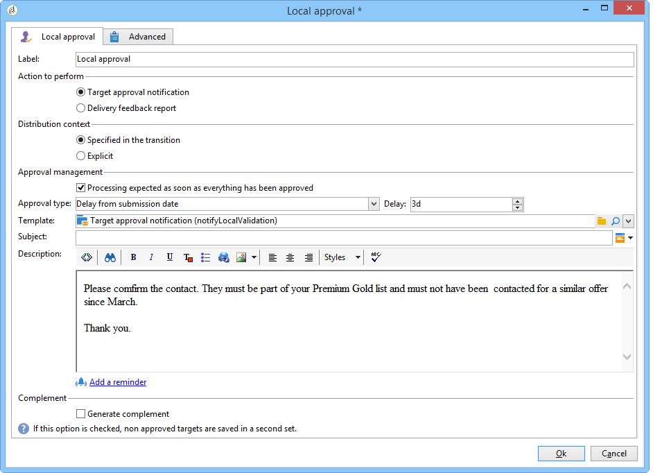

# Distribuerade marknadsexempel{#distributed-marketing-samples}


## Skapa en lokal kampanj (per formulär) {#creating-a-local-campaign--by-form-}

The **Per formulär** webbgränssnitt av typen använder **webbprogram**. Beroende på hur det är konfigurerat kan det här webbprogrammet innehålla alla typer av definierade anpassade element. Du kan till exempel föreslå länkar för att utvärdera målet, budgeten, innehållet osv. via dedikerade API:er.

>[!NOTE]
>
>Webbprogrammet som används i det här exemplet är inte ett webbprogram som levereras med Adobe Campaign. Om du vill använda ett formulär i en kampanj måste du skapa det dedikerade webbprogrammet.

När du skapar kampanjmallen klickar du på **[!UICONTROL Zoom]** -ikonen i **[!UICONTROL Web interface]** alternativ för **[!UICONTROL Advanced campaign parameters...]** -länk för att komma åt information om webbprogrammet.


>[!NOTE]
>
>Webbprogramsparametrar är bara tillgängliga i kampanjmallen.

I **[!UICONTROL Edit]** väljer du **Kampanjorder** och öppna den för att komma åt dess innehåll.


I det här exemplet **Kampanjorder** aktiviteten innefattar:

* fält som ska anges av den lokala enheten under ordern,

   

* länkar som gör det möjligt för den lokala enheten att utvärdera kampanjen (t.ex. mål, budget, innehåll),

   

* skript som gör att du kan beräkna och visa resultatet av dessa utvärderingar.

   

I det här exemplet används följande API:er:

* För målutvärderingen

   ```
   var res = nms.localOrder.EvaluateTarget(ctx.localOrder);
   ```

* För utvärderingen av budgeten

   ```
   var res = nms.localOrder.EvaluateDeliveryBudget(ctx.@deliveryId, NL.XTK.parseNumber(ctx.@compt));
   ```

* För utvärdering av innehåll

   ```
   var res = nms.localOrder.EvaluateContent(ctx.localOrder, ctx.@deliveryId, "html", resSeed.@id);
   ```

## Skapa en samarbetskampanj (genom målgodkännande) {#creating-a-collaborative-campaign--by-target-approval-}

### Introduktion {#introduction}

Du är marknadschef för ett stort varumärke för kläder som har en webbutik och flera företag över hela USA. Nu när våren är inne bestämmer du dig för att skapa ett specialerbjudande som ger dina bästa kunder 50 % rabatt på alla klänningar i din katalog.

Erbjudandet riktar sig till de bästa kunderna i era amerikanska butiker, dvs. de som har spenderat mer än 300 dollar sedan början av året.

Du bestämmer dig därför för att använda Distributed Marketing för att skapa en samverkanskampanj (efter målgodkännande) som gör att du kan välja de bästa kunderna (grupperade efter region) som får den e-postleverans som innehåller specialerbjudandet.

Den första delen av det här exemplet visar de lokala enheterna som tar emot meddelandet om att kampanjen har skapats och hur de kan använda det för att utvärdera kampanjen och beställa den.

Den andra delen av det här exemplet förklarar hur du skapar en kampanj.

Stegen är följande:

**För den lokala enheten**

1. Använd meddelandet om att skapa kampanj för att komma åt listan med kontakter som har valts av den centrala enheten.
1. Markera kontakterna och godkänn deltagandet.

**För den centrala enheten:**

1. Skapa en **[!UICONTROL Data distribution]** aktivitet.
1. Skapa en samarbetskampanj.
1. Publicera kampanjen.

### Lokal entitetssida {#local-entity-side}

1. De lokala enheter som har valts att delta i kampanjen får ett e-postmeddelande.

   

1. Genom att klicka på **[!UICONTROL Access your contact list and approve targeting]** den lokala enheten ges åtkomst (via webbläsare) till listan över klienter som valts för kampanjen.

   

1. Den lokala enheten avkontrollerar vissa kontakter från listan eftersom de redan har kontaktats för ett liknande erbjudande sedan årets början.

   

När kontrollerna har godkänts kan kampanjen starta automatiskt.

### Central entitetssida {#central-entity-side}

#### Skapa en datadistributionsaktivitet {#creating-a-data-distribution-activity}

1. Om du vill konfigurera en samarbetskampanj (efter målgodkännande) måste du först skapa en **[!UICONTROL Data distribution activity]**. Klicka på **[!UICONTROL New]** ikonen i **[!UICONTROL Resources > Campaign management > Data distribution]** nod.

   

1. I **[!UICONTROL General]** måste du ange:

   * den **[!UICONTROL Targeting dimension]**. Här är **Datadistribution** utförs på **Mottagare**.
   * den **[!UICONTROL Distribution type]**. Du kan välja en **Fast storlek** eller en **Storlek i procent**.
   * den **[!UICONTROL Assignment type]**. Välj **Lokal entitet** alternativ.
   * den **[!UICONTROL Distribution type]**. Här är det **[!UICONTROL Origin (@origin)]** i mottagarregistret där du kan identifiera relationen mellan kontakten och den lokala enheten.
   * The **[!UICONTROL Approval storage]** fält. Välj **Mottagarens lokala godkännande** alternativ.

1. I **[!UICONTROL Breakdown]** -flik, ange:

   * den **[!UICONTROL Distribution field value]**, vilket motsvarar de lokala enheter som deltar i den kommande kampanjen.
   * den lokala enheten **[!UICONTROL label]**.
   * den **[!UICONTROL Size]** (fast eller i procent). The **0 standardvärde** markerar alla mottagare som är länkade till den lokala enheten.

   

1. Spara din nya datadistribution.

#### Skapa en samverkanskampanj {#creating-a-collaborative-campaign}

1. Från **[!UICONTROL Campaign management > Campaign]** nod, skapa en ny **[!UICONTROL collaborative campaign (by target approval)]**.
1. I **[!UICONTROL Targeting and workflows]** skapar du ett arbetsflöde för kampanjen. Detta måste innehålla en **Dela** verksamhet där **[!UICONTROL Record count limitation]** definieras av **[!UICONTROL Data distribution]** aktivitet.

   

1. Lägg till en **[!UICONTROL Local approval]** åtgärd där du kan ange:

   * det meddelandeinnehåll som ska skickas till de lokala enheterna i meddelandet,
   * påminnelsen om godkännande,
   * den förväntade bearbetningen för kampanjen.

   

1. Spara ditt material.

#### Publicera kampanjen {#publishing-the-campaign}

Nu kan du lägga till en **kampanjpaket** från **[!UICONTROL Campaigns]** -fliken.

1. Välj **[!UICONTROL Reference campaign]**. I **[!UICONTROL Edit]** kan du välja **[!UICONTROL Approval mode]** som kan användas för er kampanj:

   * in **Manuell** om de lokala enheterna accepterar inbjudan från den centrala enheten. De kan ta bort de redan valda kontakterna om de vill och om de behöver ett godkännande från chefen för att bekräfta att de deltar i kampanjen.
   * in **Automatisk** måste de lokala enheterna delta i kampanjen, såvida de inte avregistrerar sig från den. De kan ta bort kontakter utan att behöva godkänna dem.

   

1. I **[!UICONTROL Description]** kan du lägga till en beskrivning av kampanjen samt alla dokument som ska skickas till de lokala enheterna.

   

1. Godkänn kampanjpaketet och starta sedan arbetsflödet för att publicera paketet och göra det tillgängligt för alla lokala enheter i paketlistan.

   

## Skapa en samarbetskampanj (per formulär) {#creating-a-collaborative-campaign--by-form-}

### Introduktion {#introduction-1}

Du är marknadschef för ett stort makeup-varumärke som har en webbutik och flera företag över hela USA. Om du vill ta bort ditt vinterlager och ge plats för ditt nya lager skapar du ett specialerbjudande som riktar sig till två kundkategorier: över 30-talet, till vilka du kommer att erbjuda ålderskänsliga hudvårdsprodukter, och de under 30-talet, till vilka du kommer att erbjuda de mer grundläggande hudvårdsprodukterna.

Du bestämmer dig därför för att använda Distributed Marketing för att skapa en samverkanskampanj (per formulär) som gör att du kan välja kunder från olika butiker utifrån åldersintervall. Dessa kunder får ett mejl med ett specialerbjudande som anpassats efter deras ålder.

Den första delen av det här exemplet visar de lokala enheterna som tar emot meddelandet om att kampanjen har skapats och hur de kan använda det för att utvärdera kampanjen och beställa den.

Den andra delen av det här exemplet förklarar hur du skapar en kampanj.

Stegen är följande:

**För den lokala enheten**

1. Använd meddelandet om kampanjskapande för att komma åt onlineformuläret.
1. Anpassa kampanjen (mål, innehåll, leveransvolym).
1. Markera dessa fält och ändra dem om det behövs.
1. Godkänn ditt deltagande.
1. Chefen för den lokala enheten (eller den centrala enheten) godkänner konfigurationen och deltagandet.

**För den centrala enheten:**

1. Skapa en samarbetskampanj.
1. Konfigurera **[!UICONTROL Advanced campaign parameters...]** som ni skulle ha gjort för en lokal kampanj.
1. Konfigurera kampanjarbetsflödet och leveransen på samma sätt som för en lokal kampanj.
1. Uppdatera webbformuläret.
1. Skapa kampanjpaketet och publicera det.

### Lokal entitetssida {#local-entity-side-1}

1. De lokala enheter som valts ut för att delta i kampanjen får ett e-postmeddelande som informerar dem om att de deltar i kampanjen.

   

1. De lokala enheterna fyller i det personliga formuläret och sedan i

   * utvärdera målet och budgeten,
   * förhandsgranska leveransinnehållet,
   * godkänna deras deltagande.

      

1. Operatören som ansvarar för validering av order godkänner deltagandet.

   

### Central entitetssida {#central-entity-side-1}

1. Om du vill genomföra en samarbetskampanj (per formulär) måste du skapa en kampanj med hjälp av **Samverkande kampanj (per formulär)** mall.

   

1. I kampanjens **[!UICONTROL Edit]** klickar du på **[!UICONTROL Advanced campaign parameters...]** -länk för att konfigurera den som en lokal kampanj. Se [Skapa en lokal kampanj (per formulär)](#creating-a-local-campaign--by-form-).

   

1. Konfigurera kampanjarbetsflödet och webbformuläret. Se [Skapa en lokal kampanj (per formulär)](#creating-a-local-campaign--by-form-).
1. Skapa ett kampanjpaket genom att ange körningsschema och de lokala enheter som ingår.

   

1. Slutför paketkonfigurationen genom att välja godkännandeläge i **[!UICONTROL Edit]** -fliken.

   

1. Från **[!UICONTROL Description]** kan du ange en kampanjpaketsbeskrivning, ett meddelande som ska skickas till lokala entiteter när paketet publiceras och bifoga informativa dokument till kampanjpaketet.

   

1. Godkänn paketet för att publicera det.

   
