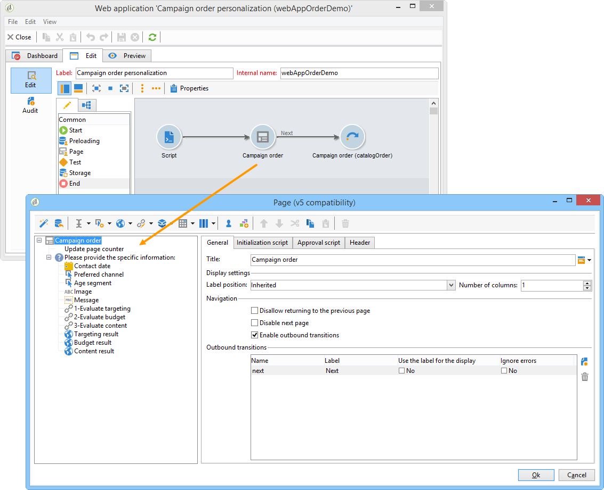

# Distribuerade marknadsexempel{#distributed-marketing-samples}


## Skapa en lokal kampanj (per formulär) {#creating-a-local-campaign--by-form-}

Webbgränssnittet av typen **Per formulär** innebär att du använder ett **webbprogram**. Beroende på hur det är konfigurerat kan det här webbprogrammet innehålla alla typer av definierade anpassade element. Du kan till exempel föreslå länkar för att utvärdera målet, budgeten, innehållet osv. via dedikerade API:er.

>[!NOTE]
>
>Webbprogrammet som används i det här exemplet är inte ett webbprogram som levereras med Adobe Campaign. Om du vill använda ett formulär i en kampanj måste du skapa det dedikerade webbprogrammet.

När du skapar kampanjmallen klickar du på ikonen **[!UICONTROL Zoom]** i alternativet **[!UICONTROL Web interface]** för länken **[!UICONTROL Advanced campaign parameters...]** för att få tillgång till information om webbprogrammet.


>[!NOTE]
>
>Webbprogramsparametrar är bara tillgängliga i kampanjmallen.

På fliken **[!UICONTROL Edit]** väljer du aktiviteten **Kampanjorder** och öppnar den för att komma åt dess innehåll.



I det här exemplet innehåller aktiviteten **Kampanjorder**:

* fält som ska anges av den lokala enheten under ordern,

  

* länkar som gör det möjligt för den lokala enheten att utvärdera kampanjen (t.ex. mål, budget, innehåll),

  

* skript som gör att du kan beräkna och visa resultatet av dessa utvärderingar.

  

I det här exemplet används följande API:er:

* För målutvärderingen

  ```
  var res = nms.localOrder.EvaluateTarget(ctx.localOrder);
  ```

* För utvärderingen av budgeten

  ```
  var res = nms.localOrder.EvaluateDeliveryBudget(ctx.@deliveryId, NL.XTK.parseNumber(ctx.@compt));
  ```

* För utvärdering av innehåll

  ```
  var res = nms.localOrder.EvaluateContent(ctx.localOrder, ctx.@deliveryId, "html", resSeed.@id);
  ```

## Skapa en samarbetskampanj (genom målgodkännande) {#creating-a-collaborative-campaign--by-target-approval-}

### Introduktion {#introduction}

Du är marknadschef för ett stort varumärke för kläder som har en webbutik och flera företag över hela USA. Nu när våren är inne väljer du att skapa ett specialerbjudande som ger dina bästa kunder 50 % rabatt på alla klänningar i din katalog.

Erbjudandet riktar sig till de bästa kunderna i era amerikanska butiker, det vill säga de som har spenderat mer än 300 dollar sedan början av året.

Du bestämmer dig därför för att använda Distributed Marketing för att skapa en samverkanskampanj (efter målgodkännande) som gör att du kan välja de bästa kunderna (grupperade efter region) som får den e-postleverans som innehåller specialerbjudandet.

Den första delen av det här exemplet visar de lokala enheterna som tar emot meddelandet om att kampanjen har skapats och hur de kan använda det för att utvärdera kampanjen och beställa den.

Den andra delen av det här exemplet förklarar hur du skapar en kampanj.

Stegen är följande:

**För den lokala entiteten**

1. Använd meddelandet om att skapa kampanj för att komma åt listan med kontakter som har valts av den centrala enheten.
1. Markera kontakterna och godkänn deltagandet.

**För den centrala entiteten:**

1. Skapa en **[!UICONTROL Data distribution]**-aktivitet.
1. Skapa en samarbetskampanj.
1. Publicera kampanjen.

### Lokal entitetssida {#local-entity-side}

1. De lokala enheter som har valts att delta i kampanjen får ett e-postmeddelande.

   

1. Genom att klicka på länken **[!UICONTROL Access your contact list and approve targeting]** får den lokala enheten åtkomst (via webbläsaren) till listan över klienter som valts för kampanjen.

   

1. Den lokala enheten avkontrollerar vissa kontakter från listan eftersom de redan har kontaktats för ett liknande erbjudande sedan årets början.

   

När kontrollerna har godkänts kan kampanjen starta automatiskt.

### Central entitetssida {#central-entity-side}

#### Skapa en datadistributionsaktivitet {#creating-a-data-distribution-activity}

1. Om du vill konfigurera en samarbetskampanj (med målgodkännande) måste du först skapa en **[!UICONTROL Data distribution activity]**. Klicka på ikonen **[!UICONTROL New]** i mappen **[!UICONTROL Resources > Campaign management > Data distribution]** i Campaign Explorer.

   

1. På fliken **[!UICONTROL General]** måste du ange:

   * **[!UICONTROL Targeting dimension]**. Här utförs **datadistributionen** på **mottagarna**.
   * **[!UICONTROL Distribution type]**. Du kan välja en **fast storlek** eller en **storlek som en procentandel**.
   * **[!UICONTROL Assignment type]**. Välj alternativet **Lokal entitet**.
   * **[!UICONTROL Distribution type]**. Här är det **[!UICONTROL Origin (@origin)]**-fält som finns i mottagarregistret som gör att du kan identifiera relationen mellan kontakten och den lokala entiteten.
   * Fältet **[!UICONTROL Approval storage]**. Välj alternativet **Lokalt godkännande av mottagare**.

1. Ange följande på fliken **[!UICONTROL Breakdown]**:

   * **[!UICONTROL Distribution field value]**, vilket motsvarar de lokala entiteter som är inblandade i den kommande kampanjen.
   * den lokala entiteten **[!UICONTROL label]**.
   * **[!UICONTROL Size]** (fast eller i procent). Standardvärdet **för** 0 innebär att alla mottagare som är länkade till den lokala entiteten väljs.

   

1. Spara din nya datadistribution.

#### Skapa en samverkanskampanj {#creating-a-collaborative-campaign}

1. Skapa en ny **[!UICONTROL collaborative campaign (by target approval)]** från mappen **[!UICONTROL Campaign management > Campaign]** i Campaign Explorer.
1. Skapa ett arbetsflöde för kampanjen på fliken **[!UICONTROL Targeting and workflows]**. Det här måste innehålla en **delad**-aktivitet där **[!UICONTROL Record count limitation]** definieras av **[!UICONTROL Data distribution]**-aktiviteten.

   

1. Lägg till en **[!UICONTROL Local approval]**-åtgärd där du kan ange:

   * det meddelandeinnehåll som ska skickas till de lokala enheterna i meddelandet,
   * påminnelsen om godkännande,
   * den förväntade bearbetningen för kampanjen.

   

1. Spara ditt material.

#### Publicera kampanjen {#publishing-the-campaign}

Du kan nu lägga till ett **kampanjpaket** från fliken **[!UICONTROL Campaigns]**.

1. Välj din **[!UICONTROL Reference campaign]**. På fliken **[!UICONTROL Edit]** i ditt paket kan du välja den **[!UICONTROL Approval mode]** som ska användas för din kampanj:

   * i **Manuellt**-läge deltar de lokala enheterna i kampanjen om de accepterar inbjudan från den centrala enheten. De kan ta bort de redan valda kontakterna om de vill och om de behöver ett godkännande från chefen för att bekräfta att de deltar i kampanjen.
   * i läget **Automatisk** måste de lokala entiteterna delta i kampanjen, såvida de inte avregistrerar sig själva från den. De kan ta bort kontakter utan godkännande.

   

1. På fliken **[!UICONTROL Description]** kan du lägga till en beskrivning av kampanjen samt alla dokument som ska skickas till de lokala entiteterna.

   

1. Godkänn kampanjpaketet och starta sedan arbetsflödet för att publicera paketet och göra det tillgängligt för alla lokala enheter i paketlistan.

   

## Skapa en samarbetskampanj (per formulär) {#creating-a-collaborative-campaign--by-form-}

### Introduktion {#introduction-1}

Du är marknadschef för ett stort makeup-varumärke som har en webbutik och flera företag över hela USA. Om du vill ta bort vintern från lagret och ge plats för det nya lagret skapar du ett specialerbjudande som riktar sig till två kundkategorier: över 30-talet, som du ska erbjuda ålderskänsliga hudvårdsprodukter till och under 30-talet, till vilka du ska erbjuda de mer grundläggande hudvårdsprodukterna.

Du bestämmer dig därför för att använda Distributed Marketing för att skapa en samverkanskampanj (per formulär) som gör att du kan välja kunder från olika butiker utifrån åldersintervall. Dessa kunder får ett mejl med ett specialerbjudande som anpassats efter deras ålder.

Den första delen av det här exemplet visar de lokala enheterna som tar emot meddelandet om att kampanjen har skapats och hur de kan använda det för att utvärdera kampanjen och beställa den.

Den andra delen av det här exemplet förklarar hur du skapar en kampanj.

Stegen är följande:

**För den lokala entiteten**

1. Använd meddelandet om kampanjskapande för att komma åt onlineformuläret.
1. Anpassa kampanjen (mål, innehåll, leveransvolym).
1. Markera dessa fält och ändra dem om det behövs.
1. Godkänn ditt deltagande.
1. Chefen för den lokala enheten (eller den centrala enheten) godkänner konfigurationen och deltagandet.

**För den centrala entiteten:**

1. Skapa en samarbetskampanj.
1. Konfigurera **[!UICONTROL Advanced campaign parameters...]** på samma sätt som för en lokal kampanj.
1. Konfigurera kampanjarbetsflödet och leveransen på samma sätt som för en lokal kampanj.
1. Uppdatera webbformuläret.
1. Skapa kampanjpaketet och publicera det.

### Lokal entitetssida {#local-entity-side-1}

1. De lokala enheter som valts ut för att delta i kampanjen får ett e-postmeddelande som informerar dem om att de deltar i kampanjen.

   

1. De lokala enheterna fyller i det personliga formuläret och sedan i:

   * utvärdera målet och budgeten,
   * förhandsgranska leveransinnehållet,
   * godkänna deras deltagande.

     

1. Operatören som ansvarar för validering av order godkänner deltagandet.

   

### Central entitetssida {#central-entity-side-1}

1. Om du vill implementera en samarbetskampanj (per formulär) måste du skapa en kampanj med mallen **Samarbetskampanj (per formulär)**.

   

1. Klicka på länken **[!UICONTROL Advanced campaign parameters...]** på fliken **[!UICONTROL Edit]** i kampanjen för att konfigurera den som en lokal kampanj. Se [Skapa en lokal kampanj (efter formulär)](#creating-a-local-campaign--by-form-).

   

1. Konfigurera kampanjarbetsflödet och webbformuläret. Se [Skapa en lokal kampanj (efter formulär)](#creating-a-local-campaign--by-form-).
1. Skapa ett kampanjpaket genom att ange körningsschema och de lokala enheter som ingår.

   

1. Slutför paketkonfigurationen genom att välja godkännandeläge på fliken **[!UICONTROL Edit]**.

   

1. På fliken **[!UICONTROL Description]** kan du ange en kampanjpaketsbeskrivning, ett meddelande som ska skickas till lokala entiteter när paketet publiceras och bifoga eventuella informativa dokument till kampanjpaketet.

   

1. Godkänn paketet för att publicera det.

   
