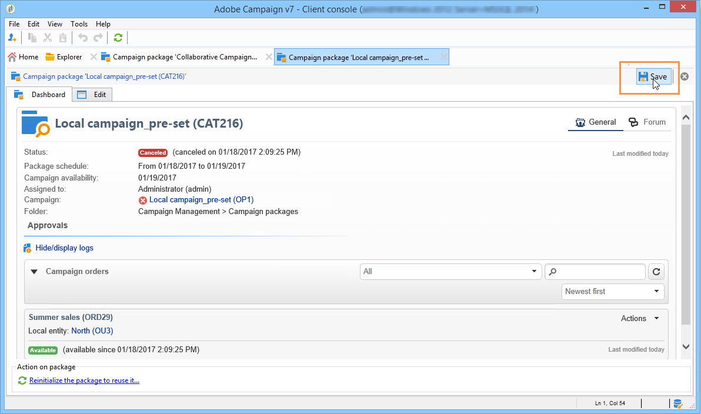

# Spåra en kampanj{#tracking-a-campaign}

Operatorer för central enhet kan spåra kampanjorder i listan över kampanjpaket.

På så sätt kan de

* [Filterpaket](#filter-packages),
* [Redigera paket](#edit-packages),
* [Avbryt ett paket](#cancel-a-package),
* [Initiera om ett paket](#reinitializing-a-package).

## Filterpaket {#filter-packages}

Från **[!UICONTROL Campaigns]** kan du visa listan med **[!UICONTROL Campaign packages]** som grupperar alla befintliga distribuerade marknadsföringskampanjer. Du kan filtrera den här listan så att den endast visar kampanjer som antingen är publicerade, sena, väntar på godkännande osv. Det gör du genom att klicka på länkarna i den övre delen av vyn eller genom att använda **[!UICONTROL Filter list]** och välj den kampanjpaketstatus som ska visas.

## Redigera paket {#edit-packages}

The **[!UICONTROL Campaign packages]** kan du visa sammanfattningen för varje paket.

Sammanfattningen innehåller följande information: etikett, kampanjtyp, namnet på kampanjen som kampanjen skapades från samt mappen.

Klicka på paketnamnet för att redigera det. Du kan också visa order efter deras lokala enheter och deras status.

Denna information finns också i **[!UICONTROL Campaign orders]** visa alla order.

Den centrala operatorn kan redigera ordern. Det finns två sätt att göra detta:

1. Operatorn kan klicka på ordningens namn för att redigera den: Här visas orderinformationen.

   

   The **[!UICONTROL Edit > General]** På -fliken kan du visa information som angetts av den lokala enheten när kampanjen beställdes.

   

1. Operatören kan klicka på kampanjpaketets etikett för att redigera den och ändra vissa inställningar.

   

## Avbryt ett paket {#cancel-a-package}

Den centrala enheten kan när som helst avbryta ett kampanjpaket.

Klicka **[!UICONTROL Cancel]** i kampanjpaketet **[!UICONTROL Dashboard]**.

The **[!UICONTROL Comment]** kan du justera annulleringen.

För **lokala kampanjer** Om du avbryter ett paket tas det bort från listan över tillgängliga marknadsföringskampanjer.

För **samverkanskampanjer**, utlöses flera åtgärder när ett paket avbryts:

1. Alla beställningar som rör detta paket annulleras,

   

1. Referenskampanjen avbryts och alla aktiva processer (arbetsflöden, leveranser) stoppas.

   

1. En anmälan skickas till alla berörda lokala enheter.

   

Avbrutna paket kan fortfarande nås och återinitieras av den centrala enheten (se nedan) om det behövs. De kommer endast att erbjudas lokala enheter igen när de har godkänts och startats. Paketets ominitieringsprocess visas nedan.

## Initiera om ett paket {#reinitializing-a-package}

Kampanjpaket som redan har publicerats kan initieras om, ändras och göras tillgängliga för lokala enheter.

1. Välj det paket det gäller.
1. Klicka på **[!UICONTROL Reinitialize the package to reuse it]** länk och klicka **[!UICONTROL OK]**.

   

1. Klicka på **[!UICONTROL Save]** för att godkänna ominitiering av paket.

   

1. Paketets status ändras till **[!UICONTROL Being edited]**. Ändra, godkänn och publicera den igen för att återställa den till listan över kampanjpaket.

>[!NOTE]
>
>Du kan även initiera om avbrutna kampanjpaket.
