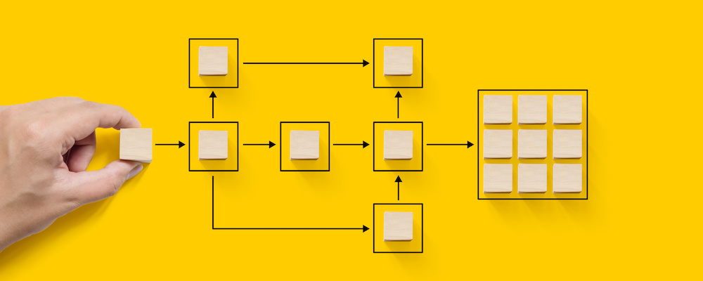

# Adobe Campaign Automation {#automation-home}

Att kommunicera med kunderna via flera marknadsföringskanaler kan fungera både för er och för er. När de olika kanalerna inte fungerar ihop blir det bara brus och förvirring. När de synkroniseras ger de era kunder en kraftfull och komplementär upplevelse av ert varumärke.

Adobe Campaign gör det enkelt för er att synkronisera era era kanaler med ett enda lättanvänt gränssnitt för kampanjsamordning. Så era onlinekanaler - som e-post, webben, mobiler och sociala kanaler - matchar era offlinekanaler, inklusive direktreklam, callcenter, butiker och så vidare. Det ger er möjlighet att ge era kunder en enhetlig och sammanhangsberoende upplevelse i både digitala och traditionella kanaler. Kort och gott gör Adobe Campaign det enkelt att leverera innehåll till alla vägar kunderna kan välja - i alla kanaler.

Gå till guiderna nedan och lär dig hur du bygger automatisering med Adobe Campaign.

>[!NOTE]
>
>Vissa skärmar kan skilja sig från din miljö.

<table>
<tr style="border: 0;">
  <td valign="top">
    

    <b> Arbetsflöden </b>
    

     
    

    <a href="workflow/about-workflows.md">Kom igång</a>
    

          
    

    <a href="workflow/build-a-workflow.md">Skapa ditt första arbetsflöde</a>
    

     
    

    <a href="workflow/workflow-use-cases.md">Användningsfall</a>
    

     
  </td>
  <td valign="top">
    

    <b> Kampanjsamordning </b>
    

     
    

    <a href="campaigns/set-up-campaigns.md">Kom igång</a>
    

     
    

    <a href="campaigns/marketing-campaign-create.md">Skapa din första kampanj</a>
    

     
    

    <a href="campaigns/marketing-campaign-deliveries.md">Skicka meddelanden i en kampanj</a>
    

     
  </td>
  <td valign="top">
    

    <b> Tillägg </b>
    

     
    

    <a href="distributed-marketing/about-distributed-marketing.md">Distribuerad marknadsföring</a>
    

     
    

    <a href="campaign-opt/campaign-typologies.md">Kampanjoptimering</a>
    

     
    

    <a href="mrm/about-marketing-resource-management.md">Hantering av marknadsföringsresurser (MRM)</a>
    

     
  </td>
</tr>
</table>
