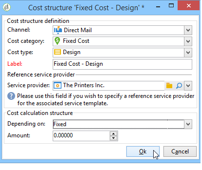

# Kontrollera kostnader{#controlling-costs}

Med Adobe Campaign kan ni kontrollera planerade, utfästa och fakturerade marknadsföringskostnader och dela upp dem per kategori med hjälp av modulen Marketing Resource Management.

Kostnaderna för de olika processerna i en kampanj debiteras en budget som fastställts i förväg av marknadsföringsavdelningen. Beloppen kan delas upp i flera kategorier för att göra informationen mer lättläst och för att ge en mer detaljerad rapportering om marknadsföringsinvesteringar.

Hanteringen och spårningen av budgetar är centraliserad i en dedikerad nod i Adobe Campaign-trädet. På så sätt kan du övervaka belopp som allokerats, reserverats, verkställts och använts från samma vy och för alla budgetar.

Följande steg måste tillämpas för att implementera budgethantering med MRM:

1. Definiera budgeten. [Läs mer](#creating-a-budget).

1. Definiera metoden för kostnadsberäkning: kostnadsstrukturer definieras för tjänsteleverantörerna. [Läs mer](../campaigns/providers-stocks-and-budgets.md).

1. Definiera kampanjkostnader (leveranser/aktiviteter): De kostnader som uppstår för leveranser och aktiviteter anges individuellt eller globalt för kampanjmallen. [Läs mer](../campaigns/marketing-campaign-deliveries.md#compute-costs-and-stocks).

1. Konsolidera: Beroende på aktiviteternas, leveransernas och kampanjens förloppsstatus kommer kostnaderna att beräknas och överföras till motsvarande budget. När kampanjens status är tillräckligt avancerad kan kampanjbudgetens förloppsstatus ändras till **[!UICONTROL Specified]**. Den beräknade kostnaden för programmet anges sedan automatiskt med kostnaderna som beräknas för kampanjen. [Läs mer](#cost-commitment--calculation-and-charging).

## Skapa en budget {#creating-a-budget}

Så här skapar du en budget:

1. Bläddra till mappen **[!UICONTROL Campaign management > Budgets]** i Campaign Explorer.
1. Klicka på ikonen **[!UICONTROL New]**, namnge och spara budgeten.
1. Ange det ursprungliga beloppet: ange det allokerade beloppet i det relevanta fältet. Övriga belopp anges automatiskt. [Läs mer](#calculating-amounts).
1. Definiera giltighetsperioden genom att ange start- och slutdatum. Denna information är endast vägledande.
1. Skapa de utgiftskategorier som den här budgeten har tilldelats för kampanjer, aktiviteter osv. kan länkas. [Läs mer](#expense-categories).

>[!NOTE]
>
>Du kan välja en relaterad budget. Mer information om detta finns i [det här avsnittet](#linking-a-budget-to-another).
>

### Beräkna belopp {#calculating-amounts}

Varje budget definieras av ett initialt belopp som ska minskas från kostnaderna för de olika kampanjerna, leveranserna eller uppgifterna som rör dem efter att de har planerats eller genomförts. Statusen för beloppen (planerade, reserverade, utfästa, spenderade eller fakturerade) beror på typen av kostnad och nivån för åtagande som definierats i kampanjen, leveransen eller uppgiften.

>[!NOTE]
>
>De belopp som anges för kategorierna måste matcha det budgetkuvert som definierats i fältet **[!UICONTROL Allocated]**.

För kampanjer kan en kostnad planeras, bindas eller reserveras för en framtida åtgärd, beroende på nivån för åtagandet.

>[!CAUTION]
>
>När en kampanj skapas måste förloppsstatusen i **[!UICONTROL Budget]** anges till **[!UICONTROL Defined]** för att kostnaderna ska beaktas vid körningen. Om statusen är **[!UICONTROL Being edited]** konsolideras inte kostnaderna.
>   
>Alternativet **[!UICONTROL Commitment level]** representerar en prognos över kostnader i framtiden innan de debiteras budgeten. Beroende på förloppet för en kampanj, uppgift eller leverans kan du välja att tilldela en högre eller lägre åtagandenivå (1). Planerad, 2. Reserverad, 3. Bekräftat) med kombinationsrutan.

Den uppskattade planerade kostnaden för en webbkampanj är till exempel 45 000 euro.

För kampanjen, när statusen för budgetskapande är **[!UICONTROL Defined]**, överförs den faktiska kostnaden för kampanjen (eller, om ingen, den beräknade kostnaden) till budgetsummorna.

Beroende på nivån för kampanjbudgetens åtagande kommer beloppet att anges i fältet **[!UICONTROL Planned]**, **[!UICONTROL Reserved]** eller **[!UICONTROL Committed]**.

Åtagandenivån kan ändras:

* i nivån **kampanj** i fönstret **[!UICONTROL Budget]** som finns på fliken **[!UICONTROL Edit]**. Det är här som budgetar, kostnader och utgifter konfigureras.
* i nivån **tasks** i fönstret **[!UICONTROL Expenses and revenues]**.

När budgeten är **[!UICONTROL Reserved]** utförs uppdateringen automatiskt för den debiterade budgeten.

Proceduren är densamma på aktivitetsnivå.

När en utgift ger upphov till en faktura och fakturan betalas, anges beloppet i fältet **[!UICONTROL Invoiced]**.

### Utgiftskategorier {#expense-categories}

Beloppen kan fördelas i flera utgiftskategorier för att informationen ska bli lättare att läsa och för mer detaljerad rapportering av marknadsföringsinvesteringar. Utgiftskategorierna definieras när budgeten skapas, via noden **[!UICONTROL Budgets]** i trädet.

Om du vill lägga till en kategori klickar du på knappen **[!UICONTROL Add]** i fönstrets nedre del.

Du kan välja en kategori bland de befintliga eller definiera en ny kategori genom att ange den direkt i fältet. När du bekräftar dina indata kan du med ett bekräftelsemeddelande lägga till den här kategorin i listan över befintliga kategorier och koppla den till en Natur om det behövs. Den här informationen kommer att användas i budgetrapporterna.

### Länka en budget till en annan {#linking-a-budget-to-another}

Du kan länka en budget till en huvudbudget. Det gör du genom att välja huvudbudgeten i fältet **[!UICONTROL related budget]** i den sekundära budgeten.

En extra flik läggs till i huvudbudgeten för att visa listan över relaterade budgetar.

Denna information överförs till budgetrapporterna.

## Lägg till utgiftsrader {#adding-expense-lines}

Utgiftsrader läggs automatiskt till i budgeten. De skapas under leveransanalysen och när en uppgift är klar.

För varje kampanj, leverans eller uppgift grupperas de genererade kostnaderna i utgiftsraderna i den budget som de debiteras. Dessa utgiftsrader skapas enligt den berörda tjänsteleverantörens kostnadsrader och beräknas via tillhörande kostnadsstrukturer.

Varje utgiftsrad innehåller därför följande information:

* Kampanjen och leveransen eller uppgiften som den hör till
* Det belopp som beräknas utifrån kostnadsstrukturerna eller den uppskattade preliminära kostnaden
* Verklig kostnad för leverans eller uppgift
* Motsvarande fakturarad (endast MRM)
* Lista över kostnader som beräknats per kostnadskategori (om det finns en kostnadsstruktur)

I exemplet ovan innehåller den redigerade utgiftsraden de beräknade kostnaderna för leveransen av **nya kort** för kampanjen **Loyalty Spring Pack**. När leveransen redigeras kan du på fliken **[!UICONTROL Direct Mail]** se hur utgiftsraden beräknas.

Kostnadsberäkningen för denna leverans baseras på de kostnadskategorier som valts ut för den berörda tjänsteleverantören:

Enligt de kostnadskategorier som valts tillämpas motsvarande kostnadsstrukturer för att beräkna kostnadsraderna. I det här exemplet är kostnadsstrukturen för den berörda tjänsteleverantören följande:

>[!NOTE]
>
>Kostnadskategorier och strukturer visas på [den här sidan](../campaigns/providers-stocks-and-budgets.md#create-a-service-provider-and-its-cost-categories)

## Kostnadsåtagande, beräkning och debitering {#cost-commitment--calculation-and-charging}

Kostnader kan åläggas för leveranser och uppgifter. Beroende på förloppet för den process som den hör till uppdateras statusen för en kostnad.

### Kostnadsberäkningsprocess {#cost-calculation-process}

Kostnaderna delas in i tre kategorier:

1. Uppskattad preliminär kostnad

   Den uppskattade preliminära kostnaden är en uppskattning av kostnaderna för kampanjens processer. Så länge som indata redigeras konsolideras inte beloppen. Den måste ha statusen **[!UICONTROL Specified]** för de indata som ska beaktas i beräkningarna.

   Detta belopp anges manuellt och kan delas upp i flera utgiftskategorier. Klicka på länken **[!UICONTROL Breakdown...]** och klicka sedan på knappen **[!UICONTROL Add]** för att definiera ett nytt belopp om du vill få en kostnad som inte räcker längre.

   

   Du kan associera varje kostnad med en kategori så att kostnadsuppdelningen per utgiftskategori senare kan visas i den relaterade budgeten och i budgetrapporterna.

1. Beräknad kostnad

   Den beräknade kostnaden beror på det berörda elementet (kampanj, leverans, uppgift osv.) och dess status (redigeras, pågår, är klar). Om den faktiska kostnaden anges kommer den beräknade kostnaden att använda detta belopp.

   Om den faktiska kostnaden inte anges gäller följande regler:

   * För en kampanj som redigeras är den beräknade kostnaden den uppskattade preliminära kostnaden för kampanjen eller, om denna kostnad inte är definierad, den beräknade kostnaden blir summan av alla preliminära kostnader för kampanjens leveranser och uppgifter. Om kampanjen är avslutad blir kampanjens beräknade kostnad summan av alla beräknade kostnader.
   * För en leverans som ännu inte har analyserats är den beräknade preliminära kostnaden den beräknade kostnaden. Om analysen redan har utförts är den beräknade kostnaden summan av alla kostnader som beräknas utifrån tjänstens kostnadsstrukturer och antalet mottagare.
   * För en pågående uppgift använder den beräknade kostnaden den uppskattade preliminära kostnaden. Om uppgiften är slutförd är den beräknade kostnaden summan av alla kostnader som beräknats från tjänsteleverantörens kostnadsstrukturer och antalet slutförda dagar.
   * För marknadsföringsplanen, liksom för programmet, är den beräknade kostnaden summan av de beräknade kostnaderna för kampanjerna. Om dessa kostnader inte anges kommer den beräknade kostnaden att använda de uppskattade preliminära kostnaderna.

   >[!NOTE]
   >
   >Med länken **[!UICONTROL Breakdown]** kan du visa information om beräkningen och datumet för senaste kostnadsberäkning.

1. Verklig kostnad

   Den verkliga kostnaden anges manuellt och delas vid behov upp i olika utgiftskategorier.

### Beräkning och debitering {#calculation-and-charging}

Kostnaderna beräknas via kostnadsstrukturer och debiteras de budgetar som valts ut för de aktuella kampanjerna, leveranserna eller uppgifterna.

En kontroll kan utföras på belopp som har anslagits för kampanjer via budgetgodkännande. Ytterligare kontrollpunktsliknande uppgifter kan skapas i en kampanj för att ställa in andra godkännanden. Se [Typer av uppgift](creating-and-managing-tasks.md#types-of-task).

### Exempel {#example}

Vi ska skapa en kampanj med:

* Direktleverans av e-post med hjälp av tjänsteleverantörens kostnadsstrukturer
* En aktivitet med fast kostnad
* En uppgift med en dagskostnad

#### Steg 1 - Skapa budgeten {#step-1---creating-the-budget}

1. Skapa en ny budget via noden **[!UICONTROL Campaign management > Budgets]**.

1. Definiera en budget på 10 000 euro i fältet **[!UICONTROL Allocated]** i avsnittet **[!UICONTROL Amounts]**. Lägg till två utgiftskategorier i fönstrets nedre del:

#### Steg 2 - Konfigurera tjänsteleverantören och definiera kostnadsstrukturerna {#step-2---configuring-the-service-provider-and-defining-the-cost-structures}

1. Skapa en tjänstleverantör och en tjänstmall med kostnadsstrukturen från noden **[!UICONTROL Administration > Campaigns]**. Mer information om detta finns i [det här avsnittet](../campaigns/providers-stocks-and-budgets.md#create-a-service-provider-and-its-cost-categories).

   Skapa kostnadskategorier **[!UICONTROL Envelopes]** (typerna 114x229 och 162x229), **[!UICONTROL Postage]** och **[!UICONTROL Print]** (typerna A3 och A4) för direktreklam. Skapa sedan följande kostnadsstrukturer:

   

1. Lägg till en fast kostnad (i kostnadskategorierna) vars beräkning är fast och vars belopp är tomt (i motsvarande kostnadsstruktur) och som specificeras individuellt för varje leverans.

   

   Skapa följande två kostnadskategorier för uppgifter:

   * **[!UICONTROL Room reservation]** (litet rum och stort rum), med en **fast** kostnadsstruktur på 300 och 500 euro:

   

   * **[!UICONTROL Creation]** (**Innehållsmall** typ), med en **daglig** kostnadsstruktur på 300 euro:

   

#### Steg 3 - Debitera budgeten i kampanjen {#step-3---charging-the-budget-in-the-campaign}

1. Skapa en kampanj och välj den budget som skapades i steg 1.

   >[!NOTE]
   >
   >Som standard tillämpas den valda budgeten för programmet på alla kampanjer i programmet.

   

1. Ange den uppskattade preliminära kostnaden, med uppdelning:

   

1. Klicka på **[!UICONTROL Ok]** och sedan **[!UICONTROL Save]** för att bekräfta informationen. Den beräknade kostnaden för kampanjen uppdateras sedan med den uppskattade preliminära kostnaden.

#### Steg 4 - Skapa direktutskick {#step-4---creating-the-direct-mail-delivery}

1. Skapa ett arbetsflöde för kampanjen och placera frågeaktiviteterna för att välja målet (varning, mottagarens postadresser måste anges).

1. Skapa en direktleverans och välj den tjänsteleverantör som skapades i steg 2: kostnadskategorierna visas automatiskt.

1. Åsidosätt kostnaden för kuverten och lägg till en fast kostnad. Välj även de kategorier som berörs av dessa kostnader.

   

   >[!NOTE]
   >
   >Om en av kostnadskategorierna inte används genereras inga utgifter.

1. Starta det arbetsflöde du just skapat för att starta analysen och beräkna kostnaderna.

   

1. Godkänn budgeten från instrumentpanelen om budgetgodkännande är aktiverat för den här kampanjen. Du kan kontrollera godkännandet av kostnadskategorier.

   

Utgiftsraden för leveransen läggs till på fliken **[!UICONTROL Edit > Budget]** i kampanjen. Redigera den för att visa information om beräkningen.

Kostnaden som beräknas för leveransen uppdateras med följande information:

När du redigerar den beräknade kostnaden kan du kontrollera kostnadsuppdelningen, statusen och datumet för kostnadsberäkningen.

#### Steg 5 - Skapa aktiviteter {#step-5---creating-tasks}

I den här kampanjen ska vi lägga till de två aktiviteterna för vilka kostnadsstrukturerna [skapades tidigare](#step-2---configuring-the-service-provider-and-defining-the-cost-structures).

Det gör du genom att klicka på knappen **[!UICONTROL Add a task]** på kontrollpanelen för kampanjer. Namnge aktiviteten och klicka på **[!UICONTROL Save]**.

1. Uppgiften läggs sedan till i uppgiftslistan. Du måste redigera den för att kunna konfigurera den.

1. Välj tjänsten och motsvarande kostnadskategori på fliken **[!UICONTROL Properties]**:

   

1. Klicka sedan på ikonen **[!UICONTROL Expenses and revenue]** för aktiviteten och ange den uppskattade preliminära kostnaden.

   

   När uppgiften har sparats anges den beräknade kostnaden med det värde som angetts för den uppskattade preliminära kostnaden.

   När aktiviteten är slutförd (status **[!UICONTROL Finished]** ) uppdateras den beräknade kostnaden automatiskt med kostnaden för det stora rummet enligt vad som anges i dess kostnadsstruktur. Denna kostnad visas också i denna kategori i uppdelningen.

1. Skapa sedan en andra uppgift enligt samma procedur, schemalagd över fem dagar och relaterad till kostnadsstrukturen som skapades tidigare.

   

   När uppgiften är slutförd specificeras den beräknade kostnaden med värdet från den relaterade kostnadsstrukturen, dvs. 1500 euro i vårt exempel (5 dagar x 300 euro):

   

#### Steg 6 - Uppdatera kampanjbudgetens status {#step-6---update-the-campaign-budget-status}

När kampanjen har konfigurerats kan dess status uppdateras genom att den anges till **[!UICONTROL Specified]**. Den beräknade kostnaden för kampanjen visar sedan summan av de beräknade kostnaderna för leveransen och kampanjens uppgifter:

#### Budgetgodkännande {#budget-approval}

När godkännandet är aktiverat kan du via en särskild länk godkänna budgeten från kampanjinstrumentpanelen. Den här länken visas när målarbetsflödet har startats och direktutskick måste godkännas.

Du kan sedan klicka på länken för att bevilja eller avvisa godkännande, eller använda länken i e-postmeddelandet om ett meddelande har aktiverats för kampanjen.

När budgeten har godkänts och leveransen är klar överförs kostnaderna automatiskt via ett särskilt tekniskt arbetsflöde.

## Beställningar och fakturor {#orders-and-invoices}

Inom ramen för MRM kan du spara beställningar hos en tjänsteleverantör och utfärda fakturor. Hela livscykeln för dessa order och fakturor kan hanteras via Adobe Campaign gränssnitt.

### Orderskapande {#order-creation}

Om du vill spara en ny order hos en tjänsteleverantör klickar du på noden **[!UICONTROL MRM > Orders]** i trädet och sedan på knappen **[!UICONTROL New]** .

Ange ordernummer, den berörda tjänsteleverantören och orderns totala belopp.

### Utfärda och spåra fakturor {#issuing-and-tracking-invoices}

För varje tjänsteleverantör kan du spara fakturor och definiera deras status och den budget som debiteras.

Fakturor skapas och lagras i noden **[!UICONTROL MRM > Invoices]** i Adobe Campaign-trädet.

En faktura består av fakturarader vars summa tillåter att beloppet beräknas automatiskt. Dessa rader skapas manuellt från fliken **[!UICONTROL Invoice lines]**. De kan kopplas till en order om att överföra informationen till beställningarna.

Fakturorna för varje tjänsteleverantör visas på fliken **[!UICONTROL Invoices]** i profilen:

På fliken **[!UICONTROL Details]** kan du visa innehållet i fakturan.

Klicka på **[!UICONTROL Add]** om du vill skapa en ny faktura.
