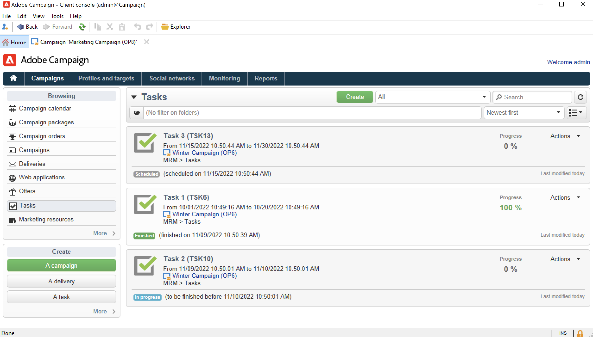
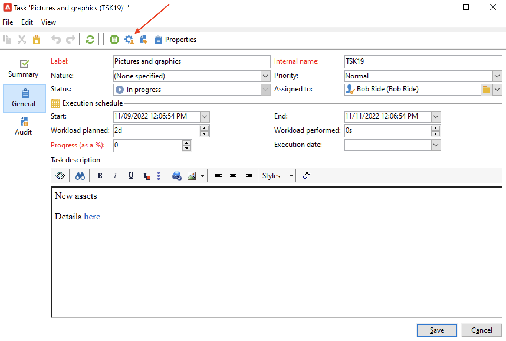
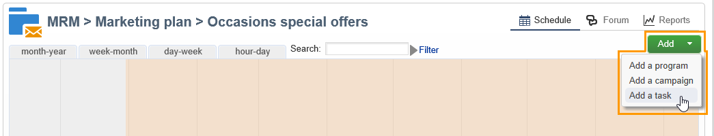

# Skapa och hantera uppgifter{#creating-and-managing-tasks}

Med Adobe Campaign kan du skapa uppgifter och hantera hela deras livscykel direkt i programmet. Program- och kampanjimplementering kan delas upp i uppgifter som tilldelas Adobe Campaign-operatörer eller externa tjänsteleverantörer. Med det här åtgärdsläget kan du skapa en öppen samarbetsmiljö som innehåller alla programdeltagare och externa deltagare.

Uppgifter kan skapas, visas och övervakas från listan med uppgifter eller kontrollpanelen för kampanjer. De kan också ses och spåras i tidsplanerna för marknadsföringsplanen, programmen och kampanjerna.

Aktiviteter är kopplade till kampanjen och kan ha beroenden, dvs. associerade uppgifter. Varje uppgift har en status, prioritet, uppskattad belastning och relaterade kostnader.

Alla uppgifter grupperas i en lista som är tillgänglig via fliken **Kampanjer** . Mer information finns i [Åtkomstuppgifter](#accessing-tasks).

De kan visas i schemat för det program de tillhör.

## Åtkomstuppgifter {#accessing-tasks}

### Visa uppgifter {#displaying-tasks}

Uppgifterna visas i uppgiftslistan som du kommer åt via fliken **[!UICONTROL Campaigns]**.

Du kan visa alla uppgifter för den aktuella operatorn.

Mer information finns i [Körningsstatus för en aktivitet](#execution-status-of-a-task) och [Förloppsstatus för en aktivitet](#progress-status-of-a-task).

### Filtrera uppgifter {#filtering-tasks}

När du visar den här vyn filtreras den automatiskt så att endast de **aktuella operatoruppgifterna** visas. Du kan även filtrera uppgifterna med hjälp av fälten i fönstrets övre del.

### Redigera uppgifter {#editing-tasks}

Klicka på en uppgift för att redigera den.

## Skapa en ny uppgift {#creating-a-new-task}

Så här skapar du en uppgift:

1. Bläddra till länken **[!UICONTROL Tasks]** på fliken **[!UICONTROL Campaigns]** och klicka på **[!UICONTROL Create]**.

   

1. Ange namnet på aktiviteten och välj den kampanj som den är länkad till.
1. Ange start- och slutdatum.
1. Klicka på **[!UICONTROL Save]** för att skapa uppgiften.

   

Du kan också skapa en uppgift via kontrollpanelen för en kampanj. I det här fallet länkas den automatiskt till den kampanj som den skapades från.

När en uppgift har skapats läggs den till i kampanjschemat, kampanjinstrumentpanelen och listan med uppgifter. Om du vill redigera en aktivitet klickar du på dess namn i listan med aktiviteter eller väljer den i schemat eller på kampanjkontrollpanelen och klickar på **[!UICONTROL Open]**.

När du har skapat uppgiften kan du konfigurera den genom att definiera:

* Chefen och deltagarna. [Läs mer](#manager-and-participants)
* Skapandeschemat. [Läs mer](#execution-schedule)
* Utfästa kostnader. [Läs mer](#expenses-and-revenues)

Du kan också lägga till [granskare](#reviewers) och [referensdokument](#documents-referenced).

Aktivitetens livscykel visas i [det här avsnittet](#life-cycle).

### Chef och deltagare {#manager-and-participants}

Som standard tilldelas uppgiften till den operator som skapade den. Den här operatorn meddelas när en åtgärd krävs för den uppgiften.

Du kan välja en annan operator i listrutan **[!UICONTROL Assigned to]**.

>[!NOTE]
>
>Operatorhantering beskrivs i [det här avsnittet](../../v8/start/gs-permissions.md).
>
>Det är bara operatorn som ansvarar för en uppgift som kan stänga den.

Du kan ange fler operatorer som ska utföra uppgiften. Dessa operatorer får inte stänga uppgiften: de kan bara godkänna den uppgift som tilldelats dem.

Följ stegen nedan för att lägga till aktivitetsoperatorer:

1. Klicka på ikonen **[!UICONTROL Resources]** i verktygsfältet för åtgärder.

   

1. Klicka på **[!UICONTROL Add]** och välj de berörda operatorerna.
1. Ange användarfrekvens: Detta representerar arbetsbelastningen som tilldelats operatorn under uppgiftskörningens varaktighet. Denna procentsats är endast en indikation och uttrycks som en procentandel.

   

   För en aktivitet vars körningsschema är inställt på 10 dagar, kommer till exempel en operator vars användarfrekvens är 50 % att aktiveras för den här aktiviteten för halva arbetstiden i 10 dagar.

   För varje operator kan du ange en schemalagd arbetsbelastning och en faktisk arbetsbelastning. Dessa varaktigheter är också avsedda endast som information.

1. Du kan konfigurera en påminnelse från länken **[!UICONTROL Add a reminder...]**. Ett e-postmeddelande skickas till alla operatorer som deltar i aktiviteten före slutdatumet.

   

1. Du kan också skicka ett meddelande innan uppgiften startar. Om du vill konfigurera det här anger du datumet i fältet **[!UICONTROL Initial notification]**.
1. När slutdatumet har nåtts och aktiviteten inte har stängts kan ett meddelande skickas till den tilldelade personen eller den grupp av tilldelade som har valts i listrutan **[!UICONTROL Assignee]**.

På kontrollpanelen för operatorer kan du kontrollera deras arbetsbelastning (andra pågående uppgifter).

### Godkännande av uppgift {#reviewers}

Förutom deltagarna kan du definiera operatorer som ska granska uppgiften när den har stängts.

Det gör du genom att klicka på alternativet **[!UICONTROL Enable task approval]** i den nedre delen av **[!UICONTROL Resources]**-fönstret. Det kan vara en enskild operator, en grupp operatorer eller en lista med operatorer.

Om du vill ange en lista med operatorer klickar du på länken **[!UICONTROL Edit...]** till höger om den första granskaren och lägger till så många operatorer som behövs, enligt nedan:

Du kan definiera ett godkännandeschema för uppgiften i det nedre avsnittet av konfigurationsfönstret. Som standard har granskarna tre dagar på sig att godkänna uppgiften från och med överföringsdatumet. Du kan också lägga till en påminnelse som automatiskt skickas till de berörda operatörerna före godkännandedeadline.

Den person som ansvarar för uppgiften kan tilldela sig själv uppgiften att godkänna den, även om andra operatorer redan har tilldelats uppgiften att göra detta. Om ingen granskare har definierats skickas meddelandena till den person som ansvarar för uppgiften. Alla andra Adobe Campaign-operatorer med **[!UICONTROL Administrator]**-behörighet kan också godkänna uppgiften. De får dock inga meddelanden.

### Dokument som refereras {#documents-referenced}

Du kan lägga till [dokument och marknadsföringsresurser](managing-marketing-resources.md) i en aktivitet.

Så här gör du:

1. Öppna uppgiften och klicka på ikonen **[!UICONTROL Documents]** i verktygsfältet för uppgifter.

   

1. Klicka på **[!UICONTROL Add]** och välj det dokument som ska läggas till i uppgiften. Använd samma process för marknadsföringsresurser.

Refererade dokument läggs till i de meddelanden som skickas till de operatorer som deltar i uppgiften. De läggs också till på kontrollpanelen för uppgifter.

### Körningsschema {#execution-schedule}

Giltighetsperioden för en aktivitet anges i fälten **[!UICONTROL Start]** och **[!UICONTROL End]**. Den schemalagda belastningen anger den arbetsbelastning som ska utföras under perioden. Den uttrycks i dagar eller timmar.

>[!NOTE]
>
>En uppgifts livscykel visas i [Livscykel](#life-cycle).

I fältet **[!UICONTROL Workload performed]**, som även uttrycks i dagar och timmar, kan du manuellt uppdatera aktivitetens förlopp i förhållande till den schemalagda arbetsbelastningen.

**[!UICONTROL Progress status]** för aktiviteten, uttryckt i procent, uppdateras automatiskt baserat på de uppgifter som utförs av de berörda operatorerna. Den kan anges manuellt.

Den här informationen kan visas på kontrollpanelen för uppgifter.

Den visas också på fliken Kampanj.

Om slutdatumet för schemat för aktivitetskörning har nåtts men aktiviteten inte har slutförts, blir aktiviteten **[!UICONTROL Late]**. Ett varningsmeddelande visas även för aviseringsoperatörer.

Mer information finns i [Förloppsstatus för en aktivitet](#progress-status-of-a-task).

### Utgifter och intäkter {#expenses-and-revenues}

Du kan definiera relaterade utgifter och prognosintäkter för varje uppgift. Dessa beräknas och konsolideras sedan för den kampanj som aktiviteten är kopplad till.

Om du vill ange den här informationen klickar du på ikonen **[!UICONTROL Expenses and revenue]** i verktygsfältet för åtgärder.

Som standard är den debiterade budgeten budgeten för den kampanj som aktiviteten är kopplad till. Den visas i aktivitetsinformationen.

>[!NOTE]
>
>Mer information om utgifter och budgetar finns i [det här avsnittet](../campaigns/providers-stocks-and-budgets.md#cost-commitment--calculation-and-charging).

I det här fönstret kan du också definiera vilka mål som ska uppnås. Målen uttrycks i prognosintäkter för uppgiften.

### Serviceföretag {#service-providers}

En extern tjänsteleverantör kan vara involverad i hanteringen av en uppgift.

Om du vill göra det redigerar du uppgiftsegenskaperna och väljer tjänsteleverantören. Kostnadskategorierna som är kopplade till tjänsteleverantören listas automatiskt i fönstrets centrala avsnitt.

Välj de kostnadskategorier som är relaterade till utförandet av uppgiften. Välj typ av kostnad och lägg till ett tilläggsbelopp om det behövs.

>[!NOTE]
>
>Metoden för att hantera budgetar och kostnader visas i [Kontrollkostnader](controlling-costs.md).

När en tjänsteleverantör har valts visas den på kontrollpanelen för uppgifter:

### Sena uppgifter {#late-tasks}

En aktivitet är sen om slutdatumet har nåtts utan att dess status ändras till **[!UICONTROL Finished]**. Som standard varnas ingen operator när en uppgift är sen. Du kan konfigurera leveransen av ett e-postmeddelande: alla operatorer kan meddelas även om de inte är inblandade i uppgiften.

Gå till rutan **[!UICONTROL Resources]** och lägg till operatorn i fältet **[!UICONTROL Assignation]**. Om du vill meddela flera personer väljer du en grupp med operatorer.

### Inledande meddelanden {#initial-notifications}

När du skapar eller ändrar en uppgift med ett startdatum i framtiden erbjuder Adobe Campaign att skicka ett e-postmeddelande till den person som ansvarar för uppgiften så att de får veta när den börjar.

Om den uppgift du skapar är långt borta kan det dock vara bättre att schemalägga att meddelandet skickas innan aktiviteten startar. Om uppgiften till exempel startar inom en månad kan du meddela den ansvariga personen en vecka innan den börjar.

Om du vill schemalägga ett meddelande går du till rutan **[!UICONTROL Resources]** och använder fältet **[!UICONTROL Initial notification]**.

* För uppgifter inom kampanjer väljer du ett specifikt datum och en viss tid.
* För aktiviteter i kampanjmallar uttrycks meddelandetiden som den återstående tiden innan aktiviteten startar (om du till exempel anger 2d i fältet **[!UICONTROL Initial notification]** skickas e-postmeddelandet två dagar före aktivitetens startdatum).

Om du har schemalagt ett meddelande kommer Adobe Campaign att skicka ett meddelande direkt när du sparar uppgiften. Du kan bestämma dig för att skicka det och detta ersätter inte det schemalagda meddelandet.

### Aktivitet länkad till ett program {#task-linked-to-a-program}

Du kan skapa aktiviteter direkt i ett program för att hantera åtgärder som gäller deras övergripande organisation och inte en viss kampanj (till exempel ett möte för att diskutera temat för kommande kampanjer i programmet). Aktiviteten visas i programschemat.

Så här skapar du en uppgift som är länkad direkt till ett program:

1. Öppna programschemat: gå till **[!UICONTROL Campaigns > Browse > Other choices > Programs]** på startsidan. Det övergripande programschemat öppnas i den högra delen av fönstret.
1. Klicka på önskat program i schemat: ett fönster visas med programmet.
1. Klicka på **[!UICONTROL Open]** i det här fönstret. Programschemat öppnas.
1. Klicka på knappen **[!UICONTROL Add]** ovanför schemat till höger och klicka sedan på **[!UICONTROL Add a task]**.

### Operatörens tillgänglighet {#operator-availability}

En ikon bredvid operatorns namn på kontrollpanelen för uppgifter anger att de redan arbetar med en annan uppgift eller händelse under den period som aktiviteten omfattar. Uppgiften som operatorn ansvarar för eller deltar i visas i fältet **[!UICONTROL Assigned to]** eller i rutan **[!UICONTROL Resources]**.

### Uppgift i ett arbetsflöde {#task-in-a-workflow}

Om du använder ett **[!UICONTROL Task]**-element i ett kampanjarbetsflöde kan du definiera två scenarier beroende på om aktiviteten har godkänts eller inte.

I kampanjarbetsflödena finns aktiviteten **[!UICONTROL Task]** på fliken **[!UICONTROL Flow control]**.

## Typer av uppgifter {#types-of-task}

När du skapar uppgifter via en kampanj kan du skapa specifika uppgifter. Typen av uppgift definieras i den valda mallen.

Följande uppgifter kan schemaläggas:

* [Kontrolluppgifter](#control-tasks),
* [Grupperingsaktivitet](#grouping-task),
* [Grupperingsaktivitet](#grouping-task),
* [Meddelandeaktivitet](#notification-task).

>[!NOTE]
>
>**[!UICONTROL Control task]**- och **[!UICONTROL Grouping]**-aktiviteter kan skapas **endast** via kampanjinstrumentpanelen.\
>De visas i aktivitetskartan för den operator som de är tilldelade till. Se [Åtkomstuppgifter](#accessing-tasks).

### Styra uppgifter {#control-tasks}

En **[!UICONTROL Control task]** är länkad till leveransgodkännande: godkännande av mål, innehåll, extraheringsfil, budget eller korrektur.

När aktiviteten har skapats läggs den till på kontrollpanelen för kampanjer.

Du kan sedan redigera den och ange dess parametrar.

### Skapande av marknadsföringsresurs {#marketing-resource-creation-task}

En uppgift att skapa marknadsföringsresurser kan användas för att hantera skapandet och publiceringen av en marknadsföringsresurs. Om du hanterar en resurs via en aktivitet och inte via själva resursen kan du:

* Styr processen för att skapa resurser via en kampanj.
* Visa resursskapandeprocessen i ett schema.
* Hantera processen för att skapa resurser (påminnelser, meddelanden).
* Beräkna och kontrollera kostnaderna för att skapa resurser.
* Godkänn och publicera resursen via aktiviteten (om det relevanta alternativet är aktiverat).

#### Interaktion mellan aktiviteten och dess länkade resurs {#interaction-between-the-task-and-its-linked-resource}

Aktiviteten för att skapa marknadsföringsresurser interagerar med den resurs som är länkad till den. Detta innebär:

* Schemat för att skapa resurser och de kostnader som är kopplade till det hanteras via aktiviteten.
* Operatorer kan arbeta med resursen som vanligt (hämta eller ladda upp, låsa och låsa upp): detta påverkar inte aktiviteten.
* Resursgodkännande och publicering kan utföras via aktiviteten: om alternativet **[!UICONTROL Publish the marketing resource]** är aktiverat godkänns resursen och publiceras automatiskt när aktiviteten är klar. Om alternativet inte är aktiverat interagerar aktiviteten och resursen inte: det ena påverkar inte det andra.

  Du kan använda en serie länkade uppgifter för att definiera en fullständig godkännandecykel. Markera alternativet **[!UICONTROL Publish the marketing resource]** bara för den senaste aktiviteten: alla aktiviteter måste slutföras för att resursen ska kunna publiceras. När du skapar en underordnad marknadsföringsresursuppgift väljs resursen automatiskt i den underordnade aktiviteten.

   * **Via resursen**: Om du skickar resursen för godkännande eller godkännande kommer dessa åtgärder inte att påverka aktiviteten.
   * **Via aktiviteten**: Om alternativet **[!UICONTROL Publish the marketing resource]** checkas in i aktiviteten godkänns resursen och publiceras automatiskt när aktiviteten är klar (se ovan). Om alternativet inte är markerat interagerar aktiviteten och resursen inte: om du agerar på den ena påverkas inte den andra.

#### Konfigurera en uppgift att skapa en marknadsföringsresurs {#configuring-a-marketing-resource-creation-task}

Den person som granskar uppgiften behöver inte samma person som granskar innehållet som definierats i resursen. Om alternativet **[!UICONTROL Publish the marketing resource]** däremot är markerat (se nedan) har uppgiftsgranskaren behörighet att godkänna resursinnehållet, eftersom åtgärden automatiskt godkänner resursen (eller, om ingen granskare är definierad, aktivitetshanteraren).

I fältet **[!UICONTROL Marketing resource]** definierar du den resurs som du vill hantera via den här aktiviteten. Du kan:

* Välj en befintlig resurs: listrutan innehåller alla resurser med statusen **[!UICONTROL Being edited]**.
* Skapa en resurs: klicka på ikonen **[!UICONTROL Select the link]** och klicka sedan på ikonen **[!UICONTROL Create]** .

Med alternativet **[!UICONTROL Publish the marketing resource]** kan du automatisera resurspublicering: när aktiviteten är **[!UICONTROL Finished]** växlar resursens status automatiskt till **[!UICONTROL Published]**, även om den inte har skickats för godkännande eller godkännande, inklusive om granskaren som slutför aktiviteten inte är den innehållsgranskare som är definierad i resursen.

Knappen **[!UICONTROL Publish the resource]** är tillgänglig och resurspubliceringsgranskaren får ett e-postmeddelande om att den är klar att publiceras. Granskning och publicering av uppgiftsgranskaren visas på fliken **[!UICONTROL Edit > Tracking]**. Om ett arbetsflöde för efterbearbetning av resurser har definierats, körs det nu.

### Gruppuppgift {#grouping-task}

Med typaktiviteten **[!UICONTROL Grouping task]** kan du gruppera flera uppgifter och synkronisera hanteringen av deras förlopp och deras godkännande.

Grupperingsuppgifter har inga länkade utgifter eller resurser.

Alla uppgifter som grupperas efter en grupperingsaktivitet kan visas på en egen kontrollpanel. På så sätt kan du filtrera listan med uppgifter så att endast de som intresserar dig visas.

Grupperingsuppgifter har en länk som gör att du enkelt kan skapa en grupperad uppgift.

Om du vill skapa en grupperad uppgift baserat på en grupperingsaktivitet går du till kampanjkontrollpanelen och klickar på grupperingsaktivitetens namn för att visa dess beskrivning. Klicka sedan på **[!UICONTROL Add a task]**.

Om du redan har skapat en uppgift som du vill länka till en grupperingsaktivitet kan du göra det via fältet **[!UICONTROL Linked to]** i rutan **[!UICONTROL Properties]**.

### Meddelandeuppgift {#notification-task}

Med meddelandeaktiviteter kan du schemalägga e-postleveranser (till en operator, en grupp operatorer, en tjänsteleverantör osv.). På så sätt kan ni schemalägga påminnelser, till exempel för att meddela någon att en kampanj är klar snart, eller för att skicka dokument innan en kampanj startar så att operatörerna kan förbereda den. Det innebär att ni kan hålla koll på er kommunikation inom ramen för kampanjen eller programmet och få ett närmare grepp om de åtgärder som vidtas.

#### Livscykel {#life-cycle}

Meddelandeaktiviteter kräver inte godkännande. Det innebär att deras livscykel är enklare än en standarduppgift:

En meddelandeaktivitet kan ha följande status:

* **[!UICONTROL Scheduled]** tills e-postmeddelandet har skickats
* **[!UICONTROL In progress]** när e-postmeddelandet har skickats och tills slutdatumet har nåtts
* **[!UICONTROL Finished]** när slutdatumet har nåtts.

#### Konfiguration {#configuration}

När du skapar en uppgift måste du ange följande element:

* **[!UICONTROL Assigned to]**: operatorn eller gruppen med operatorer som ska ta emot e-postmeddelandet. Om du tilldelar om uppgiften när e-postmeddelandet har skickats, skickas inte e-postmeddelandet till den nya operatorn (för att detta ska ske måste du initiera om uppgiften och ändra startdatumet).
* **Startdatum för aktiviteten**: det datum då e-postmeddelandet skickas. Detta datum måste infalla i framtiden när uppgiften registreras.
* **Slutdatum för aktivitet**: det datum då aktivitetsstatusen ändras till **[!UICONTROL Finished]**. Som standard är slutdatumet identiskt med startdatumet. Om du tilldelar en varaktighet till aktiviteten kan du däremot symbolisera hur lång tid operatorn måste utföra i schemat, om det behövs.
* **[!UICONTROL Description]**: texten som anges här visas i meddelandets brödtext.

  

Du kan lägga till en bifogad fil till uppgiften och i e-postmeddelandet. Det gör du genom att klicka på ikonen **[!UICONTROL Documents]** i verktygsfältet i det övre högra hörnet.

## Livscykel {#life-cycle-1}

### Länkar mellan uppgifter {#links-between-tasks}

Knappen **[!UICONTROL Properties]** i varje uppgift gör att du kan definiera länkarna mellan aktiviteter i en kampanj. Du kan dela upp aktiviteter i underaktiviteter med hjälp av en grupperingsaktivitet (se [Länkade aktiviteter](#linked-tasks)) eller definiera beroenden mellan aktiviteterna (se [Gruppera aktiviteter](#grouping-tasks)).

#### Länkade uppgifter {#linked-tasks}

Använd fältet **[!UICONTROL Linked task]** för att associera uppgifter med en grupperingsaktivitet. Se [Typer av uppgift](#types-of-task).

I följande exempel delas godkännandet av målinriktning upp i fyra underaktiviteter.

Varje underuppgift är en standarduppgift som är länkad till huvuduppgiften.

#### Gruppera uppgifter {#grouping-tasks}

Använd fältet **[!UICONTROL Grouped to]** om du vill att körningen av en uppgift ska vara beroende av körningen av en annan uppgift.

Beroendet mellan aktiviteter representeras av pilar på kontrollpanelen för kampanjer.

När det gäller grupperade uppgifter tilldelar Adobe Campaign automatiskt slutdatumet för den överordnade uppgiften till den underordnade aktiviteten som startdatum. Om en **Skapa inbjudan**-aktivitet till exempel avslutas den 15 oktober klockan 17:30, startar den underordnade aktiviteten **Skicka inbjudan via e-post** den 15 oktober klockan 17:30.

Om du skjuter upp slutet på en överordnad aktivitet kan vissa av de underordnade aktiviteterna påverkas: dessa är de underordnade aktiviteter vars status är **[!UICONTROL Scheduled]** och vars startdatum är tidigare än det nya slutdatumet för den överordnade aktiviteten. Aktivitetens längd ändras inte. Om startdatumet för en underordnad uppgift är senare än det nya slutdatumet för den överordnade aktiviteten påverkas inte den underordnade aktiviteten.

**Exempel**

En överordnad aktivitet som schemaläggs att avslutas den 9 oktober klockan 17.00 har två underordnade uppgifter, aktivitet A och aktivitet B. Aktivitet A schemaläggs att starta den 10 oktober klockan 20 och aktivitet B schemaläggs att starta den 12 oktober kl. 8.00.

Låt oss skjuta upp den överordnade uppgiften: den upphör nu den 11 oktober klockan 12. Endast uppgift A senareläggs och börjar 11 oktober klockan 16.00.

### Körningsstatus för en uppgift {#execution-status-of-a-task}

Uppgiftsstatusvärden kan visas på aktivitetskartan. Körningsstatusen för en aktivitet uppdateras automatiskt enligt operatoråtgärder.

En uppgift kan vara: **[!UICONTROL Scheduled]**, **[!UICONTROL In progress]**, **[!UICONTROL Finished]**, **[!UICONTROL Canceled]**, **[!UICONTROL Pending approval]** eller **[!UICONTROL Rejected]**.

* När en aktivitet skapas är det **[!UICONTROL Scheduled]** om startdatumet infaller i framtiden. Den här statusen behålls tills dess startdatum nås.
* När aktiviteten har startats är den **[!UICONTROL In progress]**. När den person som ansvarar för uppgiften stänger den ändras den till **[!UICONTROL Finished]**.
* Om en granskare har definierats blir uppgiften **[!UICONTROL Pending approval]** när den ansvariga personen stänger den och tills granskaren har godkänt den. Om granskaren avvisar den blir aktiviteten **[!UICONTROL Rejected]**.
* En uppgift kan avbrytas av den person som är ansvarig för den via kontrollpanelen eller **[!UICONTROL Task map]** genom att klicka på knappen **[!UICONTROL Cancel]**.
* Om du vill schemalägga en aktivitet anger du ett startdatum i framtiden. Du kan sedan skicka ett första meddelande till de Adobe Campaign-operatorer som utför uppgiften. Se [Slutför aktivitetens livscykel](#complete-task-life-cycle).

>[!NOTE]
>
>* Aktivitetens status uppdateras automatiskt.
>* Även om giltighetsperioden är slut visas uppgifter som inte stängts fortfarande i listan över pågående uppgifter. En varning meddelar operatorer om att aktiviteten är sen.
>

### Status för en uppgift {#progress-status-of-a-task}

Förutom körningsstatus kan en aktivitet associeras med en förloppsstatus: **[!UICONTROL Late]**, **[!UICONTROL To approve]**, **[!UICONTROL To do today]** eller **[!UICONTROL To do this week]**. Den här informationen anges automatiskt enligt schemat för aktiviteten.

Du kan filtrera listan över uppgifter efter process- eller förloppsstatus.

Mer information finns i [Åtkomst till aktiviteter](#accessing-tasks).

### Slutför aktivitetens livscykel {#complete-task-life-cycle}

Nedan visas de steg i en komplett uppgiftslivscykel för vilka den ansvariga personen har definierat deltagare och granskare.

1. Ansvarig skapar uppgiften och anger de olika fälten. Mer information finns i [Skapa en ny uppgift](#creating-a-new-task).

   När du skapar och redigerar en aktivitet **som är schemalagd i framtiden** (så länge som aktivitetens startdatum inte nås) kan du skicka ett meddelande till deltagare och chefer för att meddela dem att en ny aktivitet har schemalagts.

   

   Om du vill skicka det här första meddelandet klickar du på **[!UICONTROL Yes]**. Det här meddelandet ger dem information om nästa uppgift och innehåller information om innehållet och antalet dagar som återstår tills tidsgränsen har nåtts.

   När en aktivitet skapas och schemaläggs för framtiden är dess status **[!UICONTROL Scheduled]**.

1. På startdatumet för aktiviteten får den ansvariga och deltagarna ett meddelande om att aktiviteten har startats. Dess status ändras till **[!UICONTROL In progress]**.
1. När du är klar med avsnittet som tilldelats dem kan deltagarna godkänna uppgiften, antingen:

   * via e-postmeddelandet.
   * via klientkonsolen eller webbgränssnittet i kontrollpanelen för uppgifter.

     

1. Varje gång en deltagare godkänner ett jobb uppdateras uppgiftens förloppsstatus.

   

1. Granskaren får ett e-postmeddelande som talar om för dem att operatorn har slutfört det avsnitt som tilldelats dem.

   De kan följa förloppet på kontrollpanelen för uppgifter.

   

1. När den person som ansvarar för uppgiften har fastställt att den är slutförd kan han eller hon stänga den med hjälp av länken i e-postmeddelandet som skickades när aktiviteten startades, via klientkonsolen eller gränssnittet.

   

   >[!NOTE]
   >
   >Den person som ansvarar för en uppgift kan när som helst stänga den, även om godkännanden saknas. Förloppsstatusen ändras automatiskt till 100 %.

1. Aktivitetsstatusen ändras till **[!UICONTROL To approve]** och ett meddelande skickas till granskaren.

   De godkänner uppgiften via e-postmeddelandet, klientkonsolen eller webbgränssnittet.

   De kan agera via kampanjkontrollpanelen:

   

   De kan också använda knappen för godkännande av uppgifter:

   

   >[!NOTE]
   >
   >Aktivitetens status ändras bara till **[!UICONTROL To approve]** om du har aktiverat alternativet **[!UICONTROL Enable task validation]** i aktivitetens **[!UICONTROL Resources]**-fönster.\
   >Om granskaren avvisar uppgiften ändras dess status till **[!UICONTROL Rejected]** och aktivitetens livscykel startar automatiskt igen.

1. Aktivitetsstatusen ändras till **[!UICONTROL Finished]**. Ett meddelande skickas till alla berörda.

   >[!NOTE]
   >
   >När en uppgift är slutförd kan den ansvariga personen återinitiera dess livscykel. Det gör du genom att öppna aktiviteten och klicka på länken **[!UICONTROL Reset task to execute it again...]** längst ned på instrumentpanelen.
