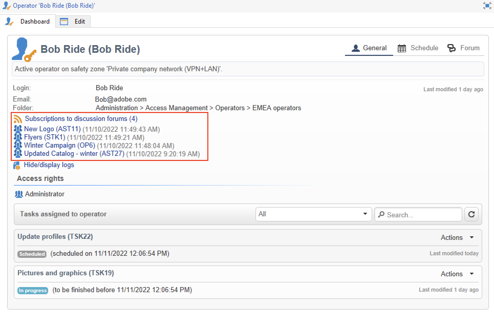

# Diskussionsforum{#discussion-forums}

Operatörer i Adobe Campaign kan använda diskussionsforum för att dela information. Följande element har ett eget forum: planer, program, kampanjer, marknadsföringsresurser, simuleringar, aktier. Varje operator har också ett personligt forum. Alla diskussioner är offentliga, även på personliga forum.

Operatörer kan prenumerera på ett forum och få ett e-postmeddelande varje gång ett meddelande skickas.

## Gå till ett forum {#accessing-a-forum}

Om du vill komma åt ett forum går du till en instrumentpanel och klickar på länken **[!UICONTROL Forum]** i det övre högra hörnet.

Meddelanden och deras svar visas från senaste till äldsta.

Om du vill starta en ny tråd klickar du på knappen **[!UICONTROL Add a discussion]** i det övre högra hörnet. **[!UICONTROL Discussion forum]**-rutan visas (se nedan).

Ange texten i fältet **[!UICONTROL Message]** och en diskussionsrubrik i fältet **[!UICONTROL Subject]**.

Operatörer som redan har publicerat ett meddelande i det här forumet meddelas som standard. Du kan välja ytterligare en operator att meddela. Om du vill meddela flera operatorer väljer du en grupp med operatorer.

Du kan lägga till en bifogad fil i meddelandet med knappen **[!UICONTROL Browse...]**. Den bifogade filen kommer också att inkluderas i e-postmeddelandet. Bifogade filer kan bara skickas individuellt: om du vill skicka flera filer måste du komprimera dem i en ZIP-fil.

>[!CAUTION]
>
>När ett meddelande har skickats till forumet kan det inte längre ändras eller tas bort.

## Publicera på en operatörs personliga forum {#posting-to-the-personal-forum-of-an-operator}

Du kan skicka ett meddelande till en operatörs forum. Personliga forum är offentliga och alla operatorer kan se ditt meddelande. Operatören får ett e-postmeddelande varje gång någon publicerar på sitt personliga forum.

Om du vill komma åt en operatörs forum kan du:

* Bläddra till mappen **[!UICONTROL Administration > Access management > Operators]** i Campaign Explorer, välj den operator som ska öppna kontrollpanelen och klicka sedan på länken **[!UICONTROL Forum]** i det övre högra hörnet.
* Leta reda på namnet på operatorn i Adobe Campaign-användargränssnittet (via ett meddelande som skickats till forumet av den här operatorn, en uppgift som tilldelats dem) och klicka på den för att komma åt kontrollpanelen för operatorer.

## Prenumerera på ett forum {#subscribing-to-a-forum}

Genom att prenumerera på ett forum kan du följa alla diskussioner. När du prenumererar får du ett e-postmeddelande varje gång ett meddelande skickas till forumet.

Om du vill svara på ett meddelande klickar du i e-postmeddelandet och loggar sedan in på Adobe Campaign webbgränssnitt.

* Om du vill prenumerera på ett forum klickar du på knappen **[!UICONTROL Follow discussions]** i det övre högra avsnittet ovanför listan med meddelanden.

  Avsnittet blir blått och visar att du prenumererar på forumet.

* Om du vill avbryta prenumerationen på ett forum klickar du på knappen **[!UICONTROL Unsubscribe]**.

* På din personliga instrumentpanel visas de forum som du prenumererar på. Klicka på länken **[!UICONTROL Subscription to discussion forums]** för att visa listan och klicka sedan på det objekt som är intressant för dig för att komma åt dess forum.

  

## Felsöka meddelandeleverans {#checking-notification-delivery}

Om operatorer som prenumererar på ett forum inte får meddelanden som förväntat:

* Kontrollera att e-postadresser anges i operatörens profiler.
* Bläddra till mappen **[!UICONTROL Administration > Production > Technical workflows > Campaign processes]** i Campaign Explorer och kontrollera att arbetsflödet i **[!UICONTROL Jobs in discussion forums]** har startats utan fel.
* Kontrollera leveransloggarna:

   * På Adobe Campaign hemsida bläddrar du till **[!UICONTROL Campaigns > Navigation > Deliveries]** och öppnar sedan leveransen av **[!UICONTROL Discussion forum notification]**.
   * Bläddra till **[!UICONTROL Administration > Production > Objects created automatically > Technical deliveries > Workflow notifications]** i Campaign Explorer och klicka sedan på **[!UICONTROL Discussion forum notifications]**.

  I rutan **[!UICONTROL Discussion forum notifications]** finns leveransloggarna på fliken **[!UICONTROL Edit > Delivery]**. Du kan även visa flikarna **[!UICONTROL Tracking > Log]** och **[!UICONTROL Exclusion causes]**.
