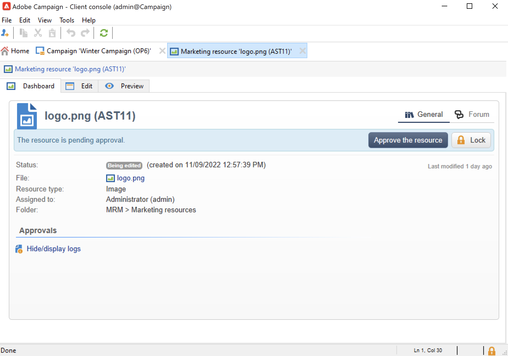
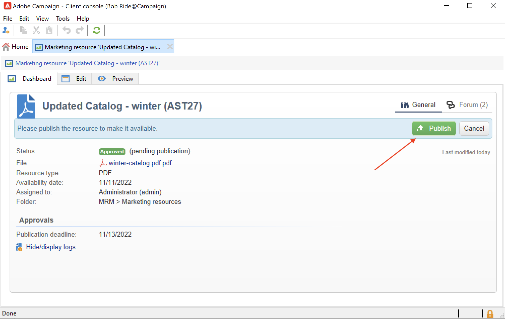

# Hantera marknadsföringsresurser{#managing-marketing-resources}

Använd Adobe Campaign för att hantera och spåra de marknadsföringsresurser som ingår i kampanjens livscykel. Dessa marknadsföringsresurser kan vara ett whitepaper, en datafil, en logotyp eller någon annan resurs som hör till en kampanj.

För varje marknadsföringsresurs som hanteras via Adobe Campaign kan du när som helst spåra status och historik och visa den aktuella versionen.

Som standard lagras marknadsföringsresurser i **[!UICONTROL MRM > Marketing resources]** mapp för Campaign Explorer.

## Lägg till en marknadsföringsresurs {#adding-a-marketing-resource}

Följ stegen nedan för att lägga till en marknadsföringsresurs:

1. Gå till **[!UICONTROL Campaigns]** och markera **[!UICONTROL Marketing resouces]**.

1. Klicka på knappen **[!UICONTROL Create]**.
   
1. Dra och släpp filen i marknadsföringsresursfönstret för att överföra den till Campaign-servern. Du kan också använda **[!UICONTROL Upload file to server...]** länk.
   

När överföringen är klar läggs resursen till i listan över tillgängliga resurser.

## Hantera marknadsföringsresurser {#manage-marketing-resources}

När marknadsföringsresursen har överförts är den tillgänglig för alla Adobe Campaign-operatorer. De kan visa den, göra en kopia för att ändra den eller uppdatera filen på servern.

Använd **[!UICONTROL Assigned to]** nedrullningsbar lista i **[!UICONTROL Edit]** för att välja den operator som är ansvarig för resursen.

Du kan också välja de operatorer eller grupper av operatorer som ansvarar för resursvalidering och resurspublikation. Klicka på  **[!UICONTROL Advanced parameters]** länk.

Operatorerna meddelas via e-post när resursvalideringsprocessen startas.

Om ingen granskare är markerad **[!UICONTROL cannot be]** med reservation för godkännande.

Använd **[!UICONTROL Audit]** för att lägga till en korrekturläsare och definiera ett tillgänglighetsdatum för resursen. Efter detta datum visas den med **[!UICONTROL Late]** status.

>[!NOTE]
>
>The **[!UICONTROL History]** innehåller hämtnings- och uppdateringsloggen för resursen. The **[!UICONTROL Details]** kan du visa den valda versionen.
>
>The **[!UICONTROL Audit]** kan du övervaka åtgärder som utförs på resursen: godkännanden, avslag på ansökningar om godkännande, relaterade kommentarer eller publikationer.

### Låsa/låsa upp en resurs {#locking-unlocking-a-resource}

När resurserna har skapats är de tillgängliga på kontrollpanelen för marknadsföringsresurser och operatorer kan redigera och ändra dem.

När en operator börjar arbeta med en resurs är det bästa sättet att låsa den, så att andra operatorer inte kan ändra den samtidigt. Resursen är sedan reserverad: den är fortfarande tillgänglig, men kan inte publiceras eller uppdateras på servern av en annan operator.

En marknadsföringsresurs kan bara låsas om den inte har godkänts.

Du måste klicka på **[!UICONTROL Lock]** på resurspanelen.

Klicka på knappen **[!UICONTROL Lock]** på resurspanelen för att göra alla operatorer tillgängliga igen.

Ett specialmeddelande meddelar alla operatorer som försöker få åtkomst till det:

The **[!UICONTROL Tracking]** -fliken anger namnet på den operator som låste resursen.

>[!NOTE]
>
>Endast operatorn som låste resursen och operatorer med administratörsbehörighet har behörighet att låsa upp en resurs.

### Diskussionsforum {#discussion-forums}

För varje resurs är **[!UICONTROL Forum]** -fliken kan deltagare dela information.

Läs mer i [Diskussionsforum](discussion-forums.md) -avsnitt.

### Godkännandeprocess {#approval-process}

Det förväntade tillgänglighetsdatumet visas i resursinformationen, om det har angetts i **[!UICONTROL Tracking]** -fliken. När detta datum har nåtts kan du genomföra godkännandeprocessen med hjälp av **[!UICONTROL Submit for approval]** på resurspanelen. Resursstatusen ändras sedan till **[!UICONTROL Approval in progress]**.

Klicka på knappen **[!UICONTROL Approve the resource]** på kontrollpanelen.

Auktoriserade operatorer kan sedan godkänna eller avvisa godkännande. Den här åtgärden är möjlig antingen via e-postmeddelandet som skickas (genom att klicka på länken i meddelandet) eller via klientkonsolen (genom att klicka på **[!UICONTROL Approve]** ).

I godkännandefönstret kan du ange en kommentar.

Gå till **[!UICONTROL Tracking]** för att kontrollera godkännanden.

>[!NOTE]
>
>Förutom den granskare som har angetts för varje marknadsföringsresurs har operatorer med administratörsrättigheter och resurshanteraren behörighet att godkänna en marknadsföringsresurs.

### Publicera en resurs {#publishing-a-resource}

Marknadsföringsresursen måste publiceras när den har godkänts. Publiceringsprocessen måste genomföras i enlighet med företagets krav. Detta innebär att resurser kan publiceras på ett extranät eller på en annan server, specifik information kan skickas till en extern tjänsteleverantör osv.

Klicka på **[!UICONTROL Publish]** i redigeringszonen på kontrollpanelen för marknadsföringsresurser.

Du kan också automatisera publiceringen av en resurs via ett arbetsflöde.

Att publicera en resurs innebär att göra den tillgänglig för användning (till exempel för en annan uppgift). Publikationen varierar beroende på vilken typ av resurs du har: för ett flygblad kan publicering innebära att du skickar filen till en skrivare, för en webbbyrå kan det betyda att du publicerar den på en webbplats osv.

För att Adobe Campaign ska kunna publicera måste du skapa ett lämpligt arbetsflöde och länka det till resursen. Öppna **[!UICONTROL Advanced settings...]** resursens ruta och välj sedan önskat arbetsflöde i **[!UICONTROL Post-processing]** fält.

Arbetsflödet körs:

* När granskaren klickar på **[!UICONTROL Publish resource]** länk (eller, om ingen granskare har definierats, den person som ansvarar för resursen).
* Om resursen hanteras via en marknadsföringsresursuppgift körs den när aktiviteten är inställd på **[!UICONTROL Finished]**, förutsatt att **[!UICONTROL Publish the marketing resource]** är markerad i uppgiften. [Läs mer](creating-and-managing-tasks.md#marketing-resource-creation-task))

Om ett arbetsflöde inte startas omedelbart (om arbetsflödet till exempel stoppas) ändras resursens status till **[!UICONTROL Pending publication]**. När arbetsflödet har startats ändras resursens status till **[!UICONTROL Published]**. Denna status tar inte hänsyn till eventuella fel i publiceringsprocessen. Kontrollera arbetsflödets status för att kontrollera att det har körts korrekt.

## Länka en resurs till en kampanj {#linking-a-resource-to-a-campaign}

### Referera en marknadsföringsresurs {#referencing-a-marketing-resource}

Marknadsföringsresurser kan associeras med kampanjer, förutsatt att den här funktionen har valts i [kampanjmall](../campaigns/marketing-campaign-templates.md).

Gå till **[!UICONTROL Edit > Documents > Resources]** i kampanjkontrollpanelen klickar du på **[!UICONTROL Add]** för att välja den berörda resursen.

Du kan filtrera resurser efter status, typ eller typ, eller använda ett anpassat filter.

Använd **[!UICONTROL Details]** för att redigera och förhandsgranska resursen.

### Lägg till en marknadsföringsresurs i en leveransdisposition {#adding-a-marketing-resource-to-a-delivery-outline}

Marknadsföringsresurser kan associeras med leveranser via leveranskonturer.

Läs mer om leveransdispositioner i [det här avsnittet](../campaigns/marketing-campaign-deliveries.md).

Om du vill göra det högerklickar du på en disposition och väljer **Nytt > Resurs**.

Ange namnet på resursen och välj den i dialogrutan **Marknadsföringsresurs** listruta.

## Stock-hantering {#stock-management}

Du kan associera en marknadsföringsresurs med en eller flera lager för att hantera dina leveranser och visa en varning på instrumentpanelen om det inte finns tillräckligt med lager.

Följ stegen nedan för att associera en marknadsföringsresurs med en aktie:

1. Redigera en aktie eller skapa en ny aktie. Läs mer om stockar i [det här avsnittet](../campaigns/providers-stocks-and-budgets.md#stock-management).

1. Lägg till en aktierad och välj motsvarande marknadsföringsresurs.

   

   Du kan redigera den valda resursen via **[!UICONTROL Edit the link]** -ikonen till höger om resursen när den har valts.

1. Ange det ursprungliga lagret och larmlagret och spara sedan.

Lagret anges i marknadsföringsresursen **Lager** -fliken.
