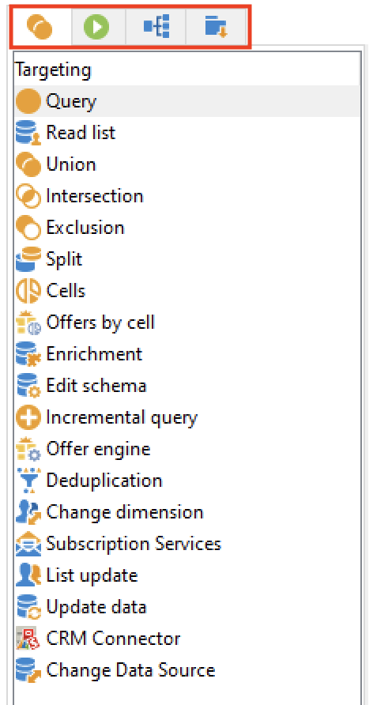

# Arbetsflödesaktiviteter{#wf-activities}

Arbetsflödesaktiviteter grupperas efter kategori på fyra olika flikar.

Beroende på dina behörigheter, implementeringen och i vilket sammanhang arbetsflödet är utformat kan tillgängliga aktiviteter variera.

Arbetsflödena som skapas i en kampanj har till exempel en specifik **Leveranser** med alla kanaler. Fliken är inte tillgänglig i [tekniskt arbetsflöde](technical-workflows.md).

Tekniska arbetsflöden har en specifik **Händelser** som inte är tillgänglig i [kampanjarbetsflöden](campaign-workflows.md).

Alla aktiviteter beskrivs i avsnitten nedan:

* [Målinriktade aktiviteter](targeting-activities.md)
* [Flödeskontrollaktiviteter](flow-control-activities.md)
* [Verksamheter](action-activities.md)
* [Händelseaktiviteter](event-activities.md)
* [Specifika aktiviteter för kampanjarbetsflöde](../campaigns/marketing-campaign-deliveries.md)
