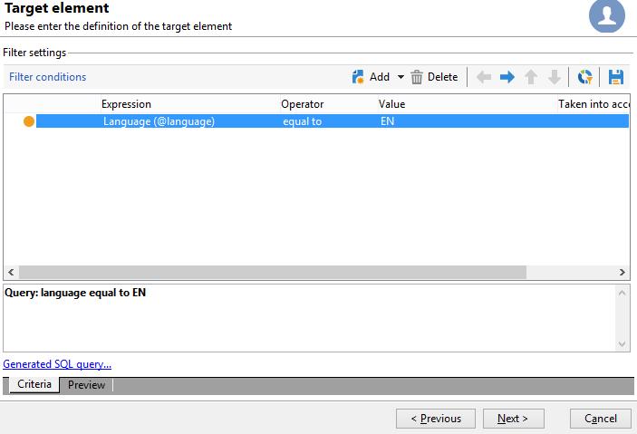
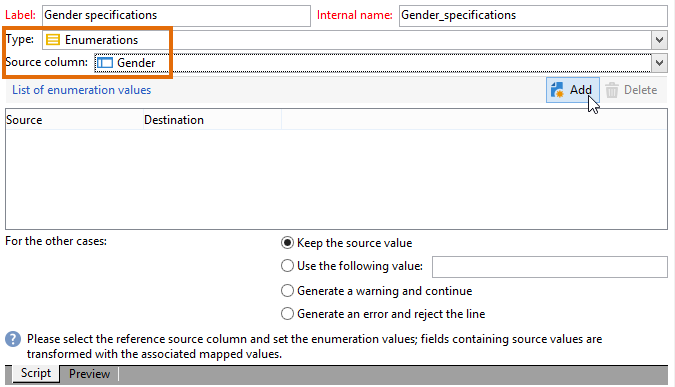
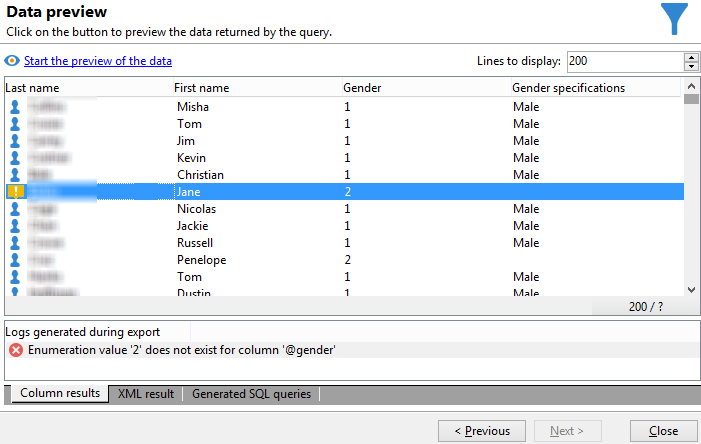

# Lägg till ett beräkningsfält av uppräkningstyp {#adding-an-enumeration-type-calculated-field}

Här vill vi skapa en fråga av typen **[!UICONTROL Enumerations]**. Det här fältet genererar ytterligare en kolumn i förhandsgranskningsfönstret. Den här kolumnen anger de numeriska värden som returneras som resultat för varje mottagare (0, 1 och 2). Ett kön tilldelas varje värde i den nya kolumnen: &quot;Man&quot; för &quot;1&quot;, &quot;Kvinna&quot; för &quot;2&quot; eller &quot;Inte angivet&quot; om värdet är lika med &quot;0&quot;.

* Vilken tabell måste markeras?

  mottagartabellen (nms:mottagare)

* Fält som ska markeras i utdatakolumnen?

  Efternamn, förnamn, kön

* Vilka villkor som informationen ska filtreras baserat på?

  Mottagarspråket

Använd följande steg:

1. Öppna den allmänna frågeredigeraren och markera mottagartabellen (**[!UICONTROL nms:recipient]**).
1. I fönstret **[!UICONTROL Data to extract]** väljer du **[!UICONTROL Last name]**, **[!UICONTROL First name]** och **[!UICONTROL Gender]**.

   

1. Klicka på **[!UICONTROL Next]** i fönstret **[!UICONTROL Sorting]**: ingen sortering behövs för det här exemplet.
1. I **[!UICONTROL Data filtering]** väljer du **[!UICONTROL Filtering conditions]**.
1. I fönstret **[!UICONTROL Target element]** anger du ett filtervillkor för att samla in mottagare som talar engelska.

   

1. Klicka på **[!UICONTROL Add a calculated field]** i fönstret **[!UICONTROL Data formatting]**.

   

1. Gå till fönstret **[!UICONTROL Type]** i fönstret **[!UICONTROL Export calculated field definition]** och välj **[!UICONTROL Enumerations]**.

   Definiera den kolumn som det nya beräkningsfältet ska referera till. Det gör du genom att markera kolumnen **[!UICONTROL Gender]** i den nedrullningsbara menyn i fältet **[!UICONTROL Source column]**: målvärdena sammanfaller med kolumnen **[!UICONTROL Gender]**.

   

   Definiera värdena för **Source** och **Mål**: Målvärdet gör frågeresultatet lättare att läsa. Frågan ska returnera mottagarens kön och resultatet blir antingen 0, 1 eller 2.

   För varje &quot;source-destination&quot;-rad som ska anges klickar du på **[!UICONTROL Add]** i **[!UICONTROL List of enumeration values]**:

   * I kolumnen **[!UICONTROL Source]** anger du källvärdet för varje kön (0,1,2) på en ny rad.
   * I kolumnen **[!UICONTROL Destination]** anger du värdena: &quot;Inte angivet&quot; för rad &quot;0&quot;, &quot;Man&quot; för rad &quot;1&quot; och &quot;Kvinna&quot; för rad &quot;2&quot;.

   Välj funktionen **[!UICONTROL Keep the source value]**.

   Klicka på **[!UICONTROL OK]** för att godkänna det beräknade fältet.

   

1. Klicka på **[!UICONTROL Next]** i fönstret **[!UICONTROL Data formatting]**.
1. **[!UICONTROL start the preview of the data]** i förhandsgranskningsfönstret.

   Den extra kolumnen definierar kön för 0, 1 och 2:

   * 0 för &quot;Ej angivet&quot;
   * 1 för &quot;Male&quot;
   * 2 för &quot;Kvinna&quot;

   

   Om du t.ex. inte anger kön &quot;2&quot; i **[!UICONTROL List of enumeration values]** och funktionen **[!UICONTROL Generate a warning and continue]** i fältet **[!UICONTROL In other cases]** är markerad får du en varningslogg. Den här loggen anger att kön &quot;2&quot; (kvinna) inte har angetts. Den visas i fältet **[!UICONTROL Logs generated during export]** i förhandsgranskningsfönstret för data.

   

   Låt oss ta ett exempel till och säga att uppräkningsvärdet &quot;2&quot; inte anges. Välj funktionen **[!UICONTROL Generate an error and reject the line]**: alla mottagare av kön (2) genererar avvikelser och annan information på raden (för- och efternamn, osv.) exporteras inte. En fellogg visas i fältet **[!UICONTROL Logs generated during export]** i förhandsgranskningsfönstret för data. Den här loggen anger att uppräkningsvärdet &quot;2&quot; inte har angetts.

   
