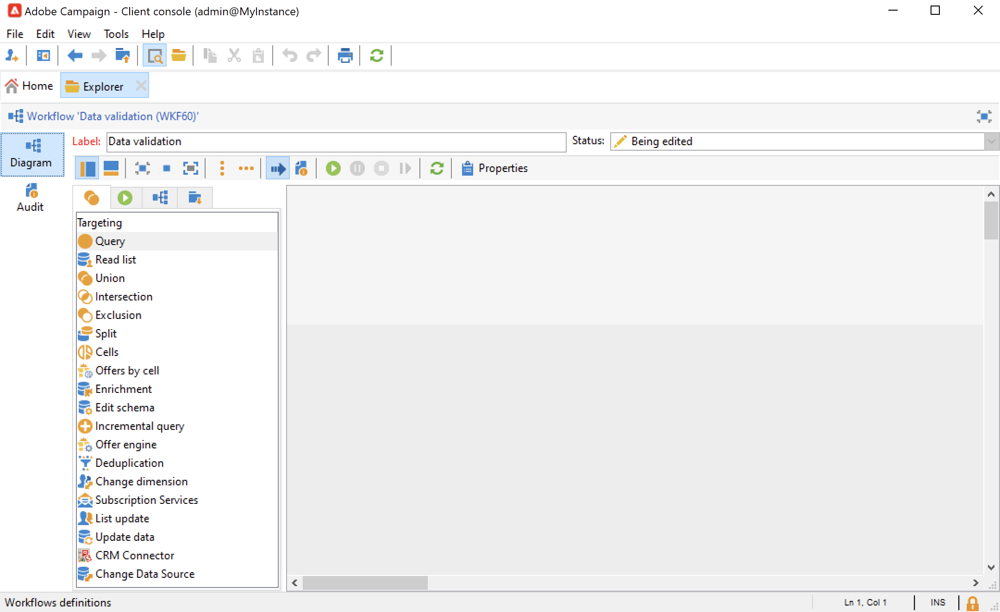

# Bygg ett arbetsflöde {#build-a-workflow}

## Skapa ett nytt arbetsflöde {#create-a-new-workflow}

Arbetsflödets arbetsflöde beror på typen av arbetsflöden. Du kan:

* Skapa [målarbetsflöden](#targeting-workflows) från noden **[!UICONTROL Profiles and Targets]** > **[!UICONTROL Jobs]** > **[!UICONTROL Targeting workflows]** i Utforskaren eller från fliken **[!UICONTROL Profiles and Targets]** på startsidan via underfliken **[!UICONTROL Targeting workflows]**.

  

* Skapa [kampanjarbetsflöden](#campaign-workflows) från fliken **[!UICONTROL Targeting and workflows]** i en kampanj

* Skapa [tekniska arbetsflöden](#technical-workflows) från noden **[!UICONTROL Administration]** > **[!UICONTROL Production]** > **[!UICONTROL Technical workflows]** i Utforskaren. Det bästa sättet är att skapa en specifik arbetsflödesmapp för att spara dina tekniska arbetsflöden.

Klicka på knappen **[!UICONTROL New]** ovanför listan med arbetsflöden.

Ange en etikett och klicka på **[!UICONTROL Save]**.

## Lägg till och länka aktiviteter {#add-and-link-activities}

Du måste nu definiera de olika aktiviteterna och länka samman dem i diagrammet. I det här skedet av konfigurationen kan vi se diagrametiketten och arbetsflödesstatusen (Redigering pågår). Fönstrets nedre del används endast för att redigera diagrammet. Den innehåller ett verktygsfält, en palett med aktiviteter (till vänster) och själva diagrammet (till höger).

>[!NOTE]
>
>Om paletten inte visas klickar du på den första knappen i arbetsflödesverktygsfältet för att visa den.

Aktiviteter grupperas efter kategori på palettens olika flikar. Tillgängliga flikar och aktiviteter kan variera beroende på arbetsflödestyp (teknik, målgruppsanpassning eller kampanjarbetsflöde).

* Den första fliken innehåller målgrupps- och datahanteringsaktiviteter. Dessa aktiviteter beskrivs i [Målaktiviteter](targeting-activities.md).
* På den andra fliken finns schemaläggningsaktiviteter, som huvudsakligen används för att samordna andra aktiviteter. De här aktiviteterna beskrivs i [Flödeskontrollaktiviteter](flow-control-activities.md).
* Den tredje fliken innehåller verktyg och åtgärder som kan användas i arbetsflödet. De här aktiviteterna beskrivs i [Åtgärdsaktiviteter](action-activities.md).
* Den fjärde fliken innehåller aktiviteter som är beroende av en viss händelse, till exempel att ett e-postmeddelande tas emot eller att en fil tas emot på en server. De här aktiviteterna beskrivs i [Händelseaktiviteter](event-activities.md).

Skapa diagrammet

1. Lägg till en aktivitet genom att markera den på paletten och flytta den till diagrammet med dra-och-släpp-funktionen.

   Lägg till en **Start**-aktivitet och sedan en **Delivery**-aktivitet i diagrammet.

   

1. Länka samman aktiviteterna genom att dra aktivitetsövergången **Start** och släppa den på aktiviteten **Leverans**.

   

   Du kan automatiskt länka en aktivitet till den föregående genom att placera den nya aktiviteten i slutet av övergången.

1. Lägg till de aktiviteter du behöver och länka ihop dem enligt bilden nedan.

   

>[!CAUTION]
>
>Du kan kopiera och klistra in aktiviteter i samma arbetsflöde. Vi rekommenderar dock inte att du kopierar inklistringsaktiviteter i olika arbetsflöden. Vissa inställningar som är kopplade till aktiviteter som Leveranser och Schemaläggare kan leda till konflikter och fel när målarbetsflödet körs. Vi rekommenderar i stället att du **duplicerar** arbetsflöden. Mer information finns i [Duplicera arbetsflöden](#duplicate-workflows).

Du kan ändra visning och layout för diagrammet med följande element:

* **Använd verktygsfältet**

  Verktygsfältet för diagramredigering ger dig tillgång till arbetsflödets layout- och körningsfunktioner.

  

  På så sätt kan du anpassa layouten för redigeringsverktyget: hur paletten visas och översikten, storleken och justeringen av grafiska objekt.

  

  Ikoner för förlopp och visning av loggar beskrivs i följande avsnitt:

   * [Visningsförlopp](monitor-workflow-execution.md#displaying-progress)
   * [Visningsloggar](monitor-workflow-execution.md#displaying-logs)

* **Objektjustering**

  Om du vill justera ikoner markerar du dem och klickar på ikonen **[!UICONTROL Align vertically]** eller **[!UICONTROL Align horizontally]** .

  Använd nyckeln **CTRL** för att markera flera spridda aktiviteter eller för att avmarkera en eller flera aktiviteter. Klicka på diagrambakgrunden för att avmarkera allt.

* **Bildhantering**

  Du kan anpassa bakgrundsbilden för diagrammet samt de som hör till de olika aktiviteterna. Se [Ändra aktivitetsbilder](change-activity-images.md).

## Konfigurera aktiviteter {#configure-activities}

Dubbelklicka på en aktivitet för att konfigurera den eller högerklicka och välj **[!UICONTROL Open...]**.

>[!NOTE]
>
>Kampanjarbetsflödesaktiviteter beskrivs i [det här avsnittet](activities.md).

Den första fliken innehåller den grundläggande konfigurationen. Fliken **[!UICONTROL Advanced]** innehåller ytterligare parametrar, som används särskilt för att definiera beteenden när ett fel påträffas, ange körningstid för en aktivitet och för att ange ett initieringsskript.

Om du vill få en bättre förståelse för aktiviteterna och för att arbetsflödet ska bli mer lättläst kan du skriva kommentarer i aktiviteterna.

Dessa kommentarer visas automatiskt när operatorer rullar över aktiviteten.

## Arbetsflödesmallar {#workflow-templates}

Arbetsflödesmallar innehåller den övergripande konfigurationen av egenskaper och eventuellt ett antal aktiviteter som sammanfogats i ett diagram. Den här konfigurationen kan återanvändas för att skapa nya arbetsflöden som innehåller ett visst antal förkonfigurerade element

Du kan skapa nya arbetsflödesmallar som baseras på befintliga mallar eller ändra ett arbetsflöde direkt till en mall.

Arbetsflödesmallar lagras i noden **[!UICONTROL Resources > Templates > Workflow templates]** i Utforskaren.

Förutom de vanliga arbetsflödesegenskaperna kan du med mallegenskaperna ange körningsfilen för arbetsflöden som skapas baserat på den här mallen.

## Duplicera arbetsflöden {#duplicate-workflows}

Du kan duplicera olika typer av arbetsflöden. När du har duplicerat arbetsflödet överförs inte ändringarna till kopian av arbetsflödet.

Adobe rekommenderar att du duplicerar ett arbetsflöde i stället för att utföra en kopiera/klistra in av aktiviteter. När en aktivitet kopieras behålls alla dess inställningar. För kanalaktiviteter kopieras även det leveransobjekt som är kopplat till aktiviteten, vilket kan leda till större problem.

1. Högerklicka på ett arbetsflöde.
1. Klicka på **Duplicera**.

   

1. Ändra arbetsflödesetiketten i arbetsflödesfönstret.
1. Klicka på **Spara**.

