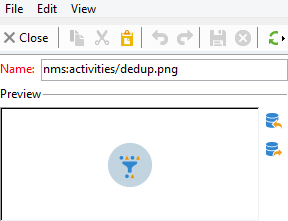

# Ändra aktivitetsbilder{#change-activity-images}

De bilder som används i diagrammen för de olika arbetsflödena kan ändras. De måste dock uppfylla vissa krav. Här är genomförandefaserna:

* Om du vill ändra bakgrundsbilden väljer du önskat målarbetsflöde och klickar sedan på **[!UICONTROL Properties]** -fliken.

   

   Om du vill välja vilken bild som ska användas klickar du på **[!UICONTROL Select link]** ikonen till höger om **[!UICONTROL Background image]** fält.

   >[!NOTE]
   >
   >Bredden i pixlar för bakgrundsbilden måste vara en multipel av 4.

   

   The **[!UICONTROL Edit link]** kan du visa den markerade bilden.

* Om du vill ändra bilden som är associerad med en aktivitet dubbelklickar du på objektet och klickar sedan på **[!UICONTROL Advanced]** -fliken.

   Om du vill välja vilken bild som ska användas klickar du på **[!UICONTROL Select link]** ikonen till höger om **[!UICONTROL Image]** fält.

   

   The **[!UICONTROL Edit link]** kan du visa den markerade bilden.

   

>[!NOTE]
>
>Bilderna som har sparats i **[!UICONTROL Administration > Configuration > Images]** trädnoden är tillgänglig för markering.
>  
>Bilderna måste vara i PNG-format med 48 x 48 pixlar, 16 miljoner färger och en genomskinlig bakgrund.
