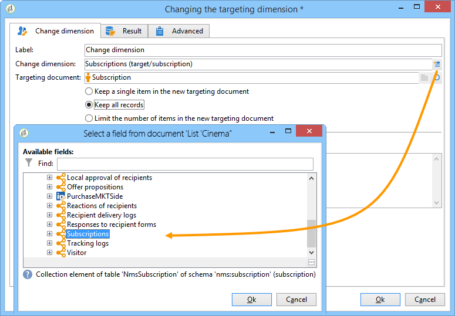

# Ändra dimension{#change-dimension}

Använd **[!UICONTROL Change dimension]** för att ändra målinriktningsdimensionen när ni skapar en målgrupp. Den här aktiviteten flyttar axeln beroende på datamallen och indatatypen. Du kan till exempel växla från dimensionen &quot;kontrakt&quot; till dimensionen &quot;kunder&quot;.

Du kan också använda den här aktiviteten för att definiera ytterligare kolumner för det nya målet och definiera villkor för datadeduplicering.

>[!IMPORTANT]
>
>Observera att **[!UICONTROL Change Dimension]** och **[!UICONTROL Change Data source]** aktiviteter ska inte läggas till på en rad. Om du behöver använda båda aktiviteterna i följd måste du inkludera en **[!UICONTROOL Berikning]** mellan dem. Detta garanterar att programmet körs på rätt sätt och förhindrar eventuella konflikter och fel.

Konfigurera **[!UICONTROL Change dimension]** ska du utföra följande steg:

1. Välj den nya måldimensionen via **[!UICONTROL Change dimension]** fält.

   

1. Vid dimensionsändring kan du behålla alla element eller välja de som ska bevaras i utdata. I följande exempel är max. antalet dubbletter anges till 2.

   

   När du väljer att bara behålla en post visas en samling i arbetsschemat: Den här samlingen representerar alla poster som inte kommer att ingå i slutresultatet (eftersom endast en post behålls). I likhet med alla andra samlingar kan du med den här metoden beräkna aggregeringar eller återställa information i kolumner.

   Om du till exempel ändrar **[!UICONTROL Customers]** dimension till **[!UICONTROL Recipients]** är det möjligt att rikta in sig på kunder i en viss butik samtidigt som man lägger till antalet inköp.

1. Om du väljer att inte behålla all den här informationen kan du konfigurera det duplicerade hanteringsläget.

   

   Med de blå pilarna kan du definiera den duplicerade bearbetningsprioriteten.

   I exemplet ovan dedupliceras mottagarna först till sin e-postadress och sedan till sitt kontonummer om det behövs.

1. The **[!UICONTROL Result]** kan du lägga till ytterligare information.

   Du kan till exempel återställa regionen baserat på postnumret genom att använda en **Delsträng** type-funktion. Så här gör du:

   * Klicka på **[!UICONTROL Add data...]** länka och markera **[!UICONTROL Data linked to the filtering dimension]**.

     

     >[!NOTE]
     >
     >Mer information om hur du skapar och hanterar ytterligare kolumner finns i [Lägg till data](query.md#add-data).

   * Markera föregående måldimension (före axelväxling) och välj **[!UICONTROL Zip Code]** i mottagarens **[!UICONTROL Location]** underträd, klicka sedan på **[!UICONTROL Edit expression]**.

     

   * Klicka **[!UICONTROL Advanced selection]** och välja **[!UICONTROL Edit the formula using an expression]**.

     

   * Använd funktionerna i listan och ange vilken beräkning som ska utföras.

     

   * Ange slutligen etiketten för den kolumn som du just har skapat.

     

1. Kör arbetsflödet för att visa resultatet av den här konfigurationen. Jämför data i tabellerna före och efter ändringsdimensionsaktiviteten och jämför arbetsflödestabellernas struktur, vilket visas i följande exempel:

   

   
