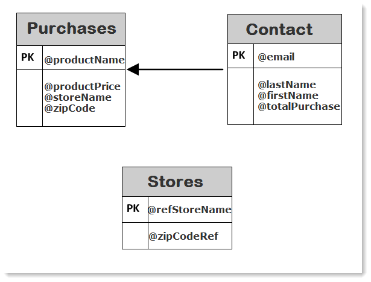

# Skapa en sammanfattningslista{#creating-a-summary-list}

I det här exemplet beskrivs hur du skapar ett arbetsflöde som du kan skapa en sammanfattningslista genom att samla in filer och följa flera förbättringar. Exemplet är baserat på en lista med kontakter som har köpt i en butik.


Följande datastruktur används:



Syftet är att

* Använda de olika alternativen för anrikningsaktiviteten
* Uppdatera data i databasen efter en avstämning
* Så här skapar du en global&quot;vy&quot; av data som berikats

Om du vill skapa en sammanfattningslista måste du följa dessa steg:

1. Samla in och läsa in en inköpsfil i arbetsflödets arbetsregister
1. Förbättra importerade data genom att skapa en länk till en referenstabell
1. Uppdaterar tabellen&quot;Inköp&quot; med data som berikats
1. Förbättra&quot;Kontaktdata&quot; med en sammanställd beräkning från tabellen&quot;Inköp&quot;
1. Skapa en sammanfattningslista

## Steg 1: Läs in filen och stämma av importerade data {#step-1--loading-the-file-and-reconciling-the-imported-data}

De data som ska läsas in är&quot;Inköpsrelaterade&quot; data i följande format:

```
Product Name;Product price;Store
Computer;2000;London 3
Tablet;600;Cambridge
Computer;2000;London 5
Computer;2000;London 8
Tablet;600;Cambridge
Phone;500;London 5
```

Dessa data finns i textfilen&quot;Purchases.txt&quot;.

1. Lägg till **Filinsamlare** och **Inläsning av data (fil)** aktiviteter i arbetsflödet.

   The **Filinsamlare** gör att du kan samla in och skicka filer från och till Adobe Campaign-servern.

   The **Inläsning av data (fil)** kan du förbättra arbetsflödets arbetstabell med insamlade data.

   Mer information om den här aktiviteten finns i .

1. Konfigurera **Filinsamlare** aktivitet för att samla in text (&#42;.txt)-typfiler från den valda katalogen.

   

   The **Filinsamlare** kan du hantera frånvaron av en fil i källkatalogen. Om du vill göra det går du till **[!UICONTROL Process file nonexistence]** alternativ. I det här arbetsflödet **Vänta** aktiviteten har lagts till för att försöka med en annan filsamling om den saknas i katalogen vid tidpunkten för samlingen.

1. Konfigurera **Inläsning av data (fil)** med en exempelfil med samma format som de data som ska importeras.

   

   Klicka på **[!UICONTROL Click here to change the file format...]** om du vill byta namn på kolumnerna med hjälp av de interna namnen och etiketterna i tabellen&quot;Inköp&quot;.

   

När data har importerats utförs en anrikning genom att en länk skapas till en referenstabell som matchar schemat&quot;Lagrar&quot;.

Lägg till anrikningsaktiviteten och konfigurera den enligt följande:

1. Välj huvuduppsättningen med data från **Inläsning av data (fil)** aktivitet.

   

1. Klicka **[!UICONTROL Add data]** väljer du **[!UICONTROL A link]** alternativ.

   

1. Välj **[!UICONTROL Define a collection]** alternativ.
1. Välj schemat&quot;Lagrar&quot; som mål.

   

Mer information om olika typer av länkar finns i [Förbättra och ändra data](targeting-workflows.md#enrich-and-modify-data).

I följande fönster måste du skapa ett kopplingsvillkor genom att välja källfältet (i huvuduppsättningen) och målfältet (som tillhör schemat &quot;Stores&quot;) för att konfigurera datavstämningen.


Nu när länken har skapats ska vi lägga till en kolumn i arbetsflödets arbetstabell från schemat &quot;Stores&quot;: fältet&quot;ZipCode Reference&quot;.

1. Öppna anrikningsaktiviteten.
1. Klicka på **[!UICONTROL Edit additional data]**.
1. Lägg till fältet&quot;ZipCode Reference&quot; i dialogrutan **[!UICONTROL Output columns]**.


Informationen i arbetsflödets arbetsregister efter denna berikning är följande:


## Steg 2: Skriv data i registret &#39;Inköp&#39; {#step-2--writing-enriched-data-to-the--purchases--table}

I det här steget beskrivs hur du skriver importerade och berikade data till tabellen&quot;Inköp&quot;. För att göra detta måste vi använda en **Uppdatera data** aktivitet.

En avstämning mellan data i arbetsflödets arbetsregister och **Inköp** målinriktningsdimensionen måste utföras innan data i **Inköp** tabellen uppdateras.

1. Klicka på **[!UICONTROL Reconciliation]** fliken för anrikningsaktiviteten.
1. Välj måldimensionen, inköpsschemat i det här fallet.
1. Välj ett källuttryck för data i arbetsflödestabellen (fältet&quot;storeName&quot; i det här fallet).
1. Välj ett måluttryck för data i tabellen&quot;Inköp&quot; (&quot;lagenamn&quot; i det här fallet).
1. Markera alternativet **[!UICONTROL Keep unreconciled data coming from the work table]**.


I **Uppdatera data** aktivitet, följande konfiguration krävs:

1. Välj **[!UICONTROL Insert or update]** i **[!UICONTROL Operation type]** för att undvika att skapa nya poster varje gång filen samlas in.
1. Välj **[!UICONTROL By directly using the targeting dimension]** värdet för **[!UICONTROL Record identification]** alternativ.
1. Välj schemat&quot;Inköp&quot; som en **[!UICONTROL Document type]**.
1. Ange listan med fält som ska uppdateras. The **[!UICONTROL Destination]** -kolumnen kan du definiera fälten i inköpsschemat. The **[!UICONTROL Expression]** Med -kolumnen kan du markera de fält i arbetstabellen som ska utföra en mappning.
1. Klicka på **[!UICONTROL Generate an outbound transition]** alternativ.


## Steg 3: Berika kontaktdata {#step-3--enriching--contact--data-}

Schemat&quot;Kontakter&quot; är fysiskt länkat till schemat&quot;Inköp&quot;. Det innebär att du kan använda ett annat alternativ för alternativet &quot;Anrikning&quot;: lägga till data som är länkade till filtreringsdimensionen.

Syftet med den andra anrikningen är att skapa en sammanställning av inköpsschemat för att beräkna det totala antalet inköp för varje identifierad kontakt.

1. Lägg till en **fråga** typaktivitet som gör att du kan återställa alla **Kontakter** lagrad.
1. Lägg till en **Berikning** väljer sedan huvuduppsättningen som är resultatet av föregående fråga.
1. Klicka på Lägg till **[!UICONTROL Data]**.
1. Klicka på **[!UICONTROL Data linked to the targeting dimension]** alternativ.
1. Klicka på **[!UICONTROL Data linked to the filtering dimension]** i **[!UICONTROL Select fields to add]** -fönstret.
1. Välj **[!UICONTROL Purchases]** nod och klicka sedan på **[!UICONTROL Next]**.

   

1. Ändra **[!UICONTROL Collected data]** fältet genom att markera **[!UICONTROL Aggregates]** alternativ.

   

1. Klicka på **[!UICONTROL Next]**.
1. Lägg till följande uttryck för att beräkna inköpsvolymen för varje kontakt: &quot;Sum(@prodprice)&quot;.

   

Om du vill förbereda sammanfattningslistan måste du lägga till fält från fälten&quot;Inköp&quot; och från den första berikningen: fältet&quot;ZipCode Reference&quot;.

1. Klicka på **[!UICONTROL Edit additional data...]** länk till anrikningsverksamheten.
1. Lägg till fälten&quot;Butiksnamn&quot; och&quot;Inköp/Postnummerreferens&quot;.

   

1. Klicka på **[!UICONTROL Properties]** -fliken.
1. Ändra den andra länken så att bara en rad skapas.

## Steg 4: Skapa och lägga till i en sammanfattningslista {#step-4--creating-and-adding-to-a-summary-list}

Det sista steget är att skriva alla data som berikats till en lista.

1. Lägg till en **Listuppdatering** till arbetsflödet. Denna verksamhet måste vara kopplad till den utgående övergången för den andra anrikningsaktiviteten.
1. Välj **[!UICONTROL Create the list if necessary (Calculated name)]** alternativ.
1. Välj ett värde för det beräknade namnet. Etiketten som väljs för listan är dagens datum: &lt;%= formatDate(new Date(), &quot;%2D/%2M/%2Y&quot;) %>.

När arbetsflödet är klart kommer listan att innehålla:

* en förteckning över kontakter,
* a &quot;Total purchasing&quot; column,
* en&quot;Store name&quot;-kolumn,
* en kolumn av typen&quot;Postnr&quot; angiven för alla butiker som finns i butiksreferensschemat.


