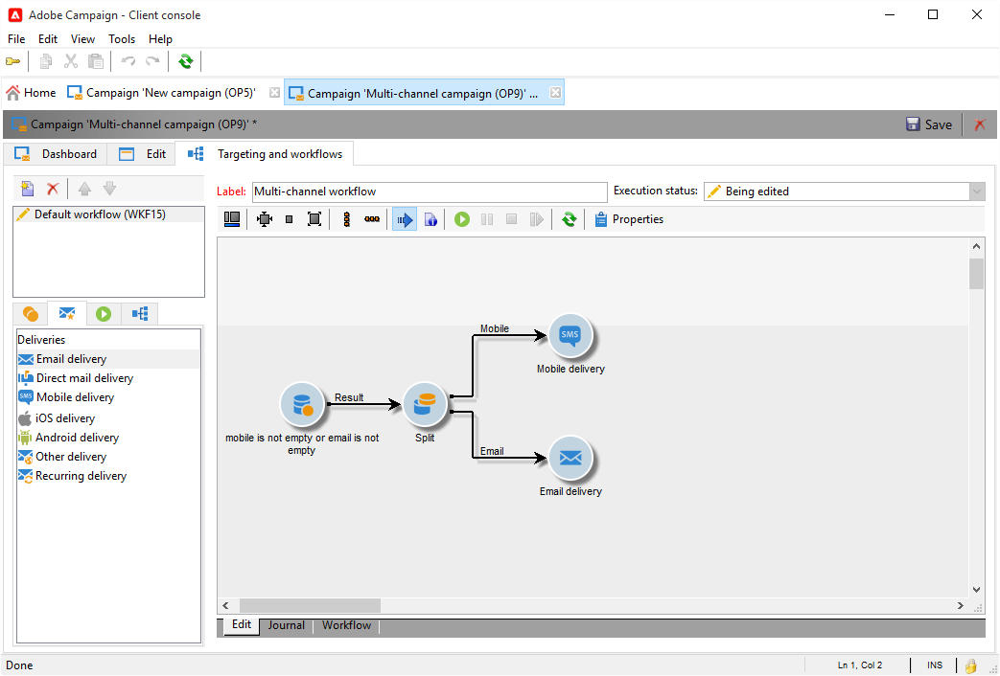

# Leveranser över flera kanaler{#cross-channel-deliveries}

Flerkanalsleveranser är tillgängliga på fliken **[!UICONTROL Deliveries]** för [kampanjarbetsflöden](campaign-workflows.md).

Välj den mall som du vill basera leveransen på och definiera dess innehåll.

Du kan ange ett mål för leveransen uppströms arbetsflödet med hjälp av olika målinriktningsaktiviteter.

I exemplet nedan kan du lära dig hur du skapar ett arbetsflöde för att skicka ett e-postmeddelande eller ett SMS för prenumeranter på push-meddelanden, och sedan ett push-meddelande en vecka senare. Så här gör du:

1. Skapa en kampanj.
1. Lägg till en **[!UICONTROL Query]**-aktivitet på fliken **[!UICONTROL Targeting and workflows]** i kampanjen.
1. Konfigurera frågan: välj de mottagare som prenumererar på push-meddelanden som måldimension.

   >[!NOTE]
   >
   >Använd måldimensionen för **prenumerantprogram** för push-meddelanden.

   

1. Lägg till filtervillkoren i frågan. I det här fallet väljer vi mottagare som har ett mobilnummer eller en e-postadress.

   

1. Lägg till en **[!UICONTROL Split]**-aktivitet i arbetsflödet för att dela upp mottagare som har ett mobilnummer och de som har en e-postadress.
1. Välj en leverans för varje mål på fliken **[!UICONTROL Delivery]**.

   Skapa leveransen på samma sätt som med en klassisk leveransguide genom att dubbelklicka på leveransaktiviteten i arbetsflödet.

   

1. Lägg till och konfigurera en **[!UICONTROL Wait]**-aktivitet för att mottagarna inte ska få för många leveranser samtidigt.
1. Lägg till en **[!UICONTROL Split]**-aktivitet för att dela upp prenumeranter på ett iOS- eller Android-mobilprogram.

   Välj en tjänst för vart och ett av operativsystemen.

   

1. Välj och konfigurera en leverans av mobilapplikationer för vart och ett av operativsystemen.

   
