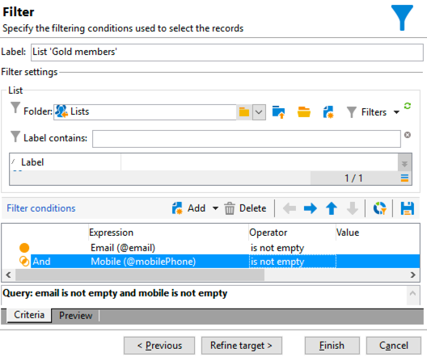

# Arbetsflöde för leveranser över flera kanaler{#cross-channel-delivery-workflow}

I det här användningsexemplet visas ett exempel med ett arbetsflöde för flerkanalsleverans. Det allmänna konceptet med flerkanalsleveranser presenteras i [det här avsnittet](cross-channel-deliveries.md).

Målet är att segmentera en målgrupp från mottagarna av databasen i olika grupper i syfte att skicka ett e-postmeddelande till en grupp och ett SMS-meddelande till en annan grupp.

De huvudsakliga implementeringsstegen för det här fallet är följande:

1. Skapa en **[!UICONTROL Query]** målgruppsaktiviteter.
1. Skapa en **[!UICONTROL Email delivery]** aktivitet som innehåller en länk till ett erbjudande.
1. Använda en **[!UICONTROL Split]** aktivitet till:

   * Skicka ytterligare ett e-postmeddelande till mottagare som inte öppnade det första e-postmeddelandet.
   * Skicka ett SMS till mottagarna som öppnade e-postmeddelandet men inte klickade på länken till erbjudandet.
   * Lägg till mottagarna som öppnade e-postmeddelandet i databasen och klickade på länken.

## Steg 1: Bygg publiken {#step-1--build-the-audience}

Om du vill definiera målet skapar du en fråga som identifierar mottagarna.

1. Skapa en kampanj. Se  för mer information om detta.
1. I **[!UICONTROL Targeting and workflows]** fliken med kampanjen, lägg till en **Fråga** till arbetsflödet. Mer information om hur du använder den här aktiviteten finns i [det här avsnittet](query.md).
1. Definiera de mottagare som ska ta emot leveranserna. Välj till exempel Guldmedlemmar som måldimension.
1. Lägg till filtervillkor i frågan. I det här exemplet väljer du mottagare som har en e-postadress och ett mobilnummer.

   

1. Spara ändringarna.

## Steg 2: Skapa ett e-postmeddelande med ett erbjudande {#step-2--create-an-email-including-an-offer}

1. Skapa en e-postleverans.
1. Designa meddelandet och infoga en länk med ett erbjudande i innehållet.

   

   Mer information om hur du integrerar ett erbjudande i brödtexten för ett meddelande finns i .

1. Spara ändringarna.
1. Högerklicka på **[!UICONTROL Email delivery]** för att öppna den.
1. Välj **[!UICONTROL Generate an outbound transition]** för att återställa populationen och spårningsloggarna.

   

   På så sätt kan du använda den här informationen för att skicka ytterligare leveranser beroende på mottagarnas beteenden när du tar emot det första e-postmeddelandet.

1. Lägg till en **[!UICONTROL Wait]** för att ge mottagarna några dagar att öppna e-postmeddelandet.

   

## Steg 3: Segmentera målgruppen {#step-3--segment-the-resulting-audience}

När målet har identifierats och första leveransen har skapats måste du segmentera målet i olika populationer med filtervillkoren.

1. Lägg till en **Dela** till arbetsflödet och öppna det. Mer information om hur du använder den här aktiviteten finns i [det här avsnittet](split.md).
1. Skapa tre segment från populationen som beräknas uppströms i frågan.

   

1. För den första delmängden väljer du **[!UICONTROL Add a filtering condition on the inbound population]** och klicka **[!UICONTROL Edit]**.

   

1. Välj **[!UICONTROL Recipients of a delivery]** som begränsningsfilter och klicka på **[!UICONTROL Next]**.

   

1. I filterinställningarna väljer du **[!UICONTROL Recipients who have not opened or clicked (email)]** från **[!UICONTROL Behavior]** nedrullningsbar lista och välj e-postmeddelandet med det erbjudande du vill skicka från leveranslistan. Klicka på **[!UICONTROL Finish]**.

   

1. Fortsätt på samma sätt för den andra delmängden och välj **[!UICONTROL Recipients who have not clicked (email)]** från **[!UICONTROL Behavior]** nedrullningsbar lista.

   

1. För den tredje delmängden efter att du har valt **[!UICONTROL Add a filtering condition on the inbound population]** och klicka **[!UICONTROL Edit]** väljer du **[!UICONTROL Use a specific filtering dimension]** alternativ.
1. Välj **[!UICONTROL Recipient tracking log]** från **[!UICONTROL Filtering dimension]** nedrullningsbar lista, markera **[!UICONTROL Filtering conditions]** från **[!UICONTROL List of restriction filters]** och klicka **[!UICONTROL Next]**.

   

1. Välj filtervillkoren enligt följande:

   

1. Klicka **[!UICONTROL Finish]** för att spara ändringarna.

## Steg 4: Slutför arbetsflödet {#step-4--finalize-the-workflow}

1. Lägg till relevanta aktiviteter i arbetsflödet efter de tre deluppsättningarna som är resultatet av **[!UICONTROL Split]** aktivitet:

   * Lägg till en **[!UICONTROL Email delivery]** för att skicka ett påminnelsemejl till den första delmängden.
   * Lägg till en **[!UICONTROL Mobile delivery]** aktivitet för att skicka ett SMS-meddelande till den andra delmängden.
   * Lägg till en **[!UICONTROL List update]** för att lägga till motsvarande mottagare i databasen.

1. Dubbelklicka på leveransaktiviteterna i arbetsflödet för att redigera dem. Mer information om hur du skapar ett e-postmeddelande och ett SMS finns i .
1. Dubbelklicka på **[!UICONTROL List update]** aktivitet och välj **[!UICONTROL Generate an outbound transition]** alternativ.

   Du kan sedan exportera de resulterande mottagarna från Adobe Campaign till Adobe Experience Cloud. Du kan till exempel använda målgruppen i Adobe Target genom att lägga till en ** .

1. Klicka på **Starta** i åtgärdsfältet för att köra arbetsflödet.

Den befolkning som **Fråga** aktiviteten segmenteras för att ta emot ett e-postmeddelande eller ett SMS-meddelande enligt mottagarnas beteenden. Den återstående populationen läggs till i databasen med **[!UICONTROL List update]** aktivitet.
