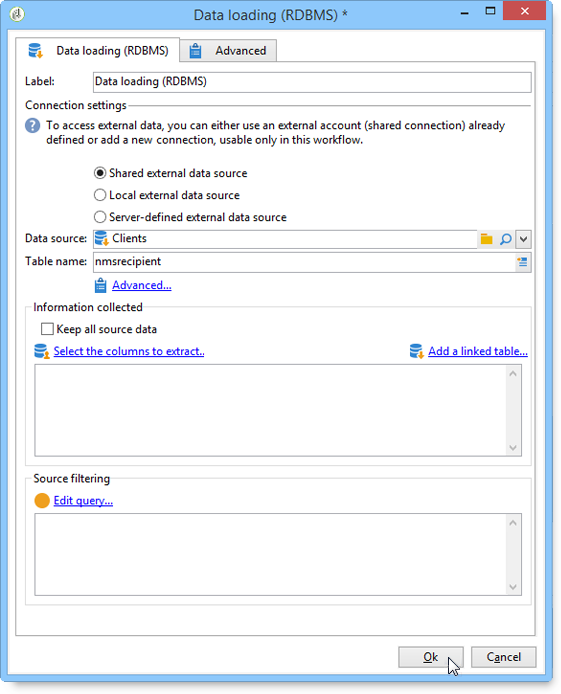
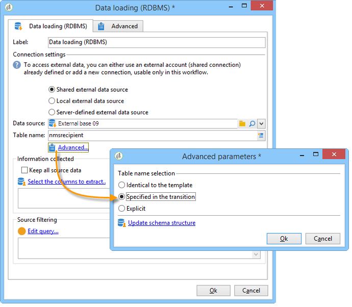

# Datainläsning (RDBMS){#data-loading-rdbms}

Med aktiviteten **[!UICONTROL Data loading (RDBMS)]** kan du få åtkomst till den här externa databasen direkt och bara samla in de data som krävs för målinriktning.

För att förbättra prestandan rekommenderar vi att du använder frågeaktiviteten (där data i en extern databas kan användas). Mer information finns i [Åtkomst till en extern databas (FDA)](accessing-an-external-database-fda.md).

Åtgärden är följande:

1. Markera datakällan i listan och ange namnet på tabellen som innehåller de data som ska extraheras.

   

   Namnet på tabellen som anges i motsvarande fält används som mall för datainsamling i den externa databasen. Namnet på den tabell som bearbetas av arbetsflödet kan beräknas eller förmedlas av den inkommande övergången för datainläsningsaktiviteten. Klicka på **[!UICONTROL Advanced..]** om du vill välja vilken tabell som ska användas. och välj alternativet **[!UICONTROL Specified in the transition]** eller **[!UICONTROL Explicit]**.

   

1. Klicka på länken **[!UICONTROL Select the columns to extract...]** för att välja vilka data som ska samlas in i databasen.

   

1. Du kan definiera ett filter för dessa data. Klicka på länken **[!UICONTROL Edit query....]** om du vill göra det.

   De data som samlas in på det här sättet kan användas under hela arbetsflödets livscykel.
