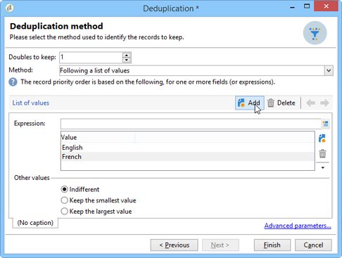

# Deduplicering{#deduplication}

Borttagning av dubbletter tar bort dubbletter från resultatet av inkommande aktiviteter. Deduplicering kan utföras på e-postadressen, telefonnumret eller något annat fält.

Aktiviteten **[!UICONTROL Deduplication]** används för att ta bort dubblettrader från en datauppsättning. Posterna nedan kan till exempel betraktas som dubbletter eftersom de har samma e-postadress och samma mobil- och/eller hemtelefon.

| Senaste ändringsdatum | Förnamn | Efternamn | E-post | Mobiltelefon | Telefon |
|-----|------------|-----------|-------|--------------|------|
| 02/03/2020 | Bob | Tisner | bob@mycompany.com | 444-444-4444 | 888-888-8888 |
| 05/19/2020 | Robert | Tisner | bob@mycompany.com | 444-444-4444 | 777-777-777 |
| 07/22/2020 | Bobby | Tisner | bob@mycompany.com | 444-444-4444 | 777-777-777 |

Aktiviteten **[!UICONTROL Deduplication]** kan behålla en hel rad som den unika posten när dubbletter har identifierats. I ovanstående exempel skulle resultatet bli:**[!UICONTROL Date]**

| Datum | Förnamn | Efternamn | E-post | Mobiltelefon | Telefon |
|-----|----------|------------|-------|--------------|------|
| 02/03/2020 | Bob | Tisner | bob@mycompany.com | 444-444-4444 | 888-888-8888 |

Den markerade huvudposten överför data utan att fältdata sammanfogas med andra relevanta data i de duplicerade raderna.

Komplettera:

| Datum | Förnamn | Efternamn | E-post | Mobiltelefon | Telefon |
|-----|------------|-----------|-------|--------------|------|
| 05/19/2020 | Robert | Tisner | bob@mycompany.com | 444-444-4444 | 777-777-777 |
| 07/22/2020 | Bobby | Tisner | bob@mycompany.com | 444-444-4444 | 777-777-777 |

## Bästa praxis {#best-practices}

Vid borttagning av dubbletter behandlas inkommande flöden separat. Om till exempel mottagare A hittas i resultatet av fråga 1 och i resultatet av fråga 2, kommer de inte att dedupliceras.

Denna fråga måste åtgärdas på följande sätt:

* Skapa en **union**-aktivitet för att förena varje inkommande flöde.
* Skapa en **borttagning av dubbletter**-aktivitet efter aktiviteten **Union**.

## Konfiguration {#configuration}

Om du vill konfigurera en borttagning av dubbletter anger du dess etikett, metod, borttagningsvillkor och alternativ för resultatet.

1. Klicka på länken **[!UICONTROL Edit configuration...]** för att definiera dedupliceringsläget.

   

1. Välj måltyp för den här aktiviteten (som standard är borttagning av dubbletter länkad till mottagare) och vilket kriterium som ska användas, dvs. fältet som identiskt värden gör att du kan identifiera dubbletter för.

   >[!NOTE]
   >
   >Om du använder externa data som indata, till exempel från en extern fil, måste du markera alternativet **[!UICONTROL Temporary schema]**.
   >
   >I nästa steg kan du med alternativet **[!UICONTROL Other]** välja vilket eller vilka villkor som ska användas:

   

1. I nästa steg kan du med alternativet **[!UICONTROL Other]** välja vilket eller vilka villkor som ska användas om värdena är identiska.

   

1. I listrutan väljer du den borttagningsmetod som ska användas och anger antalet kopior som ska behållas.

   

   Följande metoder är tillgängliga:

   * **[!UICONTROL Choose for me]**: Markerar slumpmässigt den post som ska hållas utanför dubbletterna.
   * **[!UICONTROL Following a list of values]**: Låter dig definiera en värdeprioritet för ett eller flera fält. Om du vill definiera värdena markerar du ett fält eller skapar ett uttryck och lägger sedan till värdena i rätt tabell. Om du vill definiera ett nytt fält klickar du på knappen **[!UICONTROL Add]** ovanför listan med värden.

     

   * **[!UICONTROL Non-empty value]**: Låter dig behålla poster där värdet för det valda uttrycket inte är tomt som prioritet.

     

   * **[!UICONTROL Using an expression]**: låter dig behålla poster med det lägsta (eller högsta) värdet för det angivna uttrycket.

     

   >[!NOTE]
   >
   >Funktionen **[!UICONTROL Merge]**, som du kommer åt via länken **[!UICONTROL Advanced parameters]**, gör att du kan konfigurera en uppsättning regler för att sammanfoga ett fält eller en grupp med fält till en enda resulterande datapost. Mer information finns i [Sammanfoga fält till en enda post](#merging-fields-into-single-record).

1. Klicka på **[!UICONTROL Finish]** för att godkänna den valda borttagningsmetoden.

   I fönstrets mellersta del sammanfattas den definierade konfigurationen.

   I det nedre avsnittet av aktivitetsredigeringsfönstret kan du ändra etiketten för den utgående övergången för det grafiska objektet och ange en segmentkod som ska associeras med aktivitetens resultat. Den här koden kan senare användas som målinriktningskriterium.

   

1. Markera alternativet **[!UICONTROL Generate complement]** om du vill utnyttja den återstående populationen. Komplementet består av alla dubbletter. Därefter kommer ytterligare en övergång att läggas till i aktiviteten enligt följande:

   

## Exempel: Identifiera dubbletter före leverans {#example--identify-the-duplicates-before-a-delivery}

I följande exempel gäller borttagningen av dubbletter kombinationen av tre frågor.

Målet med arbetsflödet är att definiera målet för en leverans genom att utesluta dubbletter så att det inte skickas till samma mottagare flera gånger.

De identifierade dubbletterna kommer också att integreras i en dedikerad dubblettlista som kan återanvändas om det behövs.

1. Lägg till och länka de olika aktiviteter som krävs för att arbetsflödet ska fungera enligt ovan.

   Unionsaktiviteten används här för att&quot;sammanfoga&quot; de tre frågorna till en enda övergång. Det innebär att borttagning av dubbletter inte fungerar för varje fråga separat, utan för hela frågan. Mer information om det här ämnet finns i [Bästa praxis](#best-practices).

1. Öppna dedupliceringsaktiviteten och klicka sedan på länken **[!UICONTROL Edit configuration...]** för att definiera dedupliceringsläget.
1. Välj **[!UICONTROL Database schema]** i det nya fönstret.
1. Välj **Mottagare** som mål och filtreringsdimensioner.
1. Markera ID-fältet för dubbletterna **[!UICONTROL Email]** om du bara vill skicka leveransen en gång till varje e-postadress och sedan klicka på **[!UICONTROL Next]**.

   Om du vill basera dubblett-ID:n på ett specifikt fält väljer du **[!UICONTROL Other]** för att få åtkomst till listan med tillgängliga fält.

1. Välj om du bara vill behålla en post när samma e-postadress identifieras för flera mottagare.
1. Välj dedupliceringsläget **[!UICONTROL Choose for me]** så att de poster som sparas om identifierade dubbletter identifieras slumpmässigt väljs och klicka sedan på **[!UICONTROL Finish]**.

När arbetsflödet körs exkluderas alla mottagare som identifieras som dubbletter från resultatet (och därmed leveransen) och läggs till i dubblettlistan. Den här listan kan användas igen i stället för att du behöver identifiera dubbletterna igen.

## Sammanfoga fält till en enda datapost {#merging-fields-into-single-record}

Med funktionen **[!UICONTROL Merge]** kan du konfigurera en uppsättning regler för borttagning av dubbletter för att definiera ett fält eller en grupp med fält som ska sammanfogas till en enda resulterande datapost.

Om du till exempel har en uppsättning dubblettposter kan du välja att behålla det äldsta telefonnumret eller det senaste namnet.

Ett användningsexempel som utnyttjar den här funktionen finns i [det här avsnittet](deduplication-merge.md).

Följ dessa steg för att göra detta:

1. Klicka på länken **[!UICONTROL Deduplication method]** i urvalssteget **[!UICONTROL Advanced Parameters]**.

   

1. Välj alternativet **[!UICONTROL Merge records]** om du vill aktivera funktionen.

   Om du vill gruppera flera datafält i varje kopplingsvillkor aktiverar du alternativet **[!UICONTROL Use several record merging criteria]**.

   

1. När du har aktiverat funktionen läggs en **[!UICONTROL Merge]**-flik till i **[!UICONTROL Deduplication]**-aktiviteten. Det gör att du kan definiera grupper av fält som ska sammanfogas och tillhörande regler.

   Mer information finns i avsnittet om dedikerad användning i [det här avsnittet](deduplication-merge.md).

## Indataparametrar {#input-parameters}

* tableName
* schema

Varje inkommande händelse måste ange ett mål som definieras av dessa parametrar.

## Utdataparametrar {#output-parameters}

* tableName
* schema
* recCount

Den här uppsättningen med tre värden identifierar det mål som skapas av borttagningen av dubbletter. **[!UICONTROL tableName]** är namnet på tabellen som sparar målidentifierare, **[!UICONTROL schema]** är schemat för populationen (vanligtvis nms :recipient) och **[!UICONTROL recCount]** är antalet element i tabellen.

Övergången som är associerad med komplementet har samma parametrar.
