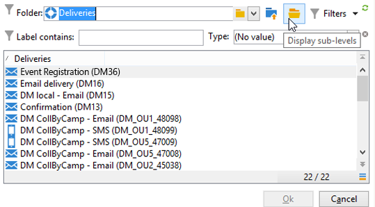

# Leverans{#delivery}


A **Leverans** Med -type-aktivitet kan du skapa en leveransåtgärd. Den kan skapas med indataelement.

Om du vill konfigurera den redigerar du aktiviteten och anger leveransalternativen.


1. **Leverans**

   Du kan:

   * Agera på leveransen som anges i den inkommande övergången. Om du vill göra det väljer du det första alternativet i **[!UICONTROL Delivery]** i fönstret.

      Det här alternativet kan användas när en tidigare arbetsflödesaktivitet redan har skapats eller specificerat leveransen. Detta kan ha gjorts, som i exemplet nedan, av en aktivitet av samma typ som har genererat en utgående övergång.

      I följande exempel skapas leveransen för första gången. Populationen och innehållet definieras senare. Därefter anges informationen för dessa tre element på nytt i en ny leveransaktivitet med hjälp av övergången för inkommande trafik så att den kan skickas.

      

   * Välj den aktuella leveransen direkt. Om du vill göra det väljer du **[!UICONTROL Explicit]** och välj leverans i listrutan i dialogrutan **[!UICONTROL Delivery]** fält.

      I listan visas oavslutade leveranser i **Leveranser** som standard. Klicka på **[!UICONTROL Select link]** ikon.

      

      Välj kampanjen i listrutan i **[!UICONTROL Folder]** eller klicka **[!UICONTROL Display sub-levels]** för att visa alla leveranser i undermappar:

      

      När du har valt leveransåtgärden kan du visa innehållet genom att klicka på **[!UICONTROL Edit link]** ikon.

   * Skapa ett skript för att beräkna leveransen. Om du vill göra det väljer du **[!UICONTROL Computed by a script]** och ange skriptet. Du kan öppna ett inmatningsfönster genom att klicka på **[!UICONTROL Edit...]** alternativ. I följande exempel återskapas leveransens identifierare:

      

   * Skapa en ny leverans. Om du vill göra det väljer du **[!UICONTROL New, created from a template]** och välj den leveransmall som leveransen ska baseras på.

      

      Klicka på **[!UICONTROL Select link]** om du vill bläddra bland mapparna och klicka på **[!UICONTROL Edit link]** om du vill visa innehållet i den valda mallen.

1. **Mottagare**

   Mottagarna kan anges av de inkommande händelserna, till exempel efter en filimport, eller anges i leveransåtgärden. De kan också lagras i en eller flera filer.

   

1. **Innehåll**

   Innehållet i meddelandet kan definieras i leverans- eller inkommande-händelsen.

   

1. **Åtgärd som ska köras**

   Du kan skapa leveransen, förbereda den, starta den, beräkna målet eller skicka ett korrektur.

   

   Välj vilken typ av åtgärd som ska utföras:

   * **[!UICONTROL Save]**: Med det här alternativet kan du skapa leveransen och spara den. Den kommer inte att analysera eller leverera den.
   * **[!UICONTROL Estimate the target]**: Med det här alternativet kan du beräkna leveransmålet för att bedöma dess potential (första analysfasen). Den här åtgärden motsvarar att välja **[!UICONTROL Estimate the population to be targeted]** och klicka **[!UICONTROL Analyze]** när en leverans skickas till huvudmålet via **Leverans**.
   * **[!UICONTROL Prepare]**: Med det här alternativet kan du köra hela analysprocessen (målberäkning och innehållsförberedelse). Leveransen har inte skickats. Den här åtgärden motsvarar att välja **[!UICONTROL Deliver as soon as possible]** och klicka **[!UICONTROL Analyze]** när en leverans skickas till huvudmålet med **Leverans**.
   * **[!UICONTROL Send a proof]**: Med det här alternativet kan du skicka ett bevis på leveransen. Den här åtgärden motsvarar att klicka på **[!UICONTROL Send a proof]** i verktygsfältet för en leverans med **Leverans**
   * **[!UICONTROL Prepare and start]**: Med det här alternativet startas hela analysprocessen (målberäkning och förberedelse av innehåll) och leveransen skickas. Den här åtgärden motsvarar att klicka **[!UICONTROL Deliver as soon as possible]**, **[!UICONTROL Analyze]** och **[!UICONTROL Confirm delivery]** alternativ när en leverans skickas till huvudmålet med **Leverans**.

   The **[!UICONTROL Act on a delivery]** Med den här aktiviteten kan du starta alla återstående steg som krävs för att starta leveransen (målberäkning, förberedelse av innehåll, leverans). Mer information finns i [Leveranskontroll](delivery-control.md).

   Följande alternativ är också tillgängliga:

   * **[!UICONTROL Generate an outbound transition]**

      Skapar en utgående övergång som ska aktiveras i slutet av körningen. Du kan välja om du vill hämta målet för den utgående leveransen eller inte.

   * **[!UICONTROL Do not recover target]**

      Återställer inte målet för åtgärden för utgående leverans.

   * **[!UICONTROL Processing errors]**

      Se [Leveranskontroll](delivery-control.md).
   The **Skript** kan du ändra leveransparametrarna.

   

## Exempel: arbetsflöde för leverans {#example--delivery-workflow}

Skapa ett nytt arbetsflöde och lägg till aktiviteter enligt bilden nedan:


Öppna **Leverans** och definiera egenskaperna enligt följande:

* I **[!UICONTROL Delivery]** avsnitt, markera **[!UICONTROL New, created from a template]** och välj en leveransmall.
* I **[!UICONTROL Recipients]** avsnitt, markera **[!UICONTROL Specified in the delivery]**.
* I **[!UICONTROL Action to execute]** -avsnittet, behåll **[!UICONTROL Prepare]** alternativ.


Klicka **[!UICONTROL OK]** för att stänga egenskapsfönstret. Du har just konfigurerat en aktivitet som består av att skapa och förbereda en ny leverans baserat på en leveransmall vars mål ska anges i den.

Öppna **Godkännande** och definiera egenskaperna enligt följande:

1. I **[!UICONTROL Assignment type]** väljer du en grupp där du är registrerad. Om du är ansluten med administratörskontot väljer du gruppen Administration.
1. Ange sedan en titel och infoga följande text i meddelandetexten:

   ```
   Do you wish to approve delivery (<%= vars.recCount %> recipient(s))?
   ```

   Detta är ett meddelande som innehåller ett uttryck skrivet i JavaScript: **[!UICONTROL vars.recCount]** representerar antalet mottagare som är målinriktade för leveransen av föregående uppgift. Mer information om JavaScript-uttryck finns i [JavaScript-skript och -mallar](javascript-scripts-and-templates.md).

   

   Godkännandeuppgiften finns i [Godkännande](approval.md).

## Indataparametrar {#input-parameters}

Leverans-ID, om **[!UICONTROL Specified in the transition]** alternativet är markerat i **[!UICONTROL Delivery]** -avsnitt.

* deliveryId
* tableName
* schema

Varje inkommande händelse måste ange ett mål som definieras av dessa parametrar.

>[!NOTE]
>
>Den här parametern visas bara om **[!UICONTROL Specified by inbound event(s)]** alternativet är markerat i **[!UICONTROL Recipients]** -avsnitt.

* filnamn

   Fullständigt namn på filen som genereras om **[!UICONTROL File(s) specified by inbound event(s)]** alternativet är markerat i **[!UICONTROL Recipients]** -avsnitt.

* contentId

   Innehållsidentifieraren om **[!UICONTROL Specified by inbound events]** alternativet är markerat i **[!UICONTROL Content]** -avsnitt.

## Utdataparametrar {#output-parameters}

* tableName
* schema
* recCount

Den här uppsättningen med tre värden identifierar det mål som är resultatet av leveransen. **[!UICONTROL tableName]** är namnet på den tabell som memorerar målets identifierare, **[!UICONTROL schema]** är schemat för populationen (vanligtvis nms:mottagare) och **[!UICONTROL recCount]** är antalet element i tabellen.

Övergången som är associerad med komplementet har samma parametrar.

>[!NOTE]
>
>Det finns inga utdataparametrar när **[!UICONTROL Do not recover target]** är markerat.
