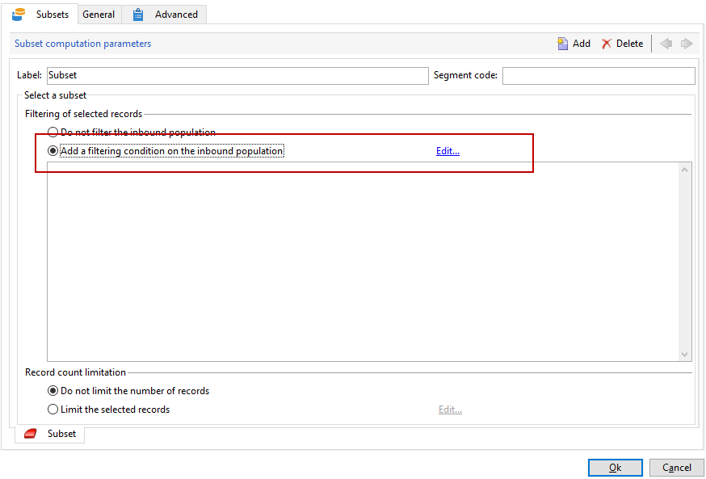
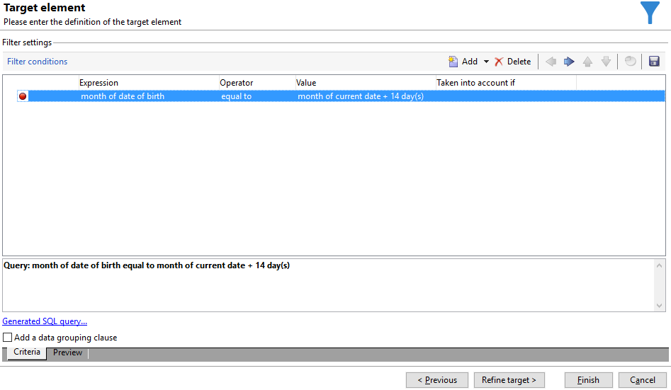
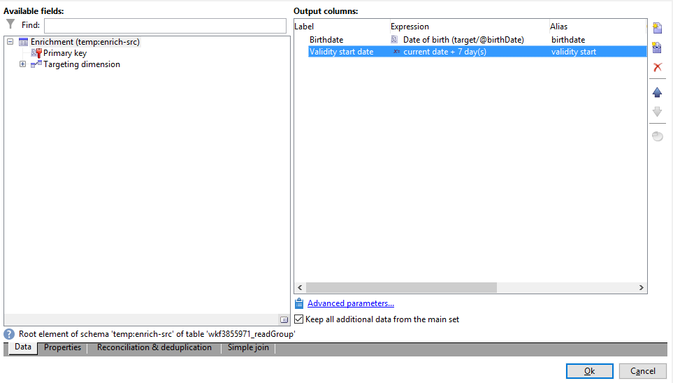

# E-postberikande med anpassade datumfält{#email-enrichment-with-custom-date-fields}


I det här exemplet vill vi skicka ett e-postmeddelande med anpassade datafält till mottagare som kommer att fira sina födelsedagar den här månaden. E-postmeddelandet innehåller en kupong som är giltig en vecka före och efter deras födelsedagar.

Vi måste rikta in oss på mottagare från en lista som kommer att fira sina födelsedagar den här månaden med en **[!UICONTROL Split]** aktivitet. Sedan använder du **[!UICONTROL Enrichment]** är det anpassade datafältet som fungerar som giltighetsdatum i e-postmeddelandet för kundens specialerbjudande.


Så här skapar du det här exemplet:

1. I **[!UICONTROL Targeting and workflows]** dra och släpp en **[!UICONTROL Read list]** -aktivitet för att ange mottagarlistan som mål.
1. Listan som ska bearbetas kan anges explicit, beräknas av ett skript eller lokaliseras dynamiskt enligt de alternativ som valts och parametrar som definierats här.

   

1. Lägg till en **[!UICONTROL Split]** aktiviteter för att skilja mottagare som kommer att fira sina födelsedagar den här månaden från andra mottagare.
1. Om du vill dela din lista går du till **[!UICONTROL Filtering of selected records]** kategori, välj **[!UICONTROL Add a filtering condition on the inbound population]**. Klicka sedan på **[!UICONTROL Edit]**.

   

1. Välj **[!UICONTROL Filtering conditions]** klickar du på **[!UICONTROL Edit expression]** för att filtrera månaden på mottagarens födelsedag.

   

1. Klicka **[!UICONTROL Advanced Selection]** sedan **[!UICONTROL Edit the formula using an expression]** och lägg till följande uttryck: Month(@bornDate).
1. I **[!UICONTROL Operator]** kolumn väljer du **[!UICONTROL equal to]**.
1. Filtrera villkoret ytterligare genom att lägga till **[!UICONTROL Value]** månad för aktuellt datum: Month(GetDate()).

   Detta skickar en fråga till mottagare vars födelsedag motsvarar den aktuella månaden.

   

1. Klicka på **[!UICONTROL Finish]**. Sedan i **[!UICONTROL General]** -fliken i **[!UICONTROL Split]** aktivitet, klicka på **[!UICONTROL Generate complement]** i **[!UICONTROL Results]** kategori.

   Med **[!UICONTROL Complement]** kan du lägga till en leveransaktivitet eller uppdatera en lista. Här har vi just lagt till en **[!UICONTROL End]** aktivitet.

   

Nu måste du konfigurera **[!UICONTROL Enrichment]** aktivitet:

1. Lägg till en **[!UICONTROL Enrichment]** efter din delmängd för att lägga till dina anpassade datumfält.

   

1. Öppna **[!UICONTROL Enrichment]** aktivitet. I **[!UICONTROL Complementary information]** kategori, klicka på **[!UICONTROL Add data]**.

   

1. Välj **[!UICONTROL Data linked to the filtering dimension]** sedan **[!UICONTROL Data of the filtering dimension]**.
1. Klicka på knappen **[!UICONTROL Add]**.

   

1. Lägg till en **[!UICONTROL Label]**. Sedan i **[!UICONTROL Expression]** kolumn, klicka **[!UICONTROL Edit expression]**.

   

1. Först måste vi rikta in veckan före födelsedatumet som **Giltighetens startdatum** med följande **[!UICONTROL Expression]**: `SubDays([target/@birthDate], 7)`.

   

1. Skapa sedan det anpassade datumfältet **Giltighetens slutdatum** som riktar sig till veckan efter födelsedatumet måste du lägga till **[!UICONTROL Expression]**: `AddDays([target/@birthDate], 7)`.

   Du kan lägga till en etikett i uttrycket.

   

1. Klicka på **[!UICONTROL Ok]**. Din berikning är nu klar.

Efter **[!UICONTROL Enrichment]** kan du lägga till en leverans. I det här fallet har vi lagt till en e-postleverans för att skicka ett specialerbjudande med giltighetsdatum till kunder som firar sina födelsedagar den här månaden.

1. Dra och släpp en **[!UICONTROL Email delivery]** aktivitet efter **[!UICONTROL Enrichment]** aktivitet.

   

1. Dubbelklicka på **[!UICONTROL Email delivery]** för att personalisera leveransen.
1. Lägg till en **[!UICONTROL Label]** till leveransen och klicka **[!UICONTROL Continue]**.
1. Klicka **[!UICONTROL Save]** för att skapa e-postleverans.
1. Checka in **[!UICONTROL Approval]** fliken för e-postleveransen **[!UICONTROL Properties]** som **[!UICONTROL Confirm delivery before sending option]** är markerad.

   Starta sedan arbetsflödet för att berika den utgående övergången med målinformationen.

   

Nu kan du börja designa din e-postleverans med de anpassade datumfälten i **[!UICONTROL Enrichment]** aktivitet.

1. Dubbelklicka på **[!UICONTROL Email delivery]** aktivitet.
1. Lägg till måltilläggen i e-postmeddelandet. Den ska finnas i följande uttryck för att konfigurera formatet för dina giltighetsdatum:

   ```
   <%=
           formatDate(targetData.alias of your expression,"%2D.%2M")  %>
   ```

1. Klicka på . Välj **[!UICONTROL Target extension]** och tidigare skapade anpassade giltighetsdatum med **[!UICONTROL Enrichment]** -aktivitet för att lägga till tillägget i formatetDate-uttrycket.

   

1. Konfigurera e-postinnehållet efter behov.

   

1. Förhandsgranska din e-post för att kontrollera om dina anpassade datumfält är korrekt konfigurerade

   

Din e-postadress är nu klar. Du kan börja skicka dina korrektur och bekräfta leveransen för att skicka dina födelsedag via e-post.
