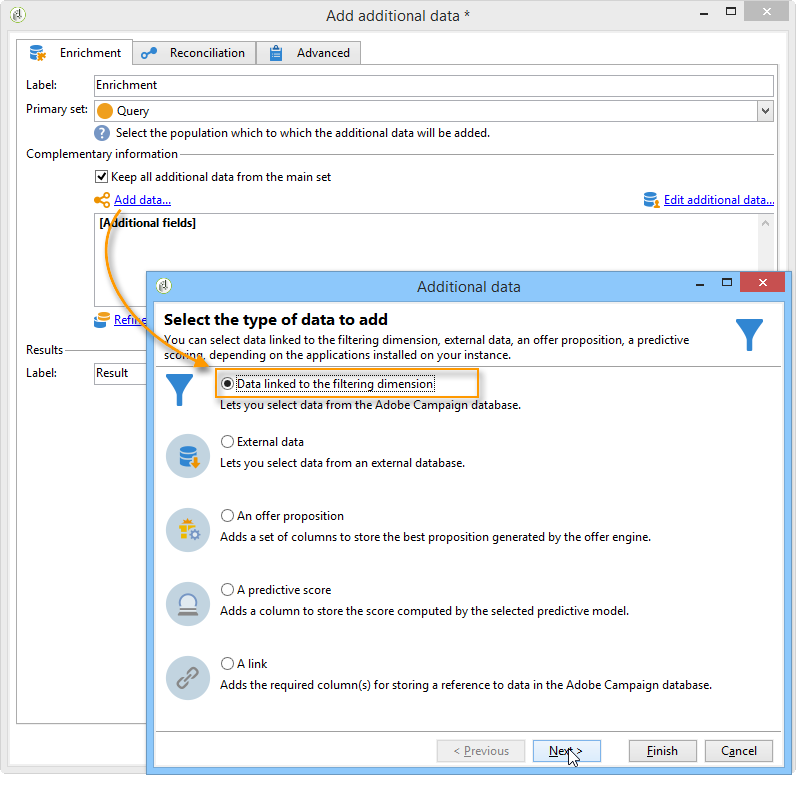

# Berika data{#enriching-data}

## Om att förbättra data {#about-enriching-data}

Här finns information om möjliga användningsområden för **[!UICONTROL Enrichment]** i ett målarbetsflöde. Mer information om hur du använder **[!UICONTROL Enrichment]** aktivitet, se: [Berikning](enrichment.md).

Det finns också ett användningsexempel om hur man förbättrar e-postleveransen med anpassade datum i [det här avsnittet](email-enrichment-with-custom-date-fields.md).

Kontakterna i marknadsföringsdatabasen får en inbjudan att delta i en tävling via ett webbprogram. Konkurrensresultaten återvinnas i **[!UICONTROL Competition results]** tabell. Det här registret är länkat till kontakttabellen (**[!UICONTROL Recipients]**). The **[!UICONTROL Competition results]** tabellen innehåller följande fält:

* Konkurrensnamn (@game)
* Utvärderingsnummer (@trial)
* Poäng (@score)

En kontakt hittades i **[!UICONTROL Recipients]** tabellen kan länkas till flera rader i **[!UICONTROL Competition results]** tabell. Relationen mellan de här två tabellerna är av typen 1-n. Här är ett exempel på resultatloggarna för en mottagare:

Syftet med detta är att skicka personaliserade leveranser till personer som deltog i den senaste tävlingen beroende på deras högsta poäng. Mottagaren med högsta poäng får första pris, mottagaren med näst högsta poäng får ett tröstpris och alla andra får ett meddelande som önskar dem bättre lycka till nästa gång.

Vi har skapat följande arbetsflöde för målinriktning för att konfigurera det här användningsexemplet:

Så här skapar du arbetsflödet:

1. Två **[!UICONTROL Query]** aktiviteter och en **[!UICONTROL Intersection]** Verksamheten läggs till för att inrikta sig på nya prenumeranter som gick in i tävlingen sist.
1. The **[!UICONTROL Enrichment]** används för att lägga till data som lagras i **[!UICONTROL Competition results]** tabell. The **[!UICONTROL Score]** det fält där vår leveranspersonalisering ska ske läggs till i arbetsflödets arbetsregister.
1. The **[!UICONTROL Split]** typaktivitet används för att skapa delmängder av mottagare baserat på poängvärden.
1. För varje delmängd av **[!UICONTROL Delivery]** aktiviteten läggs till.

## Steg 1: Målinriktning {#step-1--targeting}

Den första frågan används för målmottagare som lagts till i databasen under de senaste sex månaderna.

Den andra frågan används för att rikta sig till de mottagare som deltog i den senaste tävlingen.

An **[!UICONTROL Intersection]** Typaktivitet läggs sedan till för att rikta sig till de mottagare som lagts till i databasen under de senaste sex månaderna och som gick in i den sista tävlingen.

## Steg 2: Berikning {#step-2--enrichment}

I det här exemplet får du lära dig hur du anpassar leveranser enligt **[!UICONTROL Score]** fält som lagras i **[!UICONTROL Competition results]** tabell. Den här tabellen har en 1:n-typrelation med mottagartabellen. The **[!UICONTROL Enrichment]** används för att lägga till data från en tabell som är länkad till filtreringsdimensionen i arbetsflödets arbetsregister.

1. På redigeringsskärmen för anrikningsaktiviteten väljer du **[!UICONTROL Add data]** sedan **[!UICONTROL Data linked to the filtering dimension]** och klicka **[!UICONTROL Next]**.

   

1. Välj sedan **[!UICONTROL Data linked to the filtering dimension]** väljer du **[!UICONTROL Competition results]** tabell och klicka **[!UICONTROL Next]**.

   

1. Ange ett ID och en etikett och välj **[!UICONTROL Limit the line count]** i **[!UICONTROL Data collected]** fält. I **[!UICONTROL Lines to retrieve]** väljer du 1 som värde. För varje mottagare läggs en rad till i anrikningsaktiviteten från **[!UICONTROL Competition results]** till arbetsflödets arbetsregister. Klicka på **[!UICONTROL Next]**.

   

1. I det här exemplet vill vi återfå mottagarens högsta poäng, men bara för den sista tävlingen. Om du vill göra det lägger du till ett filter i **[!UICONTROL Competition name]** fält för att exkludera alla rader som hör till tidigare tävlingar. Klicka på **[!UICONTROL Next]**.

   

1. Gå till **[!UICONTROL Sort]** och klicka på **[!UICONTROL Add]** klickar du på **[!UICONTROL Score]** och markera kryssrutan i **[!UICONTROL descending]** kolumn för att sortera objekt i **[!UICONTROL Score]** fält i fallande ordning. För varje mottagare läggs en rad till i anrikningsaktiviteten som matchar den högsta poängen för det senaste spelet. Klicka på **[!UICONTROL Next]**.

   

1. I **[!UICONTROL Data to add]** fönster, dubbelklicka på **[!UICONTROL Score]** fält. För varje mottagare läggs endast **[!UICONTROL Score]** fält. Klicka på **[!UICONTROL Finish]**.

   

Högerklicka på den inkommande övergången för anrikningsaktiviteten och välj **[!UICONTROL Display the target]**. Arbetstabellen innehåller följande data:

Det länkade schemat är:

Förnya den här åtgärden vid utgående övergång av anrikningsaktiviteten. Vi ser att data som är länkade till mottagarpoängen har lagts till. Den högsta poängen för varje mottagare har återställts.

Det matchande schemat har också berikats.

## Steg 3: Dela och leverera {#step-3--split-and-delivery}

Om du vill sortera mottagarna baserat på deras poängvärden, kan du **[!UICONTROL Split]** Aktiviteten läggs till efter anrikningen.

1. A first (**Vinnare**) har definierats så att mottagaren med det högsta poängtalet inkluderas. Det gör du genom att definiera en begränsning av antalet poster, tillämpa en fallande sortering på poängen och begränsa antalet poster till 1.

   

1. Den andra (**Andra plats**) innehåller den mottagare som har det näst högsta poängtalet. Konfigurationen är densamma som för den första delmängden.

   

1. Den tredje (**losers**) innehåller alla andra mottagare. Gå till **[!UICONTROL General]** -fliken och kontrollera **[!UICONTROL Generate complement]** för alla mottagare som inte uppnådde de två högsta poängen.

   

1. Lägg till en **[!UICONTROL Delivery]** typaktivitet för varje delmängd, med olika leveransmallar för varje.

   
