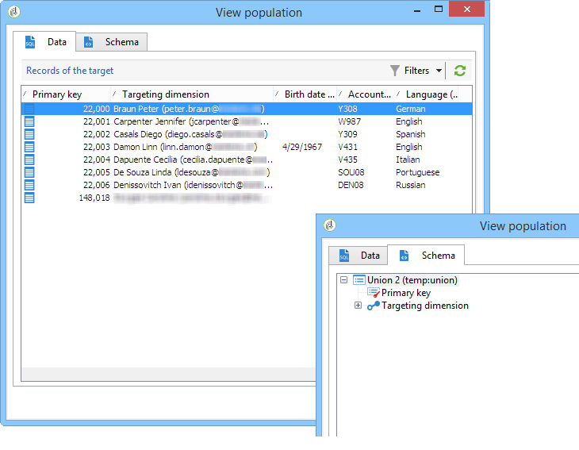

# Berikning{#enrichment}


Med aktiviteten **[!UICONTROL Enrichment]** kan du lägga till information i en profillista och länkar till en befintlig tabell (skapa en ny koppling). Avstämningskriterier med profiler i databasen kan också definieras.


## Definitioner {#definitions}

Om du vill använda anrikningsaktiviteten måste du känna till de olika alternativen som är tillgängliga när du lägger till data.


Alternativet **[!UICONTROL Data linked to the filtering dimension]** ger dig åtkomst till:

* Filtreringsdimensionens data: åtkomst till arbetsregisterdata
* Data länkade till filtreringsdimensionen: åtkomst till data länkade till arbetsregistret


Med alternativet **[!UICONTROL A link]** kan du skapa en koppling till valfri databastabell.


Det finns fyra typer av länkar:

* **[!UICONTROL Define a collection]**: gör att du kan definiera en länk med en 1-N-kardinalitet mellan tabellerna.
* **[!UICONTROL Define a link whose target is still available]**: gör att du kan definiera en länk med en 1-1-kardinalitet mellan tabeller. Kopplingsvillkoren måste definieras av en enda post i måltabellen.
* **[!UICONTROL Define a link whose target does not necessarily exist in the base]**: gör att du kan definiera en länk med 0-1-kardinalitet mellan tabeller. Kopplingsvillkoret måste definieras med 0- eller 1-post (max.) i måltabellen.

  Det här alternativet är konfigurerat på fliken **[!UICONTROL Simple Join]** som du kommer åt via länken **[!UICONTROL Edit additional data]** för aktiviteten **[!UICONTROL Enrichment]**.

* **[!UICONTROL Define a link by searching for a reference among several options]**: den här typen av länk definierar en avstämning mot en unik post. Adobe Campaign skapar en länk till en måltabell genom att lägga till en sekundärnyckel i måltabellen för lagring av en referens till den unika posten.

  Det här alternativet är konfigurerat på fliken **[!UICONTROL Reconciliation and deduplication]** som du kommer åt via länken **[!UICONTROL Edit additional data]** för aktiviteten **[!UICONTROL Enrichment]**.

Användningsexempel som beskriver hur anrikningsaktiviteter fungerar i sitt sammanhang finns också i följande avsnitt:

* [E-postanrikning med anpassade datumfält](email-enrichment-with-custom-date-fields.md).
* [Förbättra data](enrich-data.md)
* [Skapa en sammanfattningslista](create-a-summary-list.md)

## Lägga till information {#adding-information}

Använd aktiviteten **[!UICONTROL Enrichment]** för att lägga till kolumner i en arbetstabell: den här aktiviteten kan användas som komplement till en frågeaktivitet.

Konfigurationen av ytterligare kolumner beskrivs i [Lägga till data](query.md#adding-data).

I fältet **[!UICONTROL Primary set]** kan du välja den inkommande övergången: data i den här aktivitetens arbetstabell kommer att berikas.

Klicka på länken **[!UICONTROL Add data]** och välj den typ av data som ska läggas till. Listan över datatyper som erbjuds beror på vilka moduler och alternativ som är installerade på din plattform. I en minimal konfiguration kan du alltid lägga till data som är länkade till filtreringsdimensionen och en länk.


I exemplet nedan kommer den utgående övergången att berikas med information om åldern på målprofilerna.


Högerklicka på anrikningsaktivitetens inkommande övergång för att visa data före anrikningssteget.


Arbetstabellen innehåller följande data och det associerade schemat:



Upprepa den här åtgärden vid anrikningsfasens utdata.


Du kan se att data för profilsidor har lagts till:


Det matchande schemat har också berikats.

## Hantera ytterligare data {#managing-additional-data}

Avmarkera alternativet **[!UICONTROL Keep all additional data from the main set]** om du inte vill behålla tidigare definierade ytterligare data. I det här fallet läggs endast de ytterligare kolumner som har valts i anrikningsaktiviteten till i tabellen för utgående arbete. Den ytterligare information som lagts till i aktiviteterna uppströms sparas inte.


Data och schemat vid anrikningsfasutdata blir följande:


## Skapa en länk {#creating-a-link}

Du kan använda anrikningsaktiviteten för att skapa en länk mellan arbetsdata och Adobe Campaign-databasen: det här blir en lokal länk till arbetsflödet mellan inkommande data.

Om du till exempel läser in data från en fil som innehåller mottagarnas kontonummer, land och e-postadress måste du skapa en länk till landstabellen för att kunna uppdatera informationen i deras profiler.

Gör så här:

1. Samla in och läs in följande filtyp:

   ```
   Account number;Country;Email
   18D65;FRANCE;agnes@gmail.com
   243PP;RUSSIA;paul@gmail.com
   55H87;CROATIA;dave@gmail.com
   56U81;USA;susan@gmail.com
   853PI;ITALY;anna@gmail.com
   890LP;FRANCE;robert@gmail.com
   83TY2;SWITZERLAND;mike@gmail.com
   ```

1. Redigera anrikningsaktiviteten och klicka på länken **Lägg till data..** för att skapa en koppling till tabellen Land.

   

1. Markera alternativet **[!UICONTROL Link definition]** och klicka på knappen **[!UICONTROL Next]**. Ange vilken typ av länk som ska skapas. I det här exemplet vill vi att filmottagarens land ska stämma överens med ett land i listan över tillgängliga länder i den dedikerade databastabellen. Välj alternativet **[!UICONTROL Define a link by searching for a reference among several options]**. Välj landstabellen i fältet **[!UICONTROL Target schema]**.

   

1. Markera sedan de fält som du vill länka källfilsvärdena till i databasen.

   

I resultatet av den här anrikningsaktiviteten kommer det tillfälliga schemat att innehålla länken till landstabellen:


## Datavstämning {#data-reconciliation}

Anrikningsaktiviteten kan användas för att konfigurera datavstämning, inklusive när data har lästs in i databasen. I det här fallet kan du på fliken **[!UICONTROL Reconciliation]** definiera länken mellan data i Adobe Campaign-databasen och data i arbetstabellen.

Välj alternativet **[!UICONTROL Identify the targeting document based on work data]**, ange det schema som du vill skapa en länk till och definiera kopplingsvillkoren: för att göra detta väljer du de fält som ska förenas i arbetsdata (**[!UICONTROL Source expression]**) och i måldimensionen (**[!UICONTROL Destination expression]**).

Du kan använda ett eller flera avstämningskriterier.


Om flera kopplingsvillkor anges måste ALLA verifieras så att data kan länkas ihop.

## Infoga ett erbjudande {#inserting-an-offer-proposition}

Med anrikningsaktiviteten kan du lägga till erbjudanden eller länkar till erbjudanden för mottagare.

Mer information om anrikningsaktiviteten finns i det här [avsnittet](enrichment.md).

Du kan till exempel förbättra data för en mottagarfråga före en leverans.


När du har konfigurerat din fråga (se det här [avsnittet](query.md)):

1. Lägg till och öppna en anrikningsaktivitet.
1. Välj **[!UICONTROL Add data]** på fliken **[!UICONTROL Enrichment]**.
1. Välj **[!UICONTROL An offer proposition]** i de datatyper som ska läggas till.

   

1. Ange en identifierare och en etikett för det förslag som ska läggas till.
1. Ange erbjudandevalet. Det finns två möjliga alternativ:

   * **[!UICONTROL Search for the best offer in a category]**: Markera det här alternativet och ange parametrarna för att anropa motorn (erbjudandeutrymme, kategori eller tema, kontaktdatum, antal erbjudanden som ska behållas). Motorn beräknar automatiskt erbjudandena som ska läggas till enligt dessa parametrar. Vi rekommenderar att du fyller i antingen **[!UICONTROL Category]** eller **[!UICONTROL Theme]**-fältet i stället för båda samtidigt.

     

   * **[!UICONTROL A predefined offer]**: markera det här alternativet och ange ett erbjudandeutrymme, ett specifikt erbjudande och ett kontaktdatum för att direkt konfigurera det erbjudande du vill lägga till, utan att anropa erbjudandemotorn.

     

1. Konfigurera sedan en leveransaktivitet som motsvarar den valda kanalen. Se [Flerkanalsleveranser](cross-channel-deliveries.md).

   Antalet tillgängliga offerter för förhandsgranskningen beror på konfigurationen som utförs i anrikningsaktiviteten snarare än eventuell konfiguration som utförs direkt i leveransen.

Om du vill ange erbjudandeförslag kan du även välja att referera en länk till ett erbjudande. Mer information finns i följande avsnitt [Referera till en länk till ett erbjudande](#referencing-a-link-to-an-offer).

## Referera till en länk till ett erbjudande {#referencing-a-link-to-an-offer}

Du kan även referera till en länk till ett erbjudande i en anrikningsaktivitet.

Så här gör du:

1. Välj **[!UICONTROL Add data]** på aktivitetens **[!UICONTROL Enrichment]**-flik.
1. Välj **[!UICONTROL A link]** i fönstret där du väljer vilken typ av data som ska läggas till.
1. Välj den typ av länk som du vill etablera samt dess mål. I det här fallet är målet erbjudandeschemat.

   

1. Ange kopplingen mellan inkommande tabelldata i anrikningsaktiviteten (här mottagartabellen) och erbjudandetabellen. Du kan till exempel länka en erbjudandekod till en mottagare.

   

1. Konfigurera sedan en leveransaktivitet som motsvarar den valda kanalen. Se [Flerkanalsleveranser](cross-channel-deliveries.md).

   >[!NOTE]
   >
   >Antalet tillgängliga offerter för förhandsgranskningen beror på konfigurationen som utförs i leveransen.

## Rankning och vikter för erbjudanden {#storing-offer-rankings-and-weights}

När en **enrichment** -aktivitet används för att leverera erbjudanden lagras deras rankningar och deras vikter som standard inte i förslagstabellen.

Aktiviteten **[!UICONTROL Offer engine]** lagrar den här informationen som standard.

Du kan dock lagra den här informationen på följande sätt:

1. Skapa ett anrop till erbjudandemotorn i en anrikningsaktivitet som placerats efter en fråga och före en leveransaktivitet.
1. Välj **[!UICONTROL Edit additional data...]** i aktivitetens huvudfönster.

   

1. Lägg till **[!UICONTROL @rank]**-kolumnerna för rankningen och **[!UICONTROL @weight]** för erbjudandevikten.

   

1. Bekräfta tillägget och spara arbetsflödet.

Leveransen lagrar automatiskt rangordningen och vikten av erbjudandena. Den här informationen visas på leveransfliken **[!UICONTROL Offers]**.
