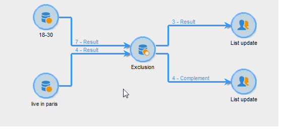

# Uteslutning{#exclusion}

En aktivitet av typen **Uteslutning** skapar ett mål baserat på ett huvudmål som ett eller flera andra mål extraheras från.

Om du vill konfigurera den här aktiviteten anger du dess etikett och väljer huvudmottagaruppsättningen: med hjälp av populationen i huvuduppsättningen kan du skapa resultatet. Profiler som delas av huvuduppsättningen och minst en av tävlingsaktiviteterna kommer att uteslutas.

>[!NOTE]
>
>Mer information om hur du konfigurerar och använder exkluderingsaktiviteten finns i [Utesluta en population (Uteslutning)](targeting-workflows.md#excluding-a-population--exclusion-).

Markera alternativet **[!UICONTROL Generate complement]** om du vill utnyttja den återstående populationen. Komplementet kommer att innehålla den huvudsakliga inkommande populationen minus den utgående populationen. En ytterligare övergång till utdata läggs sedan till i aktiviteten enligt följande:

## Exempel på undantag {#exclusion-examples}

Följande exempel söker efter en lista över mottagare i åldrarna 18 till 30 år, med undantag för personer bosatta i Paris.

1. Infoga och öppna en aktivitet av typen **[!UICONTROL Exclusion]** efter två frågor. Den första frågan riktar sig till mottagare i Paris. Den andra frågan riktar sig till 18 till 30 år.
1. Ange huvuduppsättningen. Här är huvuduppsättningen frågan **18-30 år gammal** . Element som hör till den andra uppsättningen tas inte med i slutresultatet.
1. Markera alternativet **[!UICONTROL Generate complement]** om du vill utnyttja de data som återstår efter undantaget. I detta fall består komplementet av mottagare i åldrarna 18 till 30 år som bor i Paris.
1. Godkänn undantagskonfigurationen och infoga sedan en uppdateringslistaktivitet i resultatet. Du kan också infoga ytterligare en listuppdatering till komplementet där det behövs.
1. Kör arbetsflödet. I det här exemplet består resultatet av mottagare mellan 18 och 30 år, men de som bor i Paris utesluts och skickas till komplementet.

   

## Indataparametrar {#input-parameters}

* tableName
* schema

Varje inkommande händelse måste ange ett mål som definieras av dessa parametrar.

## Utdataparametrar {#output-parameters}

* tableName
* schema
* recCount

Den här uppsättningen med tre värden identifierar det mål som är resultatet av uteslutningen. **[!UICONTROL tableName]** är namnet på tabellen som registrerar målidentifierarna, **[!UICONTROL schema]** är schemat för populationen (vanligtvis nms:mottagare) och **[!UICONTROL recCount]** är antalet element i tabellen.

Övergången som är associerad med komplementet har samma parametrar.
