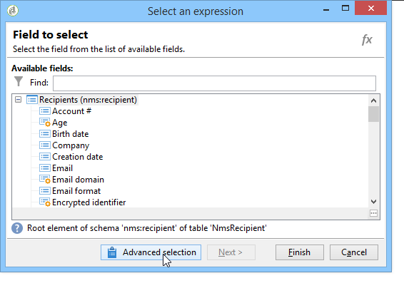

# Dataextrahering (fil){#extraction-file}

Du kan extrahera data från en arbetsflödestabell i en extern fil med **[!UICONTROL Data extraction (file)]** aktivitet.

>[!CAUTION]
>
>Den här aktiviteten måste alltid ha en inkommande övergång som innehåller de data som ska extraheras.

Så här konfigurerar du dataextrahering:

1. Ange namnet på utdatafilen: det här namnet kan innehålla variabler, infogade via personaliseringsknappen till höger om fältet.
1. Klicka **[!UICONTROL Edit the file format...]** för att markera de data som ska extraheras.

   

   The **[!UICONTROL Handle groupings (GROUP BY + HAVING)]** tillför ett extra steg för att filtrera slutresultatet av sammanställningen, t.ex. för en viss inköpsordertyp, kunder som har beställt mer än 10 gånger osv.

1. Om det behövs kan du lägga till nya kolumner i utdatafilen, t.ex. genom att beräkna eller bearbeta resultat. Om du vill göra det klickar du på **[!UICONTROL Add]** ikon.

   

   Klicka på **[!UICONTROL Edit expression]** -ikonen för att definiera innehållet i den nya kolumnen.

   

   Sedan kommer du åt urvalsfönstret. Klicka **[!UICONTROL Advanced selection]** för att välja vilken process som ska användas på data.

   

   Välj önskad formel i listan.

   

Du kan definiera en efterprocess som ska köras under dataextraheringen så att du kan komprimera eller kryptera filerna. För att göra detta måste du lägga till det önskade kommandot i **[!UICONTROL Script]** aktivitetens flik.

Mer information finns i följande avsnitt: [Zippa eller kryptera en fil](use-workflow-data.md#zipping-or-encrypting-a-file).

## Lista över sammanställningsfunktioner {#list-of-aggregate-functions}

Här följer en lista över tillgängliga sammanställningsfunktioner:

* **[!UICONTROL Count]** att räkna alla värden som inte är null i det fält som ska aggregeras, inklusive dubblettvärden (i det aggregerade fältet),

   **[!UICONTROL Distinct]** att räkna det totala antalet olika och icke-null-värden för det fält som ska aggregeras (dubblettvärden exkluderas före beräkningen),

* **[!UICONTROL Sum]** beräkna summan av värdena för ett numeriskt fält,
* **[!UICONTROL Minimum value]** beräkna minimivärdena för ett fält (numeriskt eller på annat sätt),
* **[!UICONTROL Maximum value]** att beräkna de högsta värdena för ett fält (numeriskt eller på annat sätt),
* **[!UICONTROL Average]** för att beräkna medelvärdet för ett numeriskt fälts värden.
