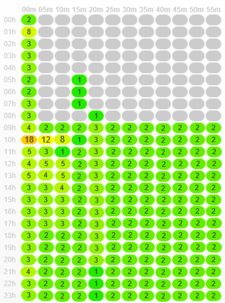

# Värmekarta för arbetsflöde {#workflow-heatmap}

Värdkarta för kampanjarbetsflöde består av en färgkodad grafisk representation av alla arbetsflöden som körs för närvarande. Det är bara tillgängligt för **Kampanjadministratörer**.

## Kom igång med Workflow HeatMap {#about-the-workflow-heatmap}

Genom att ge en snabb översikt över antalet samtidiga arbetsflöden gör Workflow HeatMap det möjligt för Adobe Campaign plattformsadministratörer att övervaka belastningen på instansen och planera arbetsflödena utifrån detta.

Mer exakt hjälper det plattformsadministratörerna att:

* se och förstå samtidiga arbetsflöden
* filtrera arbetsflöden per varaktighet för att se vilka arbetsflöden som kan stöta på problem
* Filtrera aktiviteter efter varaktighet för att se vilka aktiviteter som kan stöta på problem
* enkelt hitta enskilda arbetsflöden och alla relaterade aktiviteter (med deras varaktighet)
* Filter efter arbetsflödestyp: [tekniska arbetsflöden](technical-workflows.md) eller [kampanjarbetsflöden](campaign-workflows.md)
* leta efter ett specifikt arbetsflöde att analysera

>[!NOTE]
>
>Förutom **Heatmap för arbetsflöde** kan du skapa ett arbetsflöde där du kan övervaka statusen för en uppsättning arbetsflöden och skicka återkommande meddelanden till arbetsledare. Mer information finns i [dedikerad sektion](workflow-supervision.md).

Om du använder Workflow HeatMap måste du ha god förståelse för följande koncept: [Arbetsflöden](about-workflows.md), [Verksamhet](activities.md) och [Bästa praxis för arbetsflöden](workflow-best-practices.md).

## Anpassa Workflow HeatMap {#using-the-heatmap}

>[!NOTE]
>
>Om inga data visas i Workflow HeatMap klickar du på **[!UICONTROL Load data]** -knappen.

1. Gå till **[!UICONTROL Monitoring]** och klicka på **[!UICONTROL Workflow HeatMap]** länk för att visa **[!UICONTROL Campaign Workflow HeatMap]** sida.

   

1. Välj en dag i kalendern.

   Som standard visas arbetsflödesaktiviteten för den aktuella dagen på sidan. Du kan ändra den och välja vilken dag som helst i det förflutna.

   >[!NOTE]
   > 
   >Som standard är tidszonen för Workflow HeatMap den som är definierad för den aktuella administratörsanvändaren. Du kan till exempel vilja ändra den om du inte befinner dig inom samma område som de marknadsföringsanvändare du arbetar med.

1. Klicka på knappen **[!UICONTROL Filters]**.

   

1. Använd skjutreglaget för att ange den minsta längden från 0 sekund till 1 timme. På så sätt kan du bara söka efter arbetsflöden som körs i mer än ett visst antal sekunder eller minuter.

   

1. Du kan också välja ett specifikt arbetsflöde i **[!UICONTROL Workflows]** listruta.

   

   >[!NOTE]
   >
   >The **[!UICONTROL Min duration]** filtret används. Om du inte kan hitta ett visst arbetsflöde återställer du den kortaste tiden till 0 så att alla arbetsflöden visas i listan.

1. Du kan även filtrera på **[!UICONTROL Workflow type]** :

   * **[!UICONTROL Technical]** : Endast [inbyggda tekniska arbetsflöden](technical-workflows.md) och [arbetsflöden för datahantering](targeting-workflows.md#data-management) visas.
   * **[!UICONTROL Marketing]** : Endast arbetsflöden kopplade till en marknadsföringskampanj, s.k. [kampanjarbetsflöden](campaign-workflows.md), visas.

1. Om du vill söka efter ett specifikt arbetsflöde efter namn kan du även använda **[!UICONTROL Workflow name filter]** fält.

1. Om du har redigerat några arbetsflöden däremellan klickar du på **[!UICONTROL Reload data]** om du vill uppdatera de data som visas i rutnätet.

## Tolka heatMap för arbetsflöde {#reading-the-heatmap}

The Campaign Workflow HeatMap är ett rutnät som är naturligt läsbart uppifrån vänster till nerifrån och ned, vilket gör att det går att hitta&quot;aktiva zoner&quot; med ett grönt till rött färgkodat intervall.

* De mörkare röda cellerna motsvarar punkter när ett stort antal arbetsflöden körs samtidigt.
* De grå cellerna motsvarar perioder när inget arbetsflöde körs.

Om du vill veta hur färgkoden används och hur du navigerar i HeatMap klickar du på knappen **[!UICONTROL Help]** -knappen.

Varje rad representerar en timme på dagen och varje cell representerar fem minuter av den timmen.

I rutnätet visas alla arbetsflöden som körs samtidigt för var och en av dessa 5-minutersperioder.

I exemplet nedan körs tre arbetsflöden mellan 08:05 och 8:05 (oavsett hur långa de är):

1. Klicka på en färgad cell för att visa information om alla samtidiga arbetsflöden som körs under den här perioden.

   

   För varje arbetsflöde visas alla aktiviteter som det innehåller, med deras varaktighet.

1. Klicka på arbetsflödes-ID eller namn för att öppna ett arbetsflöde direkt.
1. Gå tillbaka till **[!UICONTROL Campaign Workflow HeatMap]** visa klickar du på **[!UICONTROL Home]** -knappen.

## Användningsexempel: använd HeatMap för att vidta åtgärder {#use-cases--using-the-heatmap-to-take-actions}

Det finns två huvudfall där HeatMap för kampanjarbetsflödet kan vara användbart.

### Minska antalet samtidiga arbetsflöden {#reducing-the-number-of-concurrent-workflows}

Som Campaign-administratör kan Workflow HeatMap hjälpa dig att förstå belastningen på instansen och planera befintliga eller nya arbetsflöden vid lämpliga tidpunkter.

1. Från **[!UICONTROL Campaign Workflow HeatMap]** visa klickar du på **[!UICONTROL Filters]** -knappen.
1. Ange en varaktighet på några sekunder eller några minuter.
1. Undvik de kortaste arbetsflödena som inte är viktiga genom att öka varaktighetsfiltret.

   

1. Utforska resultaten för att förstå inläsningen av instansen och vidta lämpliga åtgärder:

   * Om du stöter på prestandaproblem och om en eller flera röda celler visas i stödrastret bör du ändra starttiderna för flera arbetsflöden. Be marknadsföringsanvändarna att flytta manuella arbetsflöden från upptagna (&quot;heta&quot;) perioder till mer tillgängliga tidsrymder. Detta bör upprätthålla en stabil aktivitetsnivå under dagen.
   * För att undvika toppar och förhindra att instansen överbelastas bör du titta på HeatMap innan du planerar nya arbetsflöden och välja den bästa tiden. Överväg tidsrymder som motsvarar grå eller gröna celler i rutnätet för att starta nya arbetsflöden.

### Hitta tidskrävande arbetsflöden som påverkar prestandan {#finding-long-running-workflows-that-impact-performance}

Som kampanjadministratör hjälper Workflow HeatMap dig att hitta de längsta arbetsflödena som kan göra aktiviteten långsammare.

1. Från **[!UICONTROL Campaign Workflow HeatMap]** visa klickar du på **[!UICONTROL Filters]** -knappen.
1. Ange varaktighet till 1 timme.

   

1. Inkludera fler resultat genom att minska **[!UICONTROL Min duration]** filter.
1. Utforska resultaten för att hitta de längsta arbetsflödena, som kan ha större effekt på server- och databasresurserna (CPU, RAM, nätverk, IOPS och så vidare).
1. Vidta lämpliga åtgärder:

   * Rekommendera marknadsföringsanvändare att dela upp de längsta arbetsflödena för att minska bearbetningstiden.
   * Starta en djupgående analys av specifika arbetsflöden och specifika aktiviteter (som JavaScript, import, export och så vidare) för att isolera problemen och lättare lösa dem.

## Använd HeatMap för att förbättra arbetsflödesplaneringen {#example--using-the-heatmap-to-improve-workflow-planning}

I exemplet nedan visas hur planering kan vara mer effektiv och hur prestanda kan förbättras när du använder Adobe Campaign Workflow HeatMap.

I det här fallet klagar många användare över arbetsflödets prestanda. Du måste kontrollera vad som saktar ned aktiviteten och hur du löser problemet.

1. Gå till **[!UICONTROL Monitoring]** och klicka på **[!UICONTROL Workflows]** länk för att visa **[!UICONTROL Campaign Workflow HeatMap]** sida.
1. Ange **[!UICONTROL Min duration]** filtrera till 5 minuter.
1. Ange **[!UICONTROL Workflow type]** filtrera till **[!UICONTROL Marketing]**.
1. I HeatMap-rutnätet bör du tänka på följande:

   

   * Kampanjarbetsflöden som varar femtio (mer än fem minuter) körs kl. 10.
   * De flesta har ett väntande läge (som standard är samtidighetsgränsen inställd på 20).
   * De väntande arbetsflödena måste startas om manuellt varje dag.
   * Prestandan är låg.

1. I stället för att ha femtio arbetsflöden från kl. 10 ska du distribuera arbetsflödenas starttider jämnt under resten av dagen.
1. Gå tillbaka till **[!UICONTROL Campaign Workflow HeatMap]** och klickar på **[!UICONTROL Reload data]** -knappen.
1. Observera följande:

   

   * Endast 18 långvariga arbetsflöden för kampanjer körs fortfarande kl. 10.
   * Det finns inga fler arbetsflöden som väntar (gränsen för samtidighet är fortfarande satt till 20).
   * Starttider för arbetsflöden är jämnt fördelade över hela dagen.
   * Inga fler användare klagar på prestandaproblem.
