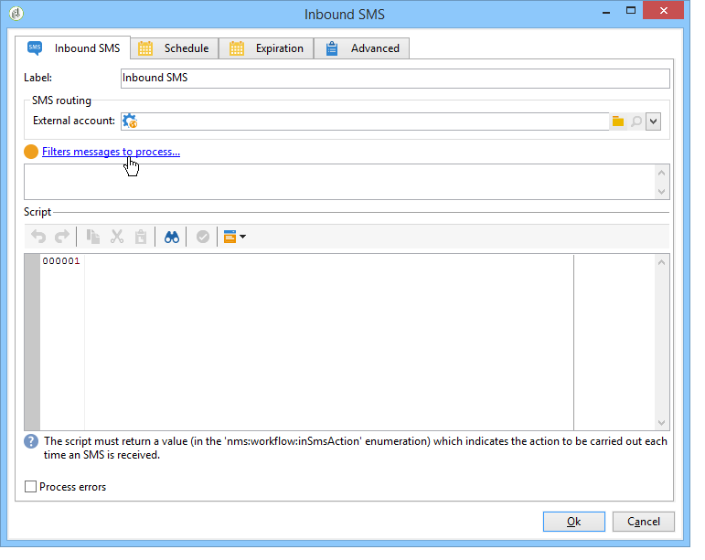

# Inkommande SMS{#inbound-sms}

The **Inkommande SMS** kan du hämta och bearbeta textmeddelanden från ett externt konto.

## Egenskaper {#properties}

Den första fliken i **Inkommande SMS** Med -aktivitet kan du ange routningsparametrar för SMS-meddelanden och ange det skript som ska köras när du tar emot varje meddelande. På den andra fliken kan du tilldela aktiviteten ett schema och på den tredje fliken definieras aktivitetens förfallovillkor.

1. **[!UICONTROL SMS routing]**: Välj det externa konto som ska användas för SMS-återställning. Externa konton konfigureras via **[!UICONTROL Administration > Platform > External accounts]** trädnod.
1. **[!UICONTROL Script]**
1. **[!UICONTROL Schedule]**

   

1. **[!UICONTROL Expiration]**

The **[!UICONTROL Script]**, **[!UICONTROL Schedule]** och **[!UICONTROL Expiry]** -tabbar beskrivs i [Inkommande e-postmeddelanden](inbound-emails.md).
