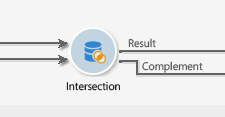

# Skärningspunkt{#intersection}

En aktivitet av typen **Skärning** skapar ett mål från skärningspunkten för de mottagna målen.

Med en skärningspunkt kan du bara extrahera den population som är gemensam för alla inkommande aktivitetsresultat. Målet skapas med alla mottagna resultat: alla tidigare aktiviteter måste därför avslutas innan skärningspunkten kan utföras. Om du vill konfigurera den här aktiviteten måste du ange en etikett för den samt alternativ för resultatet.

Mer information om hur du konfigurerar och använder skärningsaktiviteten finns i [Extrahera leddata (skärning)](targeting-workflows.md#extracting-joint-data--intersection-).

Markera alternativet **[!UICONTROL Generate complement]** om du vill bearbeta den återstående fyllningen. Komplementet ska innehålla en kombination av resultaten av alla inkommande aktiviteter minus skärningspunkten. En ytterligare utgående övergång läggs sedan till i aktiviteten enligt följande:

## Exempel på skärning {#intersection-example}

I följande exempel är syftet med skärningen att beräkna mottagarna som är gemensamma för tre enkla frågor för att skapa en lista.

1. Efter tre enkla frågor infogar du en aktivitet av typen **[!UICONTROL Intersection]**.

   I det här exemplet är frågorna avsedda för män, mottagare i Paris och mottagare mellan 18 och 30 år.

1. Konfigurera skärningspunkten. Om du vill göra det väljer du avstämningsmetoden **[!UICONTROL Keys only]** eftersom populationerna som är resultatet av frågorna innehåller konsekventa data.
1. Om du har angett ytterligare data för frågorna kan du välja att behålla endast de som är delade av mottagarna genom att markera den relevanta rutan.
1. Om du vill använda resten av data (med avseende på frågorna men inte deras skärningspunkt) markerar du rutan **[!UICONTROL Generate complement]**.
1. Lägg till en aktivitet för listuppdatering efter skärningsresultatet. Du kan också lägga till en listuppdatering till komplementet om du vill använda den här också.
1. Kör arbetsflödet. Här gäller två mottagare för alla tre inmatade frågor samtidigt. Komplementet består av fem mottagare som endast tillämpar en eller två av de tre frågorna.

   Resultatet av överlappningen skickas till den första listuppdateringen. Om du har valt att använda komplementet skickas det också till den andra listuppdateringen.

   

## Indataparametrar {#input-parameters}

* tableName
* schema

Varje inkommande händelse måste ange ett mål som definieras av dessa parametrar.

## Utdataparametrar {#output-parameters}

* tableName
* schema
* recCount

Den här uppsättningen med tre värden identifierar det mål som uppstår från skärningen. **[!UICONTROL tableName]** är namnet på tabellen som registrerar målidentifierarna, **[!UICONTROL schema]** är populationens schema (vanligtvis **[!UICONTROL nms:recipient]**) och **[!UICONTROL recCount]** är antalet element i tabellen.
