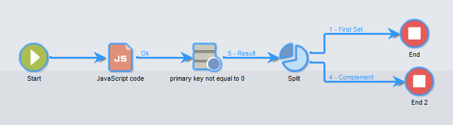
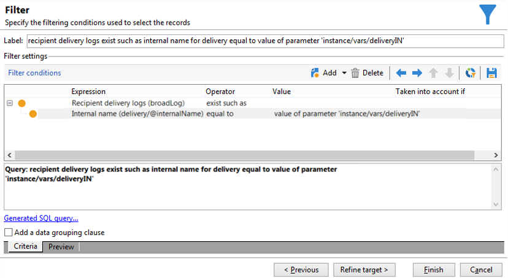

# JavaScript-skript och mallar{#javascript-scripts-and-templates}


Skript gör det möjligt att beräkna värden, utbyta data mellan olika uppgifter i processen och att utföra specifika åtgärder med SOAP.

Skript är vanliga i ett arbetsflödesdiagram:

* Alla aktiviteter har initieringsskript. Ett initieringsskript körs när aktiviteten aktiveras och kan användas för att initiera variabler och ändra egenskaperna.
* Aktiviteten &quot;JavaScript code&quot; används bara för att köra ett skript.
* Aktiviteten Test utvärderar JavaScript-uttryck för att aktivera lämplig övergång.
* De flesta textfält är JavaScript-mallar: JavaScript-uttryck kan finnas mellan &lt;%= och %>. Dessa fält har en knapp som öppnar en nedrullningsbar lista där du kan ange uttryck.

  

## Objekt som exponeras {#objects-exposed}

JavaScript-skript som körs i ett arbetsflödes-sammanhang får tillgång till en serie ytterligare globala objekt.

* **instans**: Representerar arbetsflödet som körs. Det här objektets schema är **xtk:workflow**.
* **aktivitet**: Representerar de aktiviteter som körs. Schemat för det här objektet är **xtk:workflowTask**.
* **event**: Representerar händelserna som aktiverade aktiviteten som körs. Det här objektets schema är **xtk:workflowEvent**. Det här objektet har inte initierats för aktiviteter av typen **AND-join** som har aktiverats från flera övergångar.
* **events**: Representerar listan över händelser som aktiverade den aktuella aktiviteten. Det här objektets schema är **xtk:workflowEvent**. Den här tabellen innehåller vanligtvis ett element men kan innehålla flera för **AND-join** -typaktiviteter som har aktiverats baserat på flera övergångar.
* **aktivitet**: Representerar modellen för aktiviteten som körs. Det här objektets schema beror på aktivitetstypen. Det här objektet kan ändras av initieringsskriptet, i andra skript, med obestämda effekter.

De tillgängliga egenskaperna för dessa objekt kan visas i en nedrullningsbar lista genom att klicka på knappen till höger om skriptverktygsfältet.

>[!CAUTION]
>
>Egenskaperna för dessa objekt är skrivskyddade, förutom underegenskaperna för egenskapen vars.
>  
>De flesta av dessa egenskaper uppdateras endast efter att en elementär uppgift har körts eller när instansen är passiv. De värden som läses matchar inte nödvändigtvis den aktuella statusen utan den tidigare statusen.

**Exempel**

I det här exemplet och i följande exempel skapar du ett arbetsflöde som innehåller en **JavaScript-kodsaktivitet** och en **End** -aktivitet, vilket visas i följande diagram.


Dubbelklicka på aktiviteten **JavaScript-kod** och infoga följande skript:

```
logInfo("Label: " + instance.label)
logInfo("Start date: " + task.creationDate)
```

Funktionen **[!UICONTROL logInfo(message)]** infogar ett meddelande i loggen.

Klicka på **[!UICONTROL OK]** för att stänga guiden Skapa och starta sedan arbetsflödet med åtgärdsknapparna längst upp till höger i listan med arbetsflöden. När körningen är klar, se loggen. Du bör se två meddelanden som motsvarar skriptet: den ena visar arbetsflödets etikett, den andra visar det datum då skriptet aktiverades.

## Variabel {#variables}

Variablerna är de kostnadsfria egenskaperna för objekten **[!UICONTROL instance]**, **[!UICONTROL task]** och **[!UICONTROL event]**. De JavaScript-typer som är tillåtna för dessa variabler är **[!UICONTROL string]**, **[!UICONTROL number]** och **[!UICONTROL Date]**.

### Förekomstvariabler {#instance-variables}

Instansvariablerna (**[!UICONTROL instance.vars.xxx]**) är jämförbara med globala variabler. De delas av alla aktiviteter.

### Uppgiftsvariabler {#task-variables}

Aktivitetsvariablerna (**[!UICONTROL task.vars.xxx]**) är jämförbara med lokala variabler. De används bara av den aktuella uppgiften. Variablerna används av beständiga aktiviteter för att lagra data och används ibland för att utbyta data mellan olika skript för samma aktivitet.

### Händelsevariabler {#event-variables}

Händelsevariablerna (**[!UICONTROL vars.xxx]**) aktiverar datautbyte mellan de elementära uppgifterna i en arbetsflödesprocess. Dessa variabler skickas av aktiviteten som aktiverade den pågående uppgiften. Det går att ändra dem och definiera nya. De överförs sedan till följande aktiviteter.

>[!CAUTION]
>
>När det gäller aktiviteter av typen [AND-join](and-join.md) sammanfogas variablerna, men om samma variabel definieras två gånger uppstår en konflikt och värdet är fortfarande obestämt.

Händelsen är de vanligaste variablerna, och de bör användas i stället för förekomstvariabler.

Vissa händelsevariabler ändras eller läses av de olika aktiviteterna. Dessa är alla strängtypsvariabler. En export ställer till exempel in variabeln **[!UICONTROL vars.filename]** med det fullständiga namnet på filen som just har exporterats. Alla dessa lästa eller ändrade variabler beskrivs i [Om aktiviteter](activities.md) i avsnitten **Indataparametrar** och **Utdataparametrar** för aktiviteterna.

### Användningsfall {#example}

>[!NOTE]
>
>Det finns fler användningsexempel för arbetsflöden i [det här avsnittet](workflow-use-cases.md).

**Exempel 1**

I det här exemplet används en instansvariabel för att dynamiskt beräkna den delade procentandelen som ska användas på en population.

1. Skapa ett arbetsflöde och lägg till en Start-aktivitet.

1. Lägg till och konfigurera en JavaScript-kodsaktivitet för att definiera en instansvariabel.

   Till exempel: `instance.vars.segmentpercent = 10;`

   

1. Lägg till en Query-aktivitet och målmottagare efter behov.

1. Lägg till en delad aktivitet och konfigurera den så att den utför ett slumpmässigt urval av den inkommande populationen. Procentvärdet för samplingen kan vara vad du vill. Den anges till 50 % i det här exemplet.

   Det är den här procentandelen som uppdateras dynamiskt tack vare instansvariabeln som definierats tidigare.

   

1. I avsnittet Initieringsskript på fliken Avancerat i aktiviteten Dela definierar du ett JS-villkor. JS-villkoret väljer den slumpmässiga samplingsprocenten för den första övergången som kommer från aktiviteten Dela och uppdaterar den till ett värde som anges av instansvariabeln som skapades tidigare.

   ```
   activity.transitions.extractOutput[0].limiter.percent = instance.vars.segmentpercent;
   ```

   

1. Se till att komplementet genereras i en separat övergång av aktiviteten Dela och lägg till aktiviteter efter varje utgående övergång.

1. Spara och kör arbetsflödet. Den dynamiska samplingen tillämpas enligt instansvariabeln.

   

**Exempel 2**

1. Ta arbetsflödet från föregående exempel och ersätt skriptet för aktiviteten **JavaScript Code** med följande skript:

   ```
   instance.vars.foo = "bar1"
   vars.foo = "bar2"
   task.vars.foo = "bar3"
   ```

1. Lägg till följande skript i initieringsskriptet för aktiviteten **End**:

   ```
   logInfo("instance.vars.foo = " + instance.vars.foo)
   logInfo("vars.foo = " + vars.foo)
   logInfo("task.vars.foo = " + task.vars.foo)
   ```

1. Starta arbetsflödet och titta sedan på loggen.

   ```
   Workflow finished
   task.vars.foo = undefined
   vars.foo = bar2
   instance.vars.foo = bar1
   Starting workflow (operator 'admin')
   ```

I det här exemplet visas att aktiviteten efter **JavaScript Code** kommer åt instansvariablerna och händelsevariablerna, men aktivitetsvariablerna är inte tillgängliga utifrån (&#39;undefined&#39;).

### Anropa en instansvariabel i en fråga {#calling-an-instance-variable-in-a-query}

När du har angett en instansvariabel i en aktivitet kan du återanvända den i en arbetsflödesfråga.

Om du vill anropa variabeln **instance.vars.xxx = &quot;yyy&quot;** i ett filter anger du **$(instance/vars/@xxx)**.

Exempel:

1. Skapa en instansvariabel som definierar ett leveransens interna namn via **[!UICONTROL JavaScript code]**: **instance.vars.deliveryIN = &quot;DM42&quot;**.

   

1. Skapa en fråga vars mål- och filtreringsdimensioner är mottagarna. I villkoren anger du att du vill söka efter alla mottagare som har fått leveransen som anges av variabeln.

   Som påminnelse lagras den här informationen i leveransloggarna.

   Om du vill referera till instansvariabeln i kolumnen **[!UICONTROL Value]** anger du **$(instance/vars/@deliveryIN)**.

   Arbetsflödet returnerar mottagarna av DM42-leveransen.

   

## Avancerade funktioner {#advanced-functions}

Förutom JavaScript standardfunktioner finns det specialfunktioner för att hantera filer, läsa eller ändra data i databasen eller lägga till meddelanden i loggen.

### Journal {#journal}

**[!UICONTROL logInfo(message)]** var detaljerat i exemplen ovan. Den här funktionen lägger till ett informationsmeddelande i journalen.

**[!UICONTROL logError(message)]** lägger till ett felmeddelande i loggen. Skriptet avbryter körningen och arbetsflödet ändras till felstatus (instansen pausas som standard).

## Initieringsskript {#initialization-script}

Under vissa omständigheter kan du ändra en aktivitetsegenskap vid körningen.

De flesta aktivitetsegenskaperna kan beräknas dynamiskt, antingen med en JavaScript-mall eller eftersom arbetsflödesegenskaperna uttryckligen tillåter att värdet beräknas med ett skript.

För andra egenskaper måste du dock använda initieringsskriptet. Skriptet utvärderas innan aktiviteten körs. Variabeln **[!UICONTROL activity]** refererar till aktiviteten som motsvarar aktiviteten. Egenskaperna för den här aktiviteten kan ändras och påverkar bara den här aktiviteten.

**Relaterade ämnen**
[Exempel på JavaScript-kod i arbetsflöden](javascript-in-workflows.md)
