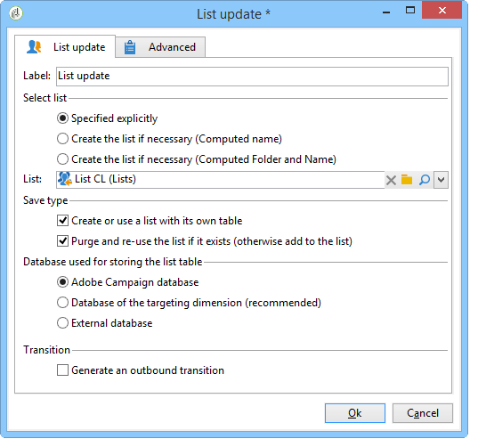

# Listuppdatering{#list-update}

A **Listuppdatering** -aktiviteten lagrar populationen som anges i övergången i en lista över mottagare.

Listan kan väljas från listan med befintliga grupper.

Den kan också skapas med **[!UICONTROL Create the list if necessary (Computed name)]** och **[!UICONTROL Create the list if necessary (Computed Folder and Name)]** alternativ. Med de här alternativen kan du välja vilken etikett du vill använda för att skapa en lista, och senare den mapp som listan ska sparas i. Etiketten kan också genereras automatiskt genom att du infogar dynamiska fält eller ett skript. De olika dynamiska fälten är tillgängliga på snabbmenyn till höger om etiketten.

Om listan redan finns läggs mottagarna till i det befintliga innehållet, såvida du inte markerar **[!UICONTROL Purge the list if it exists (otherwise add to the list)]** alternativ. I det här fallet tas innehållet i listan bort före uppdateringen.

Om du vill att den skapade eller uppdaterade listan ska använda en annan tabell än mottagartabellen ska du kontrollera **[!UICONTROL Create or use a list with its own table]** alternativ.

Om du vill använda alternativet måste de specifika tabellerna i fråga ha konfigurerats i din Adobe Campaign-instans.

Om du sparar ett mål i en lista markeras i allmänhet slutet av ett arbetsflöde. Som standard är **[!UICONTROL List update]** aktiviteten inte har någon utgående övergång. Kontrollera **[!UICONTROL Generate an outbound transition]** för att lägga till ett.

 [Upptäck hur du skapar en lista med mottagare från Utforskaren i en video](#video)

## Exempel: Listuppdatering {#example--list-update}

I följande exempel följer listuppdateringsaktiviteten en fråga som riktar sig till män över 30 som bor i Frankrike. Listan skapas från resultatet av frågan. Den uppdateras sedan varje gång den startas från arbetsflödet. Det kan till exempel användas regelbundet för riktade kampanjerbjudanden.

1. Lägg till en **[!UICONTROL list update activity]** direkt efter en fråga och öppna den för att redigera den.

   Mer information om hur du skapar en fråga i ett arbetsflöde finns i [Fråga](query.md).

1. Du kan välja en etikett för aktiviteten.
1. Välj **[!UICONTROL Create the list if necessary (Calculated name)]** för att visa att listan skapas när det första arbetsflödet har körts och sedan uppdateras med följande körningar.
1. Välj den mapp där du vill spara listan.
1. Ange en etikett för listan. Du kan infoga dynamiska fält för att automatiskt generera namnet från listan. I det här exemplet har listan samma namn som frågan för att enkelt identifiera innehållet.
1. Lämna **[!UICONTROL Purge the list if it exists (otherwise add to the list)]** markerat för att ta bort mottagare som inte matchar målinriktningsvillkoret och för att infoga de nya i listan.
1. Lämna även **[!UICONTROL Create or use a list with its own table]** alternativet är markerat.
1. Lämna **[!UICONTROL Generate an outbound transition]** alternativet inte markerat.
1. Klicka **[!UICONTROL Ok]** starta arbetsflödet.

   

   Listan med matchande mottagare skapas eller uppdateras.

## Indataparametrar {#input-parameters}

* tableName
* schema

Identifierar populationen som ska sparas i gruppen.

## Utdataparametrar {#output-parameters}

* groupId: Gruppidentifierare.

## Videokurs {#video}

I den här videon visas hur du skapar en lista med mottagare från Utforskaren.

>[!VIDEO](https://video.tv.adobe.com/v/25602/quality=12)

Det finns fler instruktionsvideor för Campaign Classic [här](https://experienceleague.adobe.com/docs/campaign-classic-learn/tutorials/overview.html?lang=sv).
