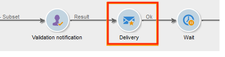

# Använda den lokala godkännandeaktiviteten{#using-the-local-approval-activity}

The **[!UICONTROL Local approval]** Med en integrerad aktivitet i ett arbetsflöde för målanpassning kan du skapa en process för godkännande av mottagare innan leveransen skickas.

>[!CAUTION]
>
>Om du vill använda den här funktionen måste du köpa modulen Distribuerad marknadsföring, som är ett kampanjalternativ. Kontrollera licensavtalet.

Vi har skapat följande arbetsflöde för målinriktning för att konfigurera det här användningsexemplet:

Huvudstegen i den lokala godkännandeprocessen är:

1. Den befolkning som blir resultatet av målinriktning kan begränsas tack vare **[!UICONTROL Split]** typaktivitet med hjälp av en datadistributionsmodell.

   

1. The **[!UICONTROL Local approval]** aktiviteten tar sedan över och skickar ett e-postmeddelande till varje lokal ansvarig. Aktiviteten förlängs tills varje lokal ansvarig godkänner mottagarna som tilldelats dem.

1. När tidsgränsen för godkännande har nåtts startar arbetsflödet igen. I det här exemplet **[!UICONTROL Delivery]** aktiviteten startar och leveransen skickas till de godkända målen.

   >[!NOTE]
   >
   >När tidsgränsen är nådd utesluts mottagare som inte har godkänts från målsättningen.

   

1. Några dagar senare, den andra **[!UICONTROL Local approval]** typaktivitet skickar ett e-postmeddelande till varje lokal ansvarig med en sammanfattning av de åtgärder som utförs av deras kontakter (klick, öppningar osv.).

## Steg 1: Skapa mallen för datadistribution {#step-1--creating-the-data-distribution-template-}

Med mallen för datadistribution kan du begränsa den population som blir resultatet av målgruppsanpassning baserat på datagruppering samtidigt som du kan tilldela varje värde till en lokal ansvarig. I det här exemplet har vi definierat **[!UICONTROL Email address domain]** fält som ett distributionsfält och som tilldelats en domän till varje lokal ansvarig

Mer information om hur du skapar en mall för datadistribution finns i [Begränsa antalet delmängdsposter per datadistribution](split.md#limiting-the-number-of-subset-records-per-data-distribution).

1. Om du vill skapa en mall för datadistribution går du till **[!UICONTROL Resources > Campaign management > Data distribution]** nod och klicka **[!UICONTROL New]**.

   

1. Klicka på fliken **[!UICONTROL General]**.  

   

1. Ange **[!UICONTROL Label]** och **[!UICONTROL Distribution context]**. I det här exemplet har vi valt **[!UICONTROL Recipient]** målschema och **[!UICONTROL Email domain]** som ett distributionsfält. Listan över mottagare kommer att delas upp efter domän.
1. I **[!UICONTROL Distribution type]** väljer du hur målbegränsningsvärdet ska uttryckas i **[!UICONTROL Distribution]** -fliken. Här har vi valt **[!UICONTROL Percentage]**.
1. I **[!UICONTROL Approval storage]** anger du lagringsschemat för godkännandena som matchar målschemat som används. Här använder vi standardlagringsschemat: **[!UICONTROL Local approval of recipients]**.
1. Klicka sedan på **[!UICONTROL Advanced parameters]** länk.

   

1. Behåll **[!UICONTROL Approve the targeted messages]** markerat så att alla mottagare är förmarkerade i listan över mottagare som ska godkännas.
1. I **[!UICONTROL Delivery label]** -fältet har vi lämnat standarduttrycket (leveransens beräkningssträng). Standardetiketten för leveransen används i feedbackmeddelandet.
1. I **[!UICONTROL Grouping field]** -avsnittet har vi valt **[!UICONTROL Gender]** som ett grupperingsfält för att visa mottagare i godkännanderutiner och feedback-meddelanden.
1. I **[!UICONTROL Edit targeted messages]** har vi valt **[!UICONTROL Edit recipients]** webbprogram och **[!UICONTROL recipientId]** parameter. I meddelanden om godkännande och feedback kan mottagarna klickas och peka mot webbprogrammets URL. Den extra URL-parametern kommer att vara **[!UICONTROL recipientId]**.
1. Klicka sedan på **[!UICONTROL Distribution]** -fliken. Ange följande fält för varje domän:

   

   * **[!UICONTROL Value]**: Ange värdet för domännamnet.
   * **[!UICONTROL Percentage / Fixed]**: för varje domän anger du max. antal mottagare som du vill skicka leveransen till. I det här exemplet vill vi begränsa leveransen till 10 % per domän.
   * **[!UICONTROL Label]**: Ange etiketten för domänen som ska visas i meddelanden om godkännande och feedback.
   * **[!UICONTROL Group or operator]**: Välj den operator eller grupp av operatorer som tilldelats domänen.

      >[!CAUTION]
      >
      >Se till att operatorerna har tilldelats rätt behörighet.

## Steg 2: Skapa målarbetsflödet {#step-2--creating-the-targeting-workflow}

Vi har skapat följande arbetsflöde för målinriktning för att konfigurera det här användningsexemplet:

Följande aktiviteter lades till:

* Två **[!UICONTROL Query]** verksamhet,
* Ett **[!UICONTROL Intersection]** verksamhet,
* Ett **[!UICONTROL Split]** verksamhet,
* Ett **[!UICONTROL Local approval]** verksamhet,
* Ett **[!UICONTROL Delivery]** verksamhet,
* Ett **[!UICONTROL Wait]** verksamhet,
* En sekund **[!UICONTROL Local approval]** verksamhet,
* Ett **[!UICONTROL End]** aktivitet.

### Frågor, skärning och delning {#queries--intersection-and-split}

Uppströms målgruppsanpassning består av två frågor, en skärningspunkt och en delning. Den befolkning som blir resultatet av målinriktning kan begränsas med hjälp av en **[!UICONTROL Split]** -aktivitet med hjälp av en datadistributionsmall.

Mer information om hur du konfigurerar en delad aktivitet finns i [Dela](split.md). Hur man skapar en mall för datadistribution beskrivs i [Begränsa antalet delmängdsposter per datadistribution](split.md#limiting-the-number-of-subset-records-per-data-distribution).

Om du inte vill begränsa antalet ifyllningar i frågan behöver du inte använda kommandot **[!UICONTROL Query]**, **[!UICONTROL Intersection]** och **[!UICONTROL Split]** verksamhet. I det här fallet fyller du i datautdelningsmallen i den första **[!UICONTROL Local approval]** aktivitet.

1. I **[!UICONTROL Record count limitation]** väljer du **[!UICONTROL Limit the selected records]** och klicka på **[!UICONTROL Edit]** länk.

   

1. Välj **[!UICONTROL Keep only the first records after sorting]** och klicka **[!UICONTROL Next]**.

   

1. I **[!UICONTROL Sort columns]** lägger du till det fält som sorteringen ska användas på. Här har vi valt **[!UICONTROL Email]** fält. Klicka på **[!UICONTROL Next]**.

   

1. Välj **[!UICONTROL By data distribution]** väljer du den distributionsmall som skapades tidigare (se [Steg 1: Skapa en mall för datadistribution](#step-1--creating-the-data-distribution-template-)) och klicka på **[!UICONTROL Finish]**.

   

I distributionsmallen har vi valt att begränsa populationen till 10 % per grupperingsvärde, vilket sammanfaller med de värden som visas i arbetsflödet (340 som indata och 34 som utdata).

### Godkännandemeddelande {#approval-notification}

The **[!UICONTROL Local approval]** kan du skicka ett meddelande till varje lokal ansvarig.

Mer information om hur du konfigurerar **[!UICONTROL Local approval]** aktivitet, se [Lokalt godkännande](local-approval.md).

Följande fält måste anges:

1. Välj alternativet **[!UICONTROL Target approval notification]** i avsnittet **[!UICONTROL Action to execute]**.
1. Välj alternativet **[!UICONTROL Specified in the transition]** i avsnittet **[!UICONTROL Distribution context]**.

   Om du inte vill begränsa målpopulationen väljer du **[!UICONTROL Explicit]** här och ange den distributionsmall som skapades tidigare i **[!UICONTROL Data distribution]** fält.

1. I **[!UICONTROL Notification]** väljer du leveransmall och ämne som ska användas för e-postmeddelandet. Här har vi valt standardmallen: **[!UICONTROL Local approval notification]**.
1. I **[!UICONTROL Approval schedule]** -avsnittet har vi behållit standardtiden för godkännande (3 dagar) och lagt till en påminnelse. Leveransen upphör 3 dagar efter det att godkännandet har börjat. När tidsgränsen för godkännande har nåtts beaktas inte mottagare som inte har godkänts av målinriktningen.

Ett e-postmeddelande skickas av **[!UICONTROL Local approval]** till lokala tillsynsmyndigheter.

### Vänta {#wait}

Med vänteaktiviteten kan du skjuta upp starten av den andra lokala godkännandeaktiviteten som skickar leveransfeedback-meddelandet. I **[!UICONTROL Duration]** fält, vi har angett **[!UICONTROL 5d]** värde (5 dagar). De åtgärder som mottagarna utför i 5 dagar efter att leveransen har skickats kommer att ingå i feedbackmeddelandet.

### Feedback-meddelande {#feedback-notification}

Den andra **[!UICONTROL Local approval]** Med den här aktiviteten kan du skicka feedback till varje lokal ansvarig.

Följande fält måste anges.

1. I **[!UICONTROL Action to execute]** avsnitt, välja **[!UICONTROL Delivery feedback report]**.
1. I **[!UICONTROL Delivery]** avsnitt, välja **[!UICONTROL Specified in the transition]**.
1. I **[!UICONTROL Notification]** väljer du leveransmall och ämne som ska användas för e-postmeddelandet.

När tidsgränsen som konfigurerats i vänteaktiviteten har nåtts, den andra **[!UICONTROL Local approval]** typaktivitet skickar följande e-postmeddelande till varje lokal ansvarig:

### Administratörens godkännandespårning {#approval-tracking-by-the-administrator}

Varje gång den lokala godkännandeaktiviteten startar skapas en godkännandeuppgift. Administratören kan styra alla dessa godkännandeåtgärder.

Gå till målarbetsflödet för kampanjen och klicka på **[!UICONTROL Local approval tasks]** -fliken.

Listan med lokala godkännandeuppgifter kan också nås via **[!UICONTROL Approval tasks]** -fliken i mallen för datadistribution.

Markera den uppgift som du vill övervaka och klicka på **[!UICONTROL Detail]** -knappen. The **[!UICONTROL General]** -fliken i den lokala godkännandeuppgiften kan du visa information om uppgiften. Om det behövs kan du ändra datumet för godkännande och påminnelsen.

På den här fliken visas följande information:

* aktivitetens etikett och dess ID
* den distributionsmall som används
* antalet riktade meddelanden
* det länkade arbetsflödet och kampanjen
* aktivitetsschemat

The **[!UICONTROL Distribution]** -fliken för uppgiften gör att du kan visa godkännandeloggarna, deras status, antalet meddelanden som ska skickas, godkännandedatumet samt den operator som godkände leveransen.

Välj en godkännandelogg och klicka på **[!UICONTROL Detail]** om du vill visa mer information. The **[!UICONTROL General]** på den lokala godkännandeloggen kan du visa allmän logginformation. Du kan också ändra godkännandestatusen.

På den här fliken visas följande information:

* den länkade godkännandeuppgiften
* godkännandestatus (**[!UICONTROL Approved]** eller **[!UICONTROL Pending]**)
* den distributionsmall som används
* den lokala ansvarige som godkänt och godkännandedatumet
* antalet riktade och godkända meddelanden

The **[!UICONTROL Targeted]** -fliken i godkännandeloggen visar en lista över målmottagare och deras godkännandestatus. Du kan ändra den här statusen om det behövs.

