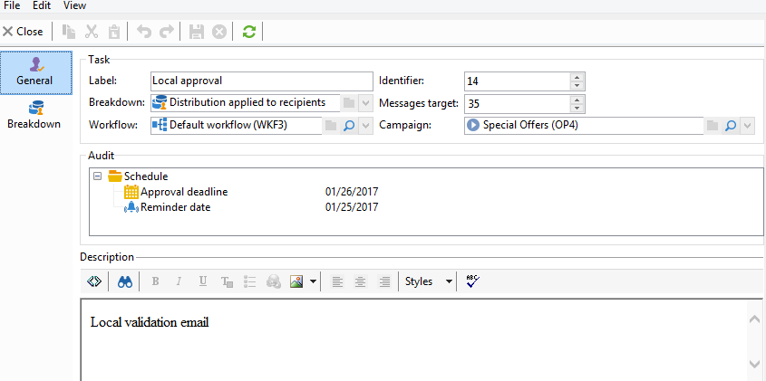

# Använda den lokala godkännandeaktiviteten{#using-the-local-approval-activity}

Med aktiviteten **[!UICONTROL Local approval]** som är integrerad i ett målarbetsflöde kan du konfigurera en process för mottagarnas godkännande innan leveransen skickas.

>[!CAUTION]
>
>Om du vill använda den här funktionen måste du köpa modulen Distribuerad marknadsföring, som är ett kampanjalternativ. Kontrollera licensavtalet.

Vi har skapat följande arbetsflöde för målinriktning för att konfigurera det här användningsexemplet:

Huvudstegen i den lokala godkännandeprocessen är:

1. Populationen som är resultatet av målinriktning kan begränsas tack vare en **[!UICONTROL Split]**-typaktivitet som använder en datadistributionsmodell.

   

1. Aktiviteten **[!UICONTROL Local approval]** tar sedan över och skickar ett e-postmeddelande till varje lokal ansvarig. Aktiviteten förlängs tills varje lokal ansvarig godkänner mottagarna som tilldelats dem.

1. När tidsgränsen för godkännande har nåtts startar arbetsflödet igen. I det här exemplet startar aktiviteten **[!UICONTROL Delivery]** och leveransen skickas till de godkända målen.

   >[!NOTE]
   >
   >När tidsgränsen är nådd utesluts mottagare som inte har godkänts från målsättningen.

   

1. Några dagar senare skickar den andra **[!UICONTROL Local approval]**-typaktiviteten ett e-postmeddelande till varje lokal ansvarig med en sammanfattning av de åtgärder som deras kontakter utför (klicka, öppnas osv.).

## Steg 1: Skapa en mall för datadistribution {#step-1--creating-the-data-distribution-template-}

Med mallen för datadistribution kan du begränsa den population som blir resultatet av målgruppsanpassning baserat på datagruppering samtidigt som du kan tilldela varje värde till en lokal ansvarig. I det här exemplet har vi definierat fältet **[!UICONTROL Email address domain]** som ett distributionsfält och tilldelat en domän till varje lokal ansvarig

Mer information om hur du skapar en mall för datadistribution finns i [Begränsa antalet delmängdsposter per datadistribution](split.md#limiting-the-number-of-subset-records-per-data-distribution).

1. Om du vill skapa en mall för datadistribution går du till noden **[!UICONTROL Resources > Campaign management > Data distribution]** och klickar på **[!UICONTROL New]**.

   

1. Klicka på fliken **[!UICONTROL General]**.  

   

1. Ange **[!UICONTROL Label]** och **[!UICONTROL Distribution context]**. I det här exemplet har vi valt målschemat **[!UICONTROL Recipient]** och fältet **[!UICONTROL Email domain]** som ett distributionsfält. Listan över mottagare delas upp efter domän.
1. I fältet **[!UICONTROL Distribution type]** väljer du hur målbegränsningsvärdet ska uttryckas på fliken **[!UICONTROL Distribution]**. Här har vi valt **[!UICONTROL Percentage]**.
1. I fältet **[!UICONTROL Approval storage]** anger du lagringsschemat för godkännandena som matchar målschemat som används. Här använder vi standardlagringsschemat: **[!UICONTROL Local approval of recipients]**.
1. Klicka sedan på länken **[!UICONTROL Advanced parameters]**.

   

1. Låt alternativet **[!UICONTROL Approve the targeted messages]** vara markerat så att alla mottagare är förmarkerade i listan över mottagare som ska godkännas.
1. I fältet **[!UICONTROL Delivery label]** har vi lämnat standarduttrycket (leveransens beräkningssträng). Standardetiketten för leveransen används i feedbackmeddelandet.
1. I avsnittet **[!UICONTROL Grouping field]** har vi valt fältet **[!UICONTROL Gender]** som ett grupperingsfält för att visa mottagare i godkännanderutiner och feedback-meddelanden.
1. I avsnittet **[!UICONTROL Edit targeted messages]** har vi valt webbprogrammet **[!UICONTROL Edit recipients]** och parametern **[!UICONTROL recipientId]**. I meddelanden om godkännande och feedback kan mottagarna klickas och peka mot webbprogrammets URL. Den extra URL-parametern blir **[!UICONTROL recipientId]**.
1. Klicka sedan på fliken **[!UICONTROL Distribution]**. Ange följande fält för varje domän:

   

   * **[!UICONTROL Value]**: Ange värdet för domännamnet.
   * **[!UICONTROL Percentage / Fixed]**: Ange det högsta värdet för varje domän. antal mottagare som du vill skicka leveransen till. I detta exempel vill vi begränsa leveransen till 10 % per domän.
   * **[!UICONTROL Label]**: Ange etiketten för domänen som ska visas i godkännanderutiner och feedback-meddelanden.
   * **[!UICONTROL Group or operator]**: välj operatorn eller gruppen med operatorer som tilldelats domänen.

     >[!CAUTION]
     >
     >Se till att operatorerna har tilldelats rätt behörighet.

## Steg 2: Skapa målarbetsflödet {#step-2--creating-the-targeting-workflow}

Vi har skapat följande arbetsflöde för målinriktning för att konfigurera det här användningsexemplet:

Följande aktiviteter lades till:

* Två **[!UICONTROL Query]** aktiviteter,
* En **[!UICONTROL Intersection]**-aktivitet,
* En **[!UICONTROL Split]**-aktivitet,
* En **[!UICONTROL Local approval]**-aktivitet,
* En **[!UICONTROL Delivery]**-aktivitet,
* En **[!UICONTROL Wait]**-aktivitet,
* En andra **[!UICONTROL Local approval]**-aktivitet,
* En **[!UICONTROL End]**-aktivitet.

### Frågor, skärning och delning {#queries--intersection-and-split}

Uppströms målgruppsanpassning består av två frågor, en skärningspunkt och en delning. Populationen som är ett resultat av målinriktning kan begränsas med en **[!UICONTROL Split]**-aktivitet som använder en datamall för distribution.

Mer information om hur du konfigurerar en delad aktivitet finns i [Dela](split.md). Skapandet av en datadistributionsmall beskrivs i [Begränsa antalet delmängdsposter per datadistribution](split.md#limiting-the-number-of-subset-records-per-data-distribution).

Om du inte vill begränsa fyllningen från frågan behöver du inte använda aktiviteterna **[!UICONTROL Query]**, **[!UICONTROL Intersection]** och **[!UICONTROL Split]**. I det här fallet slutför du datadistributionsmallen i den första **[!UICONTROL Local approval]**-aktiviteten.

1. I avsnittet **[!UICONTROL Record count limitation]** väljer du alternativet **[!UICONTROL Limit the selected records]** och klickar på länken **[!UICONTROL Edit]**.

   

1. Välj alternativet **[!UICONTROL Keep only the first records after sorting]** och klicka på **[!UICONTROL Next]**.

   

1. I avsnittet **[!UICONTROL Sort columns]** lägger du till det fält som sorteringen ska användas på. Här har vi valt fältet **[!UICONTROL Email]**. Klicka på **[!UICONTROL Next]**.

   

1. Välj alternativet **[!UICONTROL By data distribution]**, markera den distributionsmall som skapats tidigare (se [Steg 1: Skapa datadistributionsmallen](#step-1--creating-the-data-distribution-template-)) och klicka på **[!UICONTROL Finish]**.

   

I distributionsmallen har vi valt att begränsa populationen till 10 % per grupperingsvärde, vilket sammanfaller med de värden som visas i arbetsflödet (340 som indata och 34 som utdata).

### Godkännandemeddelande {#approval-notification}

Med aktiviteten **[!UICONTROL Local approval]** kan du skicka ett meddelande till varje lokal ansvarig.

Mer information om hur du konfigurerar aktiviteten **[!UICONTROL Local approval]** finns i [Lokalt godkännande](local-approval.md).

Följande fält måste anges:

1. Välj alternativet **[!UICONTROL Target approval notification]** i avsnittet **[!UICONTROL Action to execute]**.
1. Välj alternativet **[!UICONTROL Specified in the transition]** i avsnittet **[!UICONTROL Distribution context]**.

   Om du inte vill begränsa målpopulationen väljer du alternativet **[!UICONTROL Explicit]** här och anger den distributionsmall som skapades tidigare i fältet **[!UICONTROL Data distribution]**.

1. I avsnittet **[!UICONTROL Notification]** väljer du leveransmallen och ämnet som ska användas för e-postmeddelandet. Här har vi valt standardmallen: **[!UICONTROL Local approval notification]**.
1. I avsnittet **[!UICONTROL Approval schedule]** har vi behållit standardtidsgränsen för godkännande (3 dagar) och lagt till en påminnelse. Leveransen upphör 3 dagar efter det att godkännandet har börjat. När tidsgränsen för godkännande har nåtts beaktas inte mottagare som inte har godkänts av målinriktningen.

Ett e-postmeddelande skickas av aktiviteten **[!UICONTROL Local approval]** till lokala arbetsledare.

### Vänta {#wait}

Med vänteaktiviteten kan du skjuta upp starten av den andra lokala godkännandeaktiviteten som skickar leveransfeedback-meddelandet. I fältet **[!UICONTROL Duration]** har vi angett värdet **[!UICONTROL 5d]** (5 dagar). De åtgärder som mottagarna utför i 5 dagar efter att leveransen har skickats kommer att ingå i feedbackmeddelandet.

### Feedback-meddelande {#feedback-notification}

Med den andra **[!UICONTROL Local approval]**-aktiviteten kan du skicka ett leveransfeedback-meddelande till varje lokal ansvarig.

Följande fält måste anges.

1. Välj **[!UICONTROL Delivery feedback report]** i avsnittet **[!UICONTROL Action to execute]**.
1. Välj **[!UICONTROL Specified in the transition]** i avsnittet **[!UICONTROL Delivery]**.
1. I avsnittet **[!UICONTROL Notification]** väljer du leveransmallen och ämnet som ska användas för e-postmeddelandet.

När den konfigurerade tidsgränsen i vänteaktiviteten har nåtts skickar den andra **[!UICONTROL Local approval]**-typaktiviteten följande e-postmeddelande till varje lokal ansvarig:

### Administratörens godkännandespårning {#approval-tracking-by-the-administrator}

Varje gång den lokala godkännandeaktiviteten startar skapas en godkännandeuppgift. Administratören kan styra alla dessa godkännandeåtgärder.

Gå till målarbetsflödet för kampanjen och klicka på fliken **[!UICONTROL Local approval tasks]**.

Listan med lokala godkännandeuppgifter kan också nås via fliken **[!UICONTROL Approval tasks]** i mallen för datadistribution.

Markera den uppgift som du vill övervaka och klicka på knappen **[!UICONTROL Detail]**. På fliken **[!UICONTROL General]** i den lokala godkännandeuppgiften kan du visa information om uppgiften. Om det behövs kan du ändra datumet för godkännande och påminnelsen.

På den här fliken visas följande information:

* aktivitetens etikett och dess ID
* den distributionsmall som används
* antalet riktade meddelanden
* det länkade arbetsflödet och kampanjen
* aktivitetsschemat

På fliken **[!UICONTROL Distribution]** för aktiviteten kan du visa godkännandeloggarna, deras status, antalet meddelanden som angetts, godkännandedatumet samt den operator som godkänt leveransen.

Välj en godkännandelogg och klicka på knappen **[!UICONTROL Detail]** för att visa mer information. På fliken **[!UICONTROL General]** i den lokala godkännandeloggen kan du visa allmän logginformation. Du kan också ändra godkännandestatusen.

På den här fliken visas följande information:

* den länkade godkännandeuppgiften
* godkännandestatus (**[!UICONTROL Approved]** eller **[!UICONTROL Pending]**)
* den distributionsmall som används
* den lokala ansvarige som godkänt och godkännandedatumet
* antalet riktade och godkända meddelanden

Fliken **[!UICONTROL Targeted]** i godkännandeloggen visar en lista över målmottagare och deras godkännandestatus. Du kan ändra den här statusen om det behövs.

