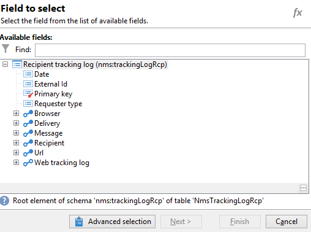

# Fråga leveransinformation {#querying-delivery-information}

## Antal klick för en viss leverans {#number-of-clicks-for-a-specific-delivery}

I det här exemplet försöker vi återställa antalet klick för en viss leverans. Dessa klick spelas in tack vare loggar för mottagarspårning som tagits under en viss period. Mottagaren identifieras via sin e-postadress. Frågan använder tabellen **[!UICONTROL Recipient tracking logs]**.

* Vilken tabell måste markeras?

  Loggspårningstabellen för mottagare (**[!UICONTROL nms:trackingLogRcp]**)

* Fält som ska markeras för utdatakolumner?

  Primär nyckel (med antal) och e-post

* Vilka kriterier kommer informationen att filtreras baserat på?

  En viss period och ett element i leveransetiketten

Så här utför du exemplet:

1. Öppna **[!UICONTROL Generic query editor]** och välj **[!UICONTROL Recipient tracking logs]**-schemat.

   

1. I fönstret **[!UICONTROL Data to extract]** vill vi skapa en mängd för att samla in information. Det gör du genom att lägga till primärnyckeln (som finns ovanför **[!UICONTROL Recipient tracking logs]**-huvudelementet): Antal spårningsloggar utförs i det här **[!UICONTROL Primary key]**-fältet. Det redigerade uttrycket blir **[!UICONTROL x=count(primary key)]**. Den länkar summan av olika spårningsloggar till en enda e-postadress.

   Så här gör du:

   * Klicka på ikonen **[!UICONTROL Add]** till höger om fältet **[!UICONTROL Output columns]**. I fönstret **[!UICONTROL Formula type]** väljer du alternativet **[!UICONTROL Edit the formula using an expression]** och klickar på **[!UICONTROL Next]**. Klicka på **[!UICONTROL Advanced selection]** i fönstret **[!UICONTROL Field to select]**.

     

   * Kör en process på sammanställningsfunktionen i fönstret **[!UICONTROL Formula type]**. Den här processen blir ett primärnyckelantal.

     Välj **[!UICONTROL Process on an aggregate function]** i avsnittet **[!UICONTROL Aggregate]** och klicka på **[!UICONTROL Count]**.

     

     Klicka på **[!UICONTROL Next]**.

   * Markera fältet **[!UICONTROL Primary key (@id)]**. Utdatakolumnen **[!UICONTROL count (primary key)]** har konfigurerats.

     

1. Markera det andra fältet som ska visas i utdatakolumnen. Öppna noden **[!UICONTROL Recipient]** i kolumnen **[!UICONTROL Available fields]** och välj **[!UICONTROL Email]**. Markera kryssrutan **[!UICONTROL Group]** till **[!UICONTROL Yes]** om du vill gruppera spårningsloggarna efter e-postadress: den här gruppen länkar varje logg till sin mottagare.

   

1. Konfigurera kolumnsortering så att de mest aktiva mottagarna (med de flesta spårningsloggar) visas först. Kontrollera **[!UICONTROL Yes]** i kolumnen **[!UICONTROL Descending sort]**.

   

1. Du måste sedan filtrera loggarna som intresserar dig, dvs. de som är yngre än två veckor och som avser försäljningsrelaterade leveranser.

   Så här gör du:

   * Konfigurera datafiltrering. Om du vill göra det väljer du **[!UICONTROL Filter conditions]** och klickar sedan på **[!UICONTROL Next]**.

     

   * Återställ spårningsloggar under en viss period för en viss leverans. Tre filtreringsvillkor är nödvändiga: två datumvillkor som anger sökperioden mellan två veckor före dagens datum och dagen före dagens datum, och ett annat villkor som begränsar sökningen till en viss leverans.

     I fönstret **[!UICONTROL Target element]** konfigurerar du det datum från vilket spårningsloggar ska tas med i beräkningen. Klicka på **[!UICONTROL Add]**. En villkorslinje visas. Redigera kolumnen **[!UICONTROL Expression]** genom att klicka på funktionen **[!UICONTROL Edit expression]**. Välj **[!UICONTROL Date (@logDate)]** i fönstret **[!UICONTROL Field to select]**.

     

     Välj operatorn **[!UICONTROL greater than]**. Klicka på **[!UICONTROL Edit expression]** i kolumnen **[!UICONTROL Value]** och välj **[!UICONTROL Process on dates]** i fönstret **[!UICONTROL Formula type]**. Ange slutligen &quot;15&quot; i **[!UICONTROL Current date minus n days]**.

     Klicka på **[!UICONTROL Finish]**.

     

   * Om du vill välja slutdatum för spårningsloggssökningen skapar du ett andra villkor genom att klicka på **[!UICONTROL Add]**. Välj **[!UICONTROL Date (@logDate)]** igen i kolumnen **[!UICONTROL Expression]**.

     Välj operatorn **[!UICONTROL less than]**. Klicka på **[!UICONTROL Edit expression]** i kolumnen **[!UICONTROL Value]**. Gå till fönstret **[!UICONTROL Formula type]** och ange &quot;1&quot; i **[!UICONTROL Current date minus n days]** för datumbearbetning.

     Klicka på **[!UICONTROL Finish]**.

     

     Nu vill vi konfigurera det tredje filtervillkoret, dvs. den leveransetikett som vår fråga gäller.

   * Klicka på funktionen **[!UICONTROL Add]** om du vill skapa ett annat filtreringsvillkor. Klicka på **[!UICONTROL Edit expression]** i kolumnen **[!UICONTROL Expression]**. I fönstret **[!UICONTROL Field to select]** väljer du **[!UICONTROL Label]** i noden **[!UICONTROL Delivery]**.

     Klicka på **[!UICONTROL Finish]**.

     

     Sök efter en leverans som innehåller ordet&quot;försäljning&quot;. Eftersom du inte kommer ihåg den exakta etiketten kan du välja operatorn **[!UICONTROL contains]** och ange &quot;sales&quot; i kolumnen **[!UICONTROL Value]**.

     

1. Klicka på **[!UICONTROL Next]** tills du kommer till fönstret **[!UICONTROL Data preview]**: ingen formatering behövs här.
1. I fönstret **[!UICONTROL Data preview]** klickar du på **[!UICONTROL Start the preview of the data]** för att visa antalet spårningsloggar för varje leveransmottagare.

   Resultatet visas i fallande ordning.

   

   Det högsta antalet loggar för en användare är 6 för den här leveransen. 5 olika användare öppnade e-postmeddelandet eller klickade på någon av länkarna i e-postmeddelandet.

## Mottagare som inte har öppnat någon leverans {#recipients-who-did-not-open-any-delivery}

I det här exemplet vill vi filtrera mottagare som inte har öppnat ett e-postmeddelande de senaste 7 dagarna.

Så här skapar du det här exemplet:

1. Dra och släpp en **[!UICONTROL Query]**-aktivitet i ett arbetsflöde och öppna aktiviteten.
1. Klicka på **[!UICONTROL Edit query]** och ställ in mål- och filtreringsdimensionerna på **[!UICONTROL Recipients]**.

   

1. Välj **[!UICONTROL Filtering conditions]** och klicka sedan på **[!UICONTROL Next]**.
1. Klicka på knappen **[!UICONTROL Add]** och välj **[!UICONTROL Tracking logs]**.
1. Ange **[!UICONTROL Operator]** för uttrycket **[!UICONTROL Tracking logs]** som **[!UICONTROL Do not exist such as]**.

   

1. Lägg till ett annat uttryck. Välj **[!UICONTROL Type]** i kategorin **[!UICONTROL URL]**.
1. Ange sedan **[!UICONTROL Operator]** som **[!UICONTROL equal to]** och dess **[!UICONTROL Value]** som **[!UICONTROL Open]**.

   

1. Lägg till ett annat uttryck och välj **[!UICONTROL Date]**. **[!UICONTROL Operator]** ska anges till **[!UICONTROL on or after]**.

   

1. Klicka på knappen **[!UICONTROL Edit expression]** i fältet **[!UICONTROL Value]** om du vill ange värdet för de senaste 7 dagarna.
1. I kategorin **[!UICONTROL Function]** väljer du **[!UICONTROL Current date minus n days]** och lägger till det antal dagar som du vill ha som mål. Här vill vi rikta in oss på de senaste 7 dagarna.

   

Din utgående övergång kommer att innehålla mottagare som inte har öppnat ett e-postmeddelande de senaste 7 dagarna.

Om du däremot vill filtrera mottagare som har öppnat minst ett e-postmeddelande bör frågan vara som följer. Observera att i det här fallet ska **[!UICONTROL Filtering dimension]** anges till **[!UICONTROL Tracking logs (Recipients)]**.

## Mottagare som har öppnat en leverans {#recipients-who-have-opened-a-delivery}

I följande exempel visas hur man riktar sig till profiler som har öppnat en leverans de senaste två veckorna:

1. Om du vill ha målprofiler som har öppnat en leverans måste du använda spårningsloggar. De lagras i en länkad tabell: börja med att markera den här tabellen i listrutan för fältet **[!UICONTROL Filtering dimension]**, vilket visas nedan:

   

1. När det gäller filtreringsvillkor klickar du på ikonen **[!UICONTROL Edit expression]** för de villkor som visas i spårningsloggarnas underträdstruktur. Markera fältet **[!UICONTROL Date]**.

   

   Bekräfta markeringen genom att klicka på **[!UICONTROL Finish]**.

   Om du bara vill återställa spårningsloggarna som är mindre än två veckor gamla väljer du operatorn **[!UICONTROL Greater than]**.

   

   Klicka sedan på ikonen **[!UICONTROL Edit expression]** i kolumnen **[!UICONTROL Value]** för att definiera beräkningsformeln som ska användas. Välj formeln **[!UICONTROL Current date minus n days]** och ange 15 i det relaterade fältet.

   

   Klicka på knappen **[!UICONTROL Finish]** i formelfönstret. Klicka på fliken **[!UICONTROL Preview]** i filtreringsfönstret för att kontrollera målinriktningsvillkoren.

   

## Filtrera mottagarnas beteende efter en leverans {#filtering-recipients--behavior-folllowing-a-delivery}

I ett arbetsflöde kan du använda rutorna **[!UICONTROL Query]** och **[!UICONTROL Split]** för att välja ett beteende efter en tidigare leverans. Detta val görs via filtret **[!UICONTROL Delivery recipient]**.

* Syfte med exemplet

  I ett leveransarbetsflöde finns det flera sätt att följa upp en första e-postkommunikation. Den här typen av åtgärd innebär att rutan **[!UICONTROL Split]** används.

* Kontext

  Sommarsportserbjudandet skickas ut. Fyra dagar efter leveransen skickas två andra leveranser. Ett av dem är &quot;vattensporterbjudande&quot;, det andra är en uppföljning av det första &quot;Sommarsportserbjudandet&quot;.

  Leveransen av&quot;vattensporterbjudandet&quot; skickas till mottagare som klickade på länken&quot;vattensporter&quot; vid första leveransen. Dessa klick visar att mottagaren är intresserad av ämnet. Det är rimligt att styra dem mot liknande erbjudanden. Mottagare som inte klickade i &quot;Sommarsportserbjudandet&quot; kommer dock att få samma innehåll igen.

I följande steg visas hur du konfigurerar rutan **[!UICONTROL Split]** genom att integrera två olika beteenden:

1. Infoga rutan **[!UICONTROL Split]** i arbetsflödet. I den här rutan delas mottagarna av den första leveransen upp i de två följande leveranserna. Uppdelningen görs utifrån de filtervillkor som är kopplade till mottagarens beteende under den första leveransen.

   

1. Öppna rutan **[!UICONTROL Split]**. På fliken **[!UICONTROL General]** anger du en etikett: **Dela baserat på beteende** till exempel.

   

1. Definiera den första delade grenen på fliken **[!UICONTROL Subsets]**. Ange till exempel etiketten **Klickad** för den här grenen.
1. Välj alternativet **[!UICONTROL Add a filtering condition on the incoming population]**. Klicka på **[!UICONTROL Edit]**.
1. Dubbelklicka på filtret **[!UICONTROL Recipients of a delivery]** i fönstret **[!UICONTROL Targeting and filtering dimension]**.

   

1. I fönstret **[!UICONTROL Target element]** väljer du det beteende som du vill tillämpa på den här grenen: **[!UICONTROL Recipients having clicked (email)]**.

   Välj alternativet **[!UICONTROL Delivery specified by the transition]** nedan. Den här funktionen återställer automatiskt de personer som ska användas vid den första leveransen.

   Det här är erbjudandet om vattensporter.

   

1. Definiera den andra grenen. Den här grenen kommer att innehålla uppföljningsmejl med samma innehåll som den första leveransen. Gå till fliken **[!UICONTROL Subsets]** och klicka på **[!UICONTROL Add]** för att skapa den.

   

1. En annan underflik visas. Namnge den **Klickade inte**.
1. Klicka på **[!UICONTROL Add a filtering condition for the incoming population]**. Klicka sedan på **[!UICONTROL Edit...]**.

   

1. Klicka på **[!UICONTROL Delivery recipients]** i fönstret **[!UICONTROL Targeting and filtering dimension]**.
1. Välj **[!UICONTROL Recipients who did not click (email)]**-beteendet i fönstret **[!UICONTROL Target element]**. Välj alternativet **[!UICONTROL Delivery specified by the transition]** så som visas för den senaste grenen.

   Rutan **[!UICONTROL Split]** är nu helt konfigurerad.

   

Nedan finns en lista över de olika komponenter som konfigurerats som standard:

* **[!UICONTROL All recipients]**
* **[!UICONTROL Recipients of successfully sent messages,]**
* **[!UICONTROL Recipients who opened or clicked (email),]**
* **[!UICONTROL Recipients who clicked (email),]**
* **[!UICONTROL Recipients of a failed message,]**
* **[!UICONTROL Recipients who didn't open or click (email),]**
* **[!UICONTROL Recipients who didn't click (email).]**

  
