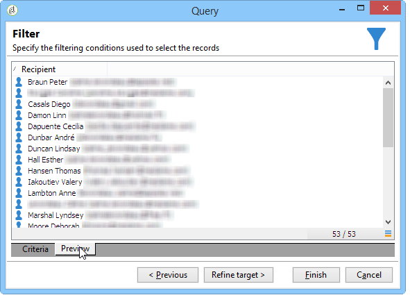

# Fråga leveransinformation {#querying-delivery-information}

## Antal klick för en viss leverans {#number-of-clicks-for-a-specific-delivery}

I det här exemplet försöker vi återställa antalet klick för en viss leverans. Dessa klick spelas in tack vare loggar för mottagarspårning som tagits under en viss period. Mottagaren identifieras via sin e-postadress. Den här frågan använder **[!UICONTROL Recipient tracking logs]** tabell.

* Vilken tabell måste markeras?

  Loggspårningstabell för mottagare (**[!UICONTROL nms:trackingLogRcp]**)

* Fält som ska markeras för utdatakolumner?

  Primär nyckel (med antal) och e-post

* Vilka kriterier kommer informationen att filtreras baserat på?

  En viss period och ett element i leveransetiketten

Så här utför du exemplet:

1. Öppna **[!UICONTROL Generic query editor]** och väljer **[!UICONTROL Recipient tracking logs]** schema.

   

1. I **[!UICONTROL Data to extract]** vill vi skapa en sammanställning för att samla in information. Lägg till primärnyckeln (som finns ovanför huvudnyckeln) **[!UICONTROL Recipient tracking logs]** element): Spåra loggantal för detta **[!UICONTROL Primary key]** fält. Det redigerade uttrycket kommer att **[!UICONTROL x=count(primary key)]**. Den länkar summan av olika spårningsloggar till en enda e-postadress.

   Så här gör du:

   * Klicka på **[!UICONTROL Add]** ikonen till höger om **[!UICONTROL Output columns]** fält. I **[!UICONTROL Formula type]** väljer du **[!UICONTROL Edit the formula using an expression]** och klicka **[!UICONTROL Next]**. I **[!UICONTROL Field to select]** fönster, klicka **[!UICONTROL Advanced selection]**.

     

   * I **[!UICONTROL Formula type]** kör du en process på sammanställningsfunktionen. Den här processen blir ett primärnyckelantal.

     Välj **[!UICONTROL Process on an aggregate function]** i **[!UICONTROL Aggregate]** och klicka **[!UICONTROL Count]**.

     

     Klicka på **[!UICONTROL Next]**.

   * Välj **[!UICONTROL Primary key (@id)]** fält. The **[!UICONTROL count (primary key)]** utdatakolumnen är konfigurerad.

     

1. Markera det andra fältet som ska visas i utdatakolumnen. I **[!UICONTROL Available fields]** kolumn, öppna **[!UICONTROL Recipient]** nod och välj **[!UICONTROL Email]**. Kontrollera **[!UICONTROL Group]** ruta till **[!UICONTROL Yes]** om du vill gruppera spårningsloggarna efter e-postadress: den här gruppen länkar varje logg till mottagaren.

   

1. Konfigurera kolumnsortering så att de mest aktiva mottagarna (med de flesta spårningsloggar) visas först. Kontrollera **[!UICONTROL Yes]** i **[!UICONTROL Descending sort]** kolumn.

   

1. Du måste sedan filtrera loggarna som intresserar dig, dvs. de som är yngre än två veckor och som avser försäljningsrelaterade leveranser.

   Så här gör du:

   * Konfigurera datafiltrering. Gör detta genom att välja **[!UICONTROL Filter conditions]** klicka sedan på **[!UICONTROL Next]**.

     

   * Återställ spårningsloggar under en viss period för en viss leverans. Tre filtreringsvillkor är nödvändiga: två datumvillkor som anger sökperioden mellan två veckor före dagens datum och dagen före dagens datum, och ett annat villkor som begränsar sökningen till en viss leverans.

     I **[!UICONTROL Target element]** konfigurerar du det datum som börjar när spårningsloggar ska användas. Klicka på **[!UICONTROL Add]**. En villkorslinje visas. Redigera **[!UICONTROL Expression]** genom att klicka på **[!UICONTROL Edit expression]** funktion. I **[!UICONTROL Field to select]** fönster, välja **[!UICONTROL Date (@logDate)]**.

     

     Välj **[!UICONTROL greater than]** -operator. I **[!UICONTROL Value]** kolumn, klicka **[!UICONTROL Edit expression]** och i **[!UICONTROL Formula type]** fönster, markera **[!UICONTROL Process on dates]**. Till sist: **[!UICONTROL Current date minus n days]**, anger &quot;15&quot;.

     Klicka på **[!UICONTROL Finish]**.

     

   * Om du vill välja slutdatum för spårningsloggssökning skapar du ett andra villkor genom att klicka på **[!UICONTROL Add]**. I **[!UICONTROL Expression]** kolumn, välja **[!UICONTROL Date (@logDate)]** igen.

     Välj **[!UICONTROL less than]** -operator. I **[!UICONTROL Value]** kolumn, klicka **[!UICONTROL Edit expression]**. Gå till **[!UICONTROL Formula type]** window, enter &quot;1&quot; in **[!UICONTROL Current date minus n days]**.

     Klicka på **[!UICONTROL Finish]**.

     

     Nu vill vi konfigurera det tredje filtervillkoret, dvs. den leveransetikett som vår fråga gäller.

   * Klicka på **[!UICONTROL Add]** om du vill skapa ett annat filtervillkor. I **[!UICONTROL Expression]** kolumn, klicka **[!UICONTROL Edit expression]**. I **[!UICONTROL Field to select]** fönster, välja **[!UICONTROL Label]** i **[!UICONTROL Delivery]** nod.

     Klicka på **[!UICONTROL Finish]**.

     

     Sök efter en leverans som innehåller ordet&quot;försäljning&quot;. Eftersom du inte kommer ihåg den exakta etiketten kan du välja **[!UICONTROL contains]** och ange&quot;försäljning&quot; i **[!UICONTROL Value]** kolumn.

     

1. Klicka **[!UICONTROL Next]** tills du kommer till **[!UICONTROL Data preview]** window: ingen formatering behövs här.
1. I **[!UICONTROL Data preview]** fönster, klicka **[!UICONTROL Start the preview of the data]** om du vill visa antalet spårningsloggar för varje leveransmottagare.

   Resultatet visas i fallande ordning.

   

   Det högsta antalet loggar för en användare är 6 för den här leveransen. 5 olika användare öppnade e-postmeddelandet eller klickade på någon av länkarna i e-postmeddelandet.

## Mottagare som inte har öppnat någon leverans {#recipients-who-did-not-open-any-delivery}

I det här exemplet vill vi filtrera mottagare som inte har öppnat ett e-postmeddelande de senaste 7 dagarna.

Så här skapar du det här exemplet:

1. Dra och släpp en **[!UICONTROL Query]** i ett arbetsflöde och öppna aktiviteten.
1. Klicka **[!UICONTROL Edit query]** och ange mål- och filterdimensionerna till **[!UICONTROL Recipients]**.

   

1. Välj **[!UICONTROL Filtering conditions]** klicka sedan på **[!UICONTROL Next]**.
1. Klicka på **[!UICONTROL Add]** knapp och markera **[!UICONTROL Tracking logs]**.
1. Ange **[!UICONTROL Operator]** i **[!UICONTROL Tracking logs]** uttryck till **[!UICONTROL Do not exist such as]**.

   

1. Lägg till ett annat uttryck. Välj **[!UICONTROL Type]** i **[!UICONTROL URL]** kategori.
1. Ange sedan dess **[!UICONTROL Operator]** till **[!UICONTROL equal to]** och **[!UICONTROL Value]** till **[!UICONTROL Open]**.

   

1. Lägg till ytterligare ett uttryck och välj **[!UICONTROL Date]**. **[!UICONTROL Operator]** ska anges till **[!UICONTROL on or after]**.

   

1. Om du vill ange värdet för de senaste 7 dagarna klickar du på **[!UICONTROL Edit expression]** knappen i **[!UICONTROL Value]** fält.
1. I **[!UICONTROL Function]** kategori, välj **[!UICONTROL Current date minus n days]** och lägg till det antal dagar som du vill ha som mål. Här vill vi rikta in oss på de senaste 7 dagarna.

   

Din utgående övergång kommer att innehålla mottagare som inte har öppnat ett e-postmeddelande de senaste 7 dagarna.

Om du däremot vill filtrera mottagare som har öppnat minst ett e-postmeddelande bör frågan vara som följer. Observera att **[!UICONTROL Filtering dimension]** ska anges till **[!UICONTROL Tracking logs (Recipients)]**.

## Mottagare som har öppnat en leverans {#recipients-who-have-opened-a-delivery}

I följande exempel visas hur man riktar sig till profiler som har öppnat en leverans de senaste två veckorna:

1. Om du vill ha målprofiler som har öppnat en leverans måste du använda spårningsloggar. de lagras i en länkad tabell: börja med att markera den här tabellen i listrutan i **[!UICONTROL Filtering dimension]** fält, enligt nedan:

   

1. Om filtervillkoren gäller klickar du på **[!UICONTROL Edit expression]** ikon för de kriterier som visas i spårningsloggarnas underträdstruktur. Välj **[!UICONTROL Date]** fält.

   

   Klicka **[!UICONTROL Finish]** för att bekräfta valet.

   Om du bara vill återställa spårningsloggarna som är mindre än två veckor gamla väljer du **[!UICONTROL Greater than]** -operator.

   

   Klicka sedan på **[!UICONTROL Edit expression]** ikonen i **[!UICONTROL Value]** kolumn för att definiera beräkningsformeln som ska användas. Välj **[!UICONTROL Current date minus n days]** och ange 15 i det relaterade fältet.

   

   Klicka på **[!UICONTROL Finish]** formelfönstrets knapp. I filtreringsfönstret klickar du på **[!UICONTROL Preview]** för att kontrollera målinriktningskriterier.

   

## Filtrera mottagarnas beteende efter en leverans {#filtering-recipients--behavior-folllowing-a-delivery}

I ett arbetsflöde **[!UICONTROL Query]** och **[!UICONTROL Split]** gör att du kan välja ett beteende efter en tidigare leverans. Detta val görs via **[!UICONTROL Delivery recipient]** filter.

* Syfte med exemplet

  I ett leveransarbetsflöde finns det flera sätt att följa upp en första e-postkommunikation. Den här typen av åtgärd använder **[!UICONTROL Split]** box.

* Kontext

  Sommarsportserbjudandet skickas ut. Fyra dagar efter leveransen skickas två andra leveranser. Ett av dem är &quot;vattensporterbjudande&quot;, det andra är en uppföljning av det första &quot;Sommarsportserbjudandet&quot;.

  Leveransen av&quot;vattensporterbjudandet&quot; skickas till mottagare som klickade på länken&quot;vattensporter&quot; vid första leveransen. Dessa klick visar att mottagaren är intresserad av ämnet. Det är rimligt att styra dem mot liknande erbjudanden. Mottagare som inte klickade i &quot;Sommarsportserbjudandet&quot; kommer dock att få samma innehåll igen.

Följande steg visar hur du konfigurerar **[!UICONTROL Split]** genom att integrera två olika beteenden:

1. Infoga **[!UICONTROL Split]** i arbetsflödet. I den här rutan delas mottagarna av den första leveransen upp i de två följande leveranserna. Uppdelningen görs utifrån de filtervillkor som är kopplade till mottagarens beteende under den första leveransen.

   

1. Öppna **[!UICONTROL Split]** box. I **[!UICONTROL General]** anger du en etikett: **Dela baserat på beteende** till exempel.

   

1. I **[!UICONTROL Subsets]** definierar du den första delade grenen. Ange till exempel **Klickat** etikett för denna gren.
1. Välj **[!UICONTROL Add a filtering condition on the incoming population]** alternativ. Klicka på **[!UICONTROL Edit]**.
1. I **[!UICONTROL Targeting and filtering dimension]** fönster, dubbelklicka på **[!UICONTROL Recipients of a delivery]** filter.

   

1. I **[!UICONTROL Target element]** väljer du det beteende som du vill använda för den här grenen: **[!UICONTROL Recipients having clicked (email)]**.

   Välj **[!UICONTROL Delivery specified by the transition]** alternativ. Den här funktionen återställer automatiskt de personer som ska användas vid den första leveransen.

   Det här är erbjudandet om vattensporter.

   

1. Definiera den andra grenen. Den här grenen kommer att innehålla uppföljningsmejl med samma innehåll som den första leveransen. Gå till **[!UICONTROL Subsets]** och klicka **[!UICONTROL Add]** för att skapa den.

   

1. En annan underflik visas. Ge den namnet **Klickade inte**&quot;.
1. Klicka på **[!UICONTROL Add a filtering condition for the incoming population]**. Klicka sedan på **[!UICONTROL Edit...]**.

   

1. Klicka **[!UICONTROL Delivery recipients]** i **[!UICONTROL Targeting and filtering dimension]** -fönstret.
1. I **[!UICONTROL Target element]** väljer du **[!UICONTROL Recipients who did not click (email)]** beteende. Välj **[!UICONTROL Delivery specified by the transition]** som visas för den senaste förgreningen.

   The **[!UICONTROL Split]** är nu helt konfigurerad.

   

Nedan finns en lista över de olika komponenter som konfigurerats som standard:

* **[!UICONTROL All recipients]**
* **[!UICONTROL Recipients of successfully sent messages,]**
* **[!UICONTROL Recipients who opened or clicked (email),]**
* **[!UICONTROL Recipients who clicked (email),]**
* **[!UICONTROL Recipients of a failed message,]**
* **[!UICONTROL Recipients who didn't open or click (email),]**
* **[!UICONTROL Recipients who didn't click (email).]**

  
