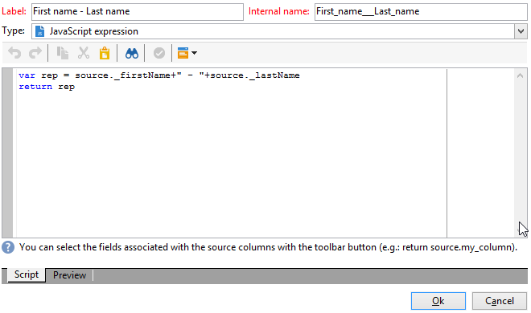

# Fråga med många-till-många-relation {#querying-using-a-many-to-many-relationship}


I det här exemplet vill vi återställa mottagare som inte har kontaktats under de senaste 7 dagarna. Den här frågan gäller alla leveranser.

I det här exemplet visas även hur du konfigurerar ett filter som är relaterat till valet av ett samlingselement (eller en orange nod). Samlingselement är tillgängliga i **[!UICONTROL Field to select]** -fönstret.

* Vilken tabell måste markeras?

   Mottagartabellen (**nms:mottagare**)

* Fält som ska markeras för utdatakolumnen

   Primär nyckel, efternamn, förnamn och e-postadress

* Baserat på vilka kriterier är den information som filtreras

   Baserat på leveransloggarna för mottagare som går tillbaka 7 dagar före idag

Använd följande steg:

1. Öppna den allmänna frågeredigeraren och välj mottagartabellen **[!UICONTROL (nms:recipient)]**.
1. I **[!UICONTROL Data to extract]** fönster, markera **[!UICONTROL Primary key]**, **[!UICONTROL First name]**, **[!UICONTROL Last name]** och **[!UICONTROL Email]**.

   

1. Sortera namnen i bokstavsordning i sorteringsfönstret.

   

1. I **[!UICONTROL Data filtering]** fönster, markera **[!UICONTROL Filtering conditions]**.
1. I **[!UICONTROL Target element]** filtreringsvillkoret för att extrahera profiler utan spårningslogg de senaste 7 dagarna omfattar två steg. Elementet som du måste markera är en många-till-många-länk.

   * Börja med att välja **[!UICONTROL Recipient delivery logs (broadlog)]** samlingselement (orange nod) för den första **[!UICONTROL Value]** kolumn.

      

      Välj **[!UICONTROL do not exist as]** -operator. Du behöver inte välja ett andra värde på den här raden.

   * Innehållet i det andra filtervillkoret beror på det första. Här är **[!UICONTROL Event date]** -fältet visas direkt i **[!UICONTROL Recipient delivery logs]** eftersom det finns en länk till den här tabellen.

      

      Välj **[!UICONTROL Event date]** med **[!UICONTROL greater than or equal to]** -operator. Välj **[!UICONTROL DaysAgo (7)]** värde. Det gör du genom att klicka **[!UICONTROL Edit expression]** i **[!UICONTROL Value]** fält. I **[!UICONTROL Formula type]** fönster, markera **[!UICONTROL Process on dates]** och **[!UICONTROL Current date minus n days]**, som ger&quot;7&quot; som värde.

      

      Filtervillkoret har konfigurerats.

      

1. I **[!UICONTROL Data formatting]** växlar du efternamnen till versaler. Klicka på **[!UICONTROL Last name]** rad i **[!UICONTROL Transformation]** kolumn och markera **[!UICONTROL Switch to upper case]** i listrutan.

   

1. Använd **[!UICONTROL Add a calculated field]** om du vill infoga en kolumn i dataförhandsvisningsfönstret.

   I det här exemplet lägger du till ett beräkningsfält med förnamn och efternamn på mottagarna i en enda kolumn. Klicka på **[!UICONTROL Add a calculated field]** funktion. I **[!UICONTROL Export calculated field definition]** anger du en etikett och ett internt namn och väljer **[!UICONTROL JavaScript Expression]** typ. Ange sedan följande uttryck:

   ```
   var rep = source._firstName+" - "+source._lastName
   return rep
   ```

   

   Klicka på **[!UICONTROL OK]**. The **[!UICONTROL Data formatting]** fönstret är konfigurerat.

   Mer information om hur du lägger till beräkningsfält finns i det här avsnittet.

1. Resultatet visas i **[!UICONTROL Data preview]** -fönstret. Mottagare som inte har kontaktats de senaste 7 dagarna visas i alfabetisk ordning. Namnen visas med stora bokstäver och kolumnen med för- och efternamn har skapats.

   
