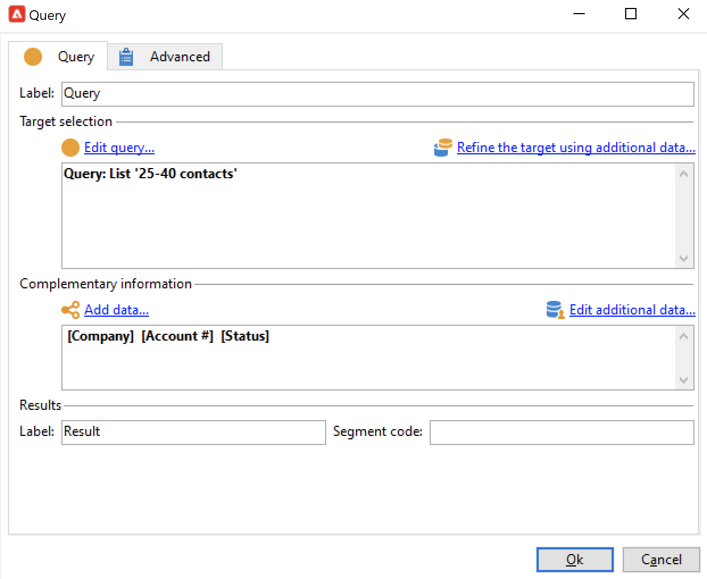

# Fråga{#query}

## Skapa en fråga {#creating-a-query}

Med en fråga kan du välja ett mål enligt villkor. Du kan koppla en segmentkod till frågeresultatet och infoga ytterligare data i den.
Mer information om frågeexempel finns i [det här avsnittet](querying-recipient-table.md).

>[!NOTE]
>
>Adobe Campaign Web UI har en kraftfull frågemodellerare som förenklar filtreringen av databaser för att välja specifika mål baserat på olika kriterier, vilket gör att du enklare kan skapa och hantera frågor. Mer information om frågemodelleraren för webbgränssnitt finns i [Adobe Campaign Web UI-dokumentationen](https://experienceleague.adobe.com/sv/docs/campaign-web/v8/query-database/query-modeler-overview){target=_blank}.

{width="70%" align="center" zoomable="yes"}

Mer information om hur du använder och hanterar ytterligare data finns i [Lägg till data](#adding-data).

Med länken **[!UICONTROL Edit query...]** kan du definiera måltyp, begränsningar och urvalskriterier för populationen på följande sätt:

1. Välj målinriktning och filtreringsdimension. Som standard är målet markerat bland mottagarna. Listan med begränsningsfilter är densamma som de som används för leveransmål.

   Målgruppsdimensionen sammanfaller med den typ av element som vi kommer att arbeta med, t.ex. målgruppen för insatsen.

   Filtreringsdimensionen gör det möjligt att samla in dessa element, t.ex. information om målpersonen (kontrakt, fullständiga och slutliga kvittningar osv.).

   Mer information finns i [Målinriktning och filtrering](targeting-workflows.md#targeting-and-filtering-dimensions).

   {width="70%" align="center" zoomable="yes"}

   En fråga kan baseras på data från den inkommande övergången, om det behövs, genom att välja **[!UICONTROL Temporary schema]** när du väljer mål- och filtreringsdimensioner.

   {width="70%" align="center" zoomable="yes"}

1. Definiera populationerna med guiden. De fält som ska anges kan vara olika beroende på måltyp. Du kan förhandsgranska målpopulationen med dina aktuella villkor på fliken **[!UICONTROL Preview]**.

   {width="70%" align="center" zoomable="yes"}

1. Om du har markerat **[!UICONTROL Filtering conditions]** i steg 1 eller använder alternativet **[!UICONTROL Filters]** > **[!UICONTROL Advanced filter...]** måste du lägga till filtervillkor manuellt senare.

   Du kan också lägga till villkor för datagruppering genom att markera motsvarande ruta. För att göra detta måste filtreringsdimensionen skilja sig från frågemålets dimension. Mer information om gruppering finns i [avsnittet](query-grouping-management.md).

   Du kan också lägga till fler villkor genom att använda uttrycksverktyget och kombinera det med de logiska alternativen AND, OR och EXCEPT.

   Spara filtret om du vill återanvända det senare.

## Lägg till data {#adding-data}

Med de extra kolumnerna kan du samla in ytterligare information om målpopulationen, t.ex. avtalsnummer, prenumerationer på nyhetsbrev eller ursprung. Dessa data kan lagras i Adobe Campaign-databasen eller i en extern databas.

Med länken **[!UICONTROL Add data...]** kan du välja vilka ytterligare data som ska samlas in.

{width="70%" align="center" zoomable="yes"}

Börja med att välja vilken typ av data som ska läggas till:

{width="70%" align="center" zoomable="yes"}

* Välj **[!UICONTROL Data linked to the filtering dimension]** för att markera data i Adobe Campaign-databasen.
* Välj **[!UICONTROL External data]** om du vill lägga till data från en extern databas. Det här alternativet är bara tillgängligt om du har köpt alternativet **Federated Data Access**. Mer information finns i [Åtkomst till en extern databas (FDA)](accessing-an-external-database-fda.md).
* Välj alternativet **[!UICONTROL An offer proposition]** om du vill lägga till en uppsättning kolumner så att du kan lagra det bästa erbjudande som genereras av erbjudandemotorn. Det här alternativet är bara tillgängligt om du har köpt modulen **Interaktion**.

Om ingen valfri modul är installerad på plattformen visas inte det här steget. Du kommer att gå direkt till nästa steg.

Så här lägger du till data från Adobe Campaign-databasen:

1. Välj den typ av data som du vill lägga till. Detta kan vara data som tillhör filterdimensionen eller data som lagras i länkade tabeller.

   {width="70%" align="center" zoomable="yes"}

1. Om data tillhör frågefiltret markerar du dem i listan över tillgängliga fält så att de visas i utdatakolumnerna.

   {width="70%" align="center" zoomable="yes"}

   Du kan lägga till:

   * Ett fält som beräknas baserat på data från målpopulationen eller ett aggregat (antal väntande inköp under den senaste månaden, genomsnittligt belopp för ett kvitto osv.). Gå till exempel till [Välj data](targeting-workflows.md#selecting-data).
   * Ett nytt fält som skapats med knappen **[!UICONTROL Add]** till höger om listan med utdatakolumner.

     Du kan också lägga till en samling information, till exempel en lista över kontrakt, de fem senaste leveranserna osv. Samlingar sammanfaller med fält som kan ha flera värden för samma profil (1-N-relation). Mer information finns i [Redigera ytterligare data](targeting-workflows.md#editing-additional-data).

Så här lägger du till en samling information som är länkad till en målpopulation:

1. I det första steget i guiden väljer du alternativet **[!UICONTROL Data linked to the filtering dimension]**:
1. Markera tabellen som innehåller den information som du vill samla in och klicka på **[!UICONTROL Next]**.

   {width="70%" align="center" zoomable="yes"}

1. Om det behövs anger du antalet element i samlingen som du vill behålla genom att välja ett av värdena i fältet **[!UICONTROL Data collected]**. Som standard återskapas alla rader i samlingen och filtreras sedan enligt villkoren som anges i följande steg.

   * Om ett enskilt element i samlingen sammanfaller med filtervillkoren för den här samlingen väljer du **[!UICONTROL Single row]** i fältet **[!UICONTROL Data collected]**.

     >[!IMPORTANT]
     >
     >I det här läget optimeras den SQL-fråga som genereras tack vare en direkt överlappning av samlingselementen.
     >
     >Om det ursprungliga villkoret inte uppfylls kan resultatet bli bristfälligt (saknade eller överlappande linjer).

   * Om du väljer att återställa flera rader (**[!UICONTROL Limit the line count]**) kan du ange hur många rader som ska samlas in.
   * Om de insamlade kolumnerna innehåller aggregat, t.ex. antalet fel som deklarerats, genomsnittliga utgifter på en webbplats, osv. du kan använda värdet **[!UICONTROL Aggregates]**.

   {width="70%" align="center" zoomable="yes"}

1. Ange delmarkeringen för samlingen.

   {width="70%" align="center" zoomable="yes"}

1. Om du har valt alternativet **[!UICONTROL Limit the line count]** anger du i vilken ordning de insamlade data ska filtreras. När antalet rader som samlas in är fler än antalet rader som du har angett att de ska behållas kan du ange vilka rader som ska behållas i filtreringsordningen.

## Exempel: Riktning på enkla mottagarattribut {#example--targeting-on-simple-recipient-attributes}

I följande exempel syftar frågan till att identifiera män mellan 18 och 30 år och som bor i Frankrike. Den här frågan används i ett arbetsflöde som t.ex. syftar till att göra dem till ett exklusivt erbjudande.

>[!NOTE]
>
>Ytterligare frågeexempel presenteras i [det här avsnittet](querying-recipient-table.md).

1. Ge frågan ett namn och välj sedan länken **[!UICONTROL Edit query...]**.
1. Välj **[!UICONTROL Filtering conditions]** i listan över tillgängliga filtertyper.
1. Ange olika villkor för det föreslagna målet. Här kombineras villkor med alternativet AND. För att kunna inkluderas i urvalet måste mottagarna uppfylla följande fyra villkor:

   * Mottagare vars titel är &quot;Mr.&quot; (kan också hittas med fältet **Genus** och välja **Male** som ett värde).
   * Mottagare under 30 år.
   * Mottagare över 18 år.
   * Mottagare som bor i Frankrike.

   {width="70%" align="center" zoomable="yes"}

   Du kan visa SQL som matchar din villkorskombination:

   {width="70%" align="center" zoomable="yes"}

1. Du kan kontrollera att villkoren är korrekta genom att förhandsgranska de mottagare som matchar frågan på fliken:

   {width="70%" align="center" zoomable="yes"}

1. Spara dina filter så att du kan använda dem igen vid ett senare datum genom att klicka på **[!UICONTROL Finish]** > **[!UICONTROL OK]**.
1. Fortsätt redigera arbetsflödet genom att lägga till andra aktiviteter i det. När det har startats och föregående frågesteg är klart visas antalet mottagare. Du kan visa mer information med hjälp av snabbmenyn (högerklicka på övergången > **[!UICONTROL Display the target...]**).

   {width="70%" align="center" zoomable="yes"}

## Utdataparametrar {#output-parameters}

* tableName
* schema
* recCount

Den här uppsättningen med tre värden identifierar den population som frågan riktar sig till. **[!UICONTROL tableName]** är namnet på tabellen som registrerar målidentifierarna, **[!UICONTROL schema]** är schemat för populationen (vanligtvis nms:mottagare) och **[!UICONTROL recCount]** är antalet element i tabellen.

Det här värdet är arbetstabellens schema. Den här parametern är giltig för alla övergångar med **[!UICONTROL tableName]** och **[!UICONTROL schema]**.

## Optimera frågor {#optimizing-queries}

I avsnittet nedan beskrivs de effektivaste strategierna för att optimera frågor som körs på Adobe Campaign för att begränsa arbetsbelastningen i databasen och förbättra användarupplevelsen.

### Kopplingar och index {#joins-and-indexes}

* Effektiva frågor bygger på index.
* Använd ett index för alla kopplingar.
* När du definierar länkar i schemat bestäms kopplingsvillkoren. Den länkade tabellen ska ha ett unikt index för primärnyckeln och kopplingen ska vara i det här fältet.
* Utför kopplingar genom att definiera nycklar i numeriska fält i stället för strängfält.
* Undvik yttre kopplingar. Använd posten med noll-ID när det är möjligt för att få en yttre kopplingsfunktion.
* Använd rätt datatyp för kopplingar.

  Kontrollera att `where`-satsen är av samma typ som fältet.

  Ett vanligt fel är: `iBlacklist='3'` där `iBlacklist` är ett numeriskt fält och `3` anger ett textvärde.

  Kontrollera att du vet vilken körningsplan din fråga kommer att ha. Undvik fullständiga tabellsökningar, särskilt för realtidsfrågor eller nästan realtidsfrågor som körs varje minut.

### Funktioner {#functions}

* Var uppmärksam på funktioner som `Lower(...)`. När funktionen Nedre används används inte indexvärdet.
* Kontrollera frågor med &quot;gilla&quot;-instruktionen eller &quot;övre&quot; eller &quot;nedre&quot; instruktionerna noggrant. Använd &quot;Upper&quot; på användarindata, inte i databasfältet.

### Filtrera dimensioner {#filtering-dimensions}

Använd frågans filtreringsdimension i stället för att använda operatorn &quot;finns som&quot;.

{width="70%" align="center" zoomable="yes"}

I frågor är villkoret &quot;finns till exempel&quot; i filter inte effektivt. De motsvarar en underfråga i SQL:

`select iRecipientId from nmsRecipient where iRecipientId IN (select iRecipientId from nmsBroadLog where (...))`

Det bästa sättet är att använda frågefiltret i stället:

{width="70%" align="center" zoomable="yes"}

Motsvarigheten till filterdimensionen i SQL är den inre kopplingen:

`select iRecipientId from nmsRecipient INNER JOIN nmsBroadLog ON (...)`

Mer information om filtreringsdimensioner finns i [det här avsnittet](build-a-workflow.md#targeting-and-filtering-dimensions).

### Arkitektur {#architecture}

* Bygg en utvecklingsplattform med liknande volymer, parametrar och arkitektur som produktionsplattformen.
* Använd samma värden för utvecklings- och produktionsmiljöer. Använd så mycket som möjligt på samma sätt:

   * Operativsystem,
   * Version,
   * Data,
   * Program,
   * Volymer.

  >[!NOTE]
  >
  >En funktion som fungerar i en utvecklingsmiljö kanske inte fungerar i en produktionsmiljö där data kan vara annorlunda. Försök att identifiera de viktigaste skillnaderna för att förutse risker och förbereda lösningar.

* Gör konfigurationer som matchar målvolymerna. Stora volymer kräver särskilda konfigurationer. En konfiguration som fungerade för 100 000 mottagare kanske inte fungerar för 10 000 000 mottagare.

  Tänk på hur systemet skalförändras när det publiceras. Bara för att något fungerar i liten skala innebär det inte att det är lämpligt med större volymer. Testerna bör utföras med liknande volymer som produktionsvolymen. Du bör också utvärdera effekten av volymförändringar (antal anrop, databasens storlek) vid högsta antal timmar, högsta antal dagar och under projektets hela livstid.
