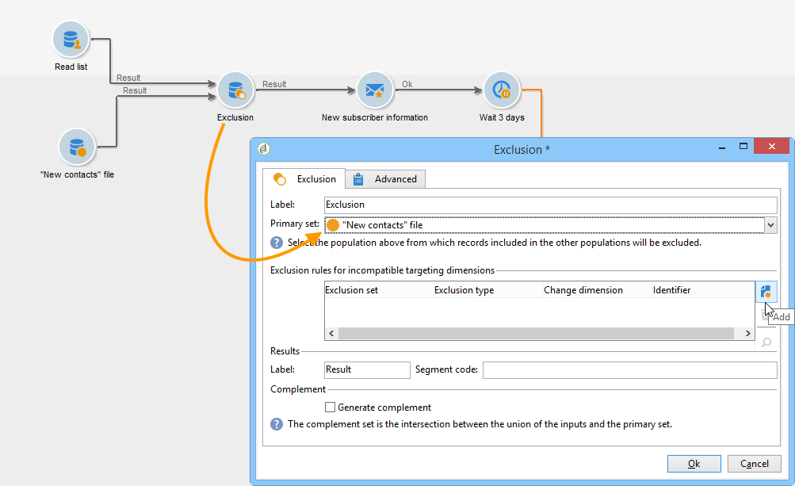

# Läslista{#read-list}

Data som bearbetas i ett arbetsflöde kan komma från listor där data har förberetts eller strukturerats i förväg (efter en tidigare segmentering eller filöverföring).

Med aktiviteten **[!UICONTROL Read list]** kan du kopiera data från en lista i arbetsflödets arbetstabell, till exempel data från en fråga. Den är sedan tillgänglig i hela arbetsflödet.

Listan som ska bearbetas kan anges explicit, beräknas av ett skript eller lokaliseras dynamiskt enligt valda alternativ och parametrar definierade i en **[!UICONTROL Read list]**-aktivitet.

Om listan inte uttryckligen anges måste du ange en lista som ska användas som mall för att ta reda på dess struktur.

När listmarkeringen har konfigurerats kan du lägga till ett filter med alternativet **[!UICONTROL Edit query]** för att behålla en del av populationen för nästa arbetsflöde.

>[!CAUTION]
>
>För att kunna skapa ett filter i en läslisteaktivitet måste den relevanta listan vara av typen &quot;file&quot;.

Listorna kan skapas direkt i Adobe Campaign via länken **[!UICONTROL Profiles and Targets > Lists]** på startsidan. De kan också skapas i ett arbetsflöde med aktiviteten **[!UICONTROL List update]**.

**Exempel: Uteslut en lista med sändningsadresser**

I följande exempel kan du använda en lista med e-postadresser som ska uteslutas från e-postleveransmålet.

Profilerna i mappen **Nya kontakter** måste ha en leveransåtgärd som mål. De e-postadresser som ska uteslutas från målet lagras i en extern lista. I vårt exempel krävs bara information om e-postadresser för att uteslutas.

1. Mappurvalsfrågan **Nya kontakter** måste göra det möjligt att läsa in de valda profilernas e-postadresser för att kunna aktivera justering mot informationen i listan.

   

1. Här lagras listan i mappen **Lists** och etiketten beräknas.

   

1. Om du vill utesluta e-postadresserna för den externa listan från huvudmålet måste du konfigurera undantagsaktiviteten och ange att mappen **Nya kontakter** innehåller de data som ska behållas. Kopplingsdata mellan den här uppsättningen och andra inkommande uppsättningar från exkluderingsaktiviteten tas bort från målet.

   

   Uteslutningsregler konfigureras i det centrala avsnittet av redigeringsverktyget. Klicka på knappen **[!UICONTROL Add]** för att definiera vilken typ av undantag som ska användas.

   Du kan definiera flera undantag beroende på antalet inkommande övergångar för aktiviteten.

1. I fältet **[!UICONTROL Exclusion set]** väljer du aktiviteten **[!UICONTROL Read list]**: data i den här aktiviteten ska exkluderas från huvuduppsättningen.

   I vårt exempel har vi ett undantag för kopplingar: data i listan kommer att stämma överens med data i huvuduppsättningen via fältet som innehåller e-postadressen. Om du vill konfigurera kopplingen väljer du **[!UICONTROL Joins]** i fältet **[!UICONTROL Change dimension]**.

   

1. Markera sedan det fält som motsvarar e-postadressen i de två uppsättningarna (Source och Mål). Kolumnerna länkas sedan och de mottagare vars e-postadress finns i listan över importerade adresser exkluderas från målet.
